
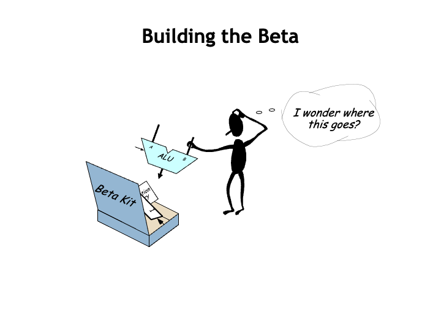

## Building Blocks

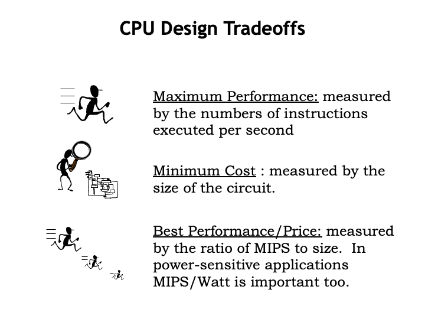

Today we&#700;re going to describe the datapath and control
logic needed to execute Beta instructions.  In an upcoming lab
assignment, we&#700;ll ask you to build a working
implementation using our standard cell library.  When
you&#700;re done, you&#700;ll have designed and debugged a
32-bit reduced-instruction set computer!  Not bad...

Before tackling a design task, it&#700;s useful to understand
the goals for the design.  Functionality, of course; in our case
the correct execution of instructions from the Beta ISA.  But
there are other goals we should think about.

An obvious goal is to maximize performance, as measured by the
number of instructions executed per second.  This is usually
expressed in MIPS, an acronym for &#8220;Millions of
Instructions Per Second&#8221;.  When the Intel 8080 was
introduced in 1974, it executed instructions at 0.29 MIPS or
290,000 instructions per second as measured by the Dhrystone
benchmark.  Modern multi-core processors are rated between
10,000 and 100,000 MIPS.

Another goal might be to minimize the manufacturing cost, which
in integrated circuit manufacturing is proportional to the size
of the circuit.

Or we might want have the best performance for a given price.
In our increasingly mobile world, the best performance per watt
might be an important goal.

One of the interesting challenges in computer engineering is
deciding exactly how to balance performance against cost and
power efficiency.  Clearly the designers of the Apple Watch have
a different set of design goals then the designers of high-end
desktop computers.

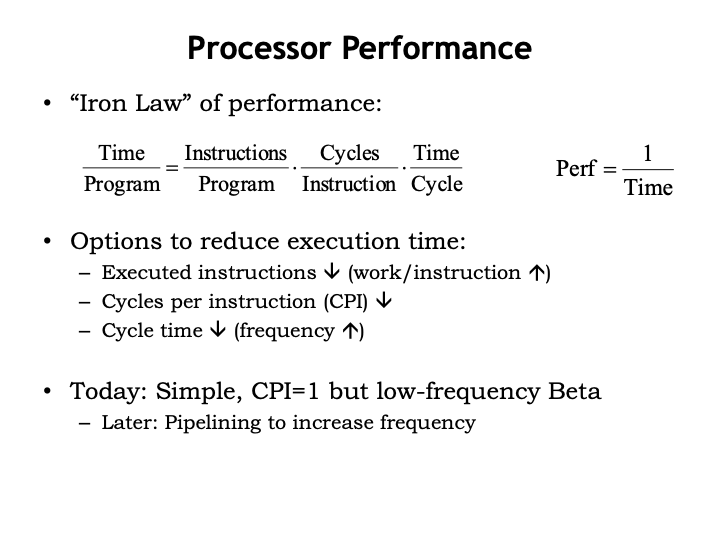

The performance of a processor is inversely proportional to the
length of time it takes to run a program.  The shorter the
execution time, the higher the performance.  The execution time
is determined by three factors.

First, the number of instructions in the program.

Second, the number of clock cycles our sequential circuit
requires to execute a particular instruction.  Complex
instructions, <i>e.g.</i>, adding two values from main memory,
may make a program shorter, but may also require many clock
cycles to perform the necessary memory and datapath
operations.

Third, the amount of time needed for each clock cycle, as
determined by the propagation delay of the digital logic in the
datapath.

So to increase the performance we could reduce the number of
instructions to be executed.  Or we can try to minimize the
number of clock cycles needed on the average to execute our
instructions.  There&#700;s obviously a bit of a tradeoff
between these first two options: more computation per
instruction usually means it will take more time to execute the
instruction.  Or we can try to keep our logic simple, minimizing
its propagation delay in the hopes of having a short clock
period.

Today we&#700;ll focus on an implementation for the Beta ISA
that executes one instruction every clock cycle.  The
combinational paths in our circuit will be fairly long, but, as
we learned in Part 1 of the course, this gives us the
opportunity to use pipelining to increase our
implementation&#700;s throughput.  We&#700;ll talk about the
implementation of a pipelined processor in some upcoming
lectures.

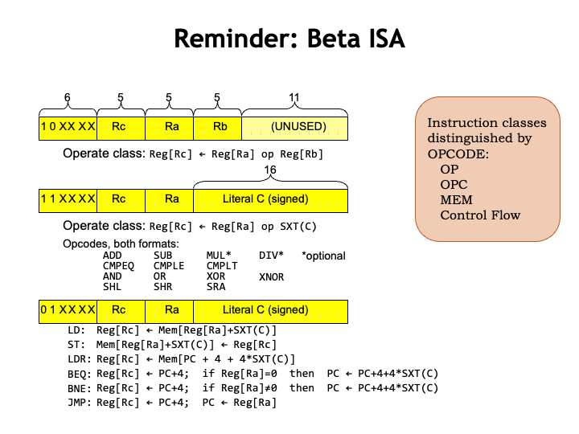

Here&#700;s a quick refresher on the Beta ISA.  The Beta has
thirty-two 32-bit registers that hold values for use by the
datapath.  The first class of ALU instructions, which have 0b10
as the top 2 bits of the opcode field, perform an operation on
two register operands (Ra and Rb), storing the result back into
a specified destination register (Rc).  There&#700;s a 6-bit
opcode field to specify the operation and three 5-bit register
fields to specify the registers to use as source and
destination.  The second class of ALU instructions, which have
0b11 in the top 2 bits of the opcode, perform the same set of
operations where the second operand is constant in the range
-32768 to +32767.

The operations include arithmetic operations, comparisons,
boolean operations, and shifts.  In assembly language, we use a
&#8220;C&#8221; suffix added to the mnemonics shown here to
indicate that the second operand is a constant.

This second instruction format is also used by the instructions
that access memory and change the normally sequential execution
order.

The use of just two instruction formats will make it very easy
to build the logic responsible for translating the encoded
instructions into the signals needed to control the operation of
the datapath.  In fact, we&#700;ll be able to use many of the
instruction bits as-is!

We&#700;ll build our datapath incrementally, starting with the
logic needed to perform the ALU instructions, then add
additional logic to execute the memory and branch instructions.
Finally, we&#700;ll need to add logic to handle what happens
when an exception occurs and execution has to be suspended
because the current instruction cannot be executed
correctly.

We&#700;ll be using the digital logic gates we learned about
in Part 1 of the course.  In particular, we&#700;ll need
multi-bit registers to hold state information from one
instruction to the next.  Recall that these memory elements load
new values at the rising edge of the clock signal, then store
that value until the next rising clock edge.

We&#700;ll use a lot of multiplexers in our design to select
between alternative values in the datapath.

The actual computations will be performed by the arithmetic and
logic unit (ALU) that we designed at the end of Part 1.  It has
logic to perform the arithmetic, comparison, boolean and shift
operations listed on the previous slide.  It takes in two 32-bit
operands and produces a 32-bit result.

And, finally, we&#700;ll use several different memory
components to implement register storage in the datapath and
also for main memory, where instructions and data are
stored.

You might find it useful to review the lectures on
combinational and sequential logic in Part 1 of the course.

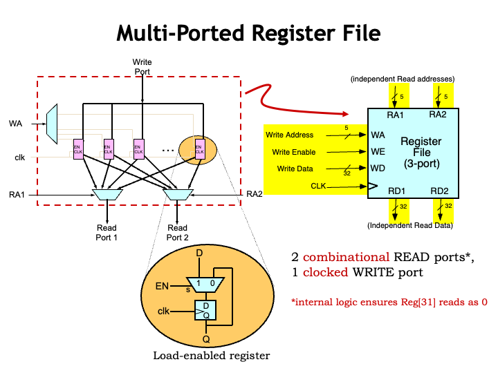

The Beta ISA specifies thirty-two 32-bit registers as part of
the datapath.  These are shown as the magenta rectangles in the
diagram below.  These are implemented as load-enabled registers,
which have an EN signal that controls when the register is
loaded with a new value.  If EN is 1, the register will be
loaded from the D input at the next rising clock edge.  If EN is
0, the register is reloaded with its current value and hence its
value is unchanged.  It might seem easier to add enabling logic
to the clock signal, but this is almost never a good idea since
any glitches in that logic might generate false edges that would
cause the register to load a new value at the wrong time.
Always remember the mantra: NO GATED CLOCKS!

There are multiplexers (shown underneath the registers) that
let us select a value from any of the 32 registers.  Since we
need two operands for the datapath logic, there are two such
multiplexers.  Their select inputs (RA1 and RA2) function as
addresses, determining which register values will be selected as
operands.  And, finally, there&#700;s a decoder that determines
which of the 32 register load enables will be 1 based on the
5-bit WA input.

For convenience, we&#700;ll package all this functionality up
into a single component called a <i>register file</i>.
The register file has two read ports, which given a 5-bit
address input, deliver the selected register value on the
read-data ports.  The two read ports operate independently.
They can read from different registers or, if the addresses are
the same, read from the same register.

The signals on the left of the register file include a 5-bit
value (WA) that selects a register to be written with the
specified 32-bit write data (WD).  If the write enable signal
(WE) is 1 at the rising edge of the clock (CLK) signal, the
selected register will be loaded with the supplied write
data.

Note that in the BETA ISA, reading from register address 31
should always produce a zero value.  The register file has
internal logic to ensure that happens.

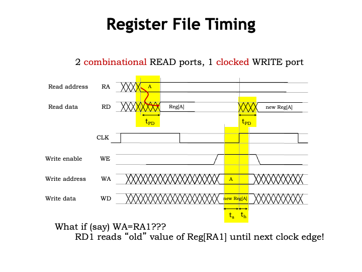

Here&#700;s a timing diagram that shows the register file in
operation.  To read a value from the register file, supply a
stable address input (RA) on one of read ports.  After the
register file&#700;s propagation delay, the value of the
selected register will appear on the corresponding read data
port (RD).

Not surprisingly, the register file write operation is very
similar to writing an ordinary D-register.  The write address
(WA), write data (WD) and write enable (WE) signals must all be
valid and stable for some specified setup time before the rising
edge of the clock.  And must remain stable and valid for the
specified hold time after the rising clock edge.  If those
timing constraints are met, the register file will reliably
update the value of the selected register.

When a register value is written at the rising clock edge, if
that value is selected by a read address, the new data will
appear after the propagation delay on the corresponding data
port.  In other words, the read data value changes if either the
read address changes or the value of the selected register
changes.

Can we read and write the same register in a single clock
cycle? Yes!  If the read address becomes valid at the beginning
of the cycle, the old value of the register will be appear on
the data port for the rest of the cycle.  Then, the write occurs
at the *end* of the cycle and the new register value will be
available in the next clock cycle.

Okay, that&#700;s a brief run-though of the components
we&#700;ll be using.  Let&#700;s get started on the
design!

## ALU Instructions

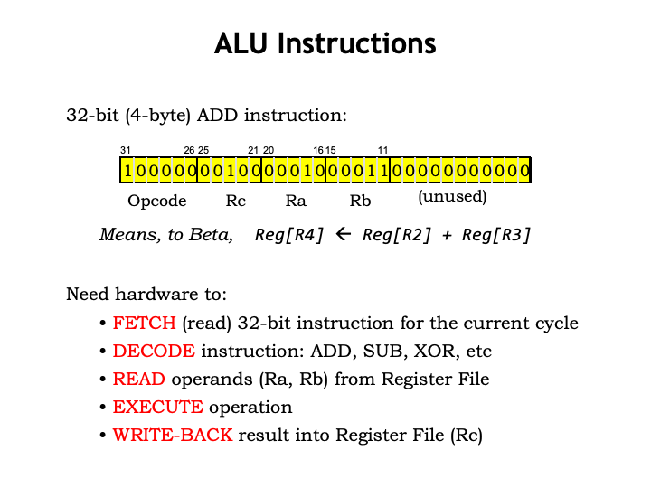

Our first task is to work on the datapath logic needed to
execute ALU instructions with two register operands.  Each
instruction requires the same processing steps:

* Fetch, where the 32-bit encoded instruction is read from main
memory from the location specified by the program counter
(PC).

* Decode, where the opcode field (instruction bits [31:26]) is
used to determine the values for the datapath control
signals.

* Read, where the contents of the registers specified by the RA
and RB fields (instruction bits [20:16] and [15:11]) are read
from the register file.

* Execute, where the requested operation is performed on the two
operand values.  We&#700;ll also need to compute the next value
for the PC.

* And Write-back, where the result of the operation is written to
the register file in the register specified by the RC field
(instruction bits [25:21]).

The system&#700;s clock signal is connected to the register
file and the PC register.  At the rising edge of the clock, the
new values computed during the Execute phase are written to
these registers.  The rising clock edge thus marks the end of
execution for the current instruction and the beginning of
execution for the next instruction.  The period of the
clock, <i>i.e.</i>, the time between rising clock edges, needs
to be long enough to accommodate the cumulative propagation
delay of the logic that implements the 5 steps described here.
Since one instruction is executed each clock cycle, the
frequency of the clock tells us the rate at which instructions
are executed.  If the clock period was 10ns, the clock frequency
would be 100 MHz and our Beta would be executing instructions at
100 MIPS!

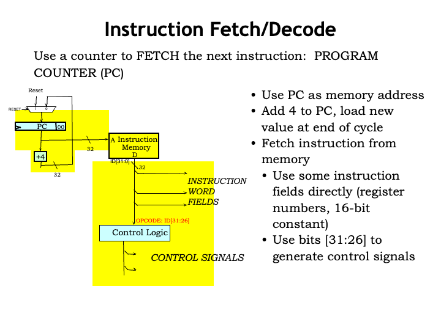

Here&#700;s a sketch showing the hardware needed for the Fetch
and Decode steps.

The current value of the PC register is routed to main memory
as the address of the instruction to be fetched.

For ALU instructions, the address of the next instruction is
simply the address of the current instruction plus 4.
There&#700;s an adder dedicated to performing the
&#8220;PC+4&#8221; computation and that value is routed back to
be used as the next value of the PC.  We&#700;ve also included
a MUX used to select the initial value for the PC when the RESET
signal is 1.

After the memory propagation delay, the instruction bits
(ID[31:0]) are available and the processing steps can begin.
Some of the instruction fields can be used directly as-is.  To
determine the values for other control signals, we&#700;ll need
some logic that computes their values from the bits of the
opcode field.

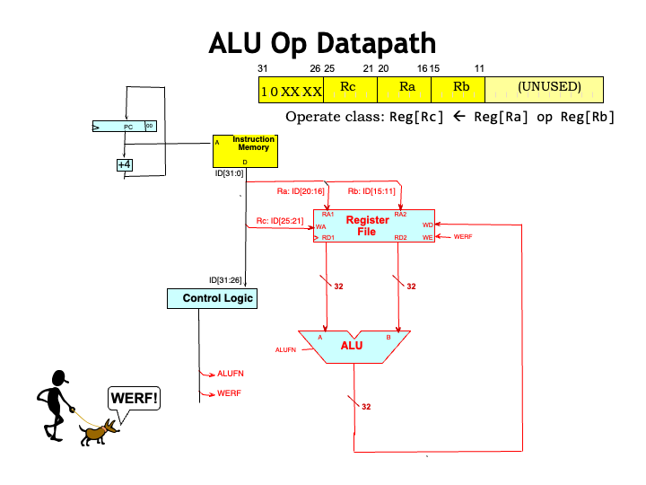

Now let&#700;s fill in the datapath logic needed to execute
ALU instructions with two register operands.  The instruction
bits for the 5-bit RA, RB and RC fields can be connected
directly to the appropriate address inputs of the register file.
The RA and RB fields supply the addresses for the two read ports
and the RC field supplies the address for the write port.

The outputs of the read data ports are routed to the inputs of
the ALU to serve as the two operands.  The ALUFN control signals
tell the ALU what operation to perform.  These control signals
are determined by control logic from the 6-bit opcode field.
For specificity, let&#700;s assume that the control logic is
implemented using a read-only memory (ROM), where the opcode
bits are used as the ROM&#700;s address and the ROM&#700;s
outputs are the control signals.  Since there are 6 opcode bits,
we&#700;ll need $2^6 = 64$ locations in the ROM.  We&#700;ll
program the contents of the ROM to supply the correct control
signal values for each of the 64 possible opcodes.

The output of the ALU is routed back to the write data port of
the register file, to be written into the RC register at the end
of the cycle.  We&#700;ll need another control signal, WERF
(&#8220;write-enable register file&#8221;), that should have the
value 1 when we want to write into the RC register.  Let me
introduce you to Werf, the Computation Structures mascot, who, of course, is
named after her favorite control signal, which she&#700;s
constantly mentioning.

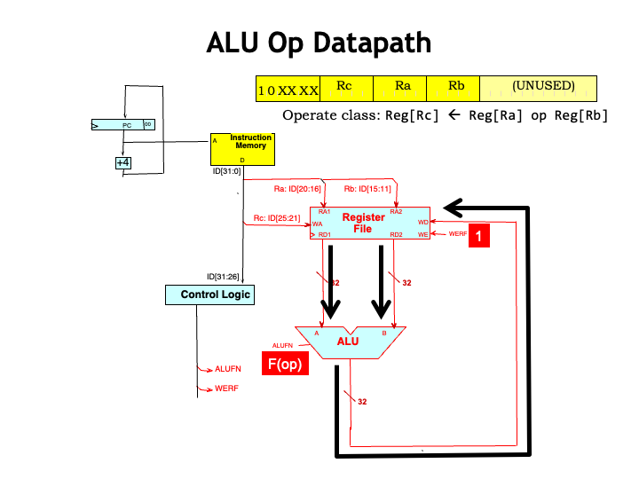

Let&#700;s follow the flow of data as we execute the ALU
instruction.  After the instruction has been fetched, supplying
the RA and RB instruction fields, the RA and RB register values
appear on the read data ports of the register file.

The control logic has decoded the opcode bits and supplied the
appropriate ALU function code.  You can find a listing of the
possible function codes in the upper right-hand corner of the
Beta Diagram handout.

The result of the ALU&#700;s computation is sent back to the
register file to be written into the RC register.  Of course,
we&#700;ll need to set WERF to 1 to enable the write.

Here we see one of the major advantages of a
reduced-instruction set computer architecture: the datapath
logic required for execution is very straightforward!

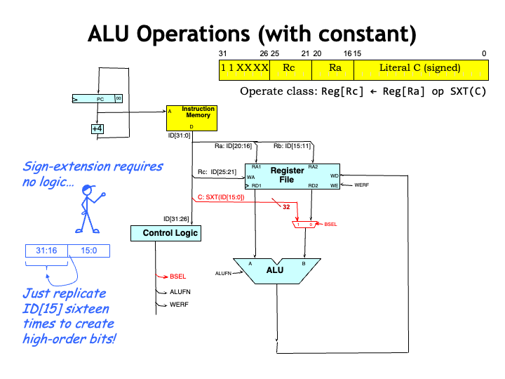

The other form of ALU instructions uses a constant as the
second ALU operand.  The 32-bit operand is formed by
sign-extending the 16-bit two&#700;s complement constant stored
in the literal field (bits [15:0]) of the instruction.  In order
to select the sign-extended constant as the second operand, we
added a MUX to the datapath.  When its BSEL control signal is 0,
the output of the register file is selected as the operand.
When BSEL is 1, the sign-extended constant is selected as the
operand.  The rest of the datapath logic is the same as
before.

Note that no logic gates are needed to perform sign-extension
&#8212; it&#700;s all done with wiring!  To sign-extend a
two&#700;s complement number, we just need to replicate the
high-order, or sign, bit as many times as necessary.  You might
find it useful to review the discussion of two&#700;s
complement in the lecture on &#8220;Basics of Information&#8221;.  So to form a
32-bit operand from a 16-bit constant, we just replicate
it&#700;s high-order bit (ID[15]) sixteen times as we make the
connection to the BSEL MUX.

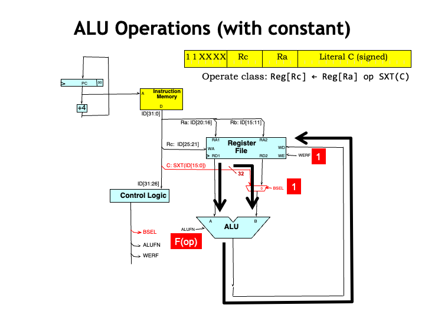

During execution of ALU-with-constant instructions, the flow of
data is much as it was before.  The one difference is that the
control logic sets the BSEL control signal to 1, selecting the
sign-extended constant as the second ALU operand.

As before, the control logic generates the appropriate ALU
function code and the output of the ALU is routed to the
register file to be written back to the RC register.

Amazingly, this datapath is sufficient to execute most of the
instructions in the Beta ISA!  We just have the memory and
branch instruction left to implement.  That&#700;s our next
task.

## Load and Store

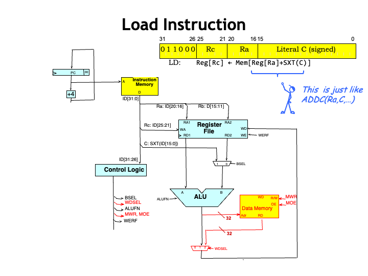

The LD and ST instructions access main memory.  Note that its
the same main memory that holds the instructions, even though
for drafting convenience we show it has two separate boxes in
our datapath diagram.  In the form we show it here, main memory
has three ports: two read ports for fetching instructions and
reading load data, and one write port used by the ST instruction
to write data into main memory.

The address calculation is exactly the same computation as
performed by the ADDC instruction: the contents of the RA
register are added to the sign-extended 16-bit literal from the
low-order 16 bits of the instruction.  So we&#700;ll simply
reuse the existing datapath hardware to compute the address.

For the LD instruction the output of the ALU is routed to main
memory as the address of the location we wish to access.  After
the memory&#700;s propagation delay, the contents of the
addressed location is returned by the memory and we need to
route that back to the register file to be written into the RC
register.

The memory has two control signals: MOE (memory output enable),
which we set to 1 when we want to read a value from the memory.
And MWE (memory write enable) which is set to 1 when we want
main memory to store the value on its write data (WD) port into
the addressed memory location.

We need to add another MUX to select which value to write back
to the register file: the output of the ALU or the data
returning from main memory.  We&#700;ve used a 3-to-1 MUX and
we&#700;ll see the use for the other MUX input when we get to
the implementation of branches and jumps.  The two-bit WDSEL
signal is used to select the source of the write-back value.

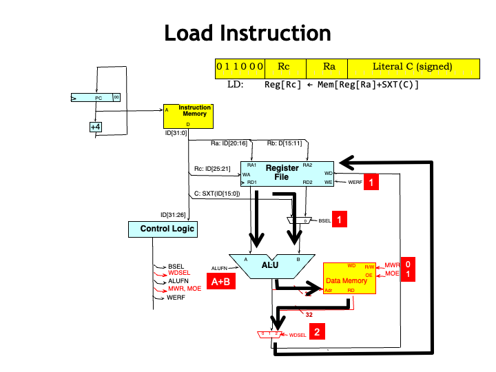

Let&#700;s follow the flow of data when executing the LD
instruction.  The ALU operands are chosen just as they are for
the ADDC instruction and the ALU is requested to perform an ADD
operation.

The ALU result is connected to the address port of main memory,
who&#700;s control signals are set for a read operation.  The
WDSEL control signals are set to 2 to route the returning data
to the register file.

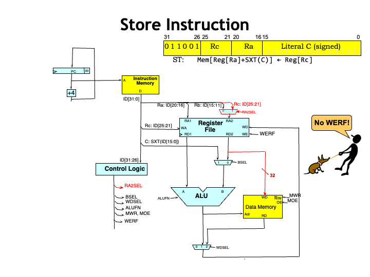

Execution of the ST instruction is very similar to the
execution of the LD instruction, with one extra complication.
The value to be written to memory comes from the RC register,
but the RC instruction field is not connected a register file
read address.

Happily, the RB register address isn&#700;t being used by the
ST instruction since the second ALU operand comes from the
literal field.  So we&#700;ll use a MUX to enable the RC field
to be selected as the address for the register file&#700;s
second read port.  When the RA2SEL control signal is 0, the RB
field is selected as the address.  When RA2SEL is 1, the RC
field is selected.

The output from the second read data port is connected to the
write data port of main memory.

The ST instruction is the only instruction that does not write
a result into the register file.  So the WERF control signal
will be 0 when executing ST.

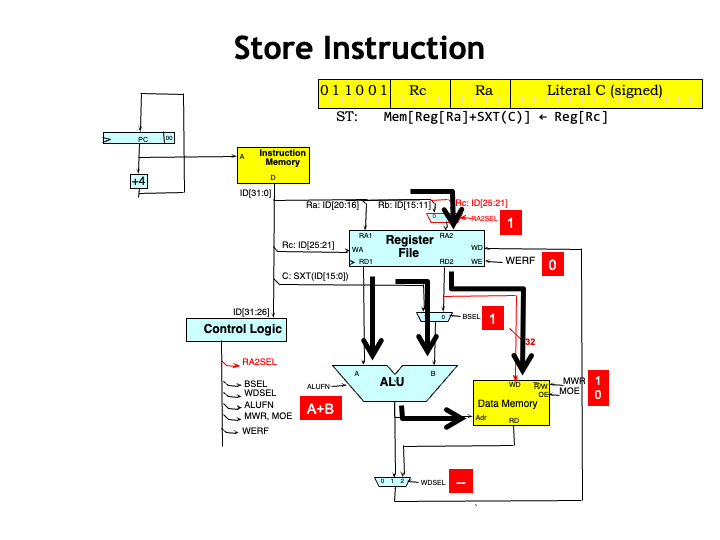

Here&#700;s the flow of data when executing ST.  The operands
are selected as for LD and the ALU performs the address
computation with the result sent to main memory as the
address.

Meanwhile the RC field is selected as the address for the
second register file read port and the value from the RC
register becomes the write data for main memory.  By setting the
MWR control signal to 1, the main memory will write the WD data
into the selected memory location at the end of the cycle.

The WERF control signal is set to zero since we won&#700;t be
writing a value into the register file.  And, since we&#700;re
not writing to the register file, we don&#700;t care about the
value for the WDSEL signal.

Of course, the logic will need to supply some value for WDSEL.
The &#8220;don&#700;t care&#8221; annotation is telling the
logic designer that she&#700;s welcome to supply whatever value
is most convenient.  This is particularly useful when using
Karnaugh maps to optimize the control logic, where the value can
be chosen as either 0 or 1, whichever results in the best
minimization of the logic equations.

</vertical>
</sequential>
<sequential display_name="Jumps and Branches" url_name="jmpbr">
<vertical display_name="Jumps and Branches">

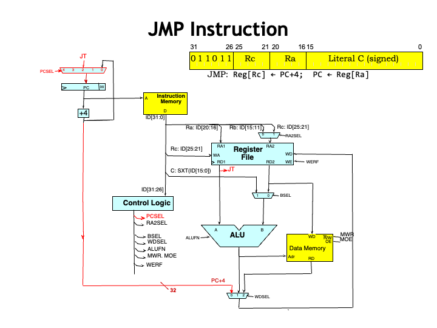

We&#700;re on the home stretch now.  For all the instructions
up until now, the next instruction has come from the location
following the current instruction &#8212; hence the
&#8220;PC+4&#8221; logic.  Branches and JMPs change that by
altering the value in the PC.

The JMP instruction simply takes the value in the RA register
and makes it the next PC value.  The PCSEL MUX in the upper
left-hand corner lets the control logic select the source of the
next PC value.  When PCSEL is 0, the incremented PC value is
chosen.  When PCSEL is 2, the value of the RA register is
chosen.  We&#700;ll see how the other inputs to the PCSEL MUX
are used in just a moment.

The JMP and branch instructions also cause the address of the
following instruction, <i>i.e.</i>, the PC+4 value, to be
written to the RC register.  When WDSEL is 0, the
&#8220;0&#8221; input of the WDSEL MUX is used to select the
PC+4 value as the write-back data.

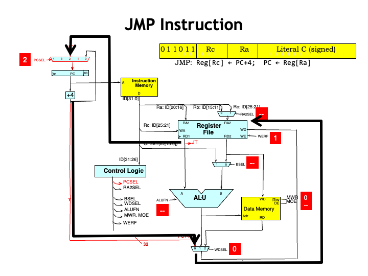

Here&#700;s how the data flow works.  The output of the PC+4
adder is is routed to the register file and WERF is set to 1 to
enable that value to be written at the end of the cycle.

Meanwhile, the value of RA register coming out of the register
file is connected to the &#8220;2&#8221; input of the PCSEL
MUX. So setting PCSEL to 2 will select the value in the RA
register as the next value for the PC.

The rest of the control signals are &#8220;don&#700;t
cares&#8221;, except, of course for the memory write enable
(MWR), which can never be &#8220;don&#700;t care&#8221; lest we
cause an accidental write to some memory location.

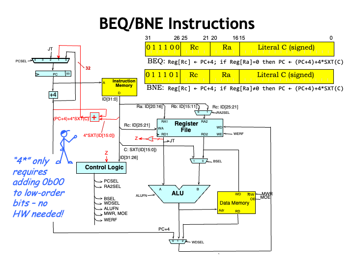

The branch instruction requires an additional adder to compute
the target address by adding the scaled offset from the
instruction&#700;s literal field to the current PC+4 value.
Remember that we scale the offset by a factor of 4 to convert it
from the word offset stored in the literal to the byte offset
required for the PC.  The output of the offset adder becomes the
&#8220;1&#8221; input to the PCSEL MUX, where, if the branch is
taken, it will become the next value of the PC.

Note that multiplying by 4 is easily accomplished by shifting
the literal two bits to the left, which inserts two 0-bits at
the low-order end of the value.  And, like before, the
sign-extension just requires replicating bit ID[15], in this
case fourteen times.  So implementing this complicated-looking
expression requires care in wiring up the input to the offset
adder, but no additional logic!

We do need some logic to determine if we should branch or not.
The 32-bit NOR gate connected to the first read port of the
register file tests the value of the RA register.  The
NOR&#700;s output Z will be 1 if all the bits of the RA
register value are 0, and 0 otherwise.

The Z value can be used by the control logic to determine the
correct value for PCSEL.  If Z indicates the branch is taken,
PCSEL will be 1 and the output of the offset adder becomes the
next value of the PC.  If the branch is not taken, PCSEL will be
0 and execution will continue with the next instruction at
PC+4.

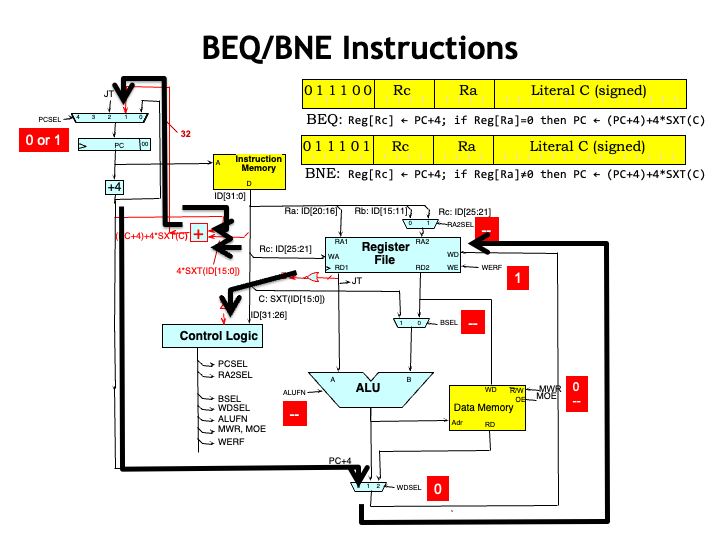

As in the JMP instruction, the PC+4 value is routed to the
register file to be written into the RC register at end of the
cycle.

Meanwhile, the value of Z is computed from the value of the RA
register while the branch offset adder computes the address of
the branch target.

The output of the offset adder is routed to the PCSEL MUX where
the value of the 3-bit PCSEL control signal, computed by the
control logic based on Z, determines whether the next PC value
is the branch target or the PC+4 value.

The remaining control signals are unused and set to their
default &#8220;don&#700;t care&#8221; values.

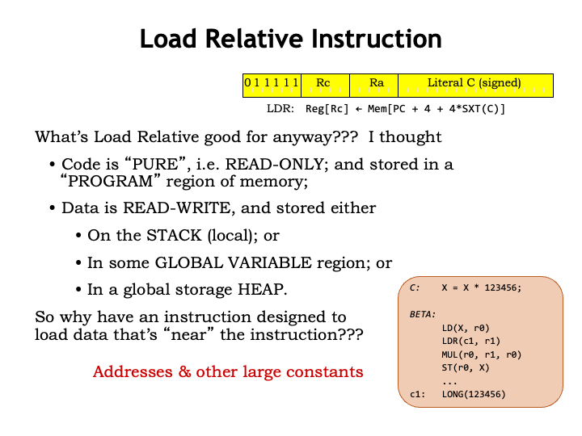

We have one last instruction to introduce: the LDR or
load-relative instruction.  LDR behaves like a normal LD
instruction except that the memory address is taken from the
branch offset adder.

Why would it be useful to load a value from a location near the
LDR instruction?  Normally such addresses would refer to the
neighboring instructions, so why would we want to load the
binary encoding of an instruction into a register to be used as
data?

The use case for LDR is accessing large constants that have to
be stored in main memory because they are too large to fit into
the 16-bit literal field of an instruction.  In the example
shown here, the compiled code needs to load the constant 123456.
So it uses an LDR instruction that refers to a nearby location
C1: that has been initialized with the required value.  Since
this read-only constant is part of the program, it makes sense
to store it with the instructions for the program, usually just
after the code for a procedure.  Note that we have to be careful
to place the storage location so that it won&#700;t be executed
as an instruction!

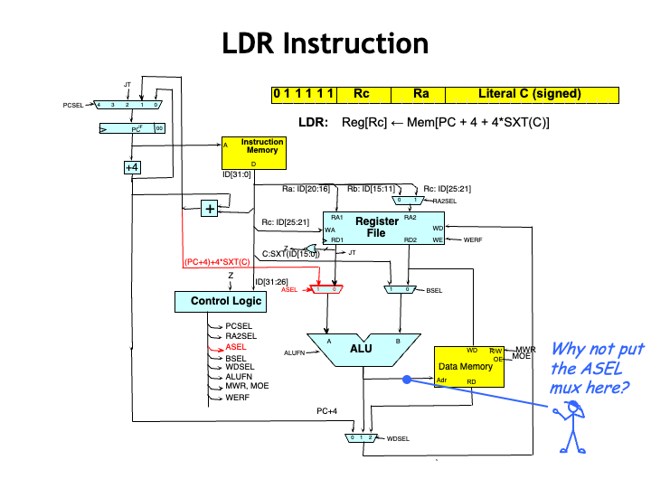

To route the output of the offset adder to the main memory
address port, we&#700;ll add ASEL MUX so we can select either
the RA register value (when ASEL=0) or the output of the offset
adder (when ASEL=1) as the first ALU operand.

For LDR, ASEL will be 1, and we&#700;ll then ask the ALU
compute the Boolean operation &#8220;A&#8221;, <i>i.e.</i>, the
boolean function whose output is just the value of the first
operand.  This value then appears on the ALU output, which is
connected to the main memory address port and the remainder of
the execution proceeds just like it did for LD.

This seems a bit complicated! Mr. Blue has a good question: why
not just put the ASEL MUX on the wire leading to the main memory
address port and bypass the ALU altogether?

The answer has to do with the amount of time needed to compute
the memory address.  If we moved the ASEL MUX here, the data
flow for LD and ST addresses would then pass through two MUXes:
the BSEL MUX and the ASEL MUX, slowing down the arrival of the
address by a small amount.  This may not seem like a big deal,
but the additional time would have to be added the clock period,
thus slowing down every instruction by a little bit.  When
executing billions of instructions, a little extra time on each
instruction really impacts the overall performance of the
processor.

By placing the ASEL MUX where we did, its propagation delay
overlaps that of the BSEL MUX, so the increased functionality it
provides comes with no cost in performance.

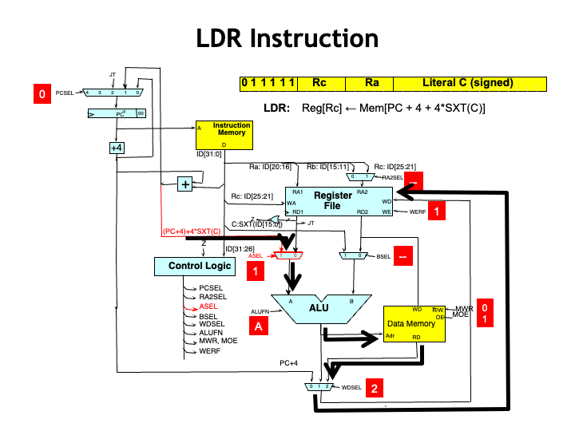

Here&#700;s the data flow for the LDR instruction.  The output
of the offset adder is routed through the ASEL MUX to the ALU.
The ALU performs the Boolean computation &#8220;A&#8221; and the
result becomes the address for main memory.

The returning data is routed through the WDSEL MUX so it can be
written into the RC register at the end of the cycle.

The remaining control signals are given their usual default
values.

## Exceptions

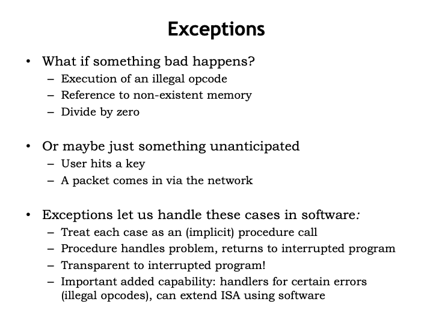

One last bit of housekeeping, then we&#700;re done!  What
should our hardware do if for some reason an instruction
can&#700;t be executed?  For example, if a programming error
has led to trying to execute some piece of data as an
instruction and the opcode field doesn&#700;t correspond to a
Beta instruction (a so-called <i>illop</i> or illegal
operation).  Or maybe the memory address is larger than the
actual amount main memory.  Or maybe one of the operand values
is not acceptable, <i>e.g.</i>, if the B operand for a DIV
instruction is 0.

In modern computers, the accepted strategy is cease execution
of the running program and transfer control to some error
handler code.  The error handler might store the program state
onto disk for later debugging.  Or, for an unimplemented but
legal opcode, it might emulate the missing instruction in
software and resume execution as if the instruction had been
implemented in hardware!

There&#700;s also the need to deal with external events, like
those associated with input and output.  Here we&#700;d like to
interrupt the execution of the current program, run some code to
deal with the external event, then resume execution as if the
interrupt had never happened.

To deal with these cases, we&#700;ll add hardware to treat
exceptions like forced procedure calls to special code to handle
the situation, arranging to save the PC+4 value of the
interrupted program so that the handler can resume execution if
it wishes.

This is a very powerful feature since it allows us to transfer
control to software to handle most any circumstance beyond the
capability of our modest hardware.  As we&#700;ll see in Part 3
of the course, the exception hardware will be our key to
interfacing running programs to the operating system (OS) and to
allow the OS to deal with external events without any awareness
on the part of the running program.

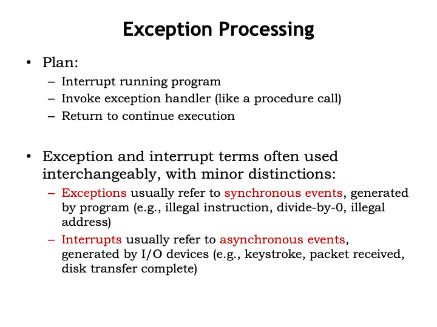

So our plan is to interrupt the running program, acting like
the current instruction was actually a procedure call to the
handler code.  When it finishes execution, the handler can, if
appropriate, use the normal procedure return sequence to resume
execution of the user program.

We&#700;ll use the term <i>exception</i> to refer to
exceptions caused by executing the current program.  Such
exceptions are <i>synchronous</i> in the sense that they
are triggered by executing a particular instruction.  In other
words, if the program was re-run with the same data, the same
exception would occur.

We&#700;ll use the term <i>interrupt</i> to refer to
asynchronous exceptions resulting from external events whose
timing is unrelated to the currently running program.

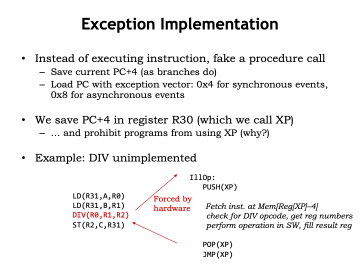

The implementation for both types of exceptions is the same.
When an exception is detected, the Beta hardware will behave as
if the current instruction was a taken BR to either location 0x4
(for synchronous exceptions) or location 0x8 (for asynchronous
interrupts).  Presumably the instructions in those locations
will jump to the entry points of the appropriate handler
routines.

We&#700;ll save the PC+4 value of the interrupted program into
R30, a register dedicated to that purpose.  We&#700;ll call
that register XP (<i>exception pointer</i>) to remind
ourselves of how we&#700;re using it.  Since interrupts in
particular can happen at any point during a program&#700;s
execution, thus overwriting the contents of XP at any time, user
programs can&#700;t use the XP register to hold values since
those values might disappear at any moment!

Here&#700;s how this scheme works: suppose we don&#700;t
include hardware to implement the DIV instruction, so it&#700;s
treated as an illegal opcode.  The exception hardware forces a
procedure call to location 0x4, which then branches to the Illop
handler shown here.  The PC+4 value of the DIV instruction has
been saved in the XP register, so the handler can fetch the
illegal instruction and, if it can, emulate its operation in
software.  When handler is complete, it can resume execution of
the original program at the instruction following DIV by
performing a JMP(XP).

Pretty neat!

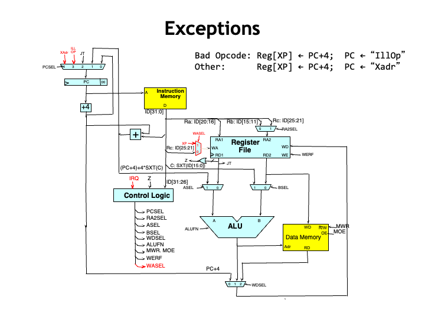

To handle exceptions, we only need a few simple changes to the
datapath.

We&#700;ve added a MUX controlled by the WASEL signal to
choose the write-back address for the register file.  When WASEL
is 1, write-back will occur to the XP register, <i>i.e.</i>,
register 30.  When WASEL is 0, write-back will occur
normally, <i>i.e.</i>, to the register specified by the RC field
of the current instruction.

The remaining two inputs of the PCSEL MUX are set to the
constant addresses for the exception handlers.  In our case, 0x4
for illegal operations, and 0x8 for interrupts.

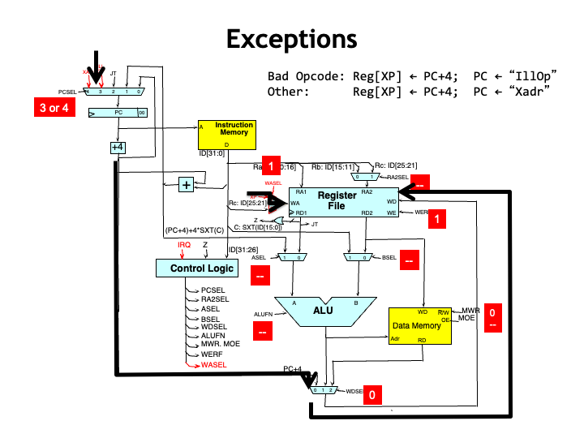

Here&#700;s the flow of control during an exception.  The PC+4
value for the interrupted instruction is routed through the
WDSEL MUX to be written into the XP register.  Meanwhile the
control logic chooses either 3 or 4 as the value of PCSEL to
select the appropriate next instruction that will initiate the
handling the exception.

The remaining control signals are forced to their
&#8220;don&#700;t care&#8221; values, since we no longer care
about completing execution of the instruction we had fetched
from main memory at the beginning of the cycle.

Note that the interrupted instruction has not been executed.
So if the exception handler wishes to execute the interrupted
instruction, it will have to subtract 4 from the value in the XP
register before performing a JMP(XP) to resume execution of the
interrupted program.

## Beta: Our &#8220;Final Answer&#8221;

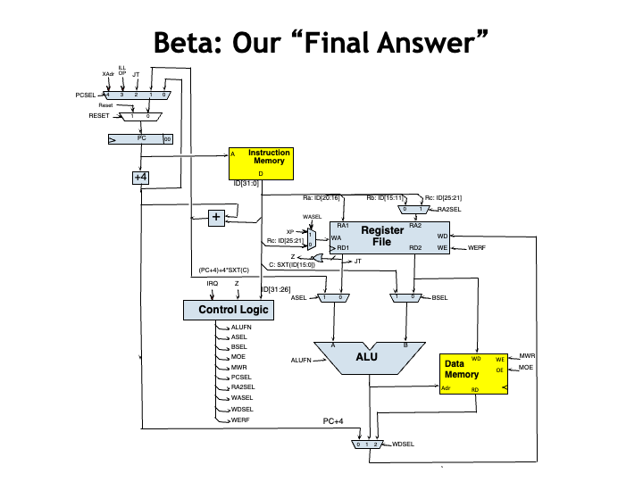

Okay, we&#700;re done!  Here&#700;s the final datapath for
executing instructions and handling exceptions.  Please take a
moment to remind yourself of what each datapath component
does, <i>i.e.</i>, why it was added to the datapath.  Similarly,
you should understand how the control signals affect the
operation of the datapath.

At least to my eye, this seems like a very modest amount of
hardware to achieve all this functionality!  It&#700;s so
modest in fact, that will ask you to actually complete the logic
design for the Beta in an upcoming lab assignment :)

How does our design compare to the processor you&#700;re using
to view this course online?  Modern processors have many
additional complexities to increase performance: pipelined
execution, the ability to execute more than instruction per
cycle, fancier memory systems to reduce average memory access
time, etc.  We&#700;ll cover some of these enhancements in
upcoming lectures.  The bottom line: the Beta hardware might
occupy 1 or 2 sq mm on a modern integrated circuit, while a
modern Intel processor occupies 300 to 600 sq mm.  Clearly all
that extra circuitry is there for a reason!  If you&#700;re
curious, I&#700;d recommend taking a course on advanced
processor architecture.

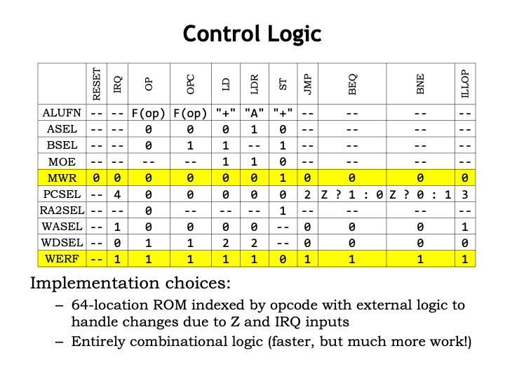

Here we&#700;ve gathered up all the control signal settings
for each class of instructions, including the settings needed
for exceptions and during reset.  Wherever possible, we&#700;ve
specified &#8220;don&#700;t care&#8221; for control signals
whose value does not affect the actions of the datapath needed
for a particular instruction.

Note that the memory write enable signal always has a defined
value, ensuring that we only write to the memory during ST
instructions.  Similarly, the write enable for the register file
is well-defined, except during RESET when presumably we&#700;re
restarting the processor and don&#700;t care about preserving
any register values.

As mentioned previously, a read-only memory (ROM) indexed by
the 6-bit opcode field is the easiest way to generate the
appropriate control signals for the current instruction.  The Z
and IRQ inputs to the control logic will affect the control
signals and this can be accomplished with a small amount of
logic to process the ROM outputs.

One can always have fun with Karnuagh maps to generate a
minimal implementation using ordinary logic gates.  The result
will be much smaller, both in terms of size and propagation
delay, but requires a lot more design work!  My recommendation:
start with the ROM implementation and get everything else
working.  Then come back later when you feel like hacking logic
gates :)

So that&#700;s what it takes to design the hardware for a
simple 32-bit computer.  Of course, we made the job easy for
ourselves by choosing a simple binary encoding for our
instructions and limiting the hardware functionality to
efficiently executing the most common operations.  Less common
and more complex functionality can be left to software.  The
exception mechanism gave us a powerful tool for transferring
control to software when the hardware couldn&#700;t handle the
task.

Have fun completing the hardware design of your Beta.
Thousands of MIT students have enjoyed that &#8220;Yes!&#8221;
moment when their design works for the first time.  For their
efforts we reward them with the &#8220;Beta Inside&#8221;
sticker you see here, which you can see on laptops as you walk
around the Institute.

Good luck!

