
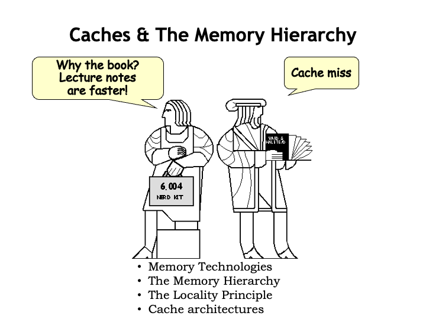

 
## Memory Technologies

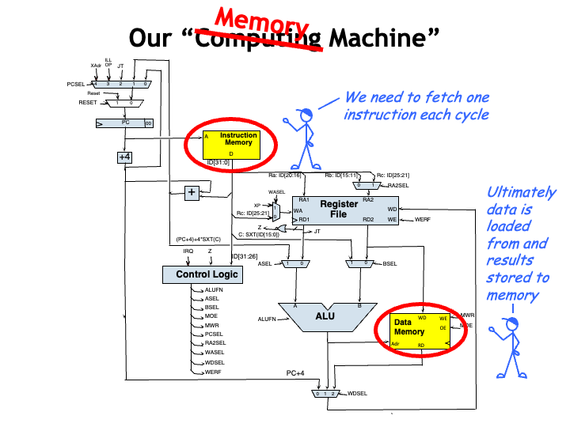

In the last chpater we completed the design of the Beta, our
reduced-instruction-set computer.  The simple organization of the Beta
ISA meant that there was a lot commonality in the circuity needed to
implement the instructions.  The final design has a few main building
blocks with MUX steering logic to select input values as appropriate.

If we were to count MOSFETs and think about propagation delays, we&#700;d
quickly determine that our 3-port main memory (shown here as the two
yellow components) was the most costly component both in terms of
space and percentage of the cycle time required by the memory
accesses.  So, in many ways, we really have a <i>memory machine</i> instead
of a <i>computing machine</i>.

The execution of every instruction starts by fetching the instruction
from main memory. And ultimately all the data processed by the CPU is
loaded from or stored to main memory.  A very few frequently-used
variable values can be kept in the CPU&#700;s register file, but most
interesting programs manipulate *much* more data than can be
accommodated by the storage available as part of the CPU datapath.

In fact, the performance of most modern computers is limited by the
bandwidth, <i>i.e.</i>, bytes/second, of the connection between the CPU and
main memory, the so-called <i>memory bottleneck</i>.  The goal of this
lecture is to understand the nature of the bottleneck and to see if
there architectural improvements we might make to minimize the problem
as much as possible.

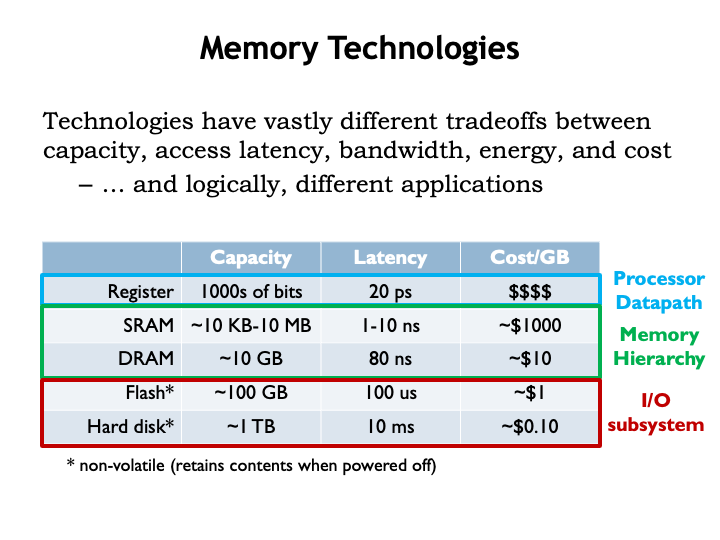

We have a number of memory technologies at our disposal, varying
widely in their capacity, latency, bandwidth, energy efficiency and
their cost.  Not surprisingly, we find that each is useful for
different applications in our overall system architecture.

Our registers are built from sequential logic and provide very low
latency access (20ps or so) to at most a few thousands of bits of
data. Static and dynamic memories, which we&#700;ll discuss further in the
coming slides, offer larger capacities at the cost of longer access
latencies.  Static random-access memories (SRAMs) are designed to
provide low latencies (a few nanoseconds at most) to many thousands of
locations.  Already we see that more locations means longer access
latencies &#8212; this is a fundamental size vs. performance tradeoff of our
current memory architectures.  The tradeoff comes about because
increasing the number of bits will increase the area needed for the
memory circuitry, which will in turn lead to longer signal lines and
slower circuit performance due to increased capacitive loads.

Dynamic random-access memories (DRAMs) are optimized for capacity and
low cost, sacrificing access latency.  As we&#700;ll see in this lecture,
we&#700;ll use both SRAMs and DRAMs to build a hybrid memory hierarchy that
provides low average latency and high capacity &#8212; an attempt to get the
best of both worlds!

Notice that the word &#8220;average&#8221; has snuck into the performance claims.
This means that we&#700;ll be relying on statistical properties of memory
accesses to achieve our goals of low latency and high capacity.  In
the worst case, we&#700;ll still be stuck with the capacity limitations of
SRAMs and the long latencies of DRAMs, but we&#700;ll work hard to ensure
that the worst case occurs infrequently!

Flash memory and hard-disk drives provide non-volatile storage.
<i>Non-volatile</i> means that the memory contents are preserved even when
the power is turned off.  Hard disks are at the bottom of the memory
hierarchy, providing massive amounts of long-term storage for very
little cost.  Flash memories, with a 100-fold improvement in access
latency, are often used in concert with hard-disk drives in the same
way that SRAMs are used in concert with DRAMs, <i>i.e.</i>, to provide a
hybrid system for non-volatile storage that has improved latency *and*
high capacity.

Let&#700;s learn a bit more about each of these four memory technologies,
then we&#700;ll return to the job of building our memory system.

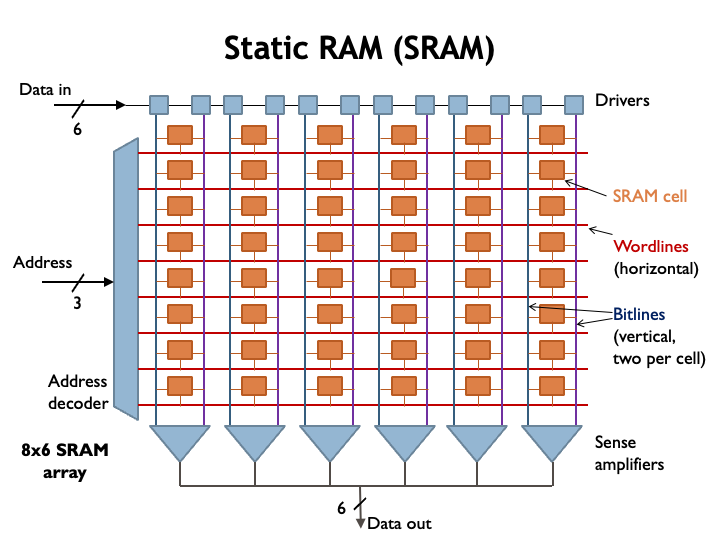

SRAMs are organized as an array of memory locations, where a memory
access is either reading or writing all the bits in a single location.
Here we see the component layout for a 8-location SRAM array where
each location hold 6 bits of data.  You can see that the individual
bit cells are organized as 8 rows (one row per location) by 6 columns
(one column per bit in each memory word).  The circuitry around the
periphery is used to decode addresses and support read and write
operations.

To access the SRAM, we need provide enough address bits to uniquely
specify the location.  In this case we need 3 address bits to select
one of the 8 memory locations.  The address decoder logic sets one of
the 8 wordlines (the horizontal wires in the array) high to enable a
particular row (location) for the upcoming access.  The remaining
wordlines are set low, disabling the cells they control.  The active
wordline enables each of the SRAM bit cells on the selected row,
connecting each cell to a pair of bit lines (the vertical wires in the
array).  During read operations the bit lines carry the analog signals
from the enabled bit cells to the sense amplifiers, which convert the
analog signals to digital data.  During write operations incoming data
is driven onto the bit lines to be stored into the enabled bit cells.

Larger SRAMs will have a more complex organization in order to
minimize the length, and hence the capacitance, of the bit lines.

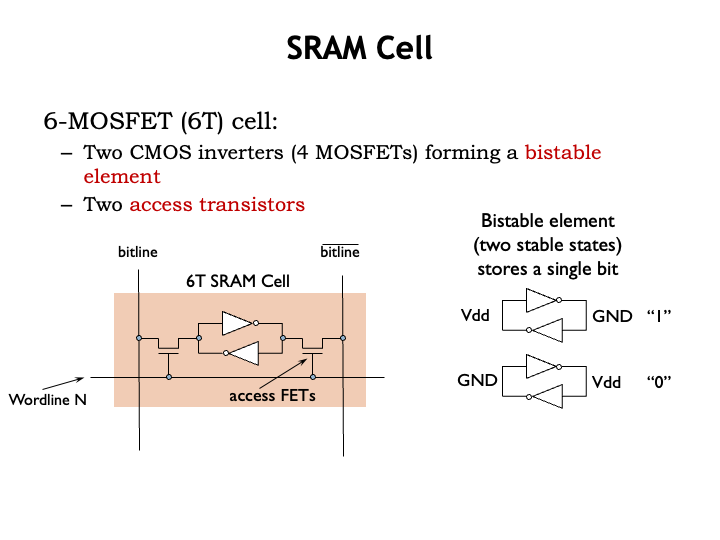

The heart of the SRAM are the bit cells.  The typical cell has two
CMOS inverters wired in a positive feedback loop to create a bistable
storage element.  The diagram on the right shows the two stable
configurations.  In the top configuration, the cell is storing a 1
bit.  In the bottom configuration, it&#700;s storing a 0 bit.  The cell
provides stable storage in the sense that as long as there&#700;s power,
the noise immunity of the inverters will ensure that the logic values
will be maintained even if there&#700;s electrical noise on either inverter
input.

Both sides of the feedback loop are connected via access FETs to the
two vertical bit lines.  When the wordline connected to the gates of
the access FETs is high, the FETs are on, <i>i.e.</i>, they will make an
electrical connection between the cell&#700;s internal circuity and the
bitlines.  When the wordline is low, the access FETs are off and the
bistable feedback loop is isolated from the bitlines and will happily
maintain the stored value as long as there&#700;s power.

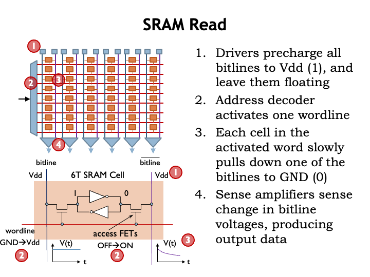

During a read operation, the drivers first recharge all the bitlines
to Vdd (<i>i.e.</i>, a logical 1 value) and then disconnect, leaving the
bitlines floating at 1.  Then the address decoder sets one of the
wordlines high, connecting a row of bit cells to their bitlines.  Each
cell in the selected row then pulls one of its two bitlines to GND.
In this example, it&#700;s the right bitline that&#700;s pulled low.
Transitions on the bitlines are slow since the bitline has a large
total capacitance and the MOSFETs in the two inverters are small to
keep the cell has small as possible.  The large capacitance comes
partly from the bitline&#700;s length and partly from the diffusion
capacitance of the access FETs in other cells in the same column.

Rather than wait for the bitline to reach a valid logic level, sense
amplifiers are used to quickly detect the small voltage difference
developing between the two bitlines and generate the appropriate
digital output.  Since detecting small changes in a voltage is very
sensitive to electrical noise, the SRAM uses a pair of bitlines for
each bit and a differential sense amplifier to provide greater noise
immunity.

As you can see, designing a low-latency SRAM involves a lot of
expertise with the analog behavior of MOSFETs and some cleverness to
ensure electrical noise will not interfere with the correct operation
of the circuitry.

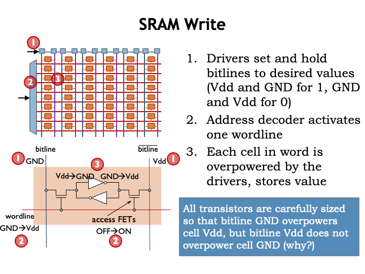

Write operations start by driving the bitlines to the appropriate
values.  In the example shown here, we want to write a 0-bit into the
cell, so the left bitline is set to GND and the right bitline is set
to VDD.  As before, the address decoder then sets one of the wordlines
high, selecting all the cells in a particular row for the write
operation.

The drivers have much larger MOSFETs than those in the cell&#700;s
inverters, so the internal signals in the enabled cells are forced to
the values on the bitlines and the bistable circuits &#8220;flip&#8221; into the
new stable configuration.  We&#700;re basically shorting together the
outputs of the driver and the internal inverter, so this is another
analog operation!  This would be a no-no in a strictly digital
circuit.

Since n-fets usually carry much higher source-drain currents than
p-fets of the same width and given the threshold-drop of the n-fet
access transistor, almost all the work of the write is performed by
the large n-fet pulldown transistor connected to the bitline with the
0 value, which easily overpowers the small p-fet pullup of the
inverters in the cell.  Again, SRAM designers need a lot of expertise
to correctly balance the sizes of MOSFETs to ensure fast and reliable
write operations.

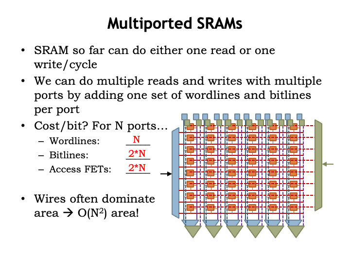

It&#700;s not hard to augment the SRAM to support multiple read/write
ports, a handy addition for register file circuits.  We&#700;ll do this by
adding additional sets of wordlines, bitlines, drivers, and sense
amps.  This will give us multiple paths to independently access the
bistable storage elements in the various rows of the memory array.

With an N-port SRAM, for each bit we&#700;ll need N wordlines, 2N bitlines
and 2N access FETs.  The additional wordlines increase the effective
height of the cell and the additional bitlines increase the effective
width of the cell and so the area required by all these wires quickly
dominates the size of the SRAM.  Since both the height and width of a
cell increase when adding ports, the overall area grows as the square
of the number of read/write ports.  So one has to take care not to
gratuitously add ports lest the cost of the SRAM get out of hand.

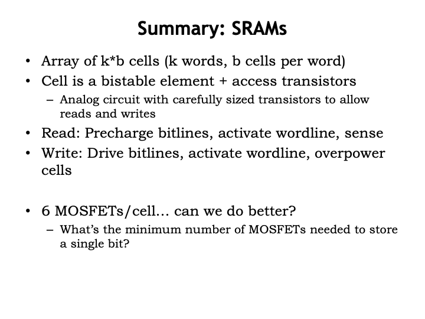

In summary, the circuitry for the SRAM is organized as an array of bit
cells, with one row for each memory location and one column for each
bit in a location.  Each bit is stored by two inverters connected to
form a bistable storage element.  Reads and writes are essentially
analog operations performed via the bitlines and access FETs.

The SRAM uses 6 MOSFETs for each bit cell.  Can we do better?  What&#700;s
the minimum number of MOSFETs needed to store a single bit of
information?

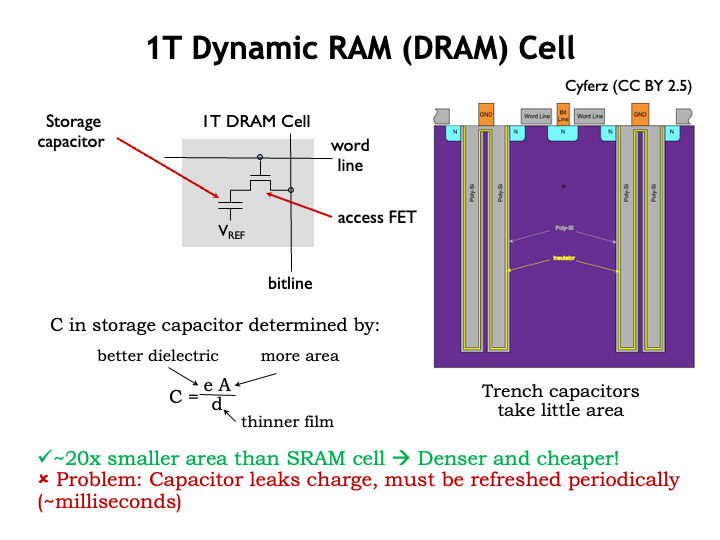

Well, we&#700;ll need at least one MOSFET to serve as the access FET so we
can select which bits will be affected by read and write operations.
We can use a simple capacitor for storage, where the value of a stored
bit is represented by voltage across the plates of the capacitor.  The
resulting circuit is termed a dynamic random-access memory (DRAM)
cell.

If the capacitor voltage exceeds a certain threshold, we&#700;re storing a
1 bit, otherwise we&#700;re storing a 0.  The amount of charge on the
capacitor, which determines the speed and reliability of reading the
stored value, is proportional to the capacitance.  We can increase the
capacitance by increasing the dielectric constant of the insulating
layer between the two plates of the capacitor, increasing the area of
the plates, or by decreasing the the distance between the plates.  All
of these are constantly being improved.

A cross section of a modern DRAM cell is shown here.  The capacitor is
formed in a large trench dug into the substrate material of the
integrated circuit.  Increasing the depth of the trench will increase
the area of the capacitor plates without increasing the cell&#700;s area.
The wordline forms the gate of the N-FET access transistor connecting
the outer plate of the capacitor to the bitline.  A very thin
insulating layer separates the outer plate from the inner plate, which
is connected to some reference voltage (shown as GND in this
diagram). You can Google <i>trench capacitor</i> to get the latest
information on the dimensions and materials used in the construction
of the capacitor.

The resulting circuit is quite compact: about 20-times less area/bit
than an SRAM bit cell.  There are some challenges however.  There&#700;s no
circuitry to main the static charge on the capacitor, so stored charge
will leak from the outer plate of the capacitor, hence the name
<i>dynamic memory</i>.  The leakage is caused by small picoamp currents
through the PN junction with the surrounding substrate, or
subthreshold conduction of the access FET even when it&#700;s turned off.
This limits the amount of time we can leave the capacitor unattended
and still expect to read the stored value.  This means we&#700;ll have to
arrange to read then re-write each bit cell (called a <i>refresh</i> cycle)
every 10ms or so, adding to the complexity of the DRAM interface
circuitry.

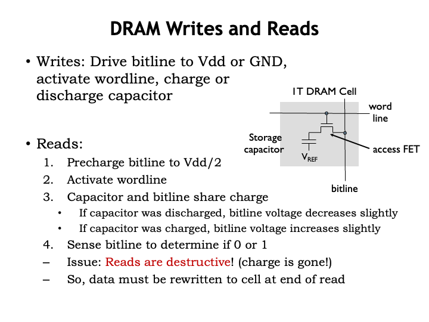

DRAM write operations are straightforward: simply turn on the access
FET with the wordline and charge or discharge the storage capacitor
through the bitline.

Reads are bit more complicated. First the bitline is precharged to
some intermediate voltage, <i>e.g.</i>, VDD/2, and then the precharge
circuitry is disconnected.  The wordline is activated, connecting the
storage capacitor of the selected cell to the bitline causing the
charge on the capacitor to be shared with the charge stored by the
capacitance of the bitline.  If the value stored by the cell capacitor
is a 1, the bitline voltage will increase very slightly (<i>e.g.</i>, a few
tens of millivolts).  If the stored value is a 0, the bitline
voltage will decrease slightly.  Sense amplifiers are used to detect
this small voltage change to produce a digital output value.

This means that read operations wipe out the information stored in the
bit cell, which must then be rewritten with the detected value at the
end of the read operation.

DRAM circuitry is usually organized to have wide rows, <i>i.e.</i>, multiple
consecutive locations are read in a single access.  This particular
block of locations is selected by the DRAM row address.  Then the DRAM
column address is used to select a particular location from the block
to be returned.  If we want to read multiple locations in a single
row, then we only need to send a new column address and the DRAM will
respond with that location without having to access the bit cells
again.  The first access to a row has a long latency, but subsequent
accesses to the same row have very low latency.  As we&#700;ll see, we&#700;ll
be able to use fast column accesses to our advantage.

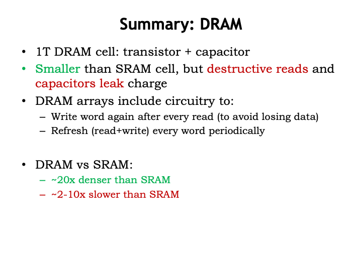

In summary, DRAM bit cells consist of a single access FET connected to
a storage capacitor that&#700;s cleverly constructed to take up as little
area as possible.  DRAMs must rewrite the contents of bit cells after
they are read and every cell must be read and written periodically to
ensure that the stored charge is refreshed before it&#700;s corrupted by
leakage currents.

DRAMs have much higher capacities than SRAMs because of the small size
of the DRAM bit cells, but the complexity of the DRAM interface
circuitry means that the initial access to a row of locations is quite
a bit slower than an SRAM access.  However subsequent accesses to the
same row happen at speeds close to that of SRAM accesses.

Both SRAMs and DRAMs will store values as long as their circuitry has
power.  But if the circuitry is powered down, the stored bits will be
lost.  For long-term storage we will need to use non-volatile memory
technologies, the topic of the next section.

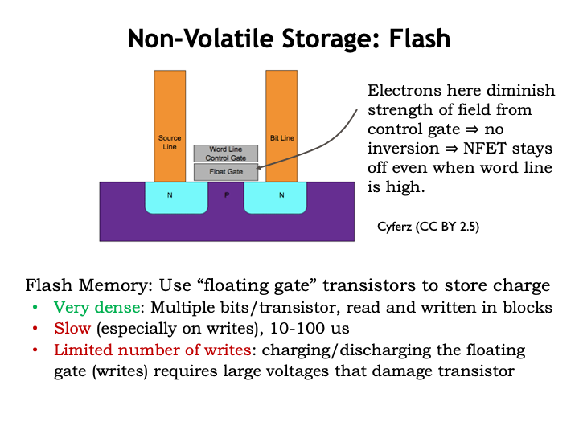

Non-volatile memories are used to maintain system state even when the
system is powered down.  In flash memories, long-term storage is
achieved by storing charge on an well-insulated conductor called a
floating gate, where it will remain stable for years.  The floating
gate is incorporated in a standard MOSFET, placed between the MOSFET&#700;s
gate and the MOSFET&#700;s channel.  If there is no charge stored on the
floating gate, the MOSFET can be turned on, <i>i.e.</i>, be made to conduct,
by placing a voltage $V_1$ on the gate terminal, creating an inversion
layer that connects the MOSFET&#700;s source and drain terminals.  If there
is a charge stored on the floating gate, a higher voltage $V_2$ is
required to turn on the MOSFET.  By setting the gate terminal to a
voltage between $V_1$ and $V_2$, we can determine if the floating gate is
charged by testing to see if the MOSFET is conducting.

In fact, if we can measure the current flowing through the MOSFET, we
can determine how much charge is stored on the floating gate, making
it possible to store multiple bits of information in one flash cell by
varying the amount of charge on its floating gate.  Flash cells can be
connected in parallel or series to form circuits resembling CMOS NOR
or NAND gates, allowing for a variety of access architectures suitable
for either random or sequential access.

Flash memories are very dense, approaching the areal density of DRAMs,
particularly when each cell holds multiple bits of information.

Read access times for NOR flash memories are similar to that of DRAMs,
several tens of nanoseconds.  Read times for NAND flash memories are
much longer, on the order of 10 microseconds.  Write times for all
types of flash memories are quite long since high voltages have to be
used to force electrons to cross the insulating barrier surrounding
the floating gate.

Flash memories can only be written some number of times before the
insulating layer is damaged to the point that the floating gate will
no longer reliably store charge.  Currently the number of guaranteed
writes varies between 100,000 and 1,000,000.  To work around this
limitation, flash chips contain clever address mapping algorithms so
that writes to the same address actually are mapped to different flash
cells on each successive write.

The bottom line is that flash memories are a higher-performance but
higher-cost replacement for the hard-disk drive, the long-time
technology of choice for non-volatile storage.

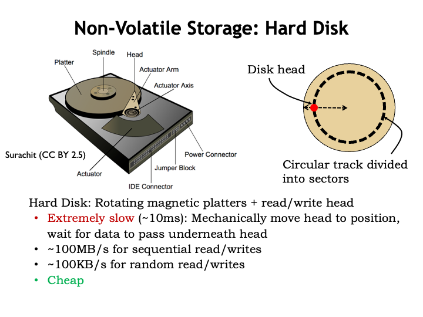

A hard-disk drive (HDD) contains one or more rotating platters coated
with a magnetic material.  The platters rotate at speeds ranging from
5400 to 15000 RPM.  A read/write head positioned above the surface of
a platter can detect or change the orientation of the magnetization of
the magnetic material below.  The read/write head is mounted an
actuator that allows it to be positioned over different circular
tracks.

To read a particular sector of data, the head must be positioned
radially over the correct track, then wait for the platter to rotate
until it&#700;s over the desired sector.  The average total time required
to correctly position the head is on the order of 10 milliseconds, so
hard disk access times are quite long.

However, once the read/write head is in the correct position, data can
be transferred at the respectable rate of 100 megabytes/second.  If
the head has to be repositioned between each access, the effective
transfer rate drops 1000-fold, limited by the time it takes to
reposition the head.

Hard disk drives provide cost-effective non-volatile storage for
terabytes of data, albeit at the cost of slow access times.

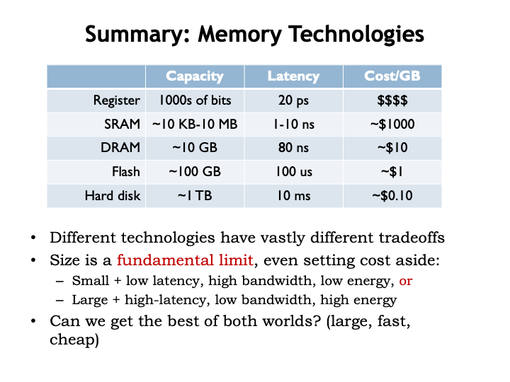

This completes our whirlwind tour of memory technologies.  If you&#700;d
like to learn a bit more, Wikipedia has useful articles on each type
of device.  SRAM sizes and access times have kept pace with the
improvements in the size and speed of integrated circuits.
Interestingly, although capacities and transfer rates for DRAMs and
HDDs have improved, their initial access times have not improved
nearly as rapidly.  Thankfully over the past decade flash memories
have helped to fill the performance gap between processor speeds and
HDDs.  But the gap between processor cycle times and DRAM access times
has continued to widen, increasing the challenge of designing
low-latency high-capacity memory systems.

The capacity of the available memory technologies varies over 10
orders of magnitude, and the variation in latencies varies over 8
orders of magnitude.  This creates a considerable challenge in
figuring out how to navigate the speed vs size tradeoffs.

Each transition in memory hierarchy shows the same fundamental design
choice: we can pick smaller-and-faster or larger-and-slower.  This is
a bit awkward actually &#8212; can we figure how to get the best of both
worlds?

## The Memory Hierarchy

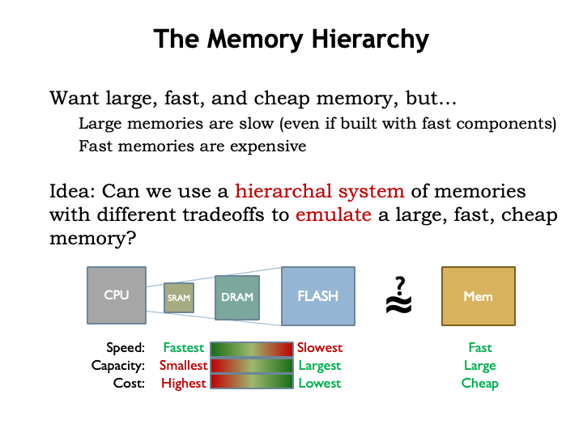

We want our system to behave as if it had a large, fast, and cheap
main memory.  Clearly we can&#700;t achieve this goal using any single
memory technology.

Here&#700;s an idea: can we use a hierarchical system of memories with
different tradeoffs to achieve close to the same results as a large,
fast, cheap memory?  Could we arrange for memory locations we&#700;re using
often to be stored, say, in SRAM and have those accesses be low
latency?  Could the rest of the data could be stored in the larger and
slower memory components, moving the between the levels when
necessary?  Let&#700;s follow this train of thought and see where it leads
us.

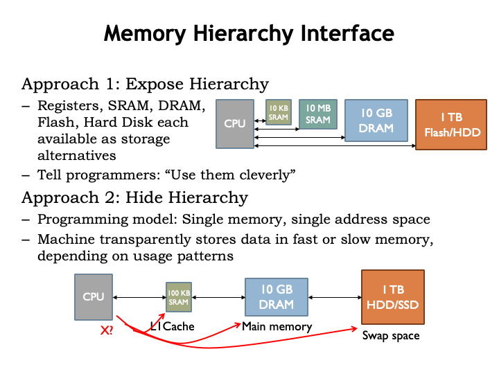

There are two approaches we might take.  The first is to expose the
hierarchy, providing some amount of each type of storage and let the
programmer decide how best to allocate the various memory resources
for each particular computation.  The programmer would write code that
moved data into fast storage when appropriate, then back to the larger
and slower memories when low-latency access was no longer required.
There would only be a small amount of the fastest memory, so data
would be constantly in motion as the focus of the computation changed.

This approach has had notable advocates.  Perhaps the most influential
was Seymour Cray, the &#8220;Steve Jobs&#8221; of supercomputers.  Cray was the
architect of the world&#700;s fastest computers in each of three decades,
inventing many of the technologies that form the foundation of
high-performance computing.  His insight to managing the memory
hierarchy was to organize data as vectors and move vectors in and out
of fast memory under program control.  This was actually a good data
abstraction for certain types of scientific computing and his vector
machines had the top computing benchmarks for many years.

The second alternative is to hide the hierarchy and simply tell the
programmer they have a large, uniform address space to use as they
wish.  The memory system would, behind the scenes, move data between
the various levels of the memory hierarchy, depending on the usage
patterns it detected.  This would require circuitry to examine each
memory access issued by the CPU to determine where in the hierarchy to
find the requested location.  And then, if a particular region of
addresses was frequently accessed &#8212; say, when fetching instructions in
a loop &#8212; the memory system would arrange for those accesses to be
mapped to the fastest memory component and automatically move the loop
instructions there.  All of this machinery would be transparent to the
programmer: the program would simply fetch instructions and access
data and the memory system would handle the rest.

Could the memory system automatically arrange for the right data to be
in the right place at the right time?  Cray was deeply skeptical of
this approach.  He famously quipped &#8220;that you can&#700;t fake what you
haven&#700;t got&#8221;.  Wouldn&#700;t the programmer, with her knowledge of how data
was going to be used by a particular program, be able to do a better
job by explicitly managing the memory hierarchy?

It turns out that when running general-purpose programs, it is
possible to build an automatically managed, low-latency, high-capacity
hierarchical memory system that appears as one large, uniform memory.
What&#700;s the insight that makes this possible?  That&#700;s the topic of the
next section.

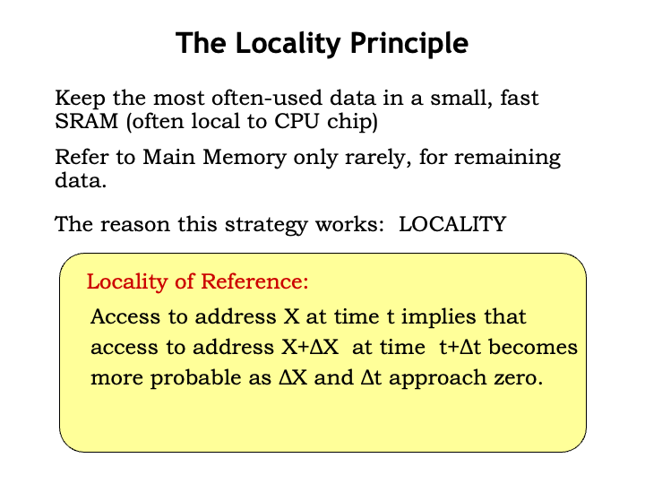

So, how can the memory system arrange for the right data to be in the
right place at the right time?  Our goal is to have the
frequently-used data in some fast SRAM.  That means the memory system
will have to be able to predict which memory locations will be
accessed.  And to keep the overhead of moving data into and out of
SRAM manageable, we&#700;d like to amortize the cost of the move over many
accesses.  In other words we want any block of data we move into SRAM
to be accessed many times.

When not in SRAM, data would live in the larger, slower DRAM that
serves as main memory.  If the system is working as planned, DRAM
accesses would happen infrequently, <i>e.g.</i>, only when it&#700;s time to bring
another block of data into SRAM.

If we look at how programs access memory, it turns out we *can* make
accurate predictions about which memory locations will be accessed.
The guiding principle is <i>locality of reference</i> which tells us that
if there&#700;s an access to address X at time t, it&#700;s very probable that
the program will access a nearby location in the near future.

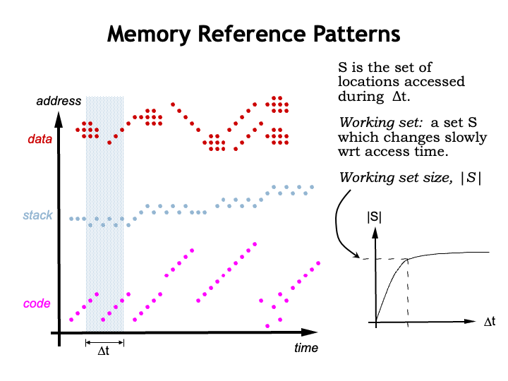

To understand why programs exhibit locality of reference, let&#700;s look
at how a running program accesses memory.

Instruction fetches are quite predictable.  Execution usually proceeds
sequentially since most of the time the next instruction is fetched
from the location after that of the current instruction.  Code that
loops will repeatedly fetch the same sequence of instructions, as
shown here on the left of the time line.  There will of course be
branches and subroutine calls that interrupt sequential execution, but
then we&#700;re back to fetching instructions from consecutive locations.
Some programming constructs, <i>e.g.</i>, method dispatch in object-oriented
languages, can produce scattered references to very short code
sequences (as shown on the right of the time line) but order is
quickly restored.

This agrees with our intuition about program execution.  For example,
once we execute the first instruction of a procedure, we&#700;ll almost
certainly execute the remaining instructions in the procedure.  So if
we arranged for all the code of a procedure to moved to SRAM when the
procedure&#700;s first instruction was fetched, we&#700;d expect that many
subsequent instruction fetches could be satisfied by the SRAM.  And
although fetching the first word of a block from DRAM has relatively
long latency, the DRAM&#700;s fast column accesses will quickly stream the
remaining words from sequential addresses.  This will amortize the
cost of the initial access over the whole sequence of transfers.

The story is similar for accesses by a procedure to its arguments and
local variables in the current stack frame.  Again there will be many
accesses to a small region of memory during the span of time we&#700;re
executing the procedure&#700;s code.

Data accesses generated by LD and ST instructions also exhibit
locality.  The program may be accessing the components of an object or
struct.  Or it may be stepping through the elements of an array.
Sometimes information is moved from one array or data object to
another, as shown by the data accesses on the right of the timeline.

Using simulations we can estimate the number of different locations
that will be accessed over a particular span of time.  What we
discover when we do this is the notion of a <i>working set</i> of locations
that are accessed repeatedly.  If we plot the size of the working set
as a function of the size of the time interval, we see that the size
of the working set levels off.  In other words once the time interval
reaches a certain size the number of locations accessed is
approximately the same independent of when in time the interval
occurs.

As we see in our plot to the left, the actual addresses accessed will
change, but the number of *different* addresses during the time
interval will, on the average, remain relatively constant and,
surprisingly, not all that large!

This means that if we can arrange for our SRAM to be large enough to
hold the working set of the program, most accesses will be able to be
satisfied by the SRAM.  We&#700;ll occasionally have to move new data into
the SRAM and old data back to DRAM, but the DRAM access will occur
less frequently than SRAM accesses.  We&#700;ll work out the mathematics in
a slide or two, but you can see that thanks to locality of reference
we&#700;re on track to build a memory out of a combination of SRAM and DRAM
that performs like an SRAM but has the capacity of the DRAM.

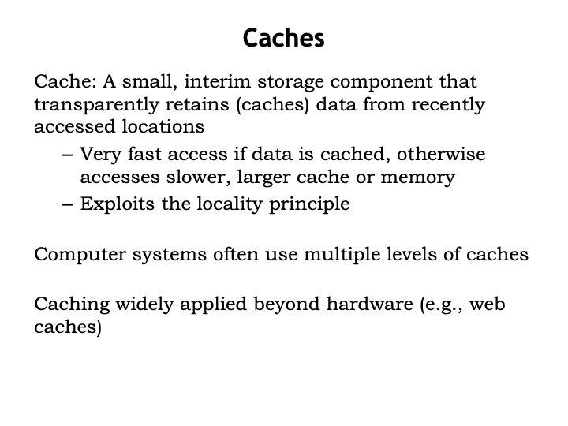

The SRAM component of our hierarchical memory system is called a
<i>cache</i>.  It provides low-latency access to recently-accessed blocks
of data.  If the requested data is in the cache, we have a <i>cache hit</i>
and the data is supplied by the SRAM.

If the requested data is not in the cache, we have a <i>cache miss</i> and
a block of data containing the requested location will have to be
moved from DRAM into the cache.  The locality principle tells us that
we should expect cache hits to occur much more frequently than cache
misses.

Modern computer systems often use multiple levels of SRAM caches.  The
levels closest to the CPU are smaller but very fast, while the levels
further away from the CPU are larger and hence slower.  A miss at one
level of the cache generates an access to the next level, and so on
until a DRAM access is needed to satisfy the initial request.

Caching is used in many applications to speed up access to
frequently-accessed data.  For example, your browser maintains a cache
of frequently-accessed web pages and uses its local copy of the web
page if it determines the data is still valid, avoiding the delay of
transferring the data over the Internet.

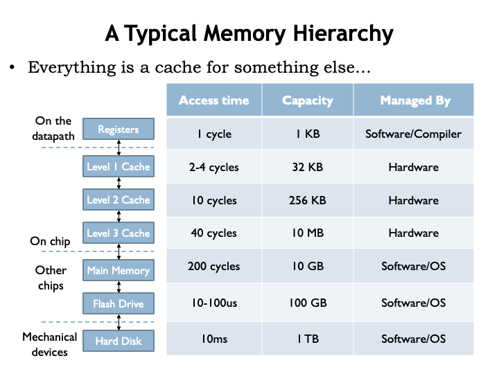

Here&#700;s an example memory hierarchy that might be found on a modern
computer.  There are three levels on-chip SRAM caches, followed by
DRAM main memory and a flash-memory cache for the hard disk drive.
The compiler is responsible for deciding which data values are kept in
the CPU registers and which values require the use of LDs and STs.
The 3-level cache and accesses to DRAM are managed by circuity in the
memory system.  After that the access times are long enough (many
hundreds of instruction times) that the job of managing the movement
of data between the lower levels of the hierarchy is turned over to
software.

Today we&#700;re discussing how the on-chip caches work.  In a later
lecture, we&#700;ll discuss how the software manages main memory and
non-volatile storage devices.  Whether managed by hardware or
software, each layer of the memory system is designed to provide
lower-latency access to frequently-accessed locations in the next,
slower layer.  But, as we&#700;ll see, the implementation strategies will
be quite different in the slower layers of the hierarchy.

## Direct-mapped Caches

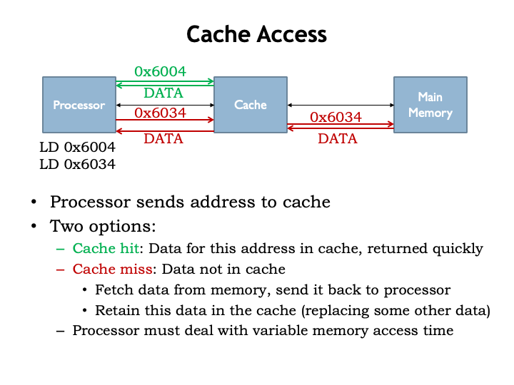

Okay, let&#700;s review our plan.  The processor starts an access by
sending an address to the cache.  If data for the requested address is
held in the cache, it&#700;s quickly returned to the CPU.

If the data we request is not in the cache, we have a cache miss, so
the cache has to make a request to main memory to get the data, which
it then returns to processor.  Typically the cache will remember the
newly fetched data, possibly replacing some older data in the cache.

Suppose a cache access takes 4 ns and a main memory access takes 40
ns.  Then an access that hits in the cache has a latency of 4 ns, but
an access that misses in the cache has a latency of 44 ns.  The
processor has to deal with the variable memory access time, perhaps by
simply waiting for the access to complete, or, in modern
hyper-threaded processors, it might execute an instruction or two from
another programming thread.

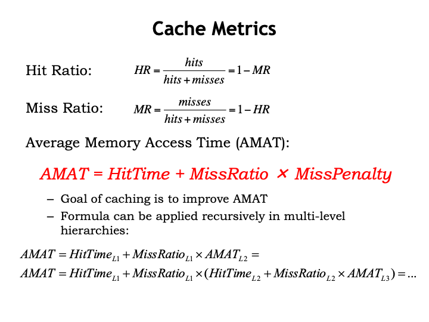

The hit and miss ratios tell us the fraction of accesses which are
cache hits and the fraction of accesses which are cache misses.  Of
course, the ratios will sum to 1.

Using these metrics we can compute the average memory access time
(AMAT).  Since we always check in the cache first, every access
includes the cache access time (called the hit time).  If we miss in
the cache, we have to take the additional time needed to access main
memory (called the miss penalty).  But the main memory access only
happens on some fraction of the accesses: the miss ratio tells us how
often that occurs.

So the AMAT can be computed using the formula shown here.  The lower
the miss ratio (or, equivalently, the higher the hit ratio), the
smaller the average access time.  Our design goal for the cache is to
achieve a high hit ratio.

If we have multiple levels of cache, we can apply the formula
recursively to calculate the AMAT at each level of the memory.  Each
successive level of the cache is slower, <i>i.e.</i>, has a longer hit time,
which is offset by lower miss ratio because of its increased size.

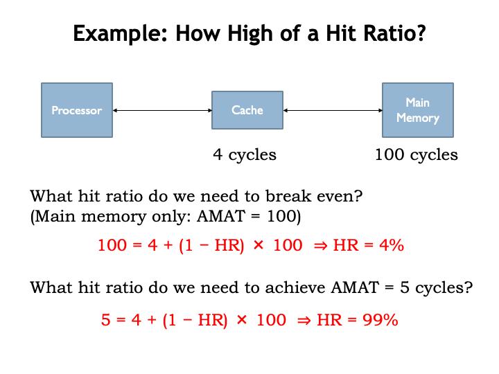

Let&#700;s try out some numbers.  Suppose the cache takes 4 processor
cycles to respond, and main memory takes 100 cycles.  Without the
cache, each memory access would take 100 cycles.  With the cache, a
cache hit takes 4 cycles, and a cache miss takes 104 cycles.

What hit ratio is needed to so that the AMAT with the cache is 100
cycles, the break-even point?  Using the AMAT formula from the
previously slide, we see that we only need a hit ratio of 4% in order
for memory system of the Cache + Main Memory to perform as well as
Main Memory alone.  The idea, of course, is that we&#700;ll be able to do
much better than that.

Suppose we wanted an AMAT of 5 cycles.  Clearly most of the accesses
would have to be cache hits.  We can use the AMAT formula to compute
the necessary hit ratio.  Working through the arithmetic we see that
99% of the accesses must be cache hits in order to achieve an average
access time of 5 cycles.

Could we expect to do that well when running actual programs?
Happily, we can come close.  In a simulation of the Spec CPU2000
Benchmark, the hit ratio for a standard-size level 1 cache was
measured to be 97.5% over some ~10 trillion accesses.

[See the &#8220;All benchmarks&#8221; arithmetic-mean table at
http://research.cs.wisc.edu/multifacet/misc/spec2000cache-data/]

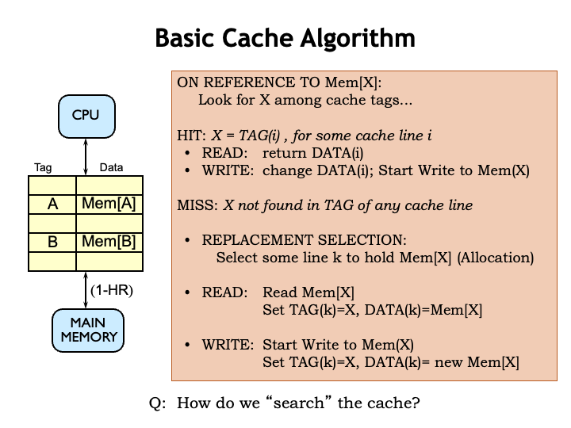

Here&#700;s a start at building a cache.  The cache will hold many
different blocks of data; for now let&#700;s assume each block is an
individual memory location.  Each data block is <i>tagged</i> with its
address. A combination of a data block and its associated address tag
is called a cache line.

When an address is received from the CPU, we&#700;ll search the cache
looking for a block with a matching address tag.  If we find a
matching address tag, we have a cache hit.  On a read access, we&#700;ll
return the data from the matching cache line.  On a write access,
we&#700;ll update the data stored in the cache line and, at some point,
update the corresponding location in main memory.

If no matching tag is found, we have a cache miss.  So we&#700;ll have to
choose a cache line to use to hold the requested data, which means
that some previously cached location will no longer be found in the
cache.  For a read operation, we&#700;ll fetch the requested data from main
memory, add it to the cache (updating the tag and data fields of the
cache line) and, of course, return the data to the CPU.  On a write,
we&#700;ll update the tag and data in the selected cache line and, at some
point, update the corresponding location in main memory.

So the contents of the cache is determined by the memory requests made
by the CPU.  If the CPU requests a recently-used address, chances are
good the data will still be in the cache from the previous access to
the same location.  As the working set slowly changes, the cache
contents will be updated as needed.  If the entire working set can fit
into the cache, most of the requests will be hits and the AMAT will be
close to the cache access time.  So far, so good!

Of course, we&#700;ll need to figure how to quickly search the cache, <i>i.e.</i>,
we&#700;ll a need fast way to answer the question of whether a particular
address tag can be found in some cache line.  That&#700;s our next topic.

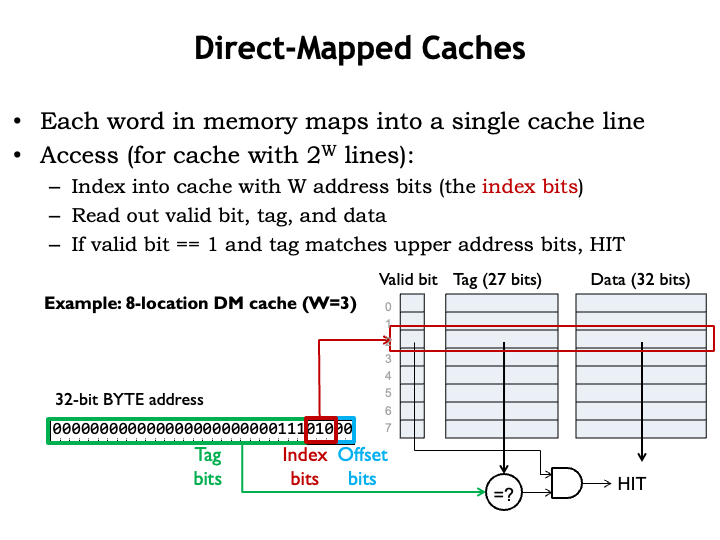

The simplest cache hardware consists of an SRAM with a few additional
pieces of logic.  The cache hardware is designed so that each memory
location in the CPU&#700;s address space maps to a particular cache line,
hence the name <i>direct-mapped (DM) cache</i>.  There are, of course, many
more memory locations then there are cache lines, so many addresses
are mapped to the same cache line and the cache will only be able to
hold the data for one of those addresses at a time.

The operation of a DM cache is straightforward.  We&#700;ll use part of the
incoming address as an index to select a single cache line to be
searched.  The search consists of comparing the rest of the incoming
address with the address tag of the selected cache line.  If the tag
matches the address, there&#700;s a cache hit and we can immediately use
the data in the cache to satisfy the request.

In this design, we&#700;ve included an additional <i>valid bit</i> which is 1
when the tag and data fields hold valid information.  The valid bit
for each cache line is initialized to 0 when the cache is powered on,
indicating that all cache lines are empty.  As data is brought into
the cache, the valid bit is set to 1 when the cache line&#700;s tag and
data fields are filled.  The CPU can request that the valid bit be
cleared for a particular cache line &#8212; this is called <i>flushing the
cache</i>;.  If, for example, the CPU initiates a read from disk, the disk
hardware will read its data into a block of main memory, so any cached
values for that block will out-of-date.  So the CPU will flush those
locations from the cache by marking any matching cache lines as
invalid.

Let&#700;s see how this works using a small DM cache with 8 lines where
each cache line contains a single word (4 bytes) of data.  Here&#700;s a
CPU request for the location at byte address 0xE8. Since there 4 bytes
of data in each cache line, the bottom 2 address bits indicate the
appropriate byte offset into the cached word.  Since the cache deals
only with word accesses, the byte offset bits aren&#700;t used.

Next, we&#700;ll need to use 3 address bits to select which of the 8 cache
lines to search.  We choose these cache index bits from the low-order
bits of the address.  Why?  Well, it&#700;s because of locality.  The
principle of locality tells us that it&#700;s likely that the CPU will be
requesting nearby addresses and for the cache to perform well, we&#700;d
like to arrange for nearby locations to be able to be held in the
cache at the same time.  This means that nearby locations will have to
be mapped to different cache lines.  The addresses of nearby locations
differ in their low-order address bits, so we&#700;ll use those bits as the
cache index bits &#8212; that way nearby locations will map to different
cache lines.

The data, tag and valid bits selected by the cache line index are read
from the SRAM.  To complete the search, we check the remaining address
against the tag field of the cache.  If they&#700;re equal and the valid
bit is 1, we have a cache hit, and the data field can be used to
satisfy the request.

How come the tag field isn&#700;t 32 bits, since we have a 32-bit address?
We could have done that, but since all values stored in cache line 2
will have the same index bits (0b010), we saved a few bits of SRAM and
chose not save those bits in the tag.  In other words, there&#700;s no
point in using SRAM to save bits we can generate from the incoming
address.

So the cache hardware in this example is an 8-location by 60 bit SRAM
plus a 27-bit comparator and a single AND gate.  The cache access time
is the access time of the SRAM plus the propagation delays of the
comparator and AND gate.  About as simple and fast as we could hope
for.

The downside of the simplicity is that for each CPU request, we&#700;re
only looking in a single cache location to see if the cache holds the
desired data.  Not much of search is it?  But the mapping of
addresses to cache lines helps us out here.  Using the low-order
address bit as the cache index, we&#700;ve arranged for nearby locations to
be mapped to different cache lines.  So, for example, if the CPU were
executing an 8-instruction loop, all 8 instructions can be held in the
cache at the same time.  A more complicated search mechanism couldn&#700;t
improve on that.  The bottom line: this extremely simple search is
sufficient to get good cache hit ratios for the cases we care about.

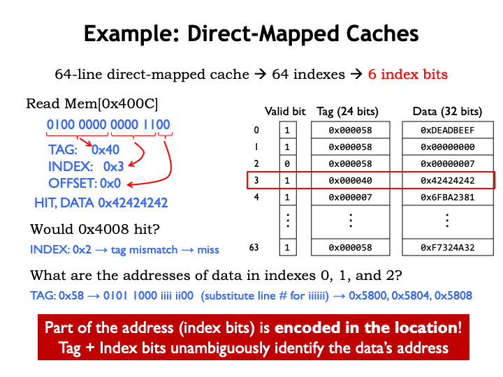

Let&#700;s try a few more examples, in this case using a DM cache with 64
lines.

Suppose the cache gets a read request for location 0x400C. To see how
the request is processed, we first write the address in binary so we
can easily divide it into the offset, index and tag fields.  For this
address the offset bits have the value 0, the cache line index bits
have the value 3, and the tag bits have the value 0x40.  So the tag
field of cache line 3 is compared with the tag field of the address.
Since there&#700;s a match, we have a cache hit and the value in the data
field of cache line can be used to satisfy the request.

Would an access to location 0x4008 be a cache hit?  This address is
similar to that in our first example, except the cache line index is
now 2 instead of 3.  Looking in cache line 2, we that its tag field
(0x58) doesn&#700;t match the tag field in the address (0x40), so this
access would be a cache miss.

What are the addresses of the words held by cache lines 0, 1, and 2,
all of which have the same tag field?  Well, we can run the address
matching process backwards!  For an address to match these three cache
lines it would have look like the binary shown here, where we&#700;ve used
the information in the cache tag field to fill in the high-order
address bits and low-order address bits will come from the index
value.  If we fill in the indices 0, 1, and 2, then convert the
resulting binary to hex we get 0x5800, 0x5804, and 0x5808 as the
addresses for the data held in cache lines 0, 1, and 2.

Note that the complete address of the cached locations is formed by
combining the tag field of the cache line with the index of the cache
line.  We of course need to be able to recover the complete address
from the information held in the cache so it can be correctly compared
against address requests from the CPU.

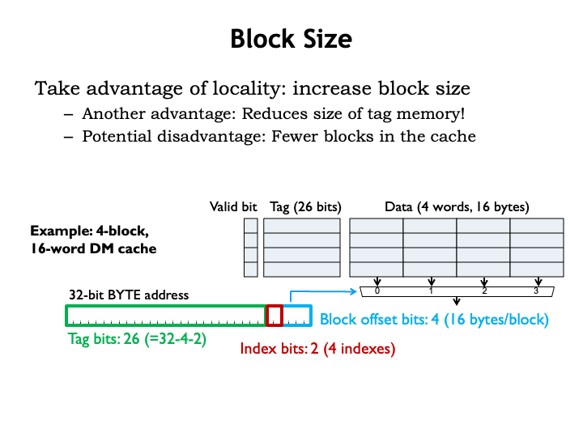

We can tweak the design of the DM cache a little to take advantage of
locality and save some of the overhead of tag fields and valid bits.

We can increase the size of the data field in a cache from 1 word to 2
words, or 4 words, etc.  The number of data words in each cache line
is called the <i>block size</i> and is always a power of two.  Using a
larger block size makes sense.  If there&#700;s a high probability of
accessing nearby words, why not fetch a larger block of words on a
cache miss, trading the increased cost of the miss against the
increased probability of future hits.

Compare the 16-word DM cache shown here with a block size of 4 with a
different 16-word DM cache with a block size of 1.  In this cache for
every 128 bits of data there are 27 bits of tags and valid bit, so
~17% of the SRAM bits are overhead in the sense that they&#700;re not being
used to store data.  In the cache with block size 1, for every 32 bits
of data there are 27 bits of tag and valid bit, so ~46% of the SRAM
bits are overhead.  So a larger block size means we&#700;ll be using the
SRAM more efficiently.

Since there are 16 bytes of data in each cache line, there are now 4
offset bits.  The cache uses the high-order two bits of the offset to
select which of the 4 words to return to the CPU on a cache hit.

There are 4 cache lines, so we&#700;ll need two cache line index bits from
the incoming address.

And, finally, the remaining 26 address bits are used as the tag field.

Note that there&#700;s only a single valid bit for each cache line, so
either the entire 4-word block is present in the cache or it&#700;s not.
Would it be worth the extra complication to support caching partial
blocks?  Probably not.  Locality tells us that we&#700;ll probably want
those other words in the near future, so having them in the cache will
likely improve the hit ratio.

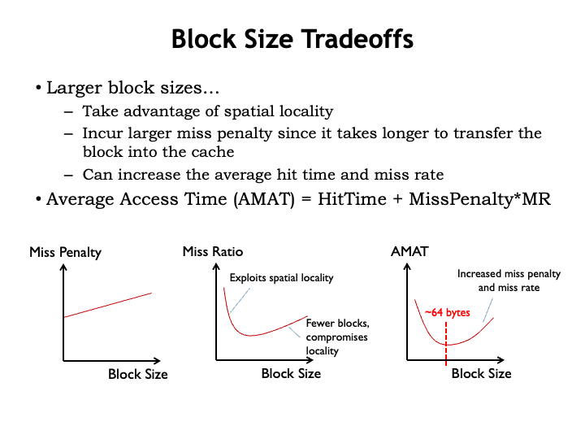

What&#700;s the tradeoff between block size and performance?  We&#700;ve argued
that increasing the block size from 1 was a good idea.  Is there a
limit to how large blocks should be?  Let&#700;s look at the costs and
benefits of an increased block size.

With a larger block size we have to fetch more words on a cache miss
and the miss penalty grows linearly with increasing block size.  Note
that since the access time for the first word from DRAM is quite high,
the increased miss penalty isn&#700;t as painful as it might be.

Increasing the block size past 1 reduces the miss ratio since we&#700;re
bringing words into the cache that will then be cache hits on
subsequent accesses.  Assuming we don&#700;t increase the overall cache
capacity, increasing the block size means we&#700;ll make a corresponding
reduction in the number of cache lines.  Reducing the number of lines
impacts the number of separate address blocks that can be accommodated
in the cache.  As we saw in the discussion on the size of the working
set of a running program, there are a certain number of separate
regions we need to accommodate to achieve a high hit ratio: program,
stack, data, etc.  So we need to ensure there are a sufficient number
of blocks to hold the different addresses in the working set.  The
bottom line is that there is an optimum block size that minimizes the
miss ratio and increasing the block size past that point will be
counterproductive.

Combining the information in these two graphs, we can use the formula
for AMAT to choose the block size the gives us the best possible AMAT.
In modern processors, a common block size is 64 bytes (16 words).

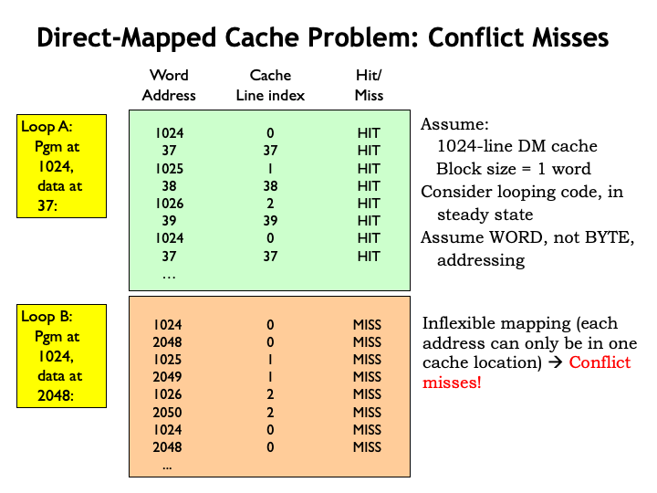

DM caches do have an Achilles heel.  Consider running the
3-instruction LOOPA code with the instructions located starting at
word address 1024 and the data starting at word address 37 where the
program is making alternating accesses to instruction and data, <i>e.g.</i>, a
loop of LD instructions.

Assuming a 1024-line DM cache with a block size of 1, the steady state
hit ratio will be 100% once all six locations have been loaded into
the cache since each location is mapped to a different cache line.

Now consider the execution of the same program, but this time the data
has been relocated to start at word address 2048.  Now the
instructions and data are competing for use of the same cache lines.
For example, the first instruction (at address 1024) and the first
data word (at address 2048) both map to cache line 0, so only one them
can be in the cache at a time.  So fetching the first instruction
fills cache line 0 with the contents of location 1024, but then the
first data access misses and then refills cache line 0 with the
contents of location 2048.  The data address is said to <i>conflict</i>
with the instruction address. The next time through the loop, the
first instruction will no longer be in the cache and it&#700;s fetch will
cause a cache miss, called a <i>conflict miss</i>.  So in the steady state,
the cache will never contain the word requested by the CPU.

This is very unfortunate!  We were hoping to design a memory system
that offered the simple abstraction of a flat, uniform address space.
But in this example we see that simply changing a few addresses
results in the cache hit ratio dropping from 100% to 0%.  The
programmer will certainly notice her program running 10 times slower!

So while we like the simplicity of DM caches, we&#700;ll need to make some
architectural changes to avoid the performance problems caused by
conflict misses.

## Associative Caches

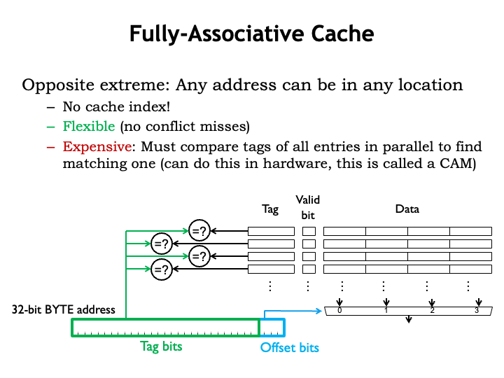

A fully-associative (FA) cache has a tag comparator for each cache
line.  So the tag field of *every* cache line in a FA cache is
compared with the tag field of the incoming address.  Since all cache
lines are searched, a particular memory location can be held in any
cache line, which eliminates the problems of address conflicts causing
conflict misses.  The cache shown here can hold 4 different 4-word
blocks, regardless of their address.  The example from the end of the
previous segment required a cache that could hold two 3-word blocks,
one for the instructions in the loop, and one for the data words.
This FA cache would use two of its cache lines to perform that task
and achieve a 100% hit ratio regardless of the addresses of the
instruction and data blocks.

FA caches are very flexible and have high hit ratios for most
applications.  Their only downside is cost: the inclusion of a tag
comparator for each cache line to implement the parallel search for a
tag match adds substantially the amount of circuitry required when
there are many cache lines.  Even the use of hybrid storage/comparison
circuitry, called a content-addressable memory, doesn&#700;t make a big
dent in the overall cost of a FA cache.

DM caches searched only a single cache line.  FA caches search all
cache lines.  Is there a happy middle ground where some small number
of cache lines are searched in parallel?

Yes!  If you look closely at the diagram of the FA cache shown here,
you&#700;ll see it looks like four 1-line DM caches operating in parallel.
What would happen if we designed a cache with four multi-line DM
caches operating in parallel?

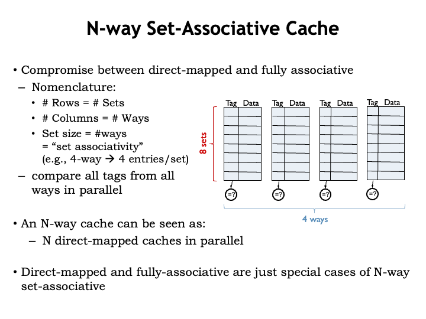

The result would be what we call an 4-way set-associative (SA) cache.
An N-way SA cache is really just N DM caches (let&#700;s call them
sub-caches) operating in parallel.  Each of the N sub-caches compares
the tag field of the incoming address with the tag field of the cache
line selected by the index bits of the incoming address.  The N cache
lines searched on a particular request form a search <i>set</i> and the
desired location might be held in any member of the set.

The 4-way SA cache shown here has 8 cache lines in each sub-cache, so
each set contains 4 cache lines (one from each sub-cache) and there
are a total of 8 sets (one for each line of the sub-caches).

An N-way SA cache can accommodate up to N blocks whose addresses map
to the same cache index.  So access to up to N blocks with conflicting
addresses can still be accommodated in this cache without misses.
This a big improvement over a DM cache where an address conflict will
cause the current resident of a cache line to be evicted in favor of
the new request.

And an N-way SA cache can have a very large number of cache lines but
still only have to pay the cost of N tag comparators.  This is a big
improvement over a FA cache where a large number of cache lines would
require a large number of comparators.

So N-way SA caches are a good compromise between a conflict-prone DM
cache and the flexible but very expensive FA cache.

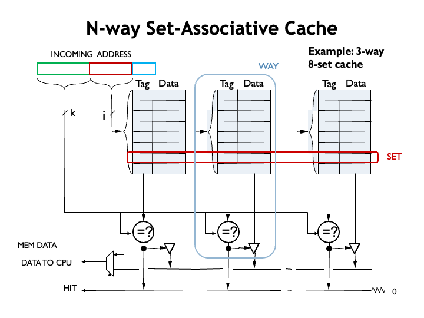

Here&#700;s a slightly more detailed diagram, in this case of a 3-way 8-set
cache.  Note that there&#700;s no constraint that the number of ways be a
power of two since we aren&#700;t using any address bits to select a
particular way.  This means the cache designer can fine tune the cache
capacity to fit her space budget.

Just to review the terminology: the N cache lines that will be
searched for a particular cache index are called a set.  And each of N
sub-caches is called a way.

The hit logic in each <i>way</i> operates in parallel with the logic in
other ways.  Is it possible for a particular address to be matched by
more than one way?  That possibility isn&#700;t ruled out by the hardware,
but the SA cache is managed so that doesn&#700;t happen.  Assuming we write
the data fetched from DRAM during a cache miss into a single sub-cache
- we&#700;ll talk about how to choose that way in a minute &#8212; there&#700;s no
possibility that more than one sub-cache will ever match an incoming
address.

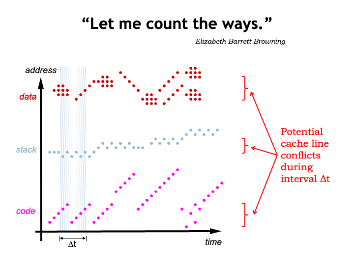

How many ways to do we need?  We&#700;d like enough ways to avoid the cache
line conflicts we experienced with the DM cache.  Looking at the graph
we saw earlier of memory accesses vs. time, we see that in any time
interval there are only so many potential address conflicts that we
need to worry about.

The mapping from addresses to cache lines is designed to avoid
conflicts between neighboring locations.  So we only need to worry
about conflicts between the different regions: code, stack and data.
In the examples shown here there are three such regions, maybe 4 if
you need two data regions to support copying from one data region to
another.  If the time interval is particularly large, we might need
double that number to avoid conflicts between accesses early in the
time interval and accesses late in the time interval.

The point is that a small number of ways should be sufficient to avoid
most cache line conflicts in the cache.

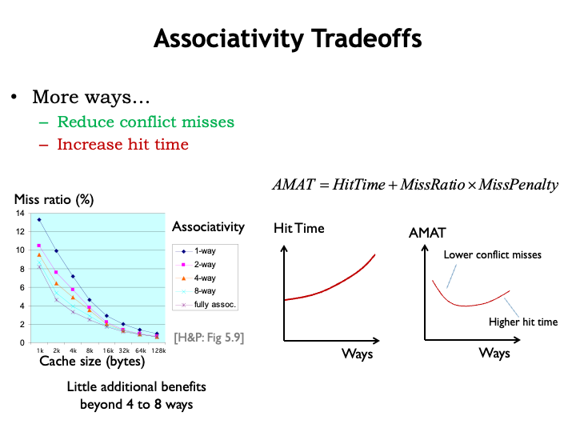

As with block size, it&#700;s possible to have too much of a good thing:
there&#700;s an optimum number of ways that minimizes the AMAT.  Beyond
that point, the additional circuity needed to combine the hit signals
from a large number of ways will start have a significant propagation
delay of its own, adding directly to the cache hit time and the AMAT.

More to the point, the chart on the left shows that there&#700;s little
additional impact on the miss ratio beyond 4 to 8 ways.  For most
programs, an 8-way set-associative cache with a large number of sets
will perform on a par with the much more-expensive FA cache of
equivalent capacity.

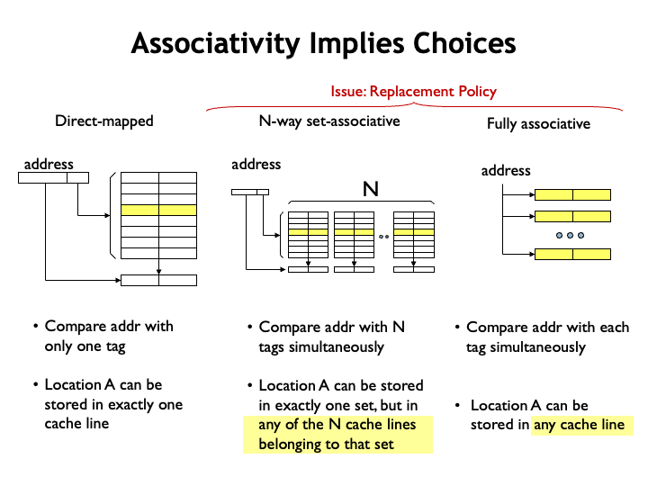

There&#700;s one final issue to resolve with SA and FA caches.  When
there&#700;s a cache miss, which cache line should be chosen to hold the
data that will be fetched from main memory?  That&#700;s not an issue with
DM caches, since each data block can only be held in one particular
cache line, determined by its address.  But in N-way SA caches, there
are N possible cache lines to choose from, one in each of the ways.
And in a FA cache, any of the cache lines can be chosen.

So, how to choose?  Our goal is to choose to replace the contents of
the cache line which will minimize the impact on the hit ratio in the
future.

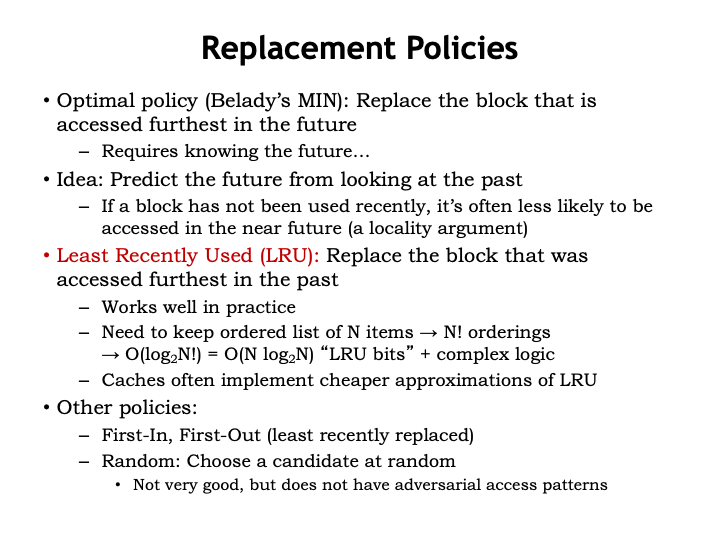

The optimal choice is to replace the block that is accessed furthest
in the future (or perhaps is never accessed again).  But that requires
knowing the future...

Here&#700;s an idea: let&#700;s predict future accesses by looking a recent
accesses and applying the principle of locality.  If a block has not
been recently accessed, it&#700;s less likely to be accessed in the near
future.

That suggests the least-recently-used replacement strategy, usually
referred to as LRU: replace the block that was accessed furthest in
the past.  LRU works well in practice, but requires us to keep a list
ordered by last use for each set of cache lines, which would need to
be updated on each cache access.  When we needed to choose which
member of a set to replace, we&#700;d choose the last cache line on this
list.  For an 8-way SA cache there are 8! possible orderings, so we&#700;d
need log2(8!) = 16 state bits to encode the current ordering.  The
logic to update these state bits on each access isn&#700;t cheap; basically
you need a lookup table to map the current 16-bit value to the next
16-bit value.  So most caches implement an approximation to LRU where
the update function is much simpler to compute.

There are other possible replacement policies: First-in, first-out,
where the oldest cache line is replaced regardless of when it was last
accessed.  And Random, where some sort of pseudo-random number
generator is used to select the replacement.

All replacement strategies except for random can be defeated.  If you
know a cache&#700;s replacement strategy you can design a program that will
have an abysmal hit rate by accessing addresses you know the cache
just replaced.  I&#700;m not sure I care about how well a program designed
to get bad performance runs on my system, but the point is that most
replacement strategies will occasionally cause a particular program to
execute much more slowly than expected.

When all is said and done, an LRU replacement strategy or a close
approximation is a reasonable choice.

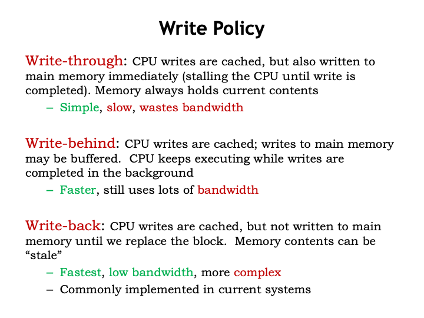

Okay, one more cache design decision to make, then we&#700;re done!

How should we handle memory writes in the cache?  Ultimately we&#700;ll
need update main memory with the new data, but when should that
happen?

The most obvious choice is to perform the write immediately. In other
words, whenever the CPU sends a write request to the cache, the cache
then performs the same write to main memory.  This is called
<i>write-through</i>.  That way main memory always has the most up-to-date
value for all locations.  But this can be slow if the CPU has to wait
for a DRAM write access &#8212; writes could become a real bottleneck!  And
what if the program is constantly writing a particular memory
location, <i>e.g.</i>, updating the value of a local variable in the current
stack frame?  In the end we only need to write the last value to main
memory.  Writing all the earlier values is waste of memory bandwidth.

Suppose we let the CPU continue execution while the cache waits for
the write to main memory to complete &#8212; this is called <i>write-behind</i>.
This will overlap execution of the program with the slow writes to
main memory.  Of course, if there&#700;s another cache miss while the write
is still pending, everything will have to wait at that point until
both the write and subsequent refill read finish, since the CPU can&#700;t
proceed until the cache miss is resolved.

The best strategy is called <i>write-back</i> where the contents of the
cache are updated and the CPU continues execution immediately.  The
updated cache value is only written to main memory when the cache line
is chosen as the replacement line for a cache miss.  This strategy
minimizes the number of accesses to main memory, preserving the memory
bandwidth for other operations.  This is the strategy used by most
modern processors.

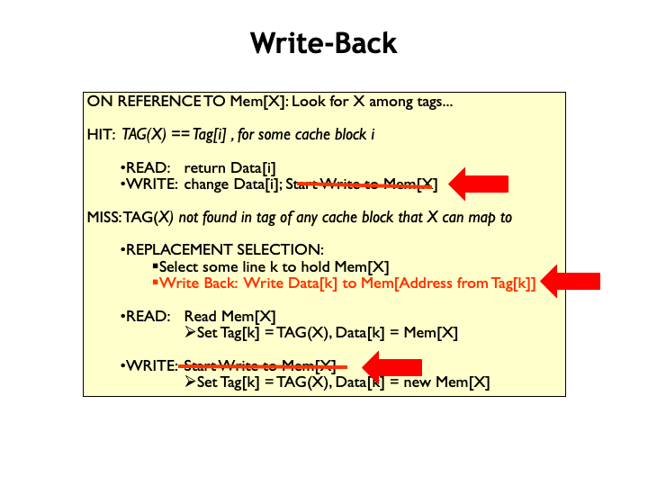

Write-back is easy to implement.  Returning to our original cache
recipe, we simply eliminate the start of the write to main memory when
there&#700;s a write request to the cache.  We just update the cache
contents and leave it at that.

However, replacing a cache line becomes a more complex operation,
since we can&#700;t reuse the cache line without first writing its contents
back to main memory in case they had been modified by an earlier write
access.

Hmm.  Seems like this does a write-back of all replaced cache lines
whether or not they&#700;ve been written to.

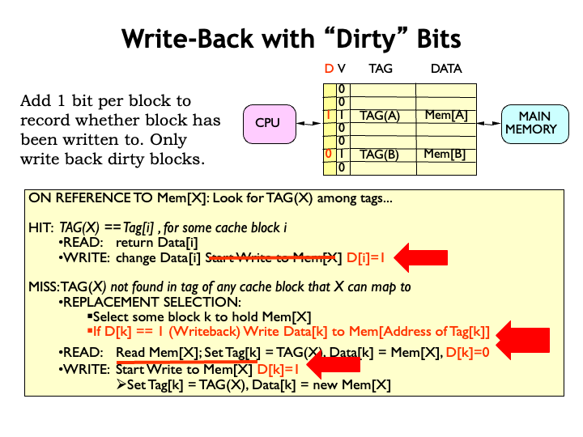

We can avoid unnecessary write-backs by adding another state bit to
each cache line: the <i>dirty</i> bit.  The dirty bit is set to 0 when a
cache line is filled during a cache miss.  If a subsequent write
operation changes the data in a cache line, the dirty bit is set to 1,
indicating that value in the cache now differs from the value in main
memory.

When a cache line is selected for replacement, we only need to write
its data back to main memory if its dirty bit is 1.

So a write-back strategy with a dirty bit gives an elegant solution
that minimizes the number of writes to main memory and only delays the
CPU on a cache miss if a dirty cache line needs to be written back to
memory.

## Summary: Cache Tradeoffs

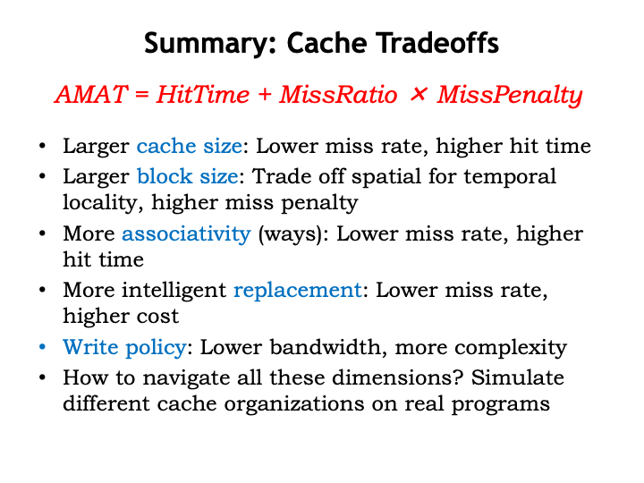

That concludes our discussion of caches, which was motivated by our
desire to minimize the average memory access time by building a
hierarchical memory system that had both low latency and high
capacity.

There were a number of strategies we employed to achieve our goal.

* Increasing the number of cache lines decreases AMAT by decreasing the
miss ratio.

* Increasing the block size of the cache let us take advantage of the
fast column accesses in a DRAM to efficiently load a whole block of
data on a cache miss.  The expectation was that this would improve
AMAT by increasing the number of hits in the future as accesses were
made to nearby locations.

* Increasing the number of ways in the cache reduced the possibility of
cache line conflicts, lowering the miss ratio.

* Choosing the least-recently used cache line for replacement minimized
the impact of replacement on the hit ratio.

* And, finally, we chose to handle writes using a write-back strategy
with dirty bits.

How do we make the tradeoffs among all these architectural choices?
As usual, we&#700;ll simulate different cache organizations and chose the
architectural mix that provides the best performance on our benchmark
programs.

