
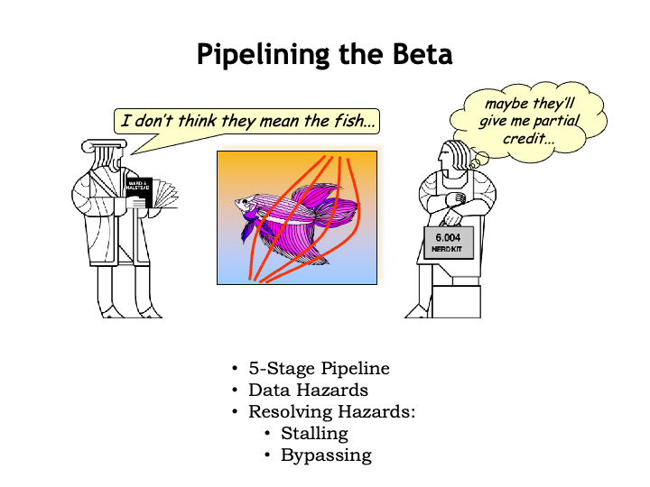

## Improving Beta Performance

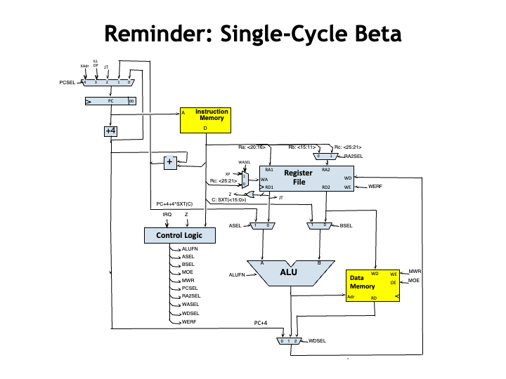

In this lecture, we&#700;re going to use the circuit
pipelining techniques we learned earlier in the course to
improve the performance of the 32-bit Beta CPU design we
developed earlier in the course.  This CPU design executes one
Beta instruction per clock cycle.  Hopefully you remember the
design!  If not, you might find it worthwhile to review
&#8220;Building the Beta&#8221;.

At the beginning of the clock cycle, this circuit loads a new
value into the program counter, which is then sent to main
memory as the address of the instruction to be executed this
cycle.  When the 32-bit word containing the binary encoding of
the instruction is returned by the memory, the opcode field is
decoded by the control logic to determine the control signals
for the rest of the data path.  The operands are read from the
register file and routed to the ALU to perform the desired
operation.  For memory operations, the output of the ALU serves
as the memory address and, in the case of load instructions, the
main memory supplies the data to be written into the register
file at the end of the cycle.  PC+4 and ALU values can also be
written to the register file.

The clock period of the Beta is determined by the cumulative
delay through all the components involved in instruction
execution.  Today&#700;s question is: how can we make this
faster?

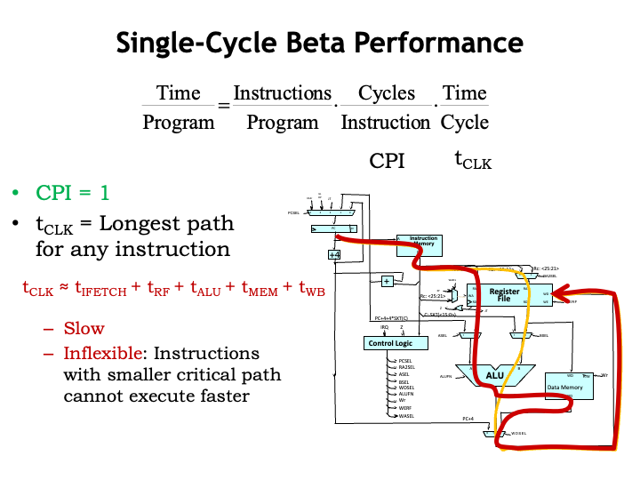

We can characterize the time spent executing a program as the
product of three terms.  The first term is the total number of
instructions executed.  Since the program usually contains loops
and procedure calls, many of the encoded instructions will be
executed many times.  We want the total count of instructions
executed, not the static size of the program as measured by the
number of encoded instructions in memory.  The second term is
the average number of clock cycles it takes to execute a single
instruction.  And the third term is the duration of a single
clock cycle.

As CPU designers it&#700;s the last two terms which are under
our control: the cycles per instruction (CPI) and the clock
period ($t_{\textrm{CLK}}$).  To affect the first term, we would
need to change the ISA or write a better compiler!

Our design for the Beta was able to execute every instruction
in a single clock cycle, so our CPI is 1.  As we discussed in
the previous slide, $t_{\textrm{CLK}}$ is determined by the
longest path through the Beta circuitry.  For example, consider
the execution of an OP-class instruction, which involves two
register operands and an ALU operation.  The arrow shows all the
components that are involved in the execution of the
instruction.  Aside from a few MUXes, the main memory, register
file, and ALU must all have time to do their thing.

The worst-case execution time is for the LD instruction.  In
one clock cycle we need to fetch the instruction from main
memory ($t_{\textrm{IFETCH}}$), read the operands from the register file
($t_{\textrm{RF}}$), perform the address addition in the ALU ($t_{\textrm{ALU}}$), read
the requested location from main memory ($t_{\textrm{MEM}}$), and finally
write the memory data to the destination register ($t_{\textrm{WB}}$).

The component delays add up and the result is a fairly long
clock period and hence it will take a long time to run the
program.  And our two example execution paths illustrate another
issue: we&#700;re forced to choose the clock period to
accommodate the worst-case execution time, even though we may be
able to execute some instructions faster since their execution
path through the circuitry is shorter.  We&#700;re making all
the instructions slower just because there&#700;s one
instruction that has a long critical path.

So why not have simple instructions execute in one clock cycle
and more complex instructions take multiple cycles instead of
forcing all instructions to execute in a single, long clock
cycle?  As we&#700;ll see in the next few slides, we have a
good answer to this question, one that will allow us to execute
*all* instructions with a short clock period.

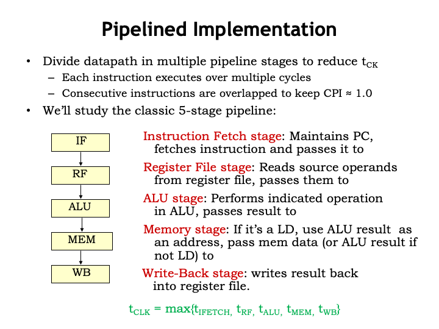

We&#700;re going to use pipelining to address these issues.
We&#700;re going to divide the execution of an instruction into
a sequence of steps, where each step is performed in successive
stages of the pipeline.  So it will take multiple clock cycles
to execute an instruction as it travels through the stages of
the execution pipeline.  But since there are only one or two
components in each stage of the pipeline, the clock period can
be much shorter and the throughput of the CPU can be much
higher.

The increased throughput is the result of overlapping the
execution of consecutive instructions.  At any given time, there
will be multiple instructions in the CPU, each at a different
stage of its execution.  The time to execute all the steps for a
particular instruction (<i>i.e.</i>, the instruction latency)
may be somewhat higher than in our unpipelined implementation.
But we will finish the last step of executing some instruction
in each clock cycle, so the instruction throughput is 1 per
clock cycle.  And since the clock cycle of our pipelined CPU is
quite a bit shorter, the instruction throughput is quite a bit
higher.

All this sounds great, but, not surprisingly, there are few
issues we&#700;ll have to deal with.

There are many ways to pipeline the execution of an
instruction.  We&#700;re going to look at the design of the
classic 5-stage instruction execution pipeline, which was widely
used in the integrated circuit CPU designs of the
1980&#700;s.

The 5 pipeline stages correspond to the steps of executing an
instruction in a von-Neumann stored-program architecture.  The
first stage (IF) is responsible for fetching the binary-encoded
instruction from the main memory location indicated by the
program counter.

The 32-bit instruction is passed to the register file stage
(RF) where the required register operands are read from the
register file.

The operand values are passed to the ALU stage (ALU), which
performs the requested operation.

The memory stage (MEM) performs the second access to main
memory to read or write the data for LD, LDR, or ST
instructions, using the value from the ALU stage as the memory
address.  For load instructions, the output of the MEM stage is
the read data from main memory.  For all other instructions, the
output of the MEM stage is simply the value from the ALU
stage.

In the final write-back stage (WB), the result from the earlier
stages is written to the destination register in the register
file.

Looking at the execution path from the previous slide, we see
that each of the main components of the unpipelined design is
now in its own pipeline stage. So the clock period will now be
determined by the slowest of these components.

Having divided instruction execution into five stages, would we
expect the clock period to be one fifth of its original value?
Well, that would only happen if we were able to divide the
execution so that each stage performed exactly one fifth of the
total work.  In real life, the major components have somewhat
different latencies, so the improvement in instruction
throughput will be a little less than the factor of 5 a perfect
5-stage pipeline could achieve.  If we have a slow
component, <i>e.g.</i>, the ALU, we might choose to pipeline
that component into further stages, or, interleave multiple ALUs
to achieve the same effect.  But for this lecture, we&#700;ll
go with the 5-stage pipeline described above.

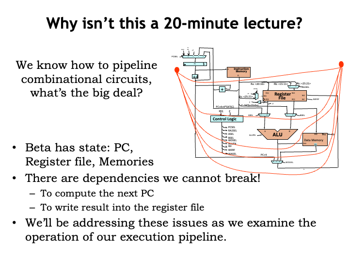

So why isn&#700;t this a 20-minute lecture?  After all we know
how pipeline combinational circuits: we can build a valid
k-stage pipeline by drawing k contours across the circuit
diagram and adding a pipeline register wherever a contour
crosses a signal.  What&#700;s the big deal here?

Well, is this circuit combinational?  No!  There&#700;s state
in the registers and memories.  This means that the result of
executing a given instruction may depend on the results from
earlier instructions.  There are loops in the circuit where data
from later pipeline stages affects the execution of earlier
pipeline stages.  For example, the write to the register file at
the end of the WB stage will change values read from the
register file in the RF stage.  In other words, there are
execution dependencies between instructions and these
dependencies will need to be taken into account when we&#700;re
trying to pipeline instruction execution.  We&#700;ll be
addressing these issues as we examine the operation of our
execution pipeline.

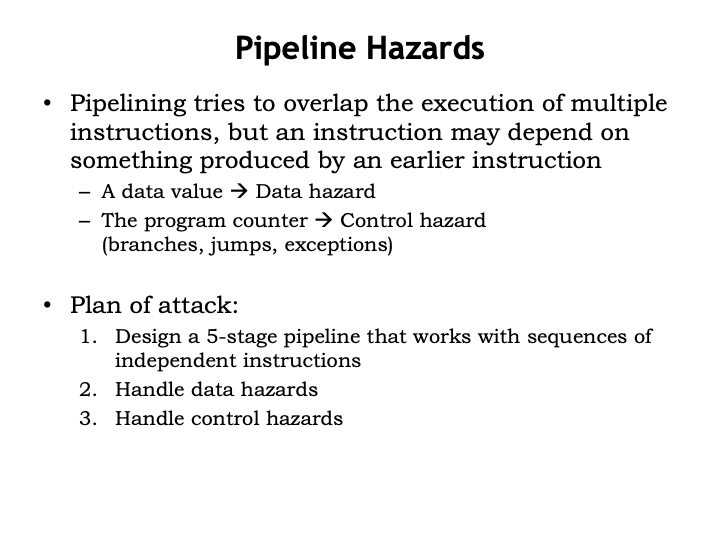

Sometimes execution of a given instruction will depend on the
results of executing a previous instruction.  Two are two types
of problematic dependencies.

The first, termed a data hazard, occurs when the execution of
the current instruction depends on data produced by an earlier
instruction. For example, an instruction that reads R0 will
depend on the execution of an earlier instruction that wrote
R0.

The second, termed a control hazard, occurs when a branch,
jump, or exception changes the order of execution.  For example,
the choice of which instruction to execute after a BNE depends
on whether the branch is taken or not.

Instruction execution triggers a hazard when the instruction on
which it depends is also in the pipeline, <i>i.e.</i>, the
earlier instruction hasn&#700;t finished execution!
We&#700;ll need to adjust execution in our pipeline to avoid
these hazards.

Here&#700;s our plan of attack:

We&#700;ll start by designing a 5-stage pipeline that works
with sequences of instructions that don&#700;t trigger
hazards, <i>i.e.</i>, where instruction execution doesn&#700;t
depend on earlier instructions still in the pipeline.

Then we&#700;ll fix our pipeline to deal correctly with data
hazards.

And finally, we&#700;ll address control hazards.

## Basic 5-stage Pipeline

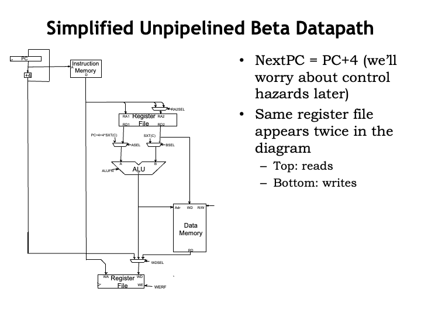

Let&#700;s start by redrawing and simplifying the Beta data
path so that it will be easier to reason about when we add
pipelining.

The first simplification is to focus on sequential execution
and so leave out the branch addressing and PC MUX logic.  Our
simplified Beta always executes the next instruction from PC+4.
We&#700;ll add back the branch and jump logic when we discuss
control hazards.

The second simplification is to have the register file appear
twice in the diagram so that we can tease apart the read and
write operations that occur at different stages of instruction
execution.  The top Register File shows the combinational read
ports, used to when reading the register operands in the RF
stage.  The bottom Register File shows the clocked write port,
used to write the result into the destination register at the
end of the WB stage.  Physically, there&#700;s only one set of
32 registers, we&#700;ve just drawn the read and write circuity
as separate components in the diagram.

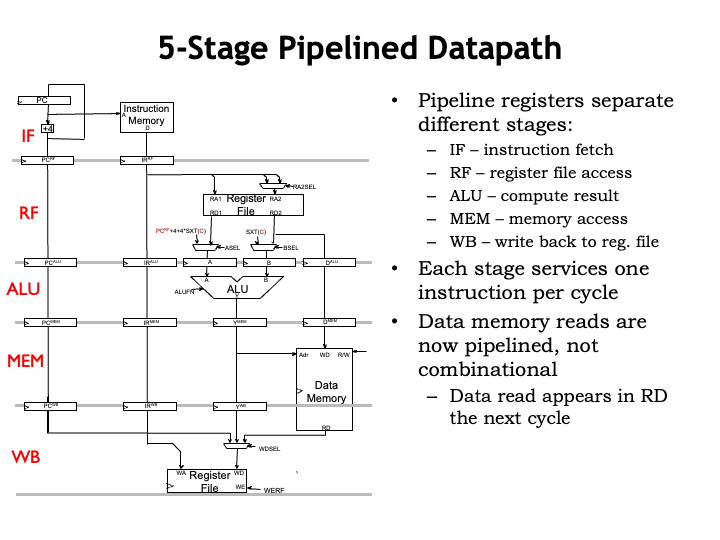

If we add pipeline registers to the simplified diagram, we see
that execution proceeds through the five stages from top to
bottom.  If we consider execution of instruction sequences with
no data hazards, information is flowing down the pipeline and
the pipeline will correctly overlap the execution of all the
instructions in the pipeline.

The diagram shows the components needed to implement each of
the five stages.  The IF stage contains the program counter and
the main memory interface for fetching instructions. The RF
stage has the register file and operand multiplexers.  The ALU
stage uses the operands and computes the result.  The MEM stage
handles the memory access for load and store operations.  And
the WB stage writes the result into the destination
register.

In each clock cycle, each stage does its part in the execution
of a particular instruction.  In a given clock cycle, there are
5 instructions in the pipeline.

Note that data accesses to main memory span almost two clock
cycles.  Data accesses are initiated at the beginning of the MEM
stage and returning data is only needed just before the end of
the WB stage.  The memory is itself pipelined and can
simultaneously finish the access from an earlier instruction
while starting an access for the next instruction.

This simplified diagram isn&#700;t showing how the control
logic is split across the pipeline stages.  How does that
work?

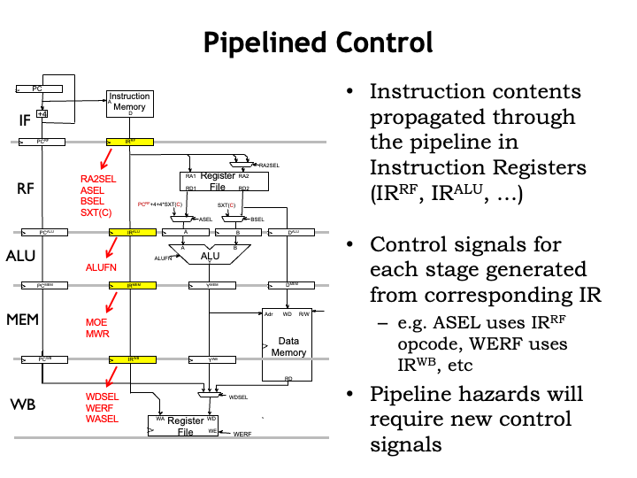

Note that we&#700;ve included instruction registers as part of
each pipeline stage, so that each stage can compute the control
signals it needs from its instruction register.  The encoded
instruction is simply passed from one stage to the next as the
instruction flows through the pipeline.

Each stage computes its control signals from the opcode field
of its instruction register.  The RF stage needs the RA,
RB, and literal fields from its instruction register.  And the
WB stage needs the RC field from its instruction register.  The
required logic is very similar to the unpipelined
implementation, it&#700;s just been split up and moved to the
appropriate pipeline stage.

We&#700;ll see that we will have to add some additional
control logic to deal correctly with pipeline hazards.

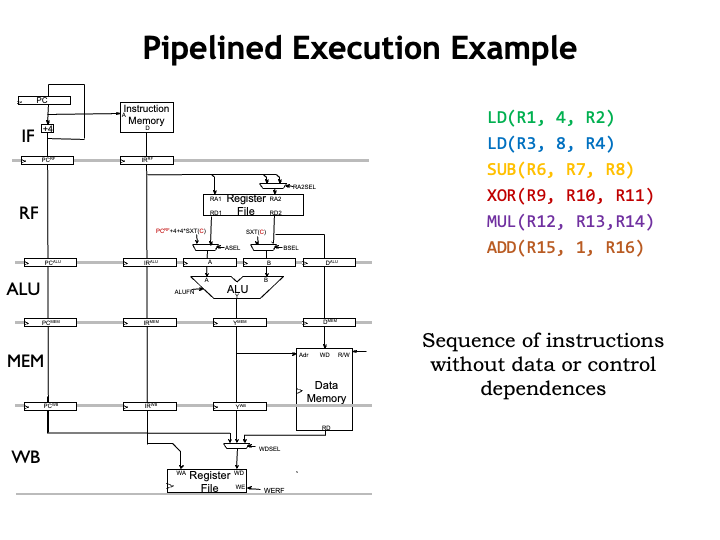

Our simplified diagram isn&#700;t so simple anymore!  To see
how the pipeline works, let&#700;s follow along as it executes
this sequence of six instructions.  Note that the instructions
are reading and writing from different registers, so there are
no potential data hazards.  And there are no branches and jumps,
so there are no potential control hazards.  Since there are no
potential hazards, the instruction executions can be overlapped
and their overlapped execution in the pipeline will work
correctly.

Okay, here we go!

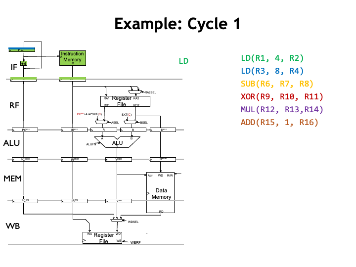

During cycle 1, the IF stage sends the value from the program
counter to main memory to fetch the first instruction (the green
LD instruction), which will be stored in the RF-stage
instruction register at the end of the cycle.  Meanwhile,
it&#700;s also computing PC+4, which will be the next value of
the program counter.  We&#700;ve colored the next value blue to
indicate that it&#700;s the address of the blue instruction in
the sequence.

We&#700;ll add the appropriately colored label on the right of
each pipeline stage to indicate which instruction the stage is
processing.

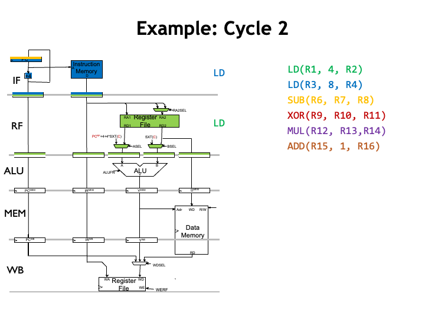

At the start of cycle 2, we see that values in the PC and
instruction registers for the RF stage now correspond to the
green instruction.  During the cycle the register file will be
reading the register operands, in this case R1, which is needed
for the green instruction.  Since the green instruction is a LD,
ASEL is 0 and BSEL is 1, selecting the appropriate values to be
written into the A and B operand registers at the end of the
cycle.

Concurrently, the IF stage is fetching the blue instruction
from main memory and computing an updated PC value for the next
cycle.

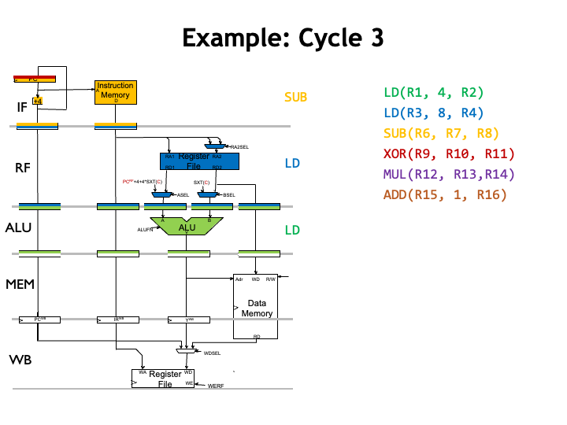

In cycle 3, the green instruction is now in the ALU stage,
where the ALU is adding the values in its operand registers (in
this case the value of R1 and the constant 4) and the result
will be stored in Y_MEM register at the end of the cycle.

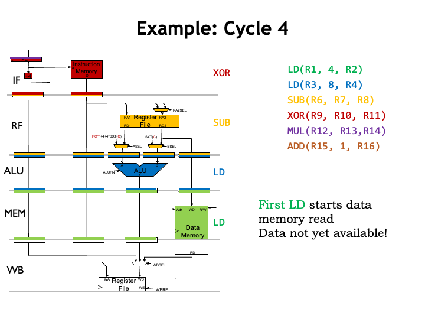

In cycle 4, we&#700;re overlapping the execution of four
instructions. The MEM stage initiates a memory read for the
green LD instruction.  Note that the read data will first become
available in the WB stage - it&#700;s not available to CPU in
the current clock cycle.

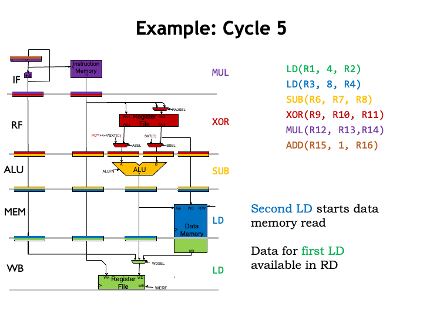

In cycle 5, the results of the main memory read initiated in
cycle 4 are available for writing to the register file in the WB
stage.  So execution of the green LD instruction will be
complete when the memory data is written to R2 at the end of
cycle 5.

Meanwhile, the MEM stage is initiating a memory read for the
blue LD instruction.

The pipeline continues to complete successive instructions in
successive clock cycles.  The latency for a particular
instruction is 5 clock cycles.  The throughput of the pipelined
CPU is 1 instruction/cycle.  This is the same as the unpipelined
implementation, except that the clock period is shorter because
each pipeline stage has fewer components.

Note that the effects of the green LD, <i>i.e.</i>, filling R2
with a new value, don&#700;t happen until the rising edge of
the clock at the end of cycle 5.  In other words, the results of
the green LD aren&#700;t available to other instructions until
cycle 6.  If there were instructions in the pipeline that read
R2 before cycle 6, they would have gotten an old value!  This is
an example of a data hazard.  Not a problem for us, since our
instruction sequence didn&#700;t trigger this data hazard.

Tackling data hazards is our next task.

## Data Hazards

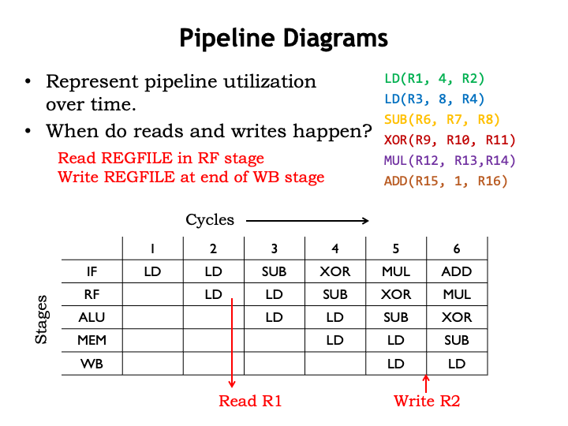

The data path diagram isn&#700;t all that useful in
diagramming the pipelined execution of an instruction sequence
since we need a new copy of the diagram for each clock cycle.  A
more compact and easier-to-read diagram of pipelined execution
is provided by the pipeline diagrams we met back in Part 1 of
the course.

There&#700;s one row in the diagram for each pipeline stage
and one column for each cycle of execution.  Entries in the
table show which instruction is in each pipeline stage at each
cycle.  In normal operation, a particular instruction moves
diagonally through the diagram as it proceeds through the five
pipeline stages.

To understand data hazards, let&#700;s first remind ourselves
of when the register file is read and written for a particular
instruction.  Register reads happen when the instruction is in
the RF stage, <i>i.e.</i>, when we&#700;re reading the
instruction&#700;s register operands.  Register writes happen
at the end of the cycle when the instruction is in the WB stage.
For example, for the first LD instruction, we read R1 during
cycle 2 and write R2 at the end of cycle 5.  Or consider the
register file operations in cycle 6: we&#700;re reading R12 and
R13 for the MUL instruction in the RF stage, and writing R4 at
the end of the cycle for the LD instruction in the WB stage.

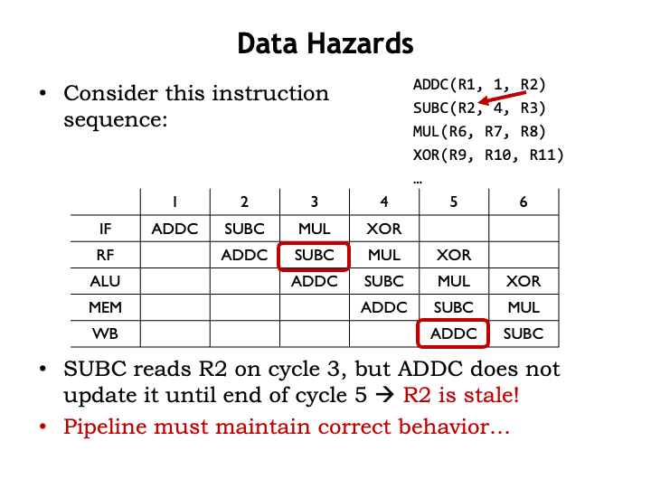

Okay, now let&#700;s see what happens when there are data
hazards.  In this instruction sequence, the ADDC instruction
writes its result in R2, which is immediately read by the
following SUBC instruction.  Correct execution of the SUBC
instruction clearly depends on the results of the ADDC
instruction.  This what we&#700;d call a read-after-write
dependency.

This pipeline diagram shows the cycle-by-cycle execution where
we&#700;ve circled the cycles during which ADDC writes R2 and
SUBC reads R2.

Oops!  ADDC doesn&#700;t write R2 until the end of cycle 5,
but SUBC is trying to read the R2 value in cycle 3.  The value
in R2 in the register file in cycle 3 doesn&#700;t yet reflect
the execution of the ADDC instruction.  So as things stand the
pipeline would *not* correctly execute this instruction
sequence.  This instruction sequence has triggered a data
hazard.

We want the pipelined CPU to generate the same program results
as the unpipelined CPU, so we&#700;ll need to figure out a
fix.

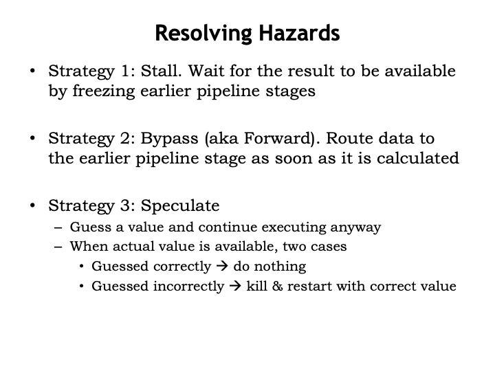

There are three general strategies we can pursue to fix
pipeline hazards.  Any of the techniques will work, but as
we&#700;ll see they have different tradeoffs for instruction
throughput and circuit complexity.

The first strategy is to stall instructions in the RF stage
until the result they need has been written to the register
file.  <i>Stall</i> means that we don&#700;t reload the
instruction register at the end of the cycle, so we&#700;ll try
to execute the same instruction in the next cycle.  If we stall
one pipeline stage, all earlier stages must also be stalled
since they are blocked by the stalled instruction.  If an
instruction is stalled in the RF stage, the IF stage is also
stalled.  Stalling will always work, but has a negative impact
on instruction throughput.  Stall for too many cycles and
you&#700;ll loose the performance advantages of pipelined
execution!

The second strategy is to route the needed value to earlier
pipeline stages as soon as its computed.  This called bypassing
or forwarding.  As it turns out, the value we need often exists
somewhere in the pipelined data path, it just hasn&#700;t been
written yet to the register file.  If the value exists and can
be forwarded to where it&#700;s needed, we won&#700;t need to
stall.  We&#700;ll be able to use this strategy to avoid
stalling on most types of data hazards.

The third strategy is called speculation.  We&#700;ll make an
intelligent guess for the needed value and continue execution.
Once the actual value is determined, if we guessed correctly,
we&#700;re all set.  If we guessed incorrectly, we have to back
up execution and restart with the correct value.  Obviously
speculation only makes sense if it&#700;s possible to make
accurate guesses.  We&#700;ll be able to use this strategy to
avoid stalling on control hazards.

Let&#700;s see how the first two strategies work when dealing
with our data hazard.

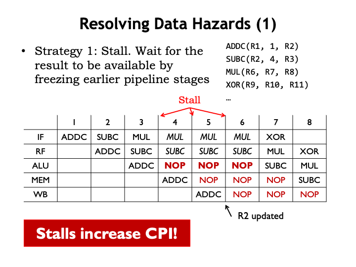

Applying the stall strategy to our data hazard, we need to
stall the SUBC instruction in the RF stage until the ADDC
instruction writes its result in R2.  So in the pipeline
diagram, SUBC is stalled three times in the RF stage until it
can finally access the R2 value from the register file in cycle
6.

Whenever the RF stage is stalled, the IF stage is also stalled.
You can see that in the diagram too.  But when RF is stalled,
what should the ALU stage do in the next cycle?  The RF stage
hasn&#700;t finished its job and so can&#700;t pass along its
instruction!  The solution is for the RF stage to make-up an
innocuous instruction for the ALU stage, what&#700;s called a
NOP instruction, short for &#8220;no operation&#8221;.  A NOP
instruction has no effect on the CPU state, <i>i.e.</i>, it
doesn&#700;t change the contents of the register file or main
memory.  For example any OP-class or OPC-class instruction that
has R31 as its destination register is a NOP.

The NOPs introduced into the pipeline by the stalled RF stage
are shown in red.  Since the SUBC is stalled in the RF stage for
three cycles, three NOPs are introduced into the pipeline.  We
sometimes refer to these NOPs as <i>bubbles</i> in the
pipeline.

How does the pipeline know when to stall?  It can compare the
register numbers in the RA and RB fields of the instruction in
the RF stage with the register numbers in the RC field of
instructions in the ALU, MEM, and WB stage.  If there&#700;s a
match, there&#700;s a data hazard and the RF stage should be
stalled.  The stall will continue until there&#700;s no hazard
detected.  There are a few details to take care of: some
instructions don&#700;t read both registers, the ST instruction
doesn&#700;t use its RC field, and we don&#700;t want R31 to
match since it&#700;s always okay to read R31 from the register
file.

Stalling will ensure correct pipelined execution, but it does
increase the effective CPI.  This will lead to longer execution
times if the increase in CPI is larger than the decrease in
cycle time afforded by pipelining.

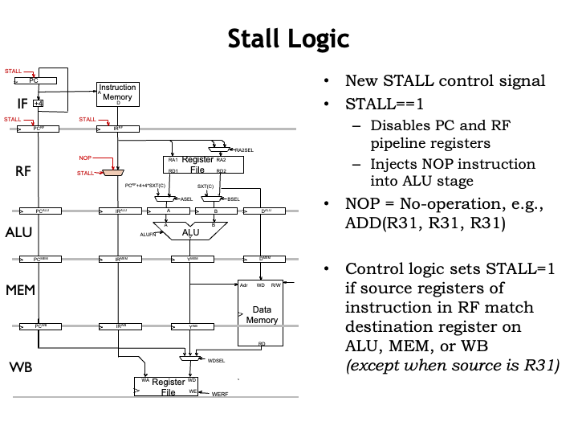

To implement stalling, we only need to make two simple changes
to our pipelined data path.  We generate a new control signal,
STALL, which, when asserted, disables the loading of the three
pipeline registers at the input of the IF and RF stages, which
means they&#700;ll have the same value next cycle as they do
this cycle.  We also introduce a mux to choose the instruction
to be sent along to the ALU stage.  If STALL is 1, we choose a
NOP instruction, <i>e.g.</i>, an ADD with R31 as its
destination.  If STALL is 0, the RF stage is not stalled, so we
pass its current instruction to the ALU.

And here we see how to compute STALL as described in the
previous slide.

The additional logic needed to implement stalling is pretty
modest, so the real design tradeoff is about increased CPI due
to stalling vs. decreased cycle time due to pipelining.

So we have a solution, although it carries some potential
performance costs.

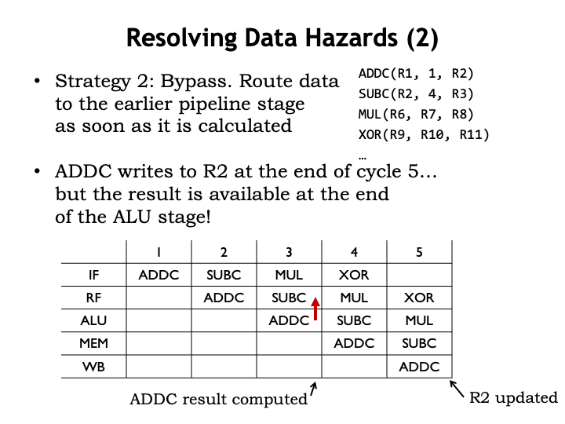

Now let&#700;s consider our second strategy: bypassing, which
is applicable if the data we need in the RF stage is somewhere
in the pipelined data path.

In our example, even though ADDC doesn&#700;t write R2 until
the end of cycle 5, the value that will be written is computed
during cycle 3 when the ADDC is in the ALU stage.  In cycle 3,
the output of the ALU is the value needed by the SUBC
that&#700;s in the RF stage in the same cycle.

So, if we detect that the RA field of the instruction in the RF
stage is the same as the RC field of the instruction in the ALU
stage, we can use the output of the ALU in place of the (stale)
RA value being read from the register file.  No stalling
necessary!

In our example, in cycle 3 we want to route the output of the
ALU to the RF stage to be used as the value for R2.  We show
this with a red <i>bypass arrow</i> showing data being
routed from the ALU stage to the RF stage.

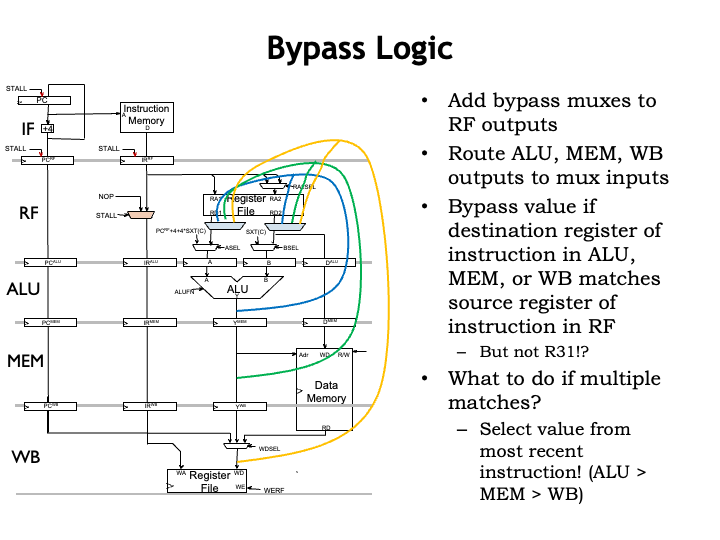

To implement bypassing, we&#700;ll add a many-input
multiplexer to the read ports of the register file so we can
select the appropriate value from other pipeline stages.  Here
we show the combinational bypass paths from the ALU, MEM, and WB
stages.  For the bypassing example of previous slides, we use
the blue bypass path during cycle 3 to get the correct value for
R2.

The bypass MUXes are controlled by logic that&#700;s matching
the number of the source register to the number of the
destination registers in the ALU, MEM, and WB stages, with the
usual complications of dealing with R31.

What if there are multiple matches, <i>i.e.</i>, if the RF
stage is trying to read a register that&#700;s the destination
for, say, the instructions in both the ALU and MEM stages?  No
problem! We want to select the result from the most recent
instruction, so we&#700;d chose the ALU match if there is one,
then the MEM match, then the WB match, then, finally, the output
of the register file.

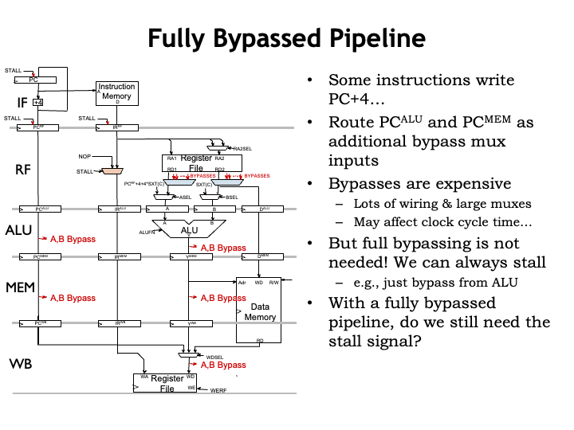

Here&#700;s a diagram showing all the bypass paths we&#700;ll
need.  Note that branches and jumps write their PC+4 value into
the register file, so we&#700;ll need to bypass from the PC+4
values in the various stages as well as the ALU values.

Note that the bypassing is happening at the end of the
cycle, <i>e.g.</i>, after the ALU has computed its answer.  To
accommodate the extra t_PD of the bypass MUX, we&#700;ll have
to extend the clock period by a small amount.  So once again
there&#700;s a design tradeoff - the increased CPI of stalling
vs the slightly increased cycle time of bypassing.  And, of
course, in the case of bypassing there&#700;s the extra area
needed for the necessary wiring and MUXes.

We can cut back on the costs by reducing the amount of
bypassing, say, to only bypassing ALU results from the ALU stage
and use stalling to deal with all the other data hazards.

If we implement full bypassing, do we still need the STALL
logic?

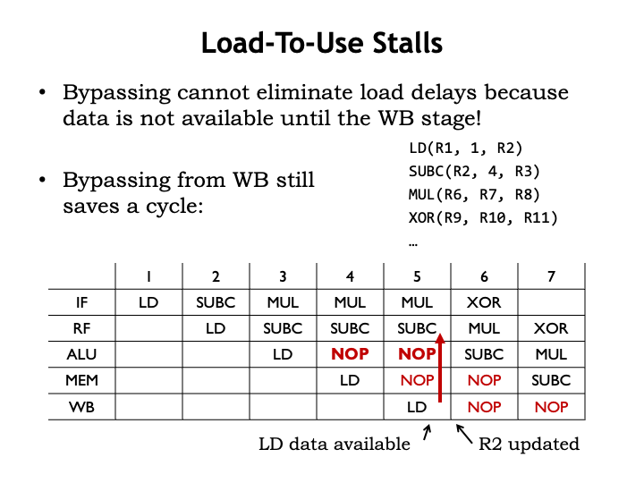

As it turns out, we do!  There&#700;s one data hazard that
bypassing doesn&#700;t completely address.  Consider trying to
immediately the use the result of a LD instruction.  In the
example shown here, the SUBC is trying to use the value the
immediately preceding LD is writing to R2.  This is called a
load-to-use hazard.

Recalling that LD data isn&#700;t available in the data path
until the cycle when LD reaches the WB stage, even with full
bypassing we&#700;ll need to stall SUBC in the RF stage until
cycle 5, introducing two NOPs into the pipeline.  Without
bypassing from the WB stage, we need to stall until cycle 6.

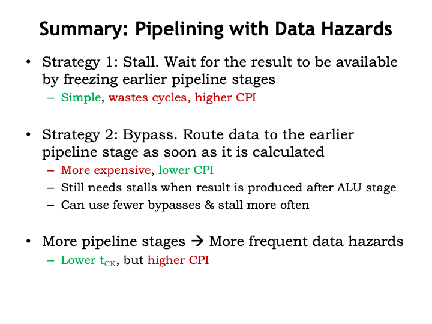

In summary, we have two strategies for dealing with data
hazards.

We can stall the IF and RF stages until the register values
needed by the instruction in the RF stage are available in the
register file.  The required hardware is simple, but the NOPs
introduced into the pipeline waste CPU cycles and result in an
higher effective CPI.

Or we can use bypass paths to route the required values to the
RF stage assuming they exist somewhere in the pipelined data
path.  This approach requires more hardware than stalling, but
doesn&#700;t reduce the effective CPI.  Even if we implement
bypassing, we&#700;ll need still need stalls to deal with
load-to-use hazards.

Can we keep adding pipeline stages in the hopes of further
reducing the clock period?  More pipeline stages mean more
instructions in the pipeline at the same time, which in turn
increases the chance of a data hazard and the necessity of
stalling, thus increasing CPI.

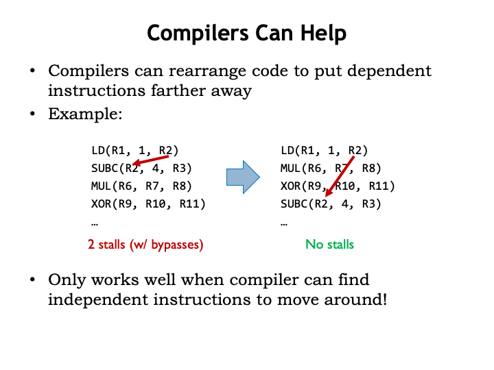

Compilers can help reduce dependencies by reorganizing the
assembly language code they produce.  Here&#700;s the
load-to-use hazard example we saw earlier.  Even with full
bypassing, we&#700;d need to stall for 2 cycles.

But if the compiler (or assembly language programmer!) notices
that the MUL and XOR instructions are independent of the SUBC
instruction and hence can be moved before the SUBC, the
dependency is now such that the LD is naturally in the WB stage
when the ST is in the RF stage, so no stalls are needed.

This optimization only works when the compiler can find
independent instructions to move around.  Unfortunately there
are plenty of programs where such instructions are hard to
find.

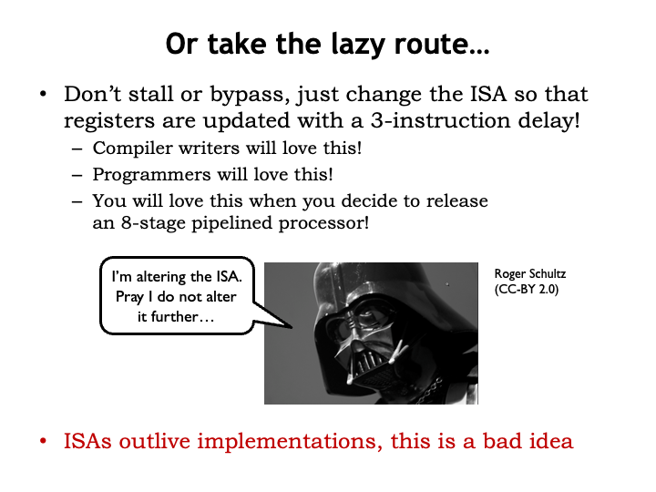

Then there&#700;s one final approach we could take - change
the ISA so that data hazards are part of the ISA, <i>i.e.</i>,
just explain that writes to the destination register happen with
a 3-instruction delay!  If NOPs are needed, make the programmer
add them to the program.  Simplify the hardware at the
&#8220;small&#8221; cost of making the compilers work
harder.

You can imagine exactly how much the compiler writers will like
this suggestion.  Not to mention assembly language programmers!
And you can change the ISA again when you add more pipeline
stages!

This is how a compiler writer views CPU architects who
unilaterally change the ISA to save a few logic gates :)

The bottom line is that successful ISAs have very long
lifetimes and so shouldn&#700;t include tradeoffs driven by
short-term implementation considerations.  Best not to go
there.

## Control Hazards

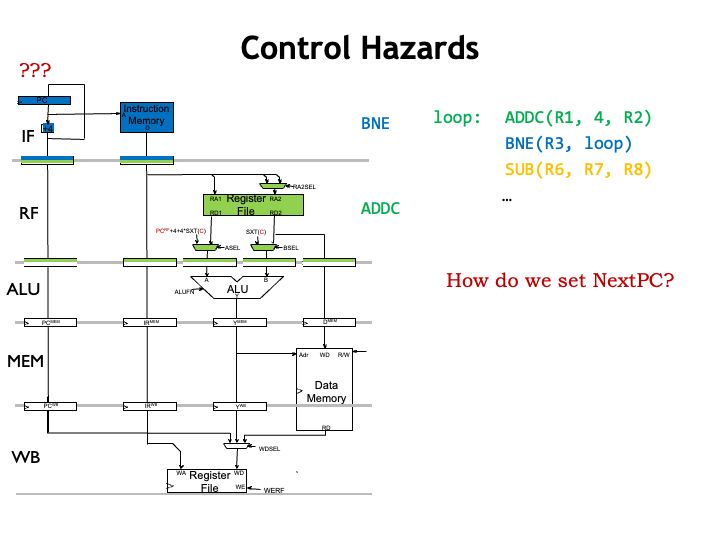

Now let&#700;s turn our attention to control hazards,
illustrated by the code fragment shown here.  Which instruction
should be executed after the BNE?  If the value in R3 is
non-zero, ADDC should be executed.  If the value in R3 is zero,
the next instruction should be SUB.  If the current instruction
is an explicit transfer of control (<i>i.e.</i>, JMPs or
branches), the choice of the next instruction depends on the
execution of the current instruction.

What are the implications of this dependency on our execution
pipeline?

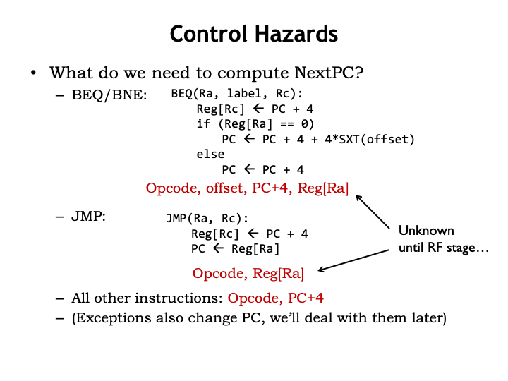

How does the unpipelined implementation determine the next
instruction?

For branches (BEQ or BNE), the value to be loaded into the
program counter depends on (1) the opcode, <i>i.e.</i>, whether
the instruction is a BEQ or a BNE, (2) the current value of the
program counter since that&#700;s used in the offset
calculation, and (3) the value stored in the register specified
by the RA field of the instruction since that&#700;s the value
tested by the branch.

For JMP instructions, the next value of the program counter
depends once again on the opcode field and the value of the RA
register.

For all other instructions, the next PC value depends only the
opcode of the instruction and the value PC+4.

Exceptions also change the program counter. We&#700;ll deal
with them later in the lecture.

The control hazard is triggered by JMP and branches since their
execution depends on the value in the RA register, <i>i.e.</i>,
they need to read from the register file, which happens in the
RF pipeline stage.  Our bypass mechanisms ensure that
we&#700;ll use the correct value for the RA register even if
it&#700;s not yet been written into the register file.  What
we&#700;re concerned about here is that the address of the
instruction following the JMP or branch will be loaded into
program counter at the end of the cycle when the JMP or branch
is in the RF stage.  But what should the IF stage be doing while
all this is going on in RF stage?

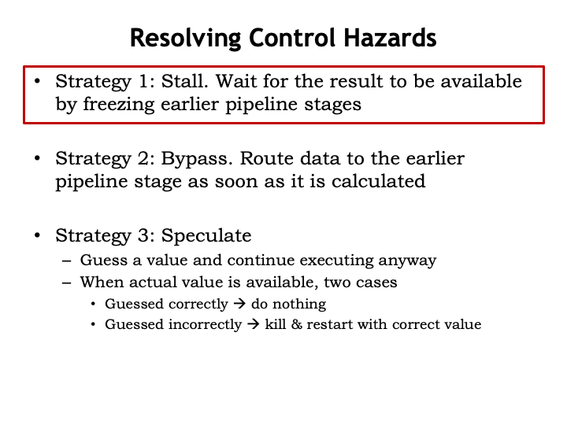

The answer is that in the case of JMPs and taken branches, we
don&#700;t know what the IF stage should be doing until those
instructions are able to access the value of the RA register in
the RF stage.

One solution is to stall the IF stage until the RF stage can
compute the necessary result.  This was the first of our general
strategies for dealing with hazards.  How would this work?

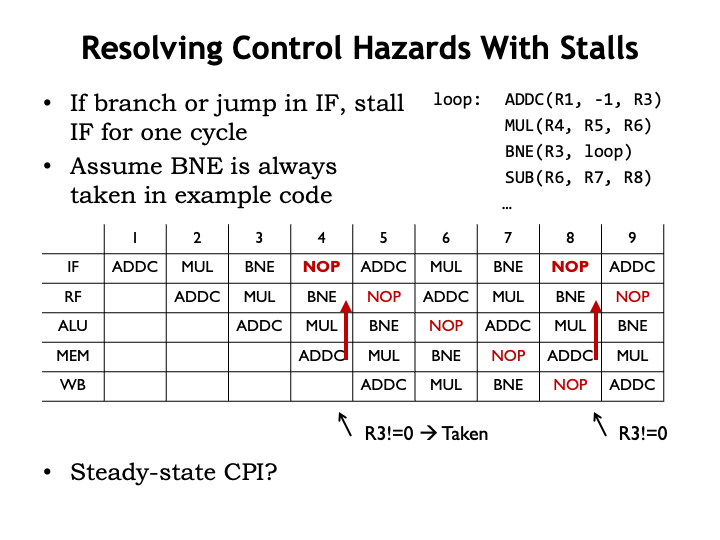

If the opcode in the RF stage is JMP, BEQ, or BNE, stall the IF
stage for one cycle.  In the example code shown here, assume
that the value in R3 is non-zero when the BNE is
executed, <i>i.e.</i>, that the instruction following BNE should
be the ADDC at the top of the loop.

The pipeline diagram shows the effect we&#700;re trying to
achieve: a NOP is inserted into the pipeline in cycles 4 and 8.
Then execution resumes in the next cycle after the RF stage
determines what instruction comes next.  Note, by the way, that
we&#700;re relying on our bypass logic to deliver the correct
value for R3 from the MEM stage since the ADDC instruction that
wrote into R3 is still in the pipeline, <i>i.e.</i>, we have a
data hazard to deal with too!

Looking at, say, the WB stage in the pipeline diagram, we see
it takes 4 cycles to execute one iteration of our 3-instruction
loop.  So the effective CPI is 4/3, an increase of 33%.  Using
stall to deal with control hazards has had an impact on the
instruction throughput of our execution pipeline.

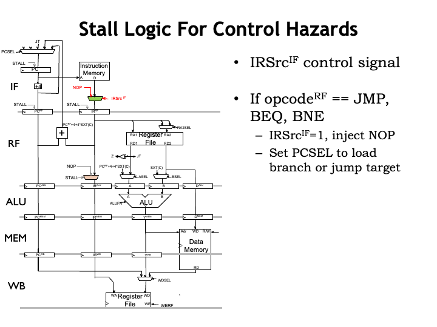

We&#700;ve already seen the logic needed to introduce NOPs
into the pipeline.  In this case, we add a mux to the
instruction path in the IF stage, controlled by the IRSrc_IF
select signal.  We use the superscript on the control signals to
indicate which pipeline stage holds the logic they control.

If the opcode in the RF stage is JMP, BEQ, or BNE we set
IRSrc_IF to 1, which causes a NOP to replace the instruction
that was being read from main memory.  And, of course,
we&#700;ll be setting the PCSEL control signals to select the
correct next PC value, so the IF stage will fetch the desired
follow-on instruction in the next cycle.

If we replace an instruction with NOP, we say we
<i>annulled</i> the instruction.

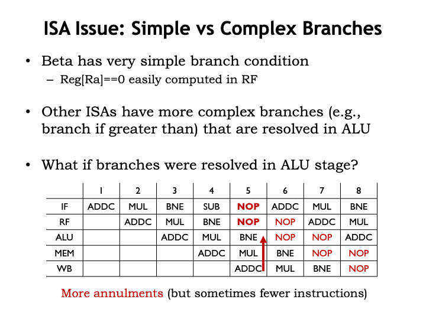

The branch instructions in the Beta ISA make their branch
decision in the RF stage since they only need the value in
register RA.

But suppose the ISA had a branch where the branch decision was
made in ALU stage.

When the branch decision is made in the ALU stage, we need to
introduce two NOPs into the pipeline, replacing the now unwanted
instructions in the RF and IF stages.  This would increase the
effective CPI even further.  But the tradeoff is that the more
complex branches may reduce the number of instructions in the
program.

If we annul instructions in all the earlier pipeline stages,
this is called <i>flushing the pipeline</i>.  Since
flushing the pipeline has a big impact on the effective CPI, we
do it when it&#700;s the only way to ensure the correct
behavior of the execution pipeline.

## Speculative Execution

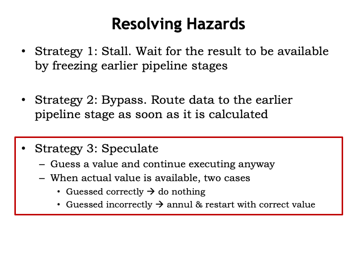

We can be smarter about when we choose to flush the pipeline
when executing branches.  If the branch is not taken, it turns
out that the pipeline has been doing the right thing by fetching
the instruction following the branch.  Starting execution of an
instruction even when we&#700;re unsure whether we really want
it executed is called <i>speculation</i>.

Speculative execution is okay if we&#700;re able to annul the
instruction before it has an effect on the CPU
state, <i>e.g.</i>, by writing into the register file or main
memory.  Since these state changes (called <i>side
effects</i>) happen in the later pipeline stages, an
instruction can progress through the IF, RF, and ALU stages
before we have to make a final decision about whether it should
be annulled.

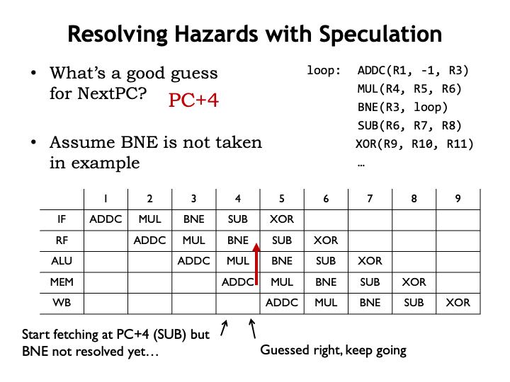

How does speculation help with control hazards?  Guessing that
the next value of the program counter is PC+4 is correct for all
but JMPs and taken branches.

Here&#700;s our example again, but this time let&#700;s
assume that the BNE is not taken, <i>i.e.</i>, that the value in
R3 is zero.  The SUB instruction enters the pipeline at the
start of cycle 4.  At the end of cycle 4, we know whether or not
to annul the SUB.  If the branch is not taken, we want to
execute the SUB instruction, so we just let it continue down the
pipeline.

In other words, instead of always annulling the instruction
following branch, we only annul it if the branch was taken.  If
the branch is not taken, the pipeline has speculated correctly
and no instructions need to be annulled.

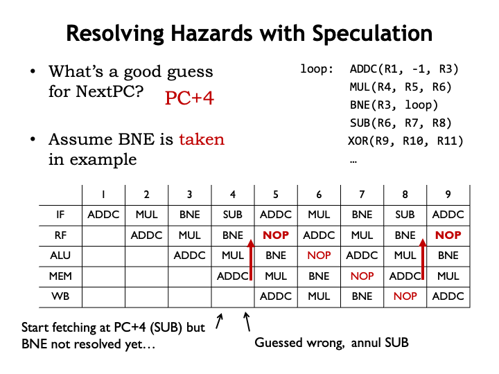

However if the BNE is taken, the SUB is annulled at the end of
cycle 4 and a NOP is executed in cycle 5.  So we only introduce
a bubble in the pipeline when there&#700;s a taken branch.
Fewer bubbles will decrease the impact of annulment on the
effective CPI.

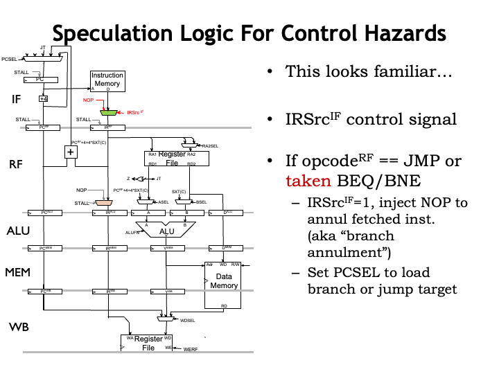

We&#700;ll be using the same data path circuitry as before,
we&#700;ll just be a bit more clever about when the value of
the IRSrc_IF control signal is set to 1.  Instead of setting it
to 1 for all branches, we only set it to 1 when the branch is
taken.

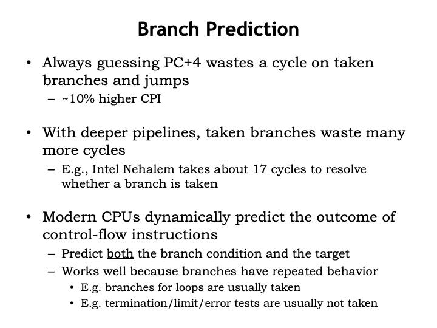

Our naive strategy of always speculating that the next
instruction comes from PC+4 is wrong for JMPs and taken
branches.  Looking at simulated execution traces, we&#700;ll
see that this error in speculation leads to about 10% higher
effective CPI.  Can we do better?

This is an important question for CPUs with deep pipelines.
For example, Intel&#700;s Nehalem processor from 2009 resolves
the more complex x86 branch instructions quite late in the
pipeline.  Since Nehalem is capable of executing multiple
instructions each cycle, flushing the pipeline in Nehalem
actually annuls the execution of many instructions, resulting in
a considerable hit on the CPI.

Like many modern processor implementations, Nehalem has a much
more sophisticated speculation mechanism.  Rather than always
guessing the next instruction is at PC+4, it only does that for
non-branch instructions.  For branches, it predicts the behavior
of each individual branch based on what the branch did last time
it was executed and some knowledge of how the branch is being
used.  For example, backward branches at the end of loops, which
are taken for all but the final iteration of the loop, can be
identified by their negative branch offset values.  Nehalem can
even determine if there&#700;s correlation between branch
instructions, using the results of an another, earlier branch to
speculate on the branch decision of the current branch.  With
these sophisticated strategies, Nehalem&#700;s speculation is
correct 95% to 99% of the time, greatly reducing the impact of
branches on the effective CPI.

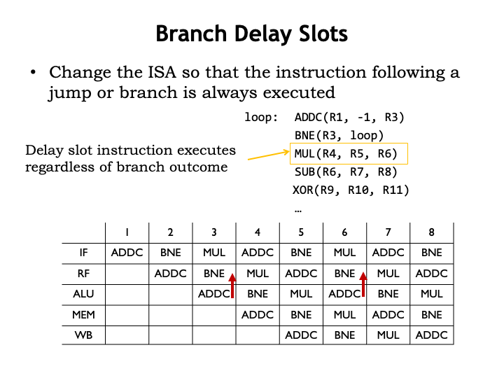

There&#700;s also the lazy option of changing the ISA to deal
with control hazards.  For example, we could change the ISA to
specify that the instruction following a jump or branch is
always executed.  In other words the transfer of control happens
*after* the next instruction.  This change ensures that the
guess of PC+4 as the address of the next instruction is always
correct!

In the example shown here, assuming we changed the ISA, we can
reorganize the execution order of the loop to place the MUL
instruction after the BNE instruction, in the so-called
<i>branch delay slot</i>.  Since the instruction in the
branch delay slot is always executed, the MUL instruction will
be executed during each iteration of the loop.

The resulting execution is shown in this pipeline diagram.
Assuming we can find an appropriate instruction to place in the
branch delay slot, the branch will have zero impact on the
effective CPI.

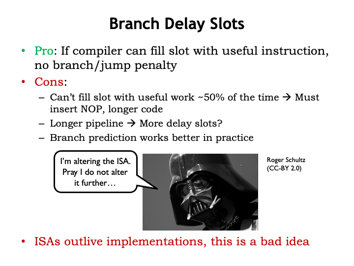

Are branch delay slots a good idea?  Seems like they reduce the
negative impact that branches might have on instruction
throughput.

The downside is that only half the time can we find
instructions to move to the branch delay slot.  The other half
of the time we have to fill it with an explicit NOP instruction,
increasing the size of the code.  And if we make the branch
decision later in the pipeline, there are more branch delay
slots, which would be even harder to fill.  In practice, it
turns out that branch prediction works better than delay slots
in reducing the impact of branches.

So, once again we see that it&#700;s problematic to alter the
ISA to improve the throughput of pipelined execution.  ISAs
outlive implementations, so it&#700;s best not to change the
execution semantics to deal with performance issues created by a
particular implementation.

</vertical>
</sequential>
<sequential display_name="Handling Exceptions and Interrupts" url_name="exceptions">
<vertical display_name="Handling Exceptions and Interrupts">

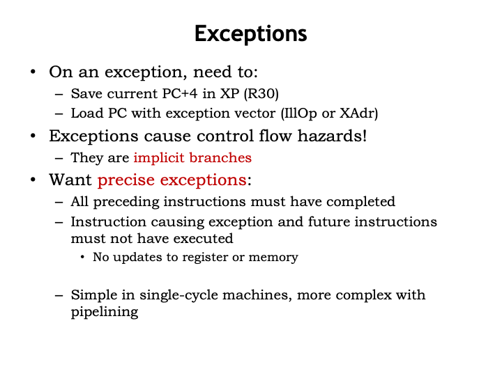

Now let&#700;s figure out how exceptions impact pipelined
execution.  When an exception occurs because of an illegal
instruction or an external interrupt, we need to store the
current PC+4 value in the XP register and load the program
counter with the address of the appropriate exception
handler.

Exceptions cause control flow hazards since they are
effectively implicit branches.

In an unpipelined implementation, exceptions affect the
execution of the current instruction.  We want to achieve
exactly the same effect in our pipelined implementation.  So
first we have to identify which one of the instructions in our
pipeline is affected, then ensure that instructions that came
earlier in the code complete correctly and that we annul the
affected instruction and any following instructions that are in
the pipeline.

Since there are multiple instructions in the pipeline, we have
a bit of sorting out to do.

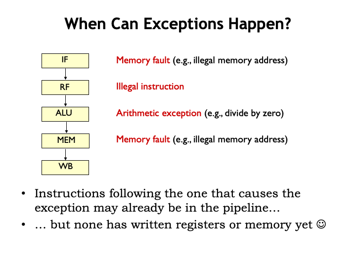

When, during pipelined execution, do we determine that an
instruction will cause an exception?  An obvious example is
detecting an illegal opcode when we decode the instruction in
the RF stage.  But we can also generate exceptions in other
pipeline stages.  For example, the ALU stage can generate an
exception if the second operand of a DIV instruction is 0. Or
the MEM stage may detect that the instruction is attempting to
access memory with an illegal address.  Similarly the IF stage
can generate a memory exception when fetching the next
instruction.

In each case, instructions that follow the one that caused the
exception may already be in the pipeline and will need to be
annulled.  The good news is that since register values are only
updated in the WB stage, annulling an instruction only requires
replacing it with a NOP.  We won&#700;t have to restore any
changed values in the register file or main memory.

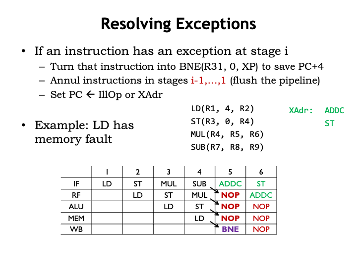

Here&#700;s our plan.  If an instruction causes an exception
in stage i, replace that instruction with this BNE instruction,
whose only side effect is writing the PC+4 value into the XP
register.  Then flush the pipeline by annulling instructions in
earlier pipeline stages.  And, finally, load the program counter
with the address of the exception handler.

In this example, assume that LD will generate a memory
exception in the MEM stage, which occurs in cycle 4.  The arrows
show how the instructions in the pipeline are rewritten for
cycle 5, at which point the IF stage is working on fetching the
first instruction in the exception handler.

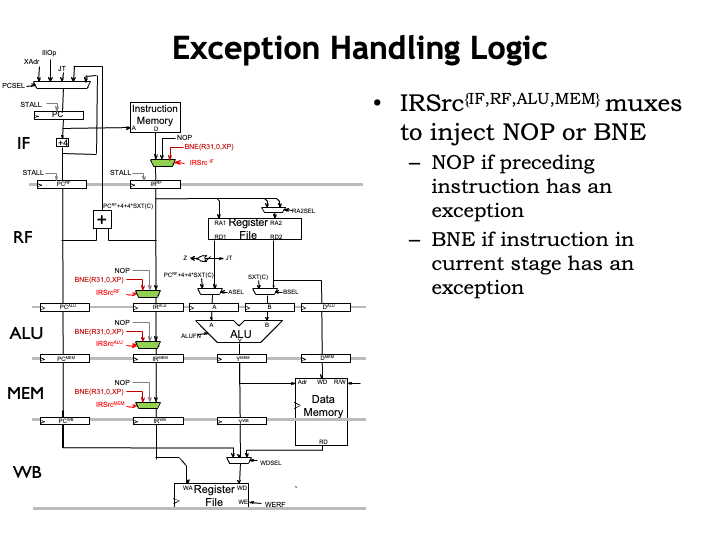

Here are the changes required to the execution pipeline.  We
modify the muxes in the instruction path so that they can
replace an actual instruction with either NOP if the instruction
is to be annulled, or BNE if the instruction caused the
exception.

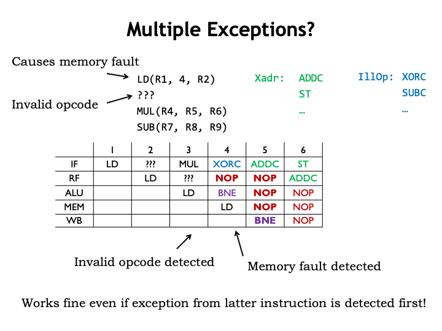

Since the pipeline is executing multiple instructions at the
same time, we have to worry about what happens if multiple
exceptions are detected during execution.  In this example
assume that LD will cause a memory exception in the MEM stage
and note that it is followed by an instruction with an illegal
opcode.

Looking at the pipeline diagram, the invalid opcode is detected
in the RF stage during cycle 3, causing the illegal instruction
exception process to begin in cycle 4.  But during that cycle,
the MEM stage detects the illegal memory access from the LD
instruction and so causes the memory exception process to begin
in cycle 5.  Note that the exception caused by the earlier
instruction (LD) overrides the exception caused by the later
illegal opcode even thought the illegal opcode exception was
detected first.  That&#700;s the correct behavior since once
the execution of LD is abandoned, the pipeline should behave as
if none of the instructions that come after the LD were
executed.

If multiple exceptions are detected in the *same* cycle, the
exception from the instruction furthest down the pipeline should
be given precedence.

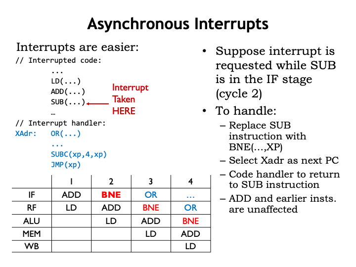

External interrupts also behave as implicit branches, but it
turns out they are a bit easier to handle in our pipeline.
We&#700;ll treat external interrupts as if they were an
exception that affected the IF stage.  Let&#700;s assume the
external interrupt occurs in cycle 2.  This means that the SUB
instruction will be replaced by our magic BNE to capture the
PC+4 value and we&#700;ll force the next PC to be the address
of the interrupt handler.  After the interrupt handler
completes, we&#700;ll want to resume execution of the
interrupted program at the SUB instruction, so we&#700;ll code
the handler to correct the value saved in the XP register so
that it points to the SUB instruction.

This is all shown in the pipeline diagram.  Note that the ADD,
LD, and other instructions that came before SUB in the program
are unaffected by the interrupt.

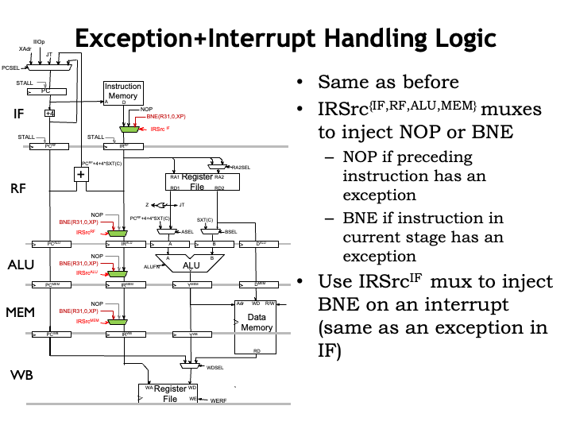

We can use the existing instruction-path muxes to deal with
interrupts, since we&#700;re treating them as IF-stage
exceptions.  We simply have to adjust the logic for IRSrc_IF to
also make it 1 when an interrupt is requested.

## 5-stage Beta: Final Version

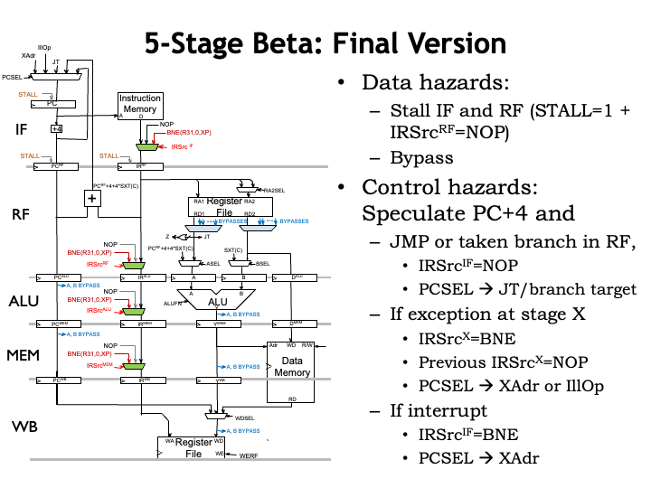

So here&#700;s the final version of our 5-stage pipelined data
path.

To deal with data hazards we&#700;ve added stall logic to the
IF and RF input registers.  We&#700;ve also added bypass muxes
on the output of the register file read ports so we can route
values from later in the data path if we need to access a
register value that&#700;s been computed but not yet written to
the register file.  We also made a provision to insert NOPs into
the pipeline after the RF stage if the IF and RF stages are
stalled.

To deal with control hazards, we speculate that the next
instruction is at PC+4.  But for JMPs and taken branches, that
guess is wrong so we added a provision for annulling the
instruction in the IF stage.

To deal with exceptions and interrupts we added instruction
muxes in all but the final pipeline stage.  An instruction that
causes an exception is replaced by our magic BNE instruction to
capture its PC+4 value.  And instructions in earlier stages are
annulled.

All this extra circuitry has been added to ensure that
pipelined execution gives the same result as unpipelined
execution.  The use of bypassing and branch prediction ensures
that data and control hazards have only a small negative impact
on the effective CPI.  This means that the much shorter clock
period translates to a large increase in instruction
throughput.

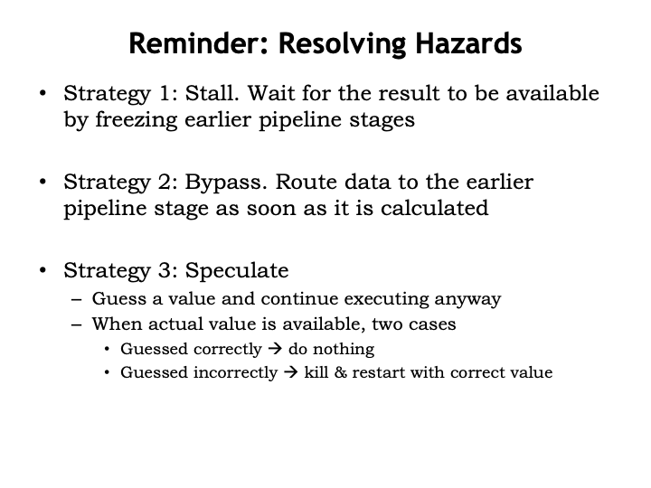

It&#700;s worth remembering the strategies we used to deal
with hazards: stalling, bypassing and speculation.  Most
execution issues can be dealt with using one of these
strategies, so keep these in mind if you ever need to design a
high-performance pipelined system.

This completes our discussion of pipelining.  We&#700;ll
explore other avenues to higher processor performance in a
a later lecture discussing parallel processing.

