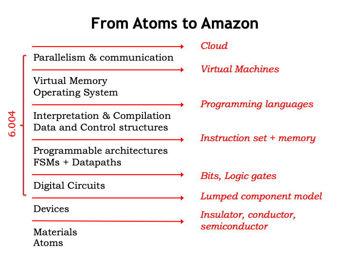
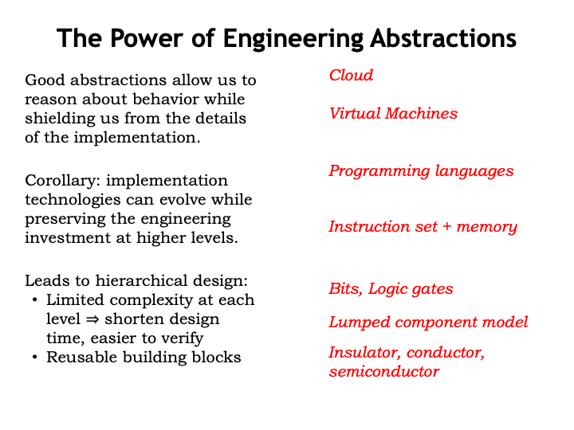
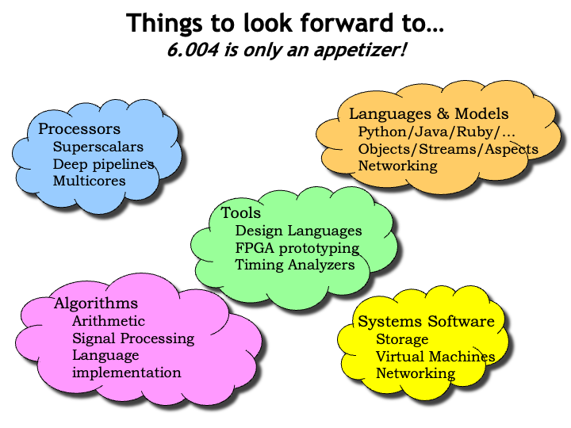
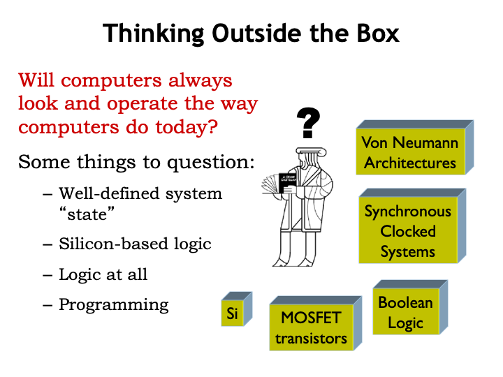
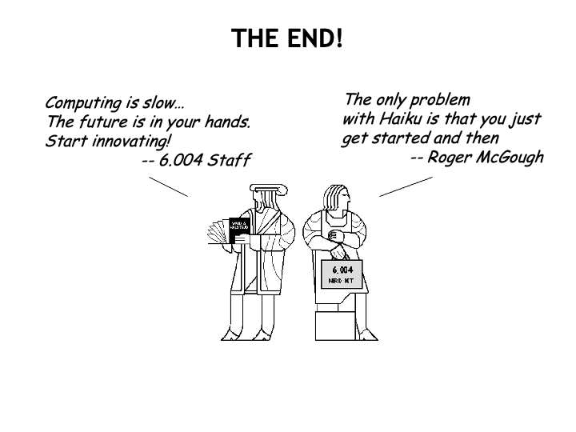

## From Atoms to Amazon

And now we&#700;ve reached the end of Computation Structures.
Looking back, there are two ways of thinking about the material
we&#700;ve discussed, the skills we&#700;ve practiced, and the
designs we&#700;ve completed.

Starting at devices, we&#700;ve worked our way up the design hierarchy,
each level serving as building blocks for the next.  Along the way we
thought about design tradeoffs, choosing the alternatives that would
make our systems reliable, efficient and easy to understand and hence
easy to maintain.

In the other view of Computation Structures, we created and
then used a hierarchy of engineering abstractions that are
reasonably independent of the technologies they encapsulate.
Even though technologies change at a rapid pace, these
abstractions embody principles that are timeless.  For example,
the symbolic logic described by George Boole in 1847 is still
used to reason about the operation of digital circuits you and I
design today.

The power of engineering abstractions is that they allow us to reason
about the behavior of a system based on the behavior of the components
without having to understand the implementation details of each
component.

The advantage of viewing components as &#8220;black boxes&#8221; implementing
some specified function is that the implementation can change as long
as the same specification is satisfied.  In my lifetime, the size of a
2-input NAND gate has shrunk by 10 orders of magnitude, yet a
50-year-old logic design would still work as intended if implemented
in today&#700;s technologies.

Imagine trying to build a circuit that added two binary numbers if you
had to reason about the electrical properties of doped silicon and
conducting metals.  Using abstractions lets us limit the design
complexity at each level, shortening design time and making it easier
to verify that the specifications have been met.  And once we&#700;ve
created a useful repertoire of building blocks, we can use them again
and again to assemble many different systems.

Our goal in Computation Structures is to demystify how computers work, starting with
MOSFETs and working our way up to operating systems.  We hope you&#700;ve
understood the engineering abstractions we&#700;ve introduced and had a
chance to practice using them when completing the design problems
offered in the labs.

We also hope that you&#700;ll also understand their limitations and have
the confidence to create new abstractions when tackling new
engineering tasks.  Good engineers use abstractions, but great
engineers create them.

## Thinking Outside the Box

Computation Structures is an introductory course that only touches upon the basic
principles used at each level of the design hierarchy.  If a
particular topic struck you as especially interesting, we hope you&#700;ll
seek out a more advanced course that will let you dig deeper into that
engineering discipline.  Hundreds of thousands of engineers have
worked to create the digital systems that are the engines of today&#700;s
information society.  As you can imagine, there&#700;s no end of
interesting engineering to explore and master &#8212; so roll up your
sleeves and come join in the fun!

What will be the engineering challenges of tomorrow?  Here are a few
thoughts about how the future of computing may be very different than
the present.

The systems we build today have a well-defined notion of state: the
exact digital values stored in their memories, produced by their logic
components, and traveling along their interconnect.  But computation
based on the principles of quantum mechanics may allow us to solve
what are now intractable problems using states described not as
collections of 1&#700;s and 0&#700;s, but as interrelated probabilities that
describe the superposition of many states.

We&#700;ve built our systems using voltages to encode information and
voltage-controlled switches to perform computation, using
silicon-based electrical devices.  But the chemistry of life has been
carrying out detailed manufacturing operations for millennia using
information encoded as sequences of amino acids.  Some of the
information encoded in our DNA has been around for millions of years,
a truly long-lived information system!  Today biologists are starting
to build computational components from biological materials.  Maybe in
50 years instead of plugging in your laptop, you&#700;ll have to feed it :)

Instead of using truth tables and logic functions, some computations
are best performed by neural networks that operate by forming
appropriately weighted combinations of analog inputs, where the
weights are learned by the system as it is trained using example
inputs that should produce known outputs.  Artificial neural nets are
thought to model the operation of the synapses and neurons in our
brains.  As we learn more about how the brain operates, we may get
many new insights into how to implement systems that are good at
recognition and reasoning.

Again using living organisms as useful models, programming may be
replaced by learning, where stimulus and feedback are used to evolve
system behavior.  In other words, systems will use adaptation
mechanisms to evolve the desired functionality rather than have it
explicitly programmed.

This all seems the stuff of science fiction, but I suspect our parents
feel the same way about having conversations with Alexa about
tomorrow&#700;s weather.

Thanks for joining us here in Computation Structures.  We&#700;ve enjoyed presenting the
material and challenging you with design tasks to exercise your new
skills and understanding.  There are interesting times ahead in the
world of digital systems and we can certainly use your help in
inventing the future!

We&#700;d welcome any feedback you have about the course.

Good bye for now... and good luck in your future studies...

