
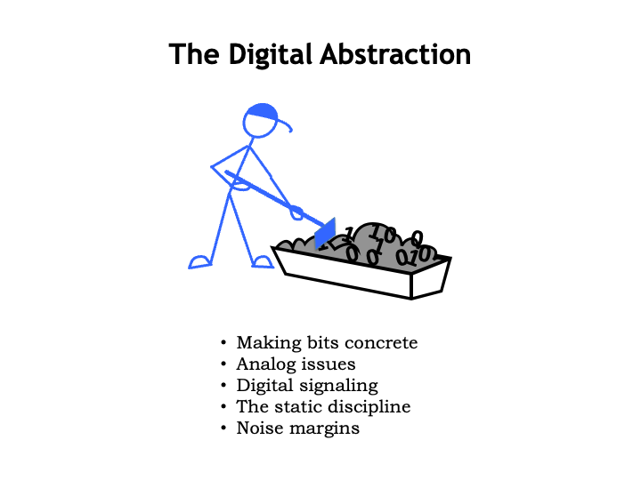

In the previous lecture, we discussed how to encode information as
sequences of bits.  In this lecture, we turn our attention to finding
a useful physical representation for bits, our first step in building
devices that can process information.

<h2>Encoding Information</h2>

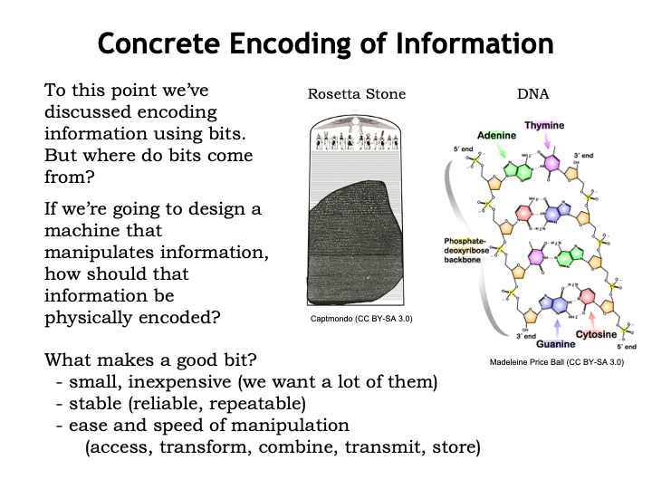

So, what makes a good bit, <i>i.e.</i>, what properties do we want
our physical representation of bits to have?

Well, we&#700;ll want a lot of them.  We expect to carry billions
of bits around with us, <i>e.g.</i>, music files.  And we expect to
have access to trillions of additional bits on the web for news,
entertainment, social interactions, commerce &#8212; the list goes on
and on.  So we want bits to be small and inexpensive.

Mother Nature has a suggestion: the chemical encoding embodied in
DNA, where sequences of the nucleotides Adenine, Thymine, Guanine and
Cytosine form codons that encode genetic information that serve as the
blueprint for living organisms.  The molecular scale meets our size
requirements and there&#700;s active research underway on how to use
the chemistry of life to perform interesting computations on a massive
scale.

We&#700;d certainly like our bits to be stable over long periods
of time &#8212; once a 0, always a 0!  The Rosetta Stone,
shown here as part of its original tablet containing a decree from the
Egyptian King Ptolemy V, was created in 196 BC and encoded the
information needed for archeologists to start reliably deciphering
Egyptian hieroglyphics almost 2000 years later.  But, the very
property that makes stone engravings a stable representation of
information makes it difficult to manipulate the information.

Which brings us to the final item on our shopping list: we&#700;d
like our representation of bits to make it easy to quickly access,
transform, combine, transmit and store the information they
encode.

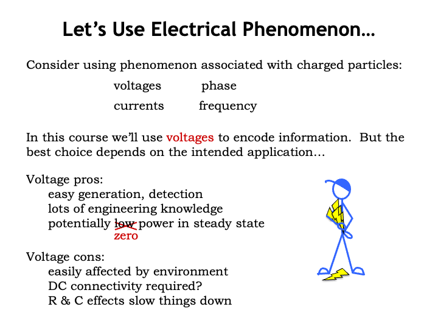

Assuming we don&#700;t want to carry around buckets of gooey DNA
or stone chisels, how should we represent bits?

With some engineering we can represent information using the
electrical phenomenon associated with charged particles.  The presence
of charged particles creates differences in electrical potential
energy we can measure as voltages, and the flow of charged particles
can be measured as currents.  We can also encode information using the
phase and frequency of electromagnetic fields associated with charged
particles &#8212; these latter two choices form the basis for wireless
communication.  Which electrical phenomenon is the best choice depends
on the intended application.

In this course, we&#700;ll use voltages to represent bits.  For
example, we might choose 0V to represent a 0-bit and 1V to represent a
1-bit.  To represent sequences of bits we can use multiple voltage
measurements, either from many different wires, or as a sequence of
voltages over time on a single wire.

A representation using voltages has many advantages: electrical
outlets provide an inexpensive and mostly reliable source of
electricity and, for mobile applications, we can use batteries to
supply what we need.  For more than a century, we&#700;ve been
accumulating considerable engineering knowledge about voltages and
currents.  We now know how to build very small circuits to store,
detect and manipulate voltages.  And we can make those circuits run on
a very small amount of electrical power.  In fact, we can design
circuits that require close to zero power dissipation in a steady
state if none of the encoded information is changing.

However, a voltage-based representation does have some challenges:
voltages are easily affected by changing electromagnetic fields in the
surrounding environment.  If I want to transmit voltage-encoded
information to you, we need to be connected by a wire.  And changing
the voltage on a wire takes some time, since the timing of the
necessary flow of charged particles is determined by the resistance
and capacitance of the wire.  In modern integrated circuits, these RC
time constants are small, but sadly not zero.

We have good engineering solutions for these challenges, so
let&#700;s get started!

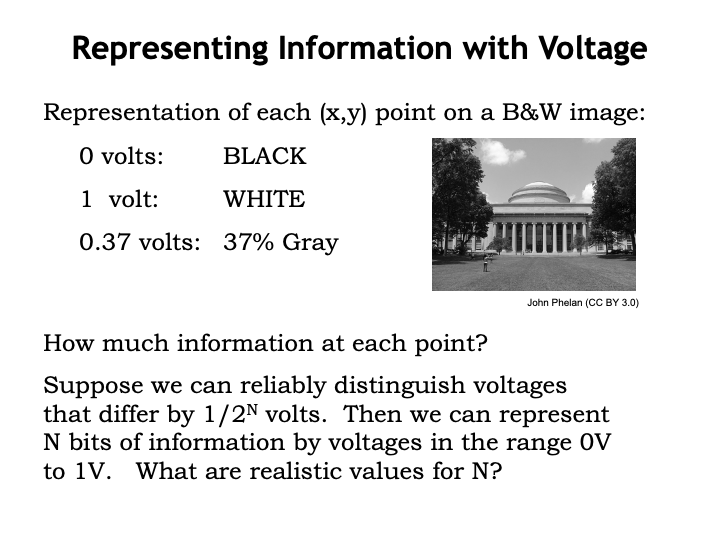

Consider the problem of using voltages to represent the information
in a black-and-white image.  Each (x,y) point in the image has an
associated intensity: black is the weakest intensity, white the
strongest.  An obvious voltage-based representation would be to encode
the intensity as a voltage, say 0V for black, 1V for white, and some
intermediate voltage for intensities in-between.

First question: how much information is there at each point in the
image?  The answer depends on how well we can distinguish intensities
or, in our case, voltages.  If we can distinguish arbitrarily small
differences, then there&#700;s potentially an infinite amount of
information in each point of the image.  But, as engineers, we suspect
there&#700;s a lower-bound on the size of differences we can
detect.

To represent the same amount of information that can be represented
with N bits, we need to be able to distinguish a total $2^N$ voltages
in the range of 0V to 1V.  For example, for N = 2, we&#700;d need to
be able to distinguish between four possible voltages.  That
doesn&#700;t seem too hard &#8212; an inexpensive volt-meter would
let us easily distinguish between 0V, 1/3V, 2/3V and 1V.

In theory, N can be arbitrarily large.  In practice, we know it
would be quite challenging to make measurements with, say, a precision
of 1-millionth of a volt and probably next to impossible if we wanted
a precision of 1-billionth of a volt.  Not only would the equipment
start to get very expensive and the measurements very time consuming,
but we&#700;d discover that phenomenon like thermal noise would
confuse what we mean by the instantaneous voltage at a particular
time.

So our ability to encode information using voltages will clearly be
constrained by our ability to reliably and quickly distinguish the
voltage at particular time.

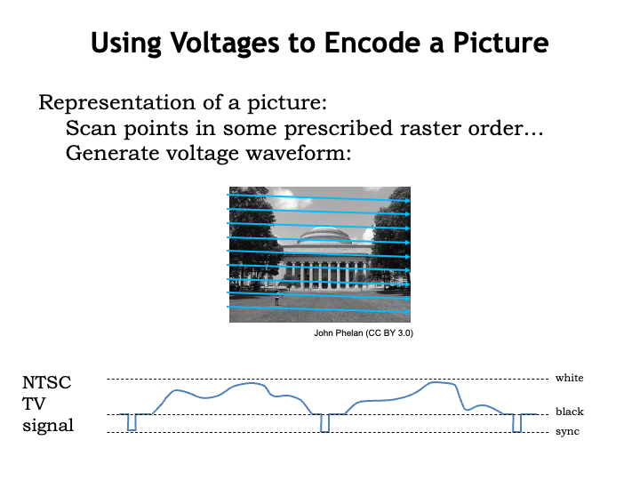

To complete our project of representing a complete image,
we&#700;ll scan the image in some prescribed raster order &#8212;
left-to-right, top-to-bottom &#8212; converting intensities to
voltages as we go.  In this way, we can convert the image into a
time-varying sequence of voltages.  This is how the original
televisions worked: the picture was encoded as a voltage waveform that
varied between the representation for black and that for white.
Actually the range of voltages was expanded to allow the signal to
specify the end of the horizontal scan and the end of an image, the
so-called sync signals.  We call this a <i>continuous waveform</i> to
indicate that it can take on any value in the specified range at a
particular point in time.

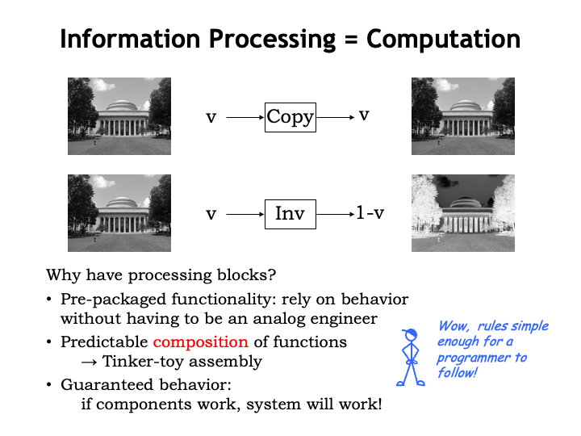

Now let&#700;s see what happens when we try to build a system to
process this signal.

We&#700;ll create a system using two simple processing blocks.
The COPY block reproduces on its output whatever voltage appears on
its input.  The output of a COPY block looks the same as the original
image.  The INVERTING block produces a voltage of 1-V when the input
voltage is V,
<i>i.e.</i>, white is converted to black and vice-versa.  We get the
negative of the input image after passing it through an INVERTING
block.

Why have processing blocks?  Using pre-packaged blocks is a common
way of building large circuits &#8212; we can assemble a system by
connecting the blocks one to another and reason about the behavior of
the resulting system without having to understand the internal details
of each block.  The pre-packaged functionality offered by the blocks
makes them easy to use without having be an expert analog
engineer!

Moreover, we would we expect to be able to wire up the blocks in
different configurations when building different systems and be able
to predict the behavior of each system based on the behavior of each
block.  This would allow us build systems like tinker toys, simply by
hooking one block to another.  Even a programmer who doesn&#700;t
understand the electrical details could expect to build systems that
perform some particular processing task.

The whole idea is that there&#700;s a guarantee of predictable
behavior: if the components work and we hook them up obeying whatever
the rules are for connecting blocks, we would expect the system to
work as intended.

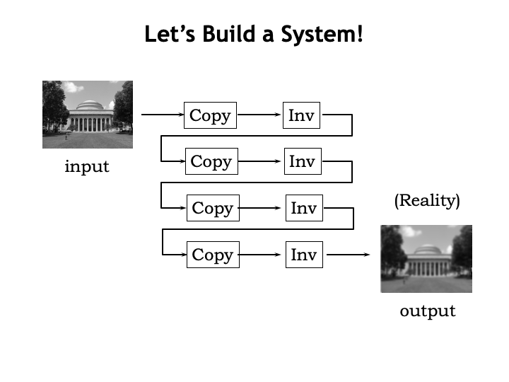

So, let&#700;s build a system with our COPY and INVERTING blocks.
Here&#700;s an image processing system using a few instances each
block.  What do we expect the output image to look like?

Well, the COPY blocks don&#700;t change the image and there are an
even number of INVERTING blocks, so, in theory, the output image
should be identical to the input image.

But in reality, the output image isn&#700;t a perfect copy of the
input, it&#700;s slightly fuzzy &#8212; the intensities are slightly
off and it looks like sharp changes in intensity have been smoothed
out, creating a blurry reproduction of the original.  What went
wrong?

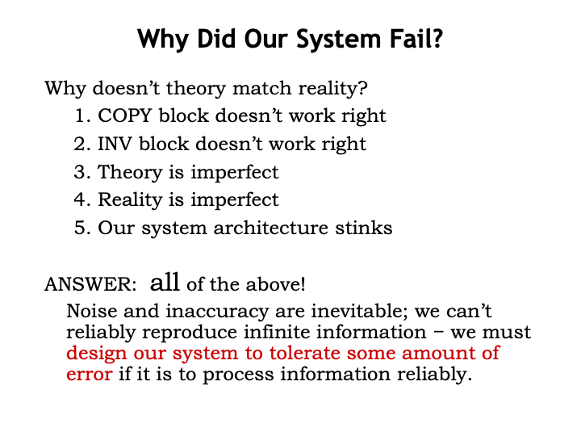

Why doesn&#700;t theory match reality?

Perhaps the COPY and INVERTING blocks don&#700;t work correctly?
That&#700;s almost certainly true, in the sense that they don&#700;t
precisely obey the mathematical description of their behavior.  Small
manufacturing variations and differing environmental conditions will
cause each instance of the COPY block to produce not V volts for a
V-volt input, but V+epsilon volts, where epsilon represents the amount
of error introduced during processing.  Ditto for the INVERTING
block.

The difficulty is that in our continuous-value representation of
intensity, V+epsilon is a perfectly correct output value, just not for
a V-volt input!  In other words, we can&#700;t tell the difference
between a slightly corrupted signal and a perfectly valid signal for a
slightly different image.

More importantly &#8212; and this is the real killer &#8212; the
errors accumulate as the encoded image passes through the system of
COPY and INVERTING blocks.  The larger the system, the larger the
amount of accumulated processing error.  This doesn&#700;t seem so
good: it would be awkward, to say the least, if we had to have rules
about how many computations could be performed on encoded information
before the results became too corrupted to be usable.

You would be correct if you thought this meant that the theory we
used to describe the operation of our system was imperfect.
We&#700;d need a very complicated theory indeed to capture all the
possible ways in which the output signal could differ from its
expected value.  Those of us who are mathematically minded might
complain that &#8220;reality is imperfect.&#8221; That&#700;s going a
bit far though.  Reality is what it is and, as engineers, we need to
build our systems to operate reliably in the real world.  So perhaps
the real problem lies in how we chose to engineer the system.

In fact, all of the above are true!  Noise and inaccuracy are
inevitable.  We can&#700;t reliably reproduce infinite information.
We must design our system to tolerate some amount of error if it is to
process information reliably.  Basically, we need to find a way to
notice that errors have been introduced by a processing step and
restore the correct values before the errors have a chance to
accumulate.  How to do that is our next topic.

<h2>The Digital Abstraction</h2>

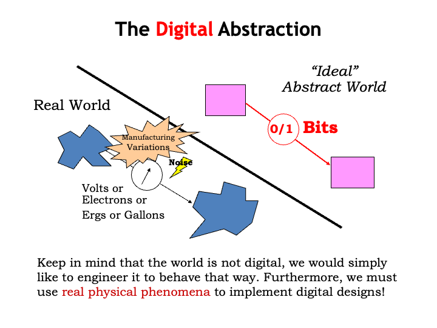

To solve our engineering problem, we will introduce what
we&#700;ll call the <i>digital abstraction</i>.  The key insight is
to use the continuous world of voltages to represent some small,
finite set of values, in our case, the two binary values, 0 and 1.
Keep in mind that the world is not inherently digital, we would simply
like to engineer it to behave that way, using continuous physical
phenomenon to implement digital designs.

As a quick aside, let me mention that there are physical phenomenon
that are naturally digital, <i>i.e.</i>, that are observed to have one
of several quantized values, <i>e.g.</i>, the spin of an electron.
This came as a surprise to classical physicists who thought
measurements of physical values were continuous.  The development of
quantum theory to describe the finite number of degrees of freedom
experienced by subatomic particles completely changed the world of
classical physics.  We&#700;re just now starting to research how to
apply quantum physics to computation and there&#700;s interesting
progress to report on building quantum computers.  But for this
course, we&#700;ll focus on how to use classical continuous
phenomenon to create digital systems.

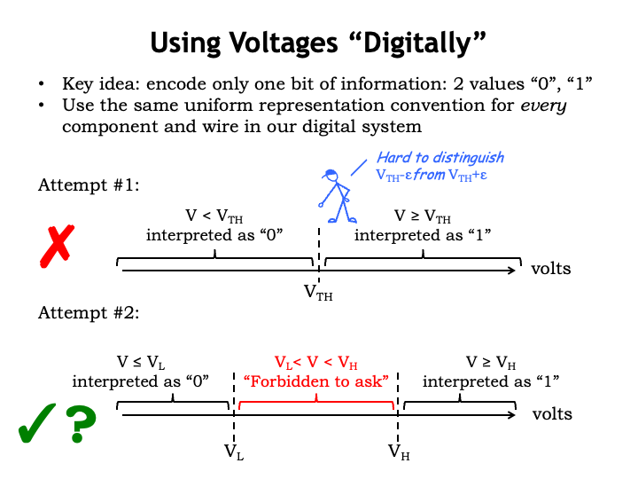

The key idea in using voltages digitally is to have a signaling
convention that encodes only one bit of information at
time, <i>i.e.</i>, one of two values, 0 or 1.  We&#700;ll use the
same uniform representation for every component and wire in our
digital system.

It&#700;ll take us three attempts to arrive at a voltage
representation that solves all the problems.  Our first cut is the
obvious one: simply divide the range of voltages into two sub-ranges,
one range to represent 0, the other range to represent 1.  Pick some
threshold voltage, $V_{\textrm{th}}$, to divide the range in two.
When a voltage V is less than the threshold voltage, we&#700;ll take
it to represent a bit value of 0.  When a voltage V is greater than or
equal to the threshold voltage, it will represent a bit value of 1.
This representation assigns a digital value to all possible
voltages.

The problematic part of this definition is the difficulty in
interpreting voltages near the threshold.  Given the numeric value for
a particular voltage, it&#700;s easy to apply the rules and come up
with the corresponding digital value.  But determining the correct
numeric value accurately gets more time consuming and expensive as the
voltage gets closer and closer to the threshold.  The circuits
involved would have to be made of precision components and run in
precisely-controlled physical environments &#8212; hard to accomplish
when we consider the multitude of environments and the modest cost
expectations for the systems we want to build.

So although this definition has an appealing mathematical
simplicity, it&#700;s not workable on practical grounds.  This one
gets a big red X.

In our second attempt, we&#700;ll introduce two threshold
voltages: $V_{\textrm{L}}$ and $V_{\textrm{H}}$.  Voltages less than
or equal to $V_{\textrm{L}}$ will be interpreted as 0, and voltages
greater than or equal to $V_{\textrm{H}}$ will be interpreted as 1.
The range of voltages between $V_{\textrm{L}}$ and $V_{\textrm{H}}$ is
called the <i>forbidden zone</i>, where we are forbidden to ask for
any particular behavior of our digital system.  A particular system
can interpret a voltage in the forbidden as either a 0 or a 1, and is
not even required to be consistent in its interpretation.  In fact the
system is not required to produce any interpretation at all for
voltages in this range.

How does this help?  Now we can build a quick-and-dirty
voltage-to-bit converter, say by using a high-gain op-amp and
reference voltage somewhere in the forbidden zone to decide if a given
voltage is above or below the threshold voltage.  This reference
voltage doesn&#700;t have to be super-accurate, so it could be
generated with, say, a voltage divider built from low-cost
10%-accurate resistors.  The reference could change slightly as the
operating temperature varied or the power supply voltage changed, and
so on.  We only need to guarantee the correct behavior of our
converter for voltages below $V_{\textrm{L}}$ or above
$V_{\textrm{H}}$.

This representation is pretty promising and we&#700;ll tentatively
give it a green checkmark for now.  After a bit more discussion,
we&#700;ll need to make one more small tweak before we get to where
we want to go.

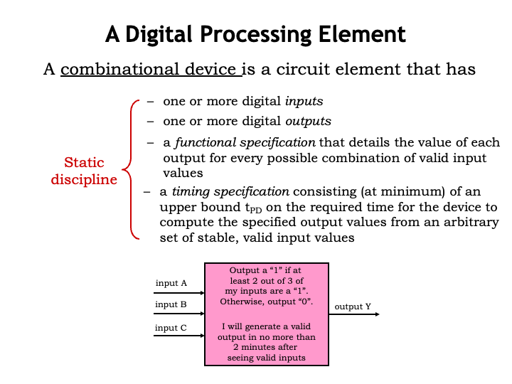

We&#700;re now in a position to define our what it means to be a
digital processing element.  We say a device is a <i>combinational
device</i> if it meets the following four criteria:

First, it should have digital inputs, by which we mean the device
uses our signaling convention, interpreting input voltages below
$V_{\textrm{L}}$ as the digital value 0, and voltages above
$V_{\textrm{H}}$ as the digital value 1.

Second, the device&#700;s outputs should also be digital,
producing outputs of 0 by generating voltages less than or equal to
$V_{\textrm{L}}$ and outputs of 1 by generating voltages greater than
or equal to $V_{\textrm{H}}$.

With these two criteria, we should be able to hook the output of
one combinational device to the input of another and expect the
signals passing between them to be interpreted correctly as 0&#700;s
and 1&#700;s.

Next, a combinational device is required to have a functional
specification that details the value of each output for every possible
combination of digital values on the inputs.

In the example, the device has three digital inputs, and since each
input can take on one of two digital values, there are 2*2*2 or eight
possible input configurations.  So the functional specification simply
has to tell us the value of the output Y when the inputs are 000, and
the output when the inputs are 001, and so on, for all 8 input
patterns.  A simple table with eight rows would do the trick.

Finally, a combinational device has a timing specification that
tells us how long it takes for the output of the dev ice to reflect
changes in its input values.  At a minimum, there must a specification
of the propagation delay, called $t_{\textrm{PD}}$, that is an upper
bound on the time from when the inputs reach stable and valid digital
values, to when the output is guaranteed to have a stable and valid
output value.

Collectively, we call these four criteria the <i>static
discipline</i>, which must be satisfied by all combinational
devices.

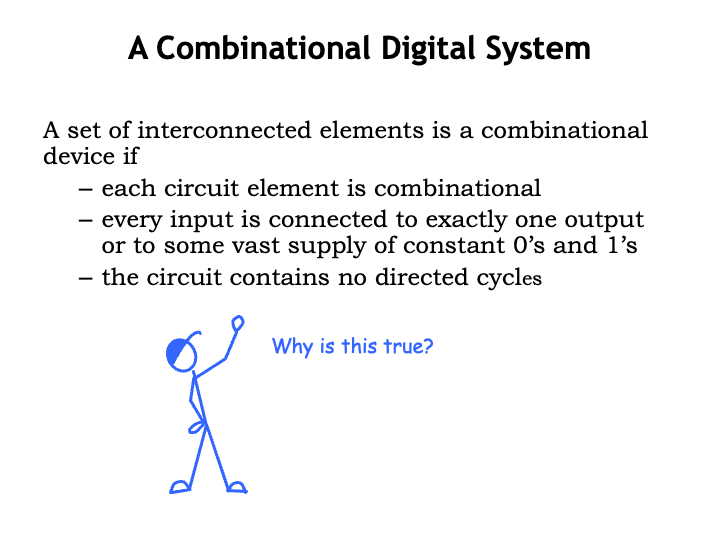

In order to build larger combinational systems from combinational
components, we&#700;ll follow the composition rules set forth
in the figure above.

First, each component of the system must itself be a combinational
device.

Second, each input of each component must be connected a system
input, or to exactly one output of another device, or to a constant
voltage representing the value 0 or the value 1.

Finally, the interconnected components cannot contain any directed
cycles, <i>i.e.</i>, paths through the system from its inputs to its
outputs will only visit a particular component at most once.

Our claim is that systems built using these composition rules will
themselves be combinational devices.  In other words, we can build big
combinational devices out of combinational components.  Unlike our
flaky analog system from the start of the lecture, the system can be
of any size and still be expected to obey the static discipline.

Why is this true?

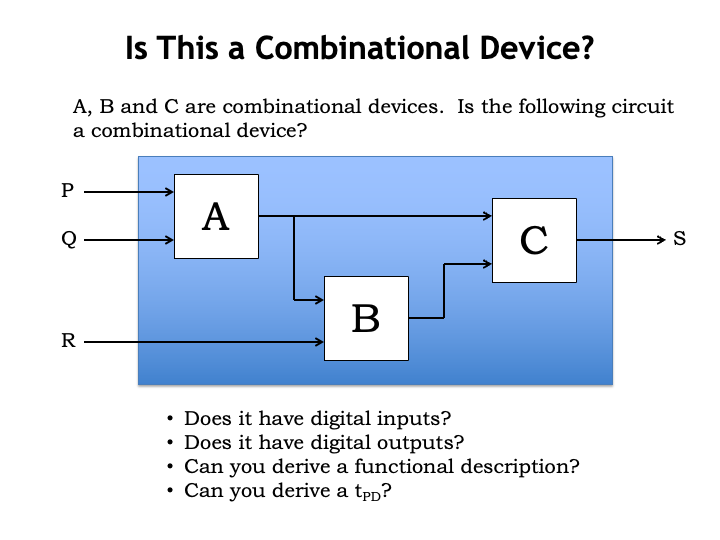

To see why the claim is true, consider the following system built
from the combinational devices A, B and C.  Let&#700;s see if we can
show that the overall system, as indicated by the containing blue box,
will itself be combinational.  We&#700;ll do this by showing that the
overall system does, in fact, obey the static discipline.

First, does the overall system have digital inputs?  Yes!  The
system&#700;s inputs are inputs to some of the component devices.
Since the components are combinational, and hence have digital inputs,
the overall system has digital inputs.  In this case, the system is
inheriting its properties from the properties of its components.

Second, does the overall system have digital outputs?  Yes, by the
same reasoning: all the system&#700;s outputs are connected to one of
the components and since the components are combinational, the outputs
are digital.

Third, can we derive a functional specification for the overall
system, <i>i.e.</i>, can we specify the expected output values for
each combination of digital input values?  Yes, we can by
incrementally propagating information about the current input values
through the component modules.  In the example shown, since A is
combinational, we can determine the value on its output given the
value on its inputs by using A&#700;s functional specification.  Now
we know the values on all of B&#700;s inputs and can use its
functional specification to determine its output value.  Finally,
since we&#700;ve now determined the values on all of C&#700;s
inputs, we can compute its output value using C&#700;s functional
specification.  In general, since there are no cycles in the circuit,
we can determine the value of every internal signal by evaluating the
behavior of the combinational components in an order that&#700;s
determined by the circuit topology.

Finally, can we derive the system&#700;s propagation delay,
$t_{\textrm{PD}}$, using the propagation delays of the
components?  Again, since there are no cycles, we can enumerate
the finite-length paths from system inputs to system outputs.
Then, we can compute the $t_{\textrm{PD}}$ along a particular
path by summing the $t_{\textrm{PD}}$s of the components along
the path.  The $t_{\textrm{PD}}$ of the overall system will be
the maximum of the path $t_{\textrm{PD}}$s considering all the
possible paths from inputs to outputs, i.e, the
$t_{\textrm{PD}}$ of the longest such path.

So the overall system does in fact obey the static discipline and
so it is indeed a combinational device.  Pretty neat &#8212; we can
use our composition rules to build combinational devices of arbitrary
complexity.

<h2>Dealing With Noise</h2>

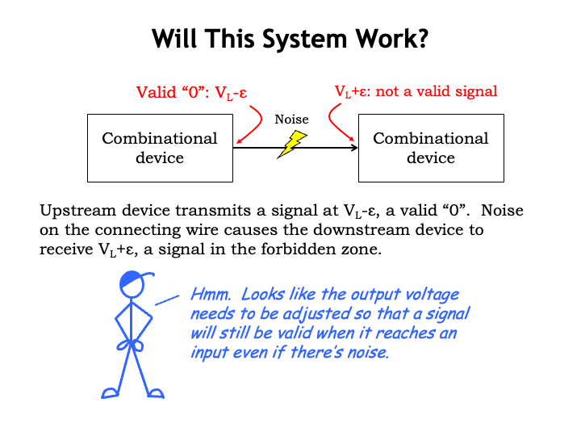

There&#700;s one more issue we need to deal with before finalizing
our signaling specification.  Consider the following combinational
system where the upstream combinational device on the left is trying
to send a digital 0 to the downstream combinational device on right.
The upstream device is generating an output voltage just slightly
below $V_{\textrm{L}}$, which, according to our proposed signaling
specification, qualifies as the representation for a digital 0.

Now suppose some electrical noise slightly changes the voltage on
the wire so that the voltage detected on the input of the downstream
device is slightly above $V_{\textrm{L}}$, <i>i.e.</i>, the received
signal no longer qualifies as a valid digital input and the
combinational behavior of the downstream device is no longer
guaranteed.

Oops, our system is behaving incorrectly because of some small
amount of electrical noise.  Just the sort of flaky behavior we are
hoping to avoid by adopting a digital systems architecture.

One way to address the problem is to adjust the signaling
specification so that outputs have to obey tighter bounds than the
inputs, the idea being to ensure that valid output signals can be
affected by noise without becoming invalid input signals.

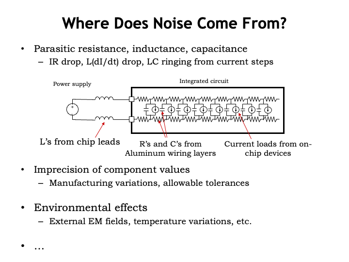

Can we avoid the problem altogether by somehow avoiding noise?  A
nice thought, but not a goal that we can achieve if we&#700;re
planning to use electrical components.  Voltage noise, which
we&#700;ll define as variations away from nominal voltage values,
comes from a variety of sources.

<ul>
  <li>Noise can be caused by electrical effects such as IR drops in
  conductors due to Ohm&#700;s law, capacitive coupling between
  conductors, and L(dI/dt) effects caused by inductance in the
  component&#700;s leads and changing currents.</li>

  <li>Voltage deviations can be caused manufacturing variations in
  component parameters from their nominal values that lead to small
  differences in electrical behavior device-to-device.</li>

  <li>Voltages can be effected by environmental factors such as thermal
  noise or voltage effects from external electromagnetic fields.</li>
</ul>

The list goes on!  Note that in many cases, noise is caused by
normal operation of the circuit or is an inherent property of the
materials and processes used to make the circuits, and so is
unavoidable.  However, we can predict the magnitude of the noise and
adjust our signaling specification appropriately &#8212; let&#700;s
see how this would work.

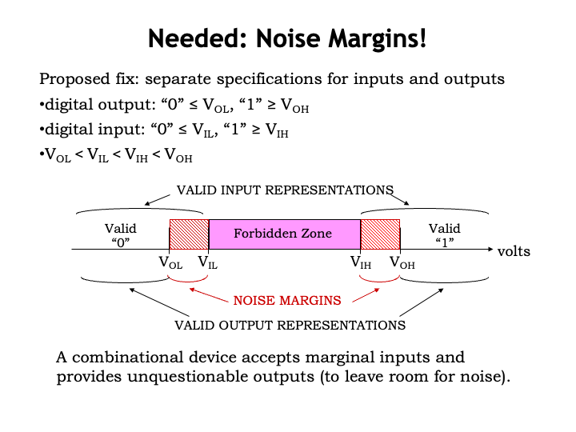

Our proposed fix to the noise problem is to provide separate
signaling specifications for digital inputs and digital outputs.  To
send a 0, digital outputs must produce a voltage less than or equal to
$V_{\textrm{OL}}$ and to send a 1, produce a voltage greater than or
equal to $V_{\textrm{OH}}$.  So far this doesn&#700;t seem very
different than our previous signaling specification...

The difference is that digital inputs must obey a different
signaling specification.  Input voltages less than or equal to
$V_{\textrm{IL}}$ must be interpreted as a digital 0 and input
voltages greater than or equal to $V_{\textrm{IH}}$ must be
interpreted as a digital 1.

The values of these four signaling thresholds are chosen to satisfy
the constraints shown here.  Note that $V_{\textrm{IL}}$ is strictly
greater than $V_{\textrm{OL}}$ and $V_{\textrm{IH}}$ is strictly less
than $V_{\textrm{OH}}$.  The gaps between the input and output voltage
thresholds are called the <i>noise margins</i>.  The noise margins
tell us how much noise can be added to a valid 0 or a valid 1 output
signal and still have the result interpreted correctly at the inputs
to which it is connected.  The smaller of the two noise margins is
called the <i>noise immunity</i> of the signaling specification.  Our
goal as digital engineers is to design our signaling specifications to
provide as much noise immunity as possible.

Combinational devices that obey this signaling specification work
to remove the noise on their inputs before it has a chance to
accumulate and eventually cause signaling errors.  The bottom line:
digital signaling doesn&#700;t suffer from the problems we saw in our
earlier analog signaling example!

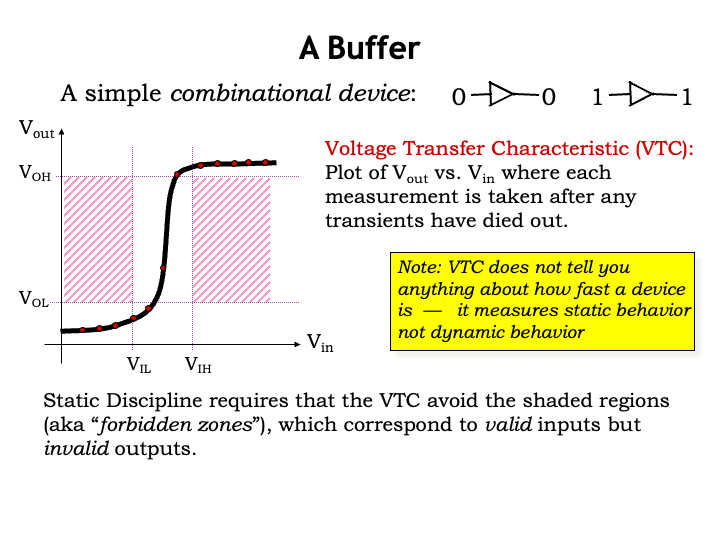

Let&#700;s make some measurements using one of the simplest
combinational devices: a buffer.  A buffer has a single input and
single output, where the output will be driven with the same digital
value as the input after some small propagation delay.  This buffer
obeys the static discipline &#8212; that&#700;s what it means to be
combinational &#8212; and uses our revised signaling specification
that includes both low and high noise margins.

The measurements will be made by setting the input voltage to a
sequence of values ranging from 0V up to the power supply voltage.
After setting the input voltage to a particular value, we&#700;ll
wait for the output voltage to become stable, <i>i.e.</i>, we&#700;ll
wait for the propagation delay of the buffer.  We&#700;ll plot the
result on a graph with the input voltage on the horizontal axis and
the measured output voltage on the vertical axis.  The resulting curve
is called the voltage transfer characteristic of the buffer.  For
convenience, we&#700;ve marked our signal thresholds on the two
axes.

Before we start plotting points, note that the static discipline
constrains what the voltage transfer characteristic must look like for
any combinational device.  If we wait for the propagation delay of the
device, the measured output voltage must be a valid digital value if
the input voltage is a valid digital value &#8212; &#8220;valid in,
valid out.&#8221; We can show this graphically as shaded forbidden
regions on our graph.  Points in these regions correspond to valid
digital input voltages but invalid digital output voltages.  So if
we&#700;re measuring a legal combinational device, none of the points
in its voltage transfer characteristic will fall within these
regions.

Okay, back to our buffer: setting the input voltage to a value less
than the low input threshold $V_{\textrm{IL}}$, produces an output
voltage less than $V_{\textrm{OL}}$, as expected &#8212; a digital 0
input yields a digital 0 output.  Trying a slightly higher but still
valid 0 input gives a similar result.  Note that these measurements
don&#700;t tell us anything about the speed of the buffer, they are
just measuring the static behavior of the device, not its dynamic
behavior.

If we proceed to make all the additional measurements, we get the
voltage transfer characteristic of the buffer, shown as the black
curve on the graph.  Notice that the curve does not pass through the
shaded regions, meeting the expectations we set out above for the
behavior of a legal combinational device.

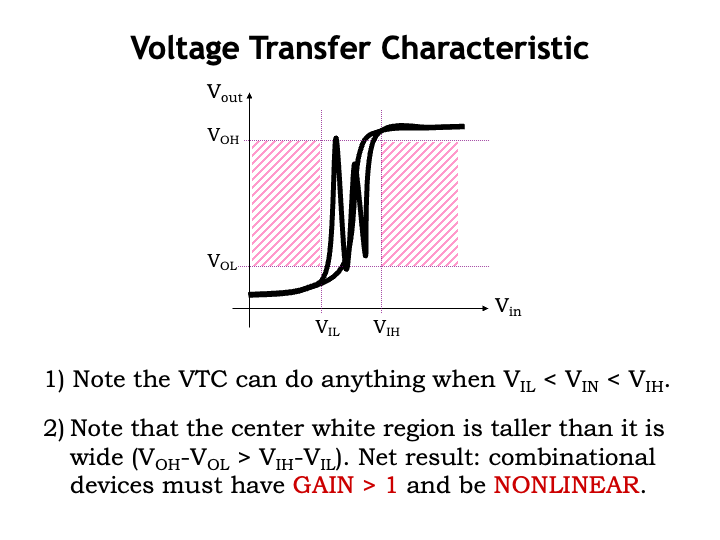

There are two interesting observations to be made about voltage
transfer characteristics.

Let&#700;s look more carefully at the white region in the center
of the graph, corresponding to input voltages in the range
$V_{\textrm{IL}}$ to $V_{\textrm{IH}}$.  First note that these input
voltages are in the forbidden zone of our signaling specification and
so a combinational device can produce any output voltage it likes and
still obey the static discipline, which only constrains the
device&#700;s behavior for *valid* inputs.

Second, note that the center white region bounded by the four
voltage thresholds is taller than it is wide.  This is true because
our signaling specification has positive noise margins, so
$V_{\textrm{OH}}$ &#8212; $V_{\textrm{OL}}$ is strictly greater than
$V_{\textrm{IH}}$ &#8212; $V_{\textrm{IL}}$.  Any curve passing through
this region &#8212; as the VTC must &#8212; has to have some portion
where the magnitude of the slope of the curve is greater than 1.  At
the point where the magnitude of the slope of the VTC is greater than
one, note that a small change in the input voltage produces a larger
change in the output voltage.  That&#700;s what it means when the
magnitude of the slope is greater than 1.  In electrical terms, we
would say the device as a gain greater than 1 or less than -1, where
we define gain as the change in output voltage for a given change in
input voltage.

If we&#700;re considering building larger circuits out of our
combinational components, any output can potentially be wired to some
other input.  This means the range on the horizontal axis ($V_{\textrm{IN}}$)
has to be the same as the range on the vertical axis
($V_{\textrm{OUT}}$), <i>i.e.</i>, the graph of VTC must be square and the VTC
curve fits inside the square.  In order to fit within the square
bounds, the VTC must change slope at some point since we know from
above there must be regions where the magnitude of the slope is
greater than 1 and it can&#700;t be greater than 1 across the whole
input range.  Devices that exhibit a change in gain across their
operating range are called nonlinear devices.

Together these observations tell us that we cannot use only linear
devices such as resistors, capacitors and inductors, to build
combinational devices.  We&#700;ll need nonlinear devices with gain &gt;
1.  Finding such devices is the subject of the next lecture.

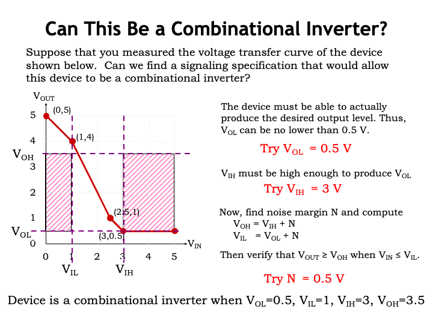

Let&#700;s look at a concrete example.  This graph shows the
voltage transfer characteristic for a particular device and
we&#700;re wondering if we can use this device as a combinational
inverter.  In other words, can we pick values for the voltage
thresholds $V_{\textrm{OL}}$, $V_{\textrm{IL}}$, $V_{\textrm{IH}}$ and
$V_{\textrm{OH}}$ so that the shown VTC meets the constraints imposed
on a combinational device?

An inverter outputs a digital 1 when its input is a digital 0 and
vice versa.  In fact this device does produce a high output voltage
when its input voltage is low, so there&#700;s a chance that this
will work out.

The lowest output voltage produced by the device is 0.5V, so if the
device is to produce a legal digital output of 0, we have to choose
$V_{\textrm{OL}}$ to be at least 0.5V.

We want the inverter to produce a valid digital 0 whenever its
input is valid digital 1.  Looking at the VTC, we see that if the
input is higher than 3V, the output will be less than or equal to
$V_{\textrm{OL}}$, so let&#700;s set $V_{\textrm{IH}}$ to 3V.  We
could set it to a higher value than 3V, but we&#700;ll make it as low
as possible to leave room for a generous high noise margin.

That takes care of two of the four signal thresholds,
$V_{\textrm{OL}}$ and $V_{\textrm{IH}}$.  The other two thresholds are
related to these two by the noise margin N as shown by these two
equations. Can we find a value for N such that $V_{OUT} \ge V_{OH}$
when $V_{IN} \le V_{IL}$?  If we chose N = 0.5V, then the formulas
tell us that $V_{\textrm{IL}}$ = 1V and $V_{\textrm{OH}}$ = 3.5V.
Plotting these thresholds on the graph and adding the forbidden
regions, we see that happily the VTC is, in fact, legal!

So we can use this device as a combinational inverter if we use the
signaling specification with $V_{\textrm{OL}}$ = 0.5V,
$V_{\textrm{IL}}$ = 1V, $V_{\textrm{IH}}$ = 3V and $V_{\textrm{OH}}$ =
3.5V.  We&#700;re good to go!

<h2>Summary</h2>

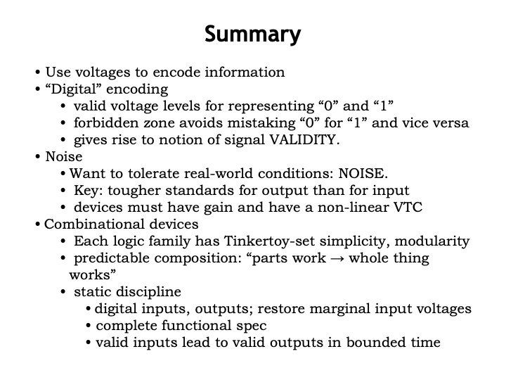

