

## The MOSFET

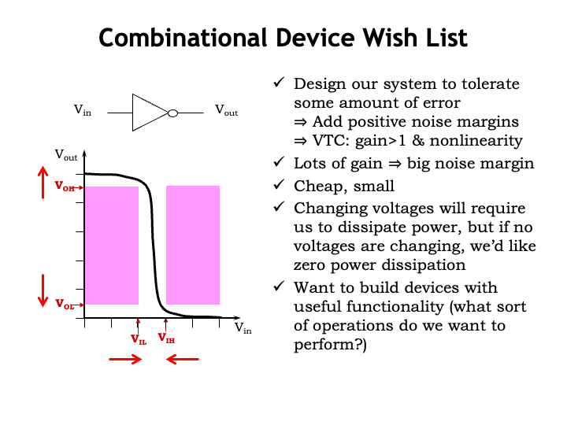

Let&#700;s review our wish list for the characteristics of a combinational
device.  In the previous lecture we worked hard to develop a
voltage-based representation for information that could tolerate some
amount error as the information flowed through a system of processing
elements.

We specified four signaling thresholds: $V_{\textrm{OL}}$ and
$V_{\textrm{OH}}$ set the upper and lower bounds on voltages used to
represent 0 and 1 respectively at the outputs of a combinational
device.  $V_{\textrm{IL}}$ and $V_{\textrm{IH}}$ served a similar role
for interpreting the voltages at the inputs of a combinational device.
We also specified that $V_{\textrm{OL}}$ be strictly less than
$V_{\textrm{IL}}$, and termed the difference between these two low
thresholds as the low noise margin, the amount of noise that could be
added to an output signal and still have the signal interpreted
correctly at any connected inputs.  For the same reasons we specified
that $V_{\textrm{IH}}$ be strictly less than $V_{\textrm{OH}}$.

We saw the implications of including noise margins when we looked at
the voltage transfer characteristic &#8212; a plot of $V_{\textrm{OUT}}$
vs. $V_{\textrm{IN}}$ &#8212; for a combinational device.  Since a
combinational device must, in the steady state, produce a valid output
voltage given a valid input voltage, we can identify forbidden regions
in the VTC, which for valid input voltages identify regions of invalid
output voltages.  The VTC for a legal combinational device could not
have any points that fall within these regions.  The center region
bounded by the four threshold voltages is narrower than it is high and
so any legal VTC has to a have region where its gain is greater than 1
and the overall VTC has to be non-linear.  The VTC shown here is that
for a combinational device that serves as an inverter.

If we&#700;re fortunate to be using a circuit technology that provides high
gain and has output voltages close the ground and the power supply
voltage, we can push $V_{\textrm{OL}}$ and $V_{\textrm{OH}}$ outward
towards the power supply rails, and push $V_{\textrm{IL}}$ and
$V_{\textrm{IH}}$ inward, with the happy consequence of increasing the
noise margins &#8212; always a good thing!

Remembering back to the beginning of the lecture on
&#8220;The Digital Abstraction&#8221;, we&#700;ll be wanting
billions of devices in our digital systems, so each device will
have to be quite inexpensive and small.

In today&#700;s mobile world, the ability to run our systems on battery
power for long periods of time means that we&#700;ll want to have our
systems dissipate as little power as possible.  Of course,
manipulating information will necessitate changing voltages within the
system and that will cost us some amount of power.  But if our system
is idle and no internal voltages are changing, we&#700;d like for our
system to have zero power dissipation.

Finally, we&#700;ll want to be able to implement systems with useful
functionality and so need to develop a catalog of the logic
computations we want to perform.

Quite remarkably, there is a circuit technology that will make our
wishes come true!  That technology is the subject of this lecture.

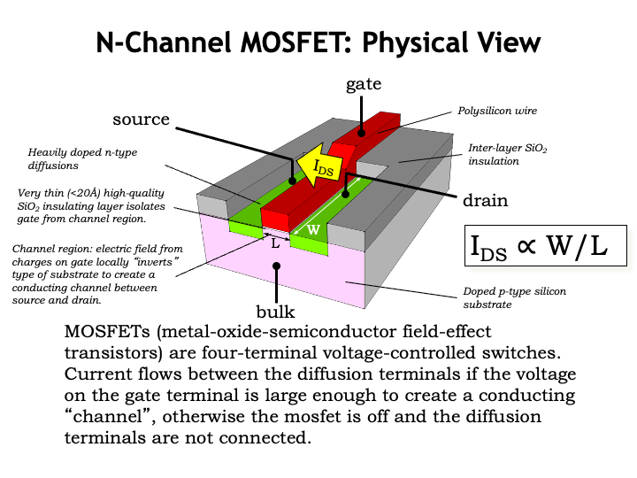

The star of our show is the metal-oxide-semiconductor field-effect
transistor, or MOSFET for short.

Here&#700;s a 3D drawing showing a cross-section of a MOSFET, which is
constructed from a complicated sandwich of electrical materials as
part of an integrated circuit, so called because the individual
devices in an integrated circuit are manufactured en-masse during a
series of manufacturing steps.

In modern technologies the dimensions of the block shown here are a
few 10&#700;s of nanometers on a side &#8212; that&#700;s 1/1000 of
the thickness of a thin human hair.  This dimension is so small that
MOSFETs can&#700;t be viewed using an ordinary optical microscope,
whose resolution is limited by the wavelength of visible light, which
is 400 to 750nm.  For many years, engineers have been able to shrink
the device dimensions by a factor of 2 every 24 months or so, an
observation known as Moore&#700;s Law after Gordon Moore, one of
the founders of Intel, who first remarked on this trend in 1965.  Each
50% shrink in dimensions enables integrated circuit (IC)
manufacturers to build four times as many devices in the same area as
before, and, as we&#700;ll see, the devices themselves get faster
too!  An integrated circuit in 1975 might have had 2500 devices; today
we&#700;re able to build ICs with two to three billion devices.

Here&#700;s a quick tour of what we see in the diagram.

The substrate upon which the IC is built is a thin wafer of silicon
crystal which has had impurities added to make it conductive.
In this case the impurity was an acceptor atom like Boron, and we
characterize the doped silicon as a p-type semiconductor.
The IC will include an electrical contact to the p-type substrate,
called the <i>bulk</i> terminal, so we can control its voltage.

When want to provide electrical insulation between conducting
materials, we&#700;ll use a layer of silicon dioxide (SiO2).
Normally the thickness of the insulator isn&#700;t terribly
important, except for when it&#700;s used to isolate the gate of the
transistor (shown here in red) from the substrate.  The insulating
layer in that region is very thin so that the electrical field from
charges on the gate conductor can easily affect the substrate.

The gate terminal of the transistor is a conductor, in this case,
polycrystalline silicon.  The gate, the thin oxide insulating layer,
and the p-type substrate form a capacitor, where changing the voltage
on the gate will cause electrical changes in the p-type substrate
directly under the gate.  In early manufacturing processes the gate
terminal was made of metal, and the term <i>metal-oxide-semiconductor</i>
(MOS) is referring to this particular structure.

After the gate terminal is in place, donor atoms such as Phosphorous
are implanted into the p-type substrate in two rectangular regions on
either side of the gate.  This changes those regions to an n-type
semiconductor, which become the final two terminals of the MOSFET,
called the source and the drain.  Note that source and drain are
usually physically identical and are distinguished by the role they
play during the operation of the device, our next topic.

As we&#700;ll see in the next slide, the MOSFET functions as a
voltage-controlled switch connecting the source and drain terminals of
the device.  When the switch is conducting, current will flow from the
drain to the source through the conducting channel formed as the
second plate of the gate capacitor.  The MOSFET has two critical
dimensions: its length L, which measures the distance the current must
cross as it flows from drain to source, and its width W, which
determines how much channel is available to conduct current.  The the
current, termed $I_{\textrm{DS}}$, flowing across the switch is
proportional to the ratio of the channel&#700;s width to its length.

Typically, IC designers make the length as short as possible &#8212;
when a news article refers to a 14nm process, the 14nm refers to the
smallest allowable value for the channel length.  And designers choose
the channel width to set the desired amount of current flow.  If
$I_{\textrm{DS}}$ is large, voltage transitions on the source and
drain nodes will be quick, at the cost of a physically larger device.

To summarize: the MOSFET has four electrical terminals: bulk, gate,
source, and drain.  Two of the device dimensions are under the control
of the designer: the channel length, usually chosen to be as small as
possible, and the channel width chosen to set the current flow to the
desired value.  It&#700;s a solid-state switch &#8212; there are no
moving parts and the switch operation is controlled by electrical
fields determined by the relative voltages of the four terminals.

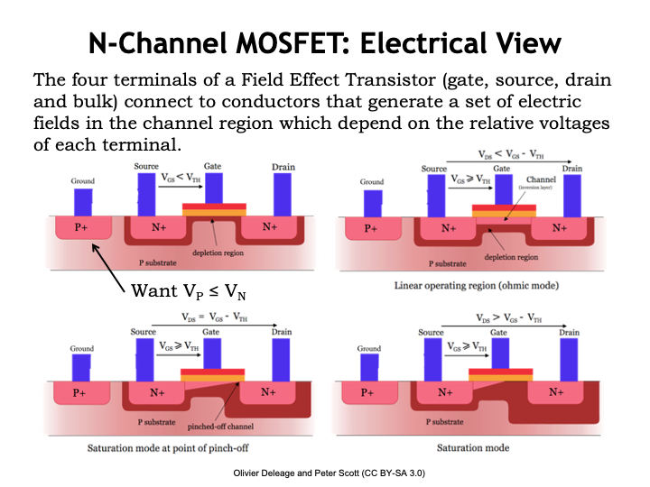

Now let&#700;s look at the electrical view of the MOSFET.  Its
operation is determined by the voltages of its four terminals.

First we&#700;ll label the two diffusion terminals on either side of
the gate terminal: our convention is to call the diffusion terminal
with the highest voltage potential the <i>drain</i> and the other
lower-potential terminal the <i>source</i>.  With this labeling if any
current is flowing through the MOSFET switch, it will flow from drain
to source.

When the MOSFET is manufactured, it&#700;s designed to have a particular
threshold voltage, $V_{\textrm{TH}}$, which tells us when the switch goes from
non-conducting/OFF/OPEN to conducting/ON/CLOSED.
For the n-channel MOSFET shown here, we&#700;d expect
$V_{\textrm{TH}}$ to be around 0.5V in a modern process.

The P+ terminal on the left of the diagram is the connection to the
p-type substrate.  For the MOSFET to operate correctly, the substrate
must always have a voltage less than or equal to the voltage of the
source and drain.  We&#700;ll have specific rules about how to
connect up this terminal.

The MOSFET is controlled by the  difference between the voltage of the
gate, $V_G$,  and the voltage  of the source, $V_S$,  which, following
the  usual  terminology  for  voltages we  call  $V_{\textrm{GS}}$,  a
shortcut for saying $V_G - V_S$.

The first picture shows the configuration of the MOSFET when
$V_{\textrm{GS}}$ is less than the MOSFET&#700;s threshold voltage.
In this configuration, the switch is open or non-conducting, <i>i.e.</i>,
there is no electrical connection between the source and drain.

When n-type and p-type materials come in physical contact, a depletion
region (shown in dark red in the diagram) forms at their
junction. This is a region of substrate where the current-carrying
electrical particles have migrated away from the junction.  The
depletion zone serves as an insulating layer between the substrate and
source/drain.  The width of this insulating layer grows as the voltage
of source/drain gets larger relative to the voltage of the substrate.
And, as you can see in the diagram, that insulating layer fills the
region of the substrate between the source and drain terminals,
keeping them electrically isolated.

Now, as $V_{\textrm{GS}}$ gets larger, positive charges accumulate on
the gate conductor and generate an electrical field which attracts the
electrons in the atoms in the substrate.  For a while that attractive
force gets larger without much happening, but when it reaches the
MOSFET&#700;s threshold voltage, the field is strong enough to pull
the substrate electrons from the valence band into the conduction
band, and the newly mobile electrons will move towards the gate
conductor, collecting just under the thin oxide that serves the gate
capacitor&#700;s insulator.

When enough electrons accumulate, the type of the semiconductor
changes from p-type to n-type and there&#700;s now a channel of
n-type material forming a conducting path between the source and drain
terminals.  This layer of n-type material is called an inversion
layer, since its type has been inverted from the original p-type
material.  The MOSFET switch is now closed or conducting.  Current
will flow from drain to source in proportion to $V_{\textrm{DS}}$, the
difference in voltage between the drain and source terminals.

At this point the conducting inversion layer is acting like a resistor
governed by Ohm&#700;s Law so $I_{DS} = V_{DS}/R$ where R is the
effective resistance of the channel.  This process is reversible: if
$V_{\textrm{GS}}$ falls below the threshold voltage, the substrate
electrons drop back into the valence band, the inversion layer
disappears, and the switch no longer conducts.

The story gets a bit more complicated when $V_{\textrm{DS}}$ is larger
than $V_{\textrm{GS}}$, as shown in the bottom figures.  A large
$V_{\textrm{DS}}$ changes the geometry of the electrical fields in the
channel and the inversion layer pinches off at the end of the channel
near the drain.  But with a large $V_{\textrm{DS}}$, the electrons
will tunnel across the pinch-off point to reach the conducting
inversion layer still present next to the source terminal.

How does pinch-off affect $I_{\textrm{DS}}$, the current flowing from
drain to source?  To see, let&#700;s look at some plots of
$I_{\textrm{DS}}$ on the next slide.

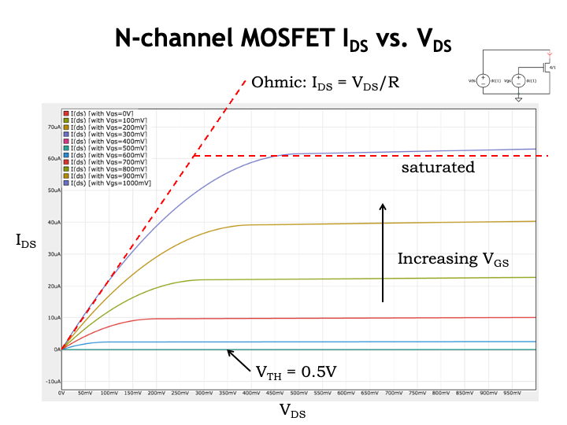

Okay, this plot has a lot of information, so let&#700;s see what we
can learn.  Each curve is a plot of $I_{\textrm{DS}}$ as a function of
$V_{\textrm{DS}}$, for a particular value of $V_{\textrm{GS}}$.
First, notice that $I_{\textrm{DS}}$ is 0 when $V_{\textrm{GS}}$ is
less than or equal to the threshold voltage.  The first six curves are
all plotted on top of each other along the x-axis.

Once $V_{\textrm{GS}}$ exceeds the threshold voltage $I_{\textrm{DS}}$
becomes non-zero, and increases as $V_{\textrm{GS}}$ increases.  This
makes sense: the larger $V_{\textrm{GS}}$ becomes, the more substrate
electrons are attracted to the bottom plate of the gate capacitor and
the thicker the inversion layer becomes, allowing it to conduct more
current.  When $V_{\textrm{DS}}$ is smaller than $V_{\textrm{GS}}$, we
said the MOSFET behaves like a resistor obeying Ohm&#700;s Law.  This
is shown in the linear portions of the $I_{\textrm{DS}}$ curves at the
left side of the plots.  The slope of the linear part of the curve is
essentially inversely proportional to the resistance of the conducting
MOSFET channel.  As the channel gets thicker with increasing
$V_{\textrm{GS}}$, more current flows and the slope of the line gets
steeper, indicating a smaller channel resistance.

But when $V_{\textrm{DS}}$ gets larger than $V_{\textrm{GS}}$, the
channel pinches off at the drain end and, as we see in on the right
side of the $I_{\textrm{DS}}$ plots, the current flow no longer
increases with increasing $V_{\textrm{DS}}$.  Instead
$I_{\textrm{DS}}$ is approximately constant and the curve becomes a
horizontal line.  We say that the MOSFET has reached <i>saturation</i>
where $I_{\textrm{DS}}$ has reached some maximum value.

Notice that the saturated part of the $I_{\textrm{DS}}$ curve
isn&#700;t quite flat and $I_{\textrm{DS}}$ continues to increase
slightly as $V_{\textrm{DS}}$ gets larger.  This effect is called
channel-length modulation and reflects the fact that the increase in
channel pinch-off isn&#700;t exactly matched by the increase current
induced by the larger $V_{\textrm{DS}}$.

Whew!  MOSFET operation is complicated!  Fortunately, as designers,
we&#700;ll be able to use the much simpler mental model of a switch
if we obey some simple rules when designing our MOSFET circuits.

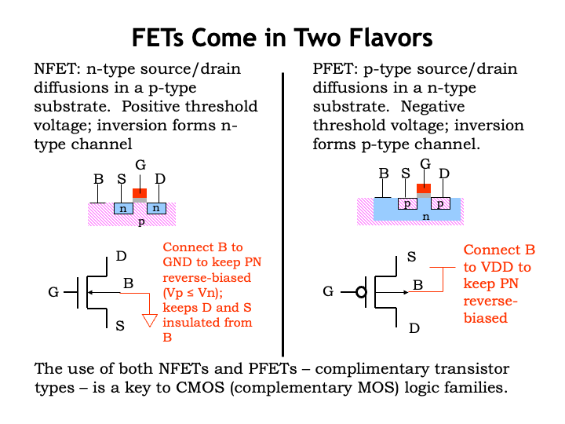

Up to now, we&#700;ve been talking about MOSFETs built as shown in
the diagram on the left: with n-type source/drain diffusions in a
p-type substrate.  These are called n-channel MOSFETs since the
inversion layer, when formed, is an n-type semiconductor.  The
schematic symbol for an n-channel MOSFET is shown here, with the four
terminals arranged as shown.  In our MOSFET circuits, we&#700;ll
connect the bulk terminal of the MOSFET to ground, which will ensure
that the voltage of the p-type substrate is always less than or equal
to the voltage of the source and drain diffusions.

We can also build a MOSFET by flipping all the material types,
creating p-type source/drain diffusions in a n-type substrate.  This
is called a p-channel MOSFET, which also behaves as voltage-controlled
switch, except that all the voltage potentials are reversed!  As
we&#700;ll see, control voltages that cause an n-channel switch to be
ON will cause a p-channel switch to be OFF and vice-versa.

Using both types of MOSFETs will give us switches that behave in a
complementary fashion.  Hence the name <i>complementary MOS</i>, CMOS for
short, for circuits that use both types of MOSFETs.  Now that we
have our two types of voltage-controlled switches, our next task is to
figure out how to use them to build circuits useful for manipulating
information encoded as voltages.

## CMOS Logic Gates

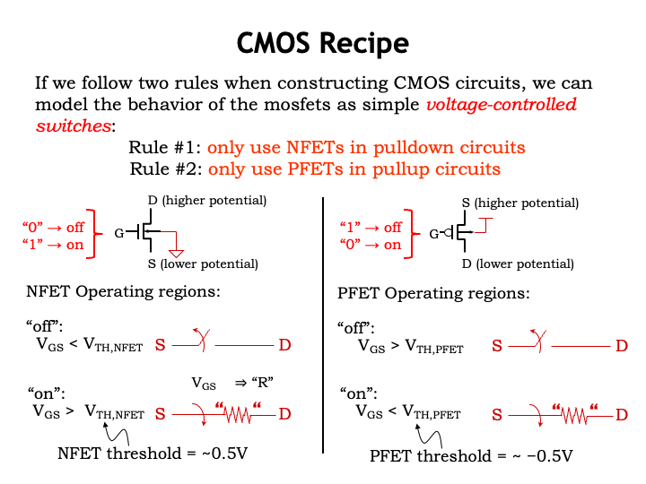

Now that we have some sense about how MOSFETs function, let&#700;s use
them to build circuits to process our digitally encoded information.
We have two simple rules we&#700;ll use when building the circuits, which,
if they&#700;re followed, will allow us to abstract the behavior of the
MOSFET as a simple voltage-controlled switch.

The first rule is that we&#700;ll only use n-channel MOSFETs, which
we&#700;ll call NFETs for short, when building pulldown circuits
that connect a signaling node to the GND rail of the power supply.
When the pulldown circuit is conducting, the signaling node will be at
0V and qualify as a digital 0.

If we obey this rule, NFETs will act switches controlled by
$V_{\textrm{GS}}$, the difference between the voltage of the gate
terminal and the voltage of the source terminal.  When
$V_{\textrm{GS}}$ is lower than the MOSFET&#700;s threshold voltage,
the switch is OPEN or not conducting and there is no connection
between the MOSFET&#700;s source and drain terminals.  If
$V_{\textrm{GS}}$ is greater than the threshold voltage, the switch is
ON or conducting and there is a connection between the source and
drain terminals.  That path has a resistance determined by the
magnitude of $V_{\textrm{GS}}$.  The larger $V_{\textrm{GS}}$, the
lower the effective resistance of the switch and the more current that
will flow from drain to source.  When designing pulldown circuits of
NFET switches, we can use the following simple mental model for each
NFET switch: if the gate voltage is a digital 0, the switch will be
off; if the gate voltage is a digital 1, the switch will be on.

The situation with PFET switches is analogous, except that the
potentials are reversed.  Our rule is that PFETs can only be used in
pullup circuits, used to connect a signaling node to the power supply
voltage, which we&#700;ll call $V_{\textrm{DD}}$.  When the pullup
circuit is conducting, the signaling node will be at $V_{\textrm{DD}}$
volts and qualify as a digital 1.  PFETs have a negative
threshold voltage and $V_{\textrm{GS}}$ has to be less than the
threshold voltage in order for the PFET switch to be conducting.  All
these negatives can be a bit confusing, but, happily there&#700;s a
simple mental model we can use for each PFET switch in the pullup
circuit: if the gate voltage is a digital 0, the switch will be on; if
the gate voltage is a digital 1, the switch will be off &#8212;
basically the opposite behavior of the NFET switch.

You may be wondering why we can&#700;t use NFETs in pullup circuits
or PFETs in pulldown circuits.  You&#700;ll get to explore the
answer to this question in one of the lab assignments.  Meanwhile, the
short answer is that the signaling node will experience degraded
signaling levels and we&#700;ll loose the noise margins we&#700;ve
worked so hard to create!

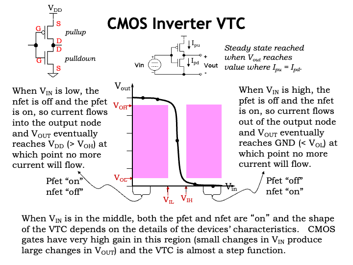

Now consider the CMOS implementation of a combinational inverter.  If
the inverter&#700;s input is a digital 0, its output is a digital 1,
and vice versa.  The inverter circuit consists of a single NFET switch
for the pulldown circuit, connecting the output node to GND and a
single PFET switch for the pullup circuit, connecting the output to
$V_{\textrm{DD}}$.  The gate terminals of both switches are connected
to the inverter&#700;s input node.  The inverter&#700;s voltage
transfer characteristic is shown in the figure.

When $V_{\textrm{IN}}$ is a digital 0 input, we see that
$V_{\textrm{OUT}}$ is greater than or equal to $V_{\textrm{OH}}$,
representing a digital 1 output.  Let&#700;s look at the state of the
pullup and pulldown switches when the input is a digital 0.  Recalling
the simple mental model for the NFET and PFET switches, a 0-input
means the NFET switch is off, so there&#700;s no connection between
the output node and ground, and the PFET switch is on, making a
connection between the output node and $V_{\textrm{DD}}$.  Current
will flow through the pullup switch, charging the output node until
its voltage reaches $V_{\textrm{DD}}$.  Once both the source and drain
terminals are at $V_{\textrm{DD}}$, there&#700;s no voltage
difference across the switch and hence no more current will flow
through the switch.

Similarly, when $V_{\textrm{IN}}$ is a digital 1, the NFET switch is
on and PFET switch is off, so the output is connected to ground and
eventually reaches a voltage of 0V.  Again, current flow through
pulldown switch will cease once the output node reaches 0V.

When the input voltage is in the middle of its range, it&#700;s
possible, depending on the particular power supply voltage used and
the threshold voltage of the MOSFETs, that both the pullup and
pulldown circuits will be conducting for a short period of time.
That&#700;s okay.  In fact, with both MOSFET switches on, small
changes in the input voltage will produce large changes in the output
voltage, leading to the very high gain exhibited by CMOS devices.
This in turn will mean we can pick signaling thresholds that
incorporate generous noise margins, allowing CMOS devices to work
reliably in many different operating environments.

This is our first CMOS combinational logic gate.  In the next slide,
we&#700;ll explore how to build other, more interesting logic
functions.

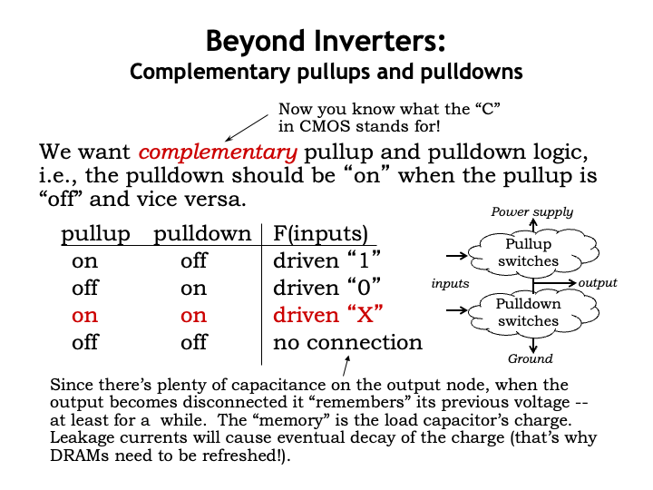

Now we get to the fun part!  To build other logic gates, we&#700;ll
design complementary pullup and pulldown circuits, hooked up as shown
in the diagram on the right, to control the voltage of the output
node.  <i>Complementary</i> refers to property that when one of the
circuits is conducting, the other is not.  When the pullup circuit is
conducting and the pulldown circuit is not, the output node has a
connection to $V_{\textrm{DD}}$ and its output voltage will quickly
rise to become a valid digital 1 output.  Similarly, when the pulldown
circuit is conducting and the pullup is not, the output node has a
connection to GND and its output voltage will quickly fall to become a
valid digital 0 output.

If the circuits are incorrectly designed so that they are not
complementary and could both be conducting for an extended period of
time, there&#700;s a path between $V_{\textrm{DD}}$ and GND and large
amounts of short circuit current will flow, a very bad idea.  Since
our simple switch model won&#700;t let us determine the output
voltage in this case, we&#700;ll call this output value X or
unknown.

Another possibility with a non-complementary pullup and pulldown is
that neither is conducting and the output node has no connection to
either power supply voltage.  At this point, the output node is
electrically floating and whatever charge is stored by the nodal
capacitance will stay there, at least for a while.  This is a form of
memory and we&#700;ll come back to this in a couple of lectures.

For now, we&#700;ll concentrate on the behavior of devices with
complementary pullups and pulldowns.

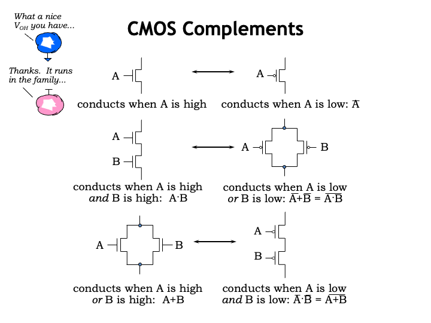

Since the pullup and pulldown circuits are complementary, we&#700;ll
see there&#700;s a nice symmetry in their design.  We&#700;ve
already seen the simplest complementary circuit: a single NFET
pulldown and a single PFET pullup.  If the same signal controls both
switches, it&#700;s easy to see that when one switch is on, the other
switch is off.

Now consider a pulldown circuit consisting of two NFET switches in
series.  There&#700;s a connection through both switches when A is 1
and B is 1.  For any other combination of A and B values, one or the
other of the switches (or both!) will be off.  The complementary
circuit to NFET switches in series is PFET switches in parallel.
There&#700;s a connection between the top and bottom circuit nodes
when either of the PFET switches is on, <i>i.e.</i>, when A is 0 or B
is 0.  As a thought experiment consider all possible pairs of values
for A and B: 00, 01, 10, and 11.  When one or both of the inputs is 0,
the series NFET circuit is not conducting and parallel PFET circuit
is.  And when both inputs are 1, the series NFET circuit is conducting
but the parallel PFET circuit is not.

Finally consider the case where we have parallel NFETs and series
PFETs.  Conduct the same thought experiment as above to convince
yourself that when one of the circuits is conducting the other
isn&#700;t.

Let&#700;s put these observations to work when building our next CMOS
combinational device.

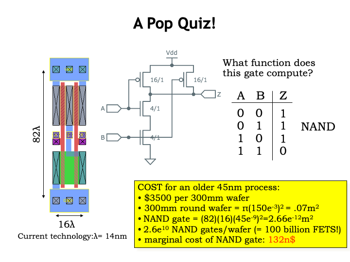

In this device, we&#700;re using series NFETs in the pulldown and
parallel PFETs in the pullup, circuits that we convinced ourselves
were complementary in the previous slide.  We can build a tabular
representation, called a <i>truth table</i>, that describes the value of Z
for all possible combinations of the input values for A and B.

When A and B are 0, the PFETs are on and the NFETs are off, so Z is
connected to $V_{\textrm{DD}}$ and the output of the device is a
digital 1.  In fact, if either A or B is 0 that continues to be the
case, and the value of Z is still 1.  Only when both A and B are 1
will both NFETs be on and the value of Z become 0.  This particular
device is called a NAND gate, short for NOT-AND, a function that is
the inverse of the AND function.

Returning to a physical view for a moment, the figure on the left is a
bird&#700;s eye view, looking down on the surface of the integrated
circuit, showing how the MOSFETs are laid out in two dimensions.  The
blue material represents metal wires with large top and bottom metal
runs connecting to $V_{\textrm{DD}}$ and GND.  The red material forms
the polysilicon gate nodes, the green material the n-type source/drain
diffusions for the NFETs and the tan material the p-type
source/drain diffusions for the PFETs.

Can you see that the NFETs are connected in series and the PFETs
in parallel?

Just to give you a sense of the costs of making a single NAND gate,
the yellow box is a back-of-the-envelope calculation showing that we
can manufacture approximately 26 billion NAND gates on a single 300mm
(that&#700;s 12 inches for us non-metric folks) silicon wafer.  For
the older IC manufacturing process shown here, it costs about $3500
to buy the materials and perform the manufacturing steps needed to
form the circuitry for all those NAND gates.  So the final cost is a
bit more than 100 nano-dollars per NAND gate.  I think this qualifies
as both cheap and small!

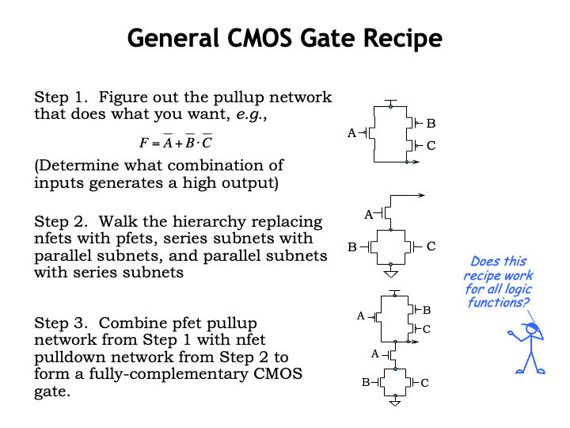

Using more complicated series/parallel networks of switches, we can
build devices that implement more complex logic functions.

To design a more complex logic gate, first figure the series and
parallel connections of PFET switches that will connect the
gate&#700;s output to $V_{\textrm{DD}}$ for the right combination of
inputs.  In this example, the output F will be 1 when A is 0 OR when
both B is 0 AND C is 0.  The OR translates into a parallel
connection, and the AND translates into a series connection, giving
the pullup circuit you see to the right.

To build the complementary pulldown circuit, systematically walk the
hierarchy of pullup connections, replacing PFETs with NFETs, series
subcircuits with parallel subcircuits, and parallel subcircuits with
series subcircuits.  In the example shown, the pullup circuit had a
switch controlled by A in parallel with a series subcircuit consisting
of switches controlled by B and C.  The complementary pulldown circuit
uses NFETs, with the switch controlled by A in series with a parallel
subcircuit consisting of switches controlled by B and C.

Finally combine the pullup and pulldown circuits to form a
fully-complementary CMOS implementation.  This probably went by a bit
quickly, but with practice you&#700;ll get comfortable with the CMOS
design process.

Mr. Blue is asking a good question: will this recipe work for any and
all logic functions?  The answer is no, let&#700;s see why.

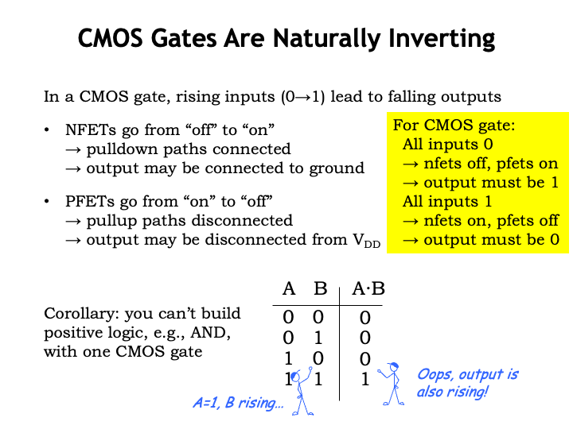

Using CMOS, a single gate (a circuit with one pullup network and one
pulldown network) can only implement the so-called inverting functions
where rising inputs lead to falling outputs and vice versa.  To see
why, consider what happens with one of the gate&#700;s inputs goes
from 0 to 1.

Any NFET switches controlled by the rising input will go from OFF to
ON.  This may enable one or more paths between the gate&#700;s output
and GND.  And PFET switches controlled by the rising input will go
from ON to OFF.  This may disable one or more paths between the
gate&#700;s output and $V_{\textrm{DD}}$.  So if the gate&#700;s
output changes as the result of the rising input, it must be because
some pulldown path was enabled and some pullup path was disabled.  In
other words, any change in the output voltage due to a rising input
must be a falling transition from 1 to 0.

Similar reasoning tells us that falling inputs must lead to rising
outputs.  In fact, for any non-constant CMOS gate, we know that its
output must be 1 when all inputs are 0 (since all the NFETs are off
and all the PFETs are on).  And vice-versa: if all the inputs are 1,
the gate&#700;s output must be 0.  This means that so-called positive
logic can&#700;t be implemented with a single CMOS gate.

Look at this truth table for the AND function.  It&#700;s value when
both inputs are 0 or both inputs are 1 is inconsistent with our
deductions about the output of a CMOS gate for these combinations of
inputs.  Furthermore, we can see that when A is 1 and B rises from 0
to 1, the output rises instead of falls.  Moral of the story: when
you&#700;re a CMOS designer, you&#700;ll get very good at
implementing functionality with inverting logic!

## CMOS Timing

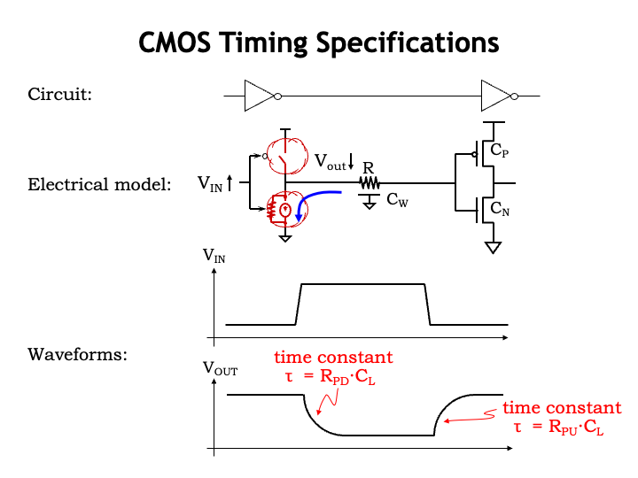

Okay, now that we understand how to build combinational logic gates
using CMOS, let&#700;s turn our attention to the timing
specifications for the gates.

Here&#700;s a simple circuit consisting of two CMOS inverters
connected in series, which we&#700;ll use to understand how to
characterize the timing of the inverter on the left.  It will be
helpful to build an electrical model of what happens when we change
$V_{\textrm{IN}}$, the voltage on the input to the left inverter.  If
$V_{\textrm{IN}}$ makes a transition from a digital 0 to a digital 1,
the PFET switch in the pullup turns off and the NFET switch in
pulldown turns on, connecting the output node of the left inverter to
GND.

The electrical model for this node includes the distributed resistance
and capacitance of the physical wire connecting the output of the left
inverter to the input of the right inverter.  And there is also
capacitance associated with the gate terminals of the MOSFETs in the
right inverter.  When the output node is connected to GND, the charge
on this capacitance will flow towards the GND connection through the
resistance of the wire and the resistance of the conducting channel of
the NFET pulldown switch.  Eventually the voltage on the wire will
reach the potential of the GND connection, 0V.  The process is much
the same for falling transitions on $V_{\textrm{IN}}$, which cause the
output node to charge up to $V_{\textrm{DD}}$.

Now let&#700;s look at the voltage waveforms as a function of time.

The top plot shows both a rising and, later, a falling transition for
$V_{\textrm{IN}}$.  We see that the output waveform has the
characteristic exponential shape for the voltage of a capacitor being
discharged or charged though a resistor.  The exponential is
characterized by its associated R-C time constant, where, in this
case, the R is the net resistance of the wire and MOSFET channel, and
the C is the net capacitance of the wire and MOSFET gate terminals.
Since neither the input nor output transition is instantaneous, we
have some choices to make about how to measure the inverter&#700;s
propagation delay.  Happily, we have just the guidance we need from
our signaling thresholds!

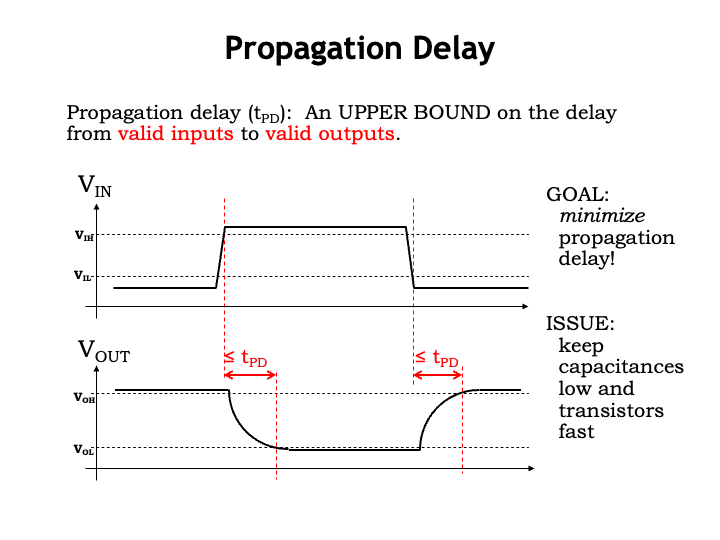

The propagation delay of a combinational logic gate is defined to be
an upper bound on the delay from valid inputs to valid outputs.  Valid
input voltages are defined by the $V_{\textrm{IL}}$ and
$V_{\textrm{IH}}$ signaling thresholds, and valid output voltages are
defined by the $V_{\textrm{OL}}$ and $V_{\textrm{OH}}$ signaling
thresholds.  We&#700;ve shown these thresholds on the waveform plots.

To measure the delay associated with the rising transition on
$V_{\textrm{IN}}$, first identify the time when the input becomes a
valid digital 1, <i>i.e.</i>, the time at which $V_{\textrm{IN}}$
crosses the $V_{\textrm{IH}}$ threshold.
Next identify the time when the output becomes a valid digital 0,
<i>i.e.</i>, the time at which $V_{\textrm{OUT}}$ crosses the
$V_{\textrm{OL}}$ threshold.  The interval between these two time
points is the delay for this particular set of input and output
transitions.

We can go through the same process to measure the delay associated
with a falling input transition.  First, identify the time at which
$V_{\textrm{IN}}$ cross the $V_{\textrm{IL}}$ threshold.  Then find
the time at which $V_{\textrm{OUT}}$ crosses the $V_{\textrm{OH}}$
threshold.  The resulting interval is the delay we wanted to measure.

Since the propagation delay, $t_{\textrm{PD}}$, is an upper bound on
the delay associated with <i>any</i> input transition, we&#700;ll choose a
value for $t_{\textrm{PD}}$ that&#700;s greater than or equal to the
measurements we just made.  When a manufacturer selects the
$t_{\textrm{PD}}$ specification for a gate, it must take into account
manufacturing variations, the effects of different environmental
conditions such as temperature and power-supply voltage, and so on.
It should choose a $t_{\textrm{PD}}$ that will be an upper bound on
any delay measurements their customers might make on actual devices.

From the designer&#700;s point of view, we can rely on this upper
bound for each component of a larger digital system and use it to
calculate the system&#700;s $t_{\textrm{PD}}$ without having to
repeat all the manufacturer&#700;s measurements.  If our goal is to
minimize the propagation delay of our system, then we&#700;ll want to
keep the capacitances and resistances as small as possible.
There&#700;s an interesting tension here: to make the effective
resistance of a MOSFET switch smaller, we would increase its width.
But that would add additional capacitance to the switch&#700;s gate
terminal, slowing down transitions on the input node that connects to
the gate!  It&#700;s a fun optimization problem to figure out
transistor sizing that minimizes the overall propagation delay.

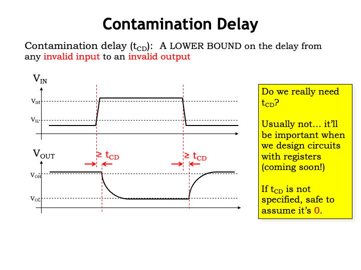

Although not strictly required by the static discipline, it will be
useful to define another timing specification, called the
<i>contamination delay</i>.  It measures how long a gate&#700;s
previous output value remains valid after the gate&#700;s inputs
start to change and become invalid.  Technically, the contamination
delay will be a lower bound on the delay from an invalid input to an
invalid output.  We&#700;ll make the delay measurements much as we
did for the propagation delay.

On a rising input transition, the delay starts when the input is no
longer a valid digital 0, <i>i.e.</i>, when $V_{\textrm{IN}}$ crosses
the $V_{\textrm{IL}}$ threshold.  And the delay ends when the output
becomes invalid, <i>i.e.</i>, when $V_{\textrm{OUT}}$ crosses the
$V_{\textrm{OH}}$ threshold.  We can make a similar delay measurement
for the falling input transition.  Since the contamination delay,
$t_{\textrm{CD}}$, is a lower bound on the delay associated with <i>any</i>
input transition, we&#700;ll choose a value for $t_{\textrm{CD}}$
that&#700;s less than or equal to the measurements we just made.

Do we really need the contamination delay specification?  Usually not.
And if not&#700;s specified, designers should assume that the
$t_{\textrm{CD}}$ for a combinational device is 0.  In other words a
conservative assumption is that the outputs go invalid as soon as the
inputs go invalid.

By the way, manufacturers often use the term minimum propagation
delay to refer to a device&#700;s contamination delay.
That terminology is a bit confusing, but now you know what it is
they&#700;re trying to tell you.

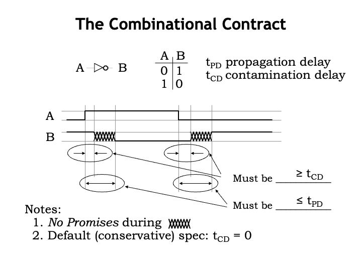

So here&#700;s a quick summary of the timing specifications for
combinational logic.
These specifications tell us how the timing of changes in the output
waveform (labeled B in this example) are related to the timing of
changes in the input waveform (labeled A).

A combinational device may retain its previous output value for some
interval of time after an input transition.  The contamination delay
of the device is a guarantee on the minimum size of that
interval, <i>i.e.</i>, $t_{\textrm{CD}}$ is a lower bound on how long
the old output value stays valid.  As stated in Note 2, a conservative
assumption is that the contamination delay of a device is 0, meaning
the device&#700;s output may change immediately after an input
transition.  So $t_{\textrm{CD}}$ gives us information on when B will
start to change.

Similarly, it would be good to know when B is guaranteed to be done
changing after an input transition. In other words, how long do we
have to wait for a change in the inputs to reflected in an updated
value on the outputs?  This is what $t_{\textrm{PD}}$ tells us since
it is a upper bound on the time it takes for B to become valid and
stable after an input transition.

As Note 1 points out, in general there are no guarantees on the
behavior of the output in the interval after $t_{\textrm{CD}}$ and
before $t_{\textrm{PD}}$, as measured from the input transition.  It
would legal for the B output to change several times in that interval,
or even have a non-digital voltage for any part of the interval.  As
we&#700;ll see in the last part of this lecture, we&#700;ll be able
to offer more insights into B&#700;s behavior in this interval for a
subclass of combinational devices.  But in general, a designer should
make no assumptions about B&#700;s value in the interval between
$t_{\textrm{CD}}$ and $t_{\textrm{PD}}$.

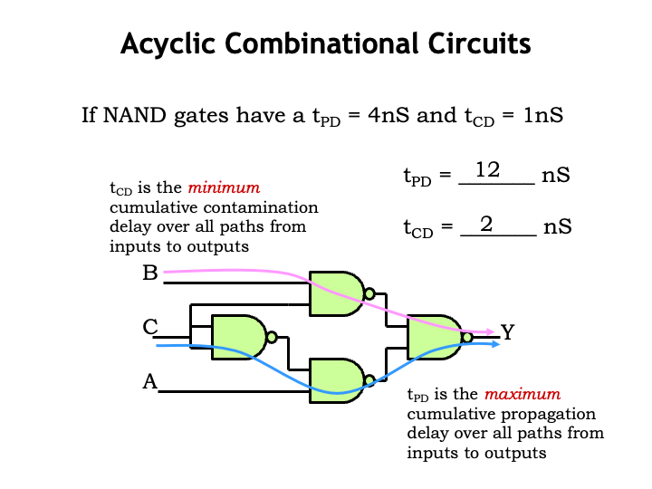

How do we calculate the propagation and contamination delays of a
larger combinational circuit from the timing specifications of its
components?

Our example is a circuit of four NAND gates where each NAND has a
$t_{\textrm{PD}}$ of 4 ns and $t_{\textrm{CD}}$ of 1 ns.  To find the
propagation delay for the larger circuit, we need to find the maximum
delay from an input transition on nodes A, B, or C to a valid and
stable value on the output Y.  To do this, consider each possible path
from one of the inputs to Y and compute the path delay by summing the
$t_{\textrm{PD}}$s of the components along the path.  Choose the
largest such path delay as the $t_{\textrm{PD}}$ of the overall
circuit.  In our example, the largest delay is a path that includes
three NAND gates, with a cumulative propagation delay of 12 ns.  In
other words, the output Y is guaranteed be stable and valid within 12
ns of a transition on A, B, or C.

To find the contamination delay for the larger circuit, we again
investigate all paths from inputs to outputs, but this time
we&#700;re looking for the shortest path from an invalid input to an
invalid output.  So we sum the $t_{\textrm{CD}}$s of the components
along each path and choose the smallest such path delay as the
$t_{\textrm{CD}}$ of the overall circuit.  In our example, the
smallest delay is a path that includes two NAND gates with a
cumulative contamination delay of 2 ns.  In other words, the output Y
will retain its previous value for at least 2 ns after one of the
inputs goes invalid.

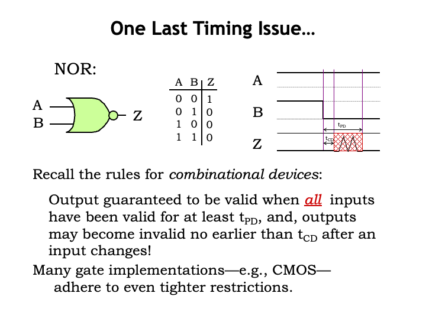

It turns out we can say a bit more about the timing of output
transitions for CMOS logic gates.  Let&#700;s start by considering
the behavior of a non-CMOS combinational device that implements the
NOR function.  Looking at the waveform diagram, we see that initially
the A and B inputs are both 0, and the output Z is 1, just as
specified by the truth table.  Now B makes a 0-to-1 transition and the
Z output will eventually reflect that change by making a 1-to-0
transition.  As we learned in the previous video, the timing of the Z
transition is determined by the contamination and propagation delays
of the NOR gate.  Note that we can&#700;t say anything about the
value of the Z output in the interval of $t_{\textrm{CD}}$ to
$t_{\textrm{PD}}$ after the input transition, which we indicate with a
red shaded region on the waveform diagram.

Now, let&#700;s consider a different set up, where initially both A
and B are 1, and, appropriately, the output Z is 0.  Examining the
truth table we see that if A is 1, the output Z will be 0 regardless
of the value of B.  So what happens when B makes a 1-to-0 transition?
Before the transition, Z was 0 and we expect it to be 0 again,
$t_{\textrm{PD}}$ after the B transition.  But, in general, we
can&#700;t assume anything about the value of Z in the interval
between $t_{\textrm{CD}}$ and $t_{\textrm{PD}}$. Z could have any
behavior it wants in that interval and the device would still be a
legitimate combinational device.

Many gate technologies &#8212; <i>e.g.</i>, CMOS &#8212; adhere
to even tighter restrictions.

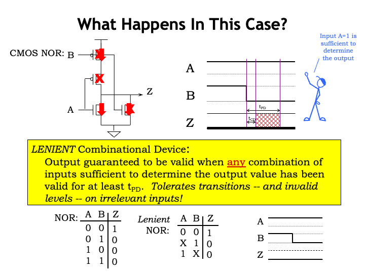

Let&#700;s look in detail at the switch configuration in a CMOS
implementation of a NOR gate when both inputs are a digital 1.  A high
gate voltage will turn on NFET switches (as indicated by the red
arrows) and turn off PFET switches (as indicated by the red X&#700;s).
Since the pullup circuit is not conducting and the pulldown circuit is
conducting, the output Z is connected to GND, the voltage for a
digital 0 output.

Now, what happens when the B input transitions from 1 to 0?  The
switches controlled by B change their configuration: the PFET switch
is now on and the NFET switch is now off.  But overall the pullup
circuit is still not conducting and there is still a pulldown path
from Z to GND.  So while there used to be two paths from Z to GND and
there is now only one path, Z has been connected to GND the whole time
and its value has remained valid and stable throughout B&#700;s
transition.  In the case of a CMOS NOR gate, when one input is a
digital 1, the output will be unaffected by transitions on the other
input.

A <i>lenient combinational device</i> is one that exhibits this
behavior, namely that the output is guaranteed to be be valid when any
combination of inputs sufficient to determine the output value has
been valid for at least $t_{\textrm{PD}}$.  When some of the inputs
are in a configuration that triggers this lenient behavior,
transitions on the other inputs will have no effect on the validity of
the output value.  Happily most CMOS implementations of logic gates
are naturally lenient.

We can extend our truth-table notation to indicate lenient
behavior by using X for the input values on certain rows to
indicate that input value is irrelevant when determining the
correct output value.  The truth table for a lenient NOR gate
calls out two such situations: when A is 1, the value of B is
irrelevant, and when B is 1, the value of A is irrelevant.
Transitions on the irrelevant inputs don&#700;t trigger the
$t_{\textrm{CD}}$ and $t_{\textrm{PD}}$ output timing normally
associated with an input transition.

When does lenience matter?  We&#700;ll need lenient components when
building memory components, a topic we&#700;ll get to in a couple of
lectures.

You&#700;re ready to try building some CMOS gates of your own!

## Summary

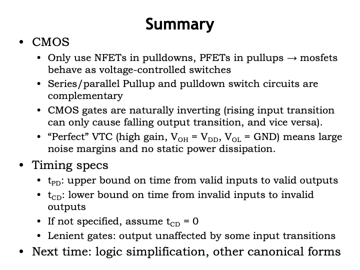

