
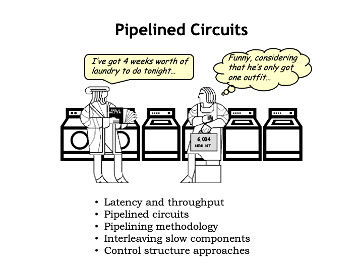

In this lecture, our goal is to introduce some metrics for
measuring the performance of a circuit and then investigate ways
to improve that performance.

<h2>Latency and Throughput</h2>

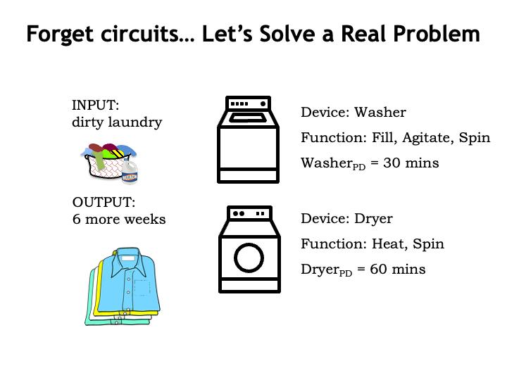

We&#700;ll start by putting aside circuits for a moment and look at
an everyday example that will help us understand the proposed
performance metrics.

Laundry is a processing task we all have to face at some point!
The input to our laundry system is some number of
loads of dirty laundry and the output is the same loads, but
washed, dried, and folded.  There two system components: a
washer that washes a load of laundry in 30 minutes, and a dryer
that dries a load in 60 minutes.  You may be used to laundry
system components with different propagation delays, but
let&#700;s go with these delays for our example.

Our laundry follows a simple path through the system: each load
is first washed in the washer and afterwards moved to the dryer
for drying.  There can, of course, be delays between the steps
of loading the washer, or moving wet, washed loads to the dryer,
or in taking dried loads out of the dryer.  Let&#700;s assume
we move the laundry through the system as fast as possible,
moving loads to the next processing step as soon as we can.

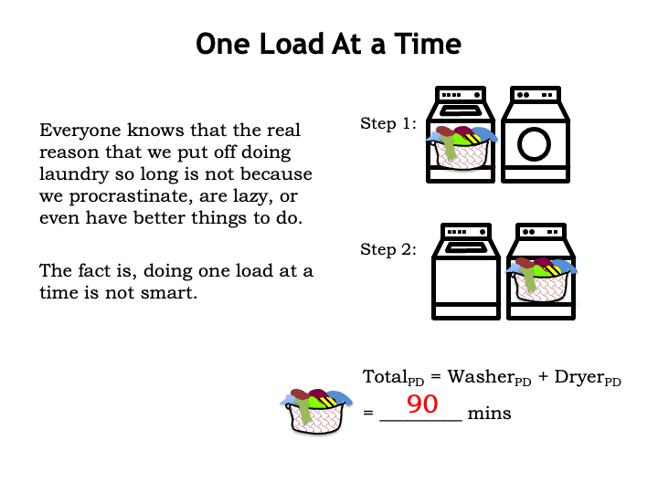

Most of us wait to do laundry until we&#700;ve accumulated
several loads.  That turns out to be a good strategy!
Let&#700;s see why...

To process a single load of laundry, we first run it through
the washer, which takes 30 minutes.  Then we run it through the
dryer, which takes 60 minutes.  So the total amount of time from
system input to system output is 90 minutes.  If this were a
combinational logic circuit, we&#700;d say the circuit&#700;s
propagation delay is 90 minutes from valid inputs to valid
outputs.

Okay, that&#700;s the performance analysis for a single load
of laundry.  Now let&#700;s think about doing N loads of
laundry.

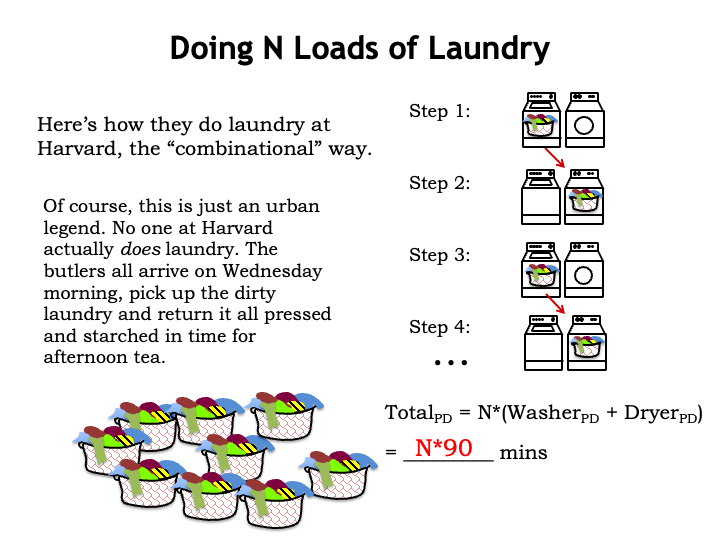

Here at MIT we like to make gentle fun of our colleagues at the
prestigious institution just up the river from us.  So
here&#700;s how we imagine they do N loads of laundry at
Harvard. They follow the combinational recipe of supplying new
system inputs after the system generates the correct output from
the previous set of inputs.  So in step 1 the first load is
washed and in step 2, the first load is dried, taking a total of
90 minutes.  Once those steps complete, Harvard students move on
to step 3, starting the processing of the second load of
laundry.  And so on...

The total time for the system to process N laundry loads is
just N times the time it takes to process a single load.  So the
total time is N*90 minutes.

Of course, we&#700;re being silly here!  Harvard students
don&#700;t actually do laundry.  Mummy sends the family butler
over on Wednesday mornings to collect the dirty loads and return
them starched and pressed in time for afternoon tea.

But I hope you&#700;re seeing the analogy we&#700;re making
between the Harvard approach to laundry and combinational
circuits.  We can all see that the washer is sitting idle while
the dryer is running and that inefficiency has a cost in terms
of the rate at which N load of laundry can move through the
system.

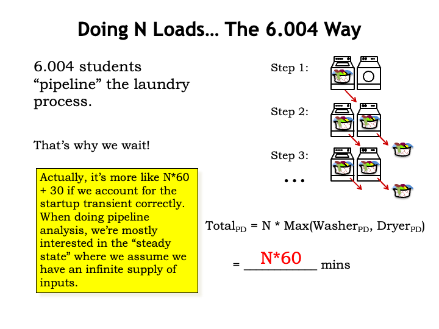

As engineering students here in Computatation Structures, we see that it makes
sense to overlap washing and drying.  So in step 1 we wash the
first load.  And in step 2, we dry the first load as before,
but, in addition, we start washing the second load of laundry.
We have to allocate 60 minutes for step 2 in order to give the
dryer time to finish. There&#700;s a slight inefficiency in
that the washer finishes its work early, but with only one
dryer, it&#700;s the dryer that determines how quickly laundry
moves through the system.

Systems that overlap the processing of a sequence of inputs are
called pipelined systems and each of the processing steps is
called a stage of the pipeline.  The rate at which inputs move
through the pipeline is determined by the slowest pipeline
stage.  Our laundry system is a 2-stage pipeline with a
60-minute processing time for each stage.

We repeat the overlapped wash/dry step until all N loads of
laundry have been processed.  We&#700;re starting a new washer load
every 60 minutes and getting a new load of dried laundry from the
dryer every 60 minutes.  In other words, the effective processing
rate of our overlapped laundry system is one load every 60
minutes. So once the process is underway N loads of laundry takes
N*60 minutes.  And a particular load of laundry, which requires
two stages of processing time, takes 120 minutes.

The timing for the first load of laundry is a little different
since the timing of Step 1 can be shorter with no dryer to wait
for.  But in the performance analysis of pipelined systems,
we&#700;re interested in the steady state where we&#700;re
assuming that we have an infinite supply of inputs.

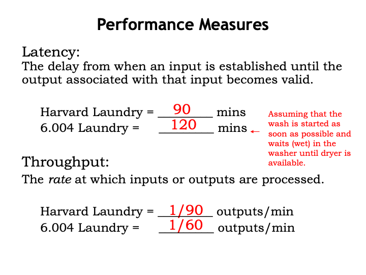

We see that there are two interesting performance metrics.  The
first is the latency of the system, the time it takes for the
system to process a particular input.  In the Harvard laundry
system, it takes 90 minutes to wash and dry a load.  In the
Computation Structures laundry, it takes 120 minutes to wash and dry a load,
assuming that it&#700;s not the first load.

The second performance measure is throughput, the rate at which
the system produces outputs.  In many systems, we get one set of
outputs for each set of inputs, and in such systems, the
throughput also tells us the rate at inputs are consumed.  In
the Harvard laundry system, the throughput is 1 load of laundry
every 90 minutes.  In the Computation Structures laundry, the throughput is 1
load of laundry every 60 minutes.

The Harvard laundry has lower latency, the Computation Structures laundry has
better throughput.  Which is the better system?  That depends on
your goals!  If you need to wash 100 loads of laundry,
you&#700;d prefer to use the system with higher throughput.
If, on the other hand, you want clean underwear for your date in
90 minutes, you&#700;re much more concerned about the
latency.

The laundry example also illustrates a common tradeoff between
latency and throughput.  If we increase throughput by using
pipelined processing, the latency usually increases since all
pipeline stages must operate in lock-step and the rate of
processing is thus determined by the slowest stage.

<h2>Pipelined Circuits</h2>

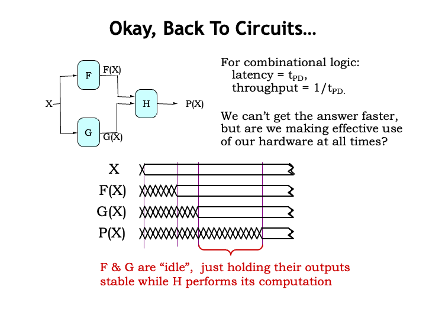

Okay, now let&#700;s apply all this analysis to improving the
performance of our circuits.  The latency of a combinational
logic circuit is simply its propagation delay $t_{\textrm{PD}}$.
And the throughput is just $1/t_{\textrm{PD}}$ since we start
processing the next input only after finishing the computation
on the current input.

Consider a combinational system with three components: F, G,
and H, where F and G work in parallel to produce the inputs to
H.  Using this timing diagram we can follow the processing of a
particular input value X.  Sometime after X is valid and stable,
the F and G modules produce their outputs F(X) and G(X).

Now that the inputs to H are valid and stable, the H module
will produce the system output P(X) after a delay set by the
propagation delay of H.  The total elapsed time from valid input
to valid output is determined by the propagation delays of the
component modules.  Assuming we use those modules as-is, we
can&#700;t make any improvements on this latency.

But what about the system&#700;s throughput?  Observe that
after producing their outputs, the F and G modules are sitting
sitting idle, just holding their outputs stable while H performs
its computation.  Can we figure out a way for F and G to get
started processing the next input while still letting H do its
job on the first input?  In other words, can we divide the
processing of the combinational circuit into two stages where
the first stage computes F(X) and G(X), and the second stage
computes H(X)?  If we can, then we can increase the throughput
of the system.

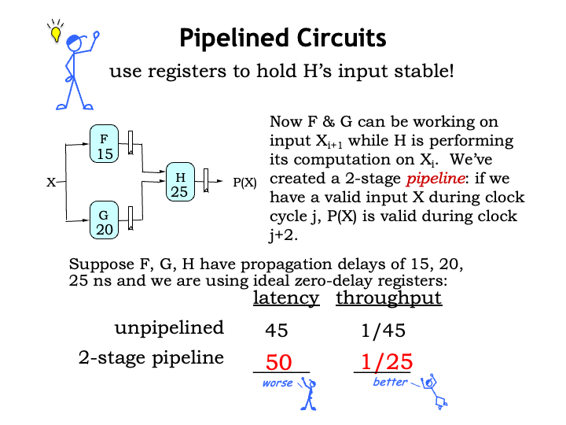

Mr. Blue&#700;s inspiration is to use registers to hold the
values F(X) and G(X) for use by H, while the F and G modules
start working on the next input value.  To make our timing
analysis a little easier, we&#700;ll assume that our pipelining
registers have a zero propagation delay and setup time.

The appropriate clock period for this sequential circuit is
determined by the propagation delay of the slowest processing
stage.  In this example, the stage with F and G needs a clock
period of at least 20 ns to work correctly.  And the stage with
H needs a clock period of 25 ns to work correctly.  So the
second stage is the slowest and sets the system clock period at
25 ns.

This will be our general plan for increasing the throughput of
combinational logic: we&#700;ll use registers to divide the
processing into a sequence of stages, where the registers
capture the outputs from one processing stage and hold them as
inputs for the next processing stage.  A particular input will
progress through the system at the rate of one stage per clock
cycle.

In this example, there are two stages in the processing
pipeline and the clock period is 25 ns, so the latency of the
pipelined system is 50 ns, <i>i.e.</i>, the number of stages
times the system&#700;s clock period.  The latency of the
pipeline system is a little longer than the latency of the
unpipelined system.  However, the pipeline system produces 1
output every clock period, or 25 ns.  The pipeline system has
considerably better throughput at the cost of a small increase
in latency.

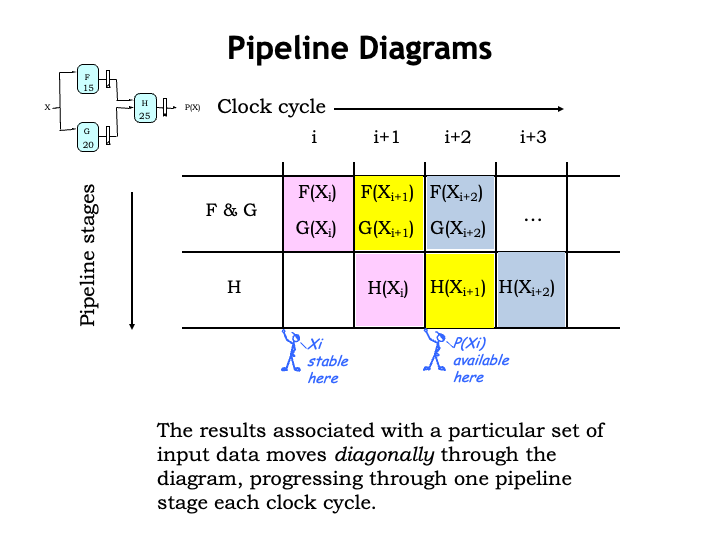

Pipeline diagrams help us visualize the operation of a
pipelined system.  The rows of the pipeline diagram represent
the pipeline stages and the columns are successive clock
cycles.

At the beginning of clock cycle $i$ the input $X_i$ becomes
stable and valid.  Then during clock cycle $i$ the F and G
modules process that input and at the end of the cycle the
results F($X_i$) and G($X_i$) are captured by the pipeline
registers between the first and second stages.

Then in cycle $i+1$, H uses the captured values do its share of
the processing of $X_i$.  And, meanwhile, the F and G modules
are working on $X_{i+1}$.  You can see that the processing for a
particular input value moves diagonally through the diagram, one
pipeline stage per clock cycle.

At the end of cycle i+1, the output of H is captured by the
final pipeline register and is available for use during cycle
i+2.  The total time elapsed between the arrival of an input and
the availability of the output is two cycles.

The processing continues cycle after cycle, producing a new
output every clock cycle.

Using the pipeline diagram we can track how a particular input
progresses through the system or see what all the stages are
doing in any particular cycle.

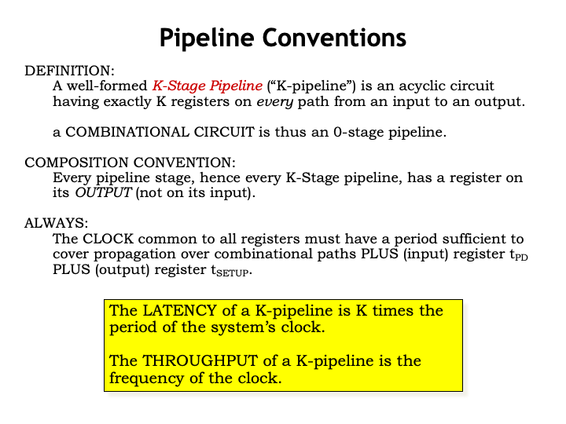

We&#700;ll define a K-stage pipeline (or K-pipeline for short)
as an acyclic circuit having exactly K registers on every path
from input to output.  An unpipelined combinational circuit is
thus a 0-stage pipeline.

To make it easy to build larger pipelined systems out of
pipelined components, we&#700;ll adopt the convention that
every pipeline stage, and hence every K-stage pipeline, has a
register on its OUTPUT.

We&#700;ll use the techniques we learned for analyzing the
timing of sequential circuits to ensure the clock signal common
to all the pipeline registers has a period sufficient to ensure
correct operation of each stage.  So for every
register-to-register and input-to-register path, we need to
compute the sum of the propagation delay of the input register,
plus the propagation delay of the combinational logic, plus the
setup time of the output register.  Then we&#700;ll choose the
system&#700;s clock period to be greater than or equal to the
largest such sum.

With the correct clock period and exactly K-registers along
each path from system input to system output, we are guaranteed
that the K-pipeline will compute the same outputs as the
original unpipelined combinational circuit.

The latency of a K-pipeline is K times the period of the
system&#700;s clock.  And the throughput of a K-pipeline is the
frequency of the system&#700;s clock, <i>i.e.</i>, 1 over the
clock period.

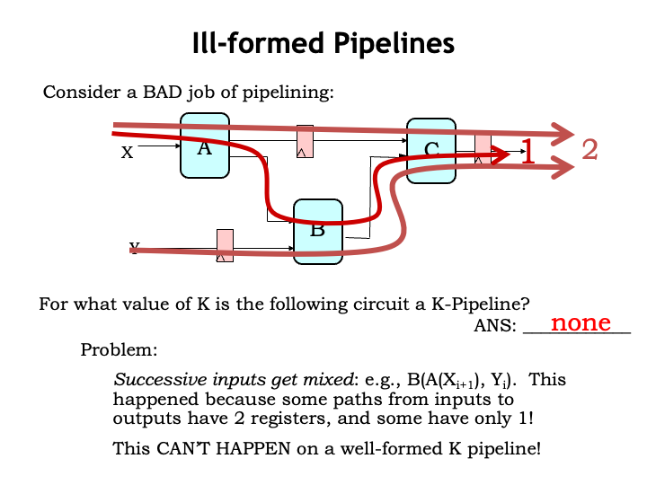

Here&#700;s a failed attempt at pipelining a circuit.  For
what value of K is the circuit a K-pipeline?  Well, let&#700;s
count the number of registers along each path from system inputs
to system outputs.

The top path through the A and C components has 2 registers.
As does the bottom path through the B and C components.  But the
middle path through all three components has only 1 register.
Oops, this not a well-formed K-pipeline.

Why do we care? We care because this pipelined circuit does not
compute the same answer as the original unpipelined circuit.
The problem is that successive generations of inputs get mixed
together during processing.  For example, during cycle i+1, the
B module is computing with the current value of the X input but
the previous value of the Y input.

This can&#700;t happen with a well-formed K-pipeline.  So we
need to develop a technique for pipelining a circuit that
guarantees the result will be well-formed.

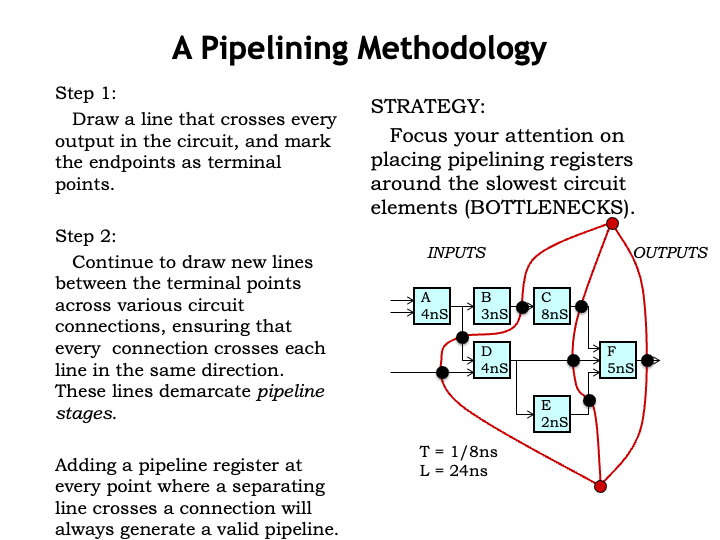

Here&#700;s our strategy that will ensure if we add a pipeline
register along one path from system inputs to system outputs, we
will add pipeline registers along every path.

Step 1 is to draw a contour line that crosses every output in
the circuit and mark its endpoints as the terminal points for
all the other contours we&#700;ll add.

During Step 2 continue to draw contour lines between the two
terminal points across the signal connections between modules.
Make sure that every signal connection crosses the new contour
line in the same direction.  This means that system inputs will
be one side of the contour and system outputs will be on the
other side. These contours demarcate pipeline stages.

Place a pipeline register wherever a signal connection
intersects the pipelining contours.  Here we&#700;ve marked the
location of pipeline registers with large black dots.

By drawing the contours from terminal point to terminal point
we guarantee that we cross every input-output path, thus
ensuring our pipeline will be well-formed.

Now we can compute the system&#700;s clock period by looking
for the pipeline stage with the longest register-to-register or
input-to-register propagation delay.  With these contours and
assuming ideal zero-delay pipeline registers, the system clock
must have a period of 8 ns to accommodate the operation of the C
module.  This gives a system throughput of 1 output every 8 ns.
Since we drew 3 contours, this is a 3-pipeline and the system
latency is 3 times 8 ns or 24 ns total.

Our usual goal in pipelining a circuit is to achieve maximum
throughput using the fewest possible registers.  So our strategy
is to find the slowest system component (in our example, the C
component) and place pipeline registers on its inputs and
outputs.  So we drew contours that pass on either side of the C
module.  This sets the clock period at 8 ns, so we position the
contours so that longest path between any two pipeline registers
is at most 8.

There are often several choices for how to draw a contour while
maintaining the same throughput and latency.  For example, we
could have included the E module in the same pipeline stage as
the F module.

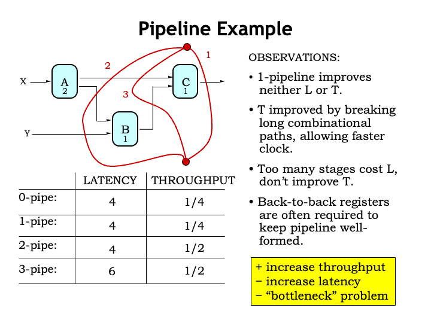

Okay, let&#700;s review our pipelining strategy.

First we draw a contour across all the outputs.  This creates a
1-pipeline, which, as you can see, will always have the same
throughput and latency as the original combinational
circuit.

Then we draw our next contour, trying to isolate the slowest
component in the system.  This creates a 2-pipeline with a clock
period of 2 and hence a throughput of 1/2, or double that of the
1-pipeline.

We can add additional contours, but note that the 2-pipeline
had the smallest possible clock period, so after that additional
contours add stages and hence increase the system&#700;s
latency without increasing its throughput.  Not illegal, just
not a worthwhile investment in hardware.

Note that the signal connection between the A and C module now
has two back-to-back pipelining registers.  Nothing wrong with
that; it often happens when we pipeline a circuit where the
input-output paths are of different lengths.

So our pipelining strategy will be to pipeline implementations
with increased throughput, usually at the cost of increased
latency.  Sometimes we get lucky and the delays of each pipeline
stage are perfectly balanced, in which case the latency will not
increase.  Note that a pipelined circuit will NEVER have a
smaller latency than the unpipelined circuit.

Notice that once we&#700;ve isolated the slowest component, we
can&#700;t increase the throughput any further.  How do we
continue to improve the performance of circuits in light of
these performance bottlenecks?

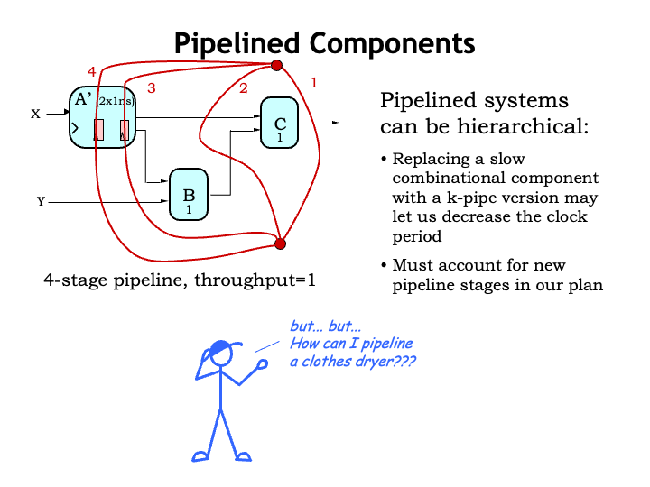

One solution is to use pipelined components if they&#700;re
available!  Suppose we&#700;re able to replace the original A
component with a 2-stage pipelined version A-prime.

We can redraw our pipelining contours, making sure we account
for the internal pipeline registers in the A-prime component.
This means that 2 of our contours have to pass through the
A-prime component, guaranteeing that we&#700;ll add pipeline
registers elsewhere in the system that will account for the
two-cycle delay introduced by A-prime.

Now the maximum propagation delay in any stage is 1 ns,
doubling the throughput from 1/2 to 1/1.  This is a 4-pipeline
so the latency will be 4 ns.

This is great!  But what can we do if our bottleneck component
doesn&#700;t have a pipelined substitute.  We&#700;ll tackle
that question in the next section.

</vertical>
</sequential>
<sequential display_name="Interleaving" url_name="Interleaving">
<vertical display_name="Interleaving">

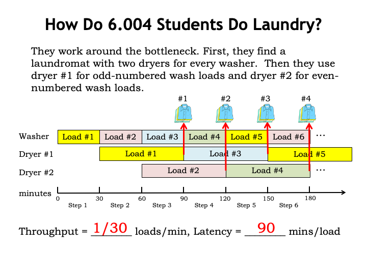

Computation Structures students work around the dryer bottleneck by finding a
laundromat that has two dryers for every washer.  Looking at the
timeline you can see the plan, which is divided into 30-minute
steps.  The washer is in use every step, producing a
newly-washed load every 30 minutes.  Dryer usage is interleaved,
where Dryer #1 is used to dry the odd-numbered loads and Dryer
#2 is used to dry the even-numbered loads.  Once started, a
dryer runs for a duration of two steps, a total of 60 minutes.
Since the dryers run on a staggered schedule, the system as a
whole produces a load of clean, dry laundry every 30
minutes.

The steady-state throughput is 1 load of laundry every 30
minutes and the latency for a particular load of laundry is 90
minutes.

And now here&#700;s the take-home message from this example.
Consider the operation of the two-dryer system.  Even though the
component dryers themselves aren&#700;t pipelined, the
two-dryer interleaving system is acting like a 2-stage pipeline
with a clock period of 30 minutes and a latency of 60 minutes.
In other words, by interleaving the operation of 2 unpipelined
components we can achieve the effect of a 2-stage pipeline.

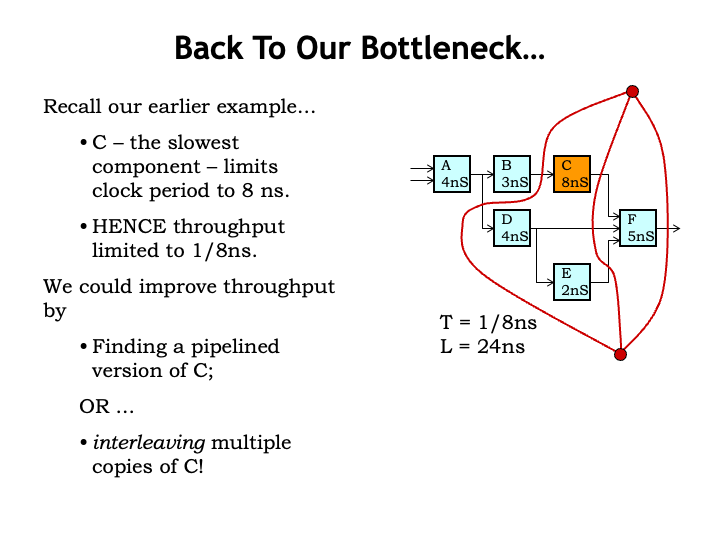

Returning to the example of the previous section, we
couldn&#700;t improve the throughput of our pipelined system
past 1/8 ns since the minimum clock period was set the by the 8
ns latency of the C module.

To improve the throughput further we either need to find a
pipelined version of the C component or use an interleaving
strategy to achieve the effect of a 2-stage pipeline using two
instances of the unpipelined C component.  Let&#700;s try
that...

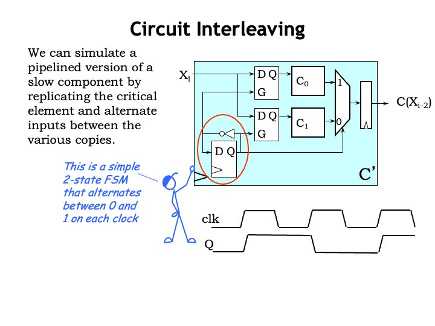

Here&#700;s a circuit for a general-purpose two-way
interleaver, using, in this case, two copies of the unpipelined
C component, $C_0$ and $C_1$.

The input for each C component comes from a D-latch, which has
the job of capturing and holding the input value.  There&#700;s
also a multiplexer to select which C-component output will be
captured by the output register.

In the lower left-hand corner of the circuit is a very simple
2-state FSM with one state bit.  The next-state logic is a
single inverter, which causes the state to alternate between 0
and 1 on successive clock cycles.  This timing diagram shows how
the state bit changes right after each rising clock edge.

To help us understand the circuit, we&#700;ll look at some
signal waveforms to illustrate its operation.

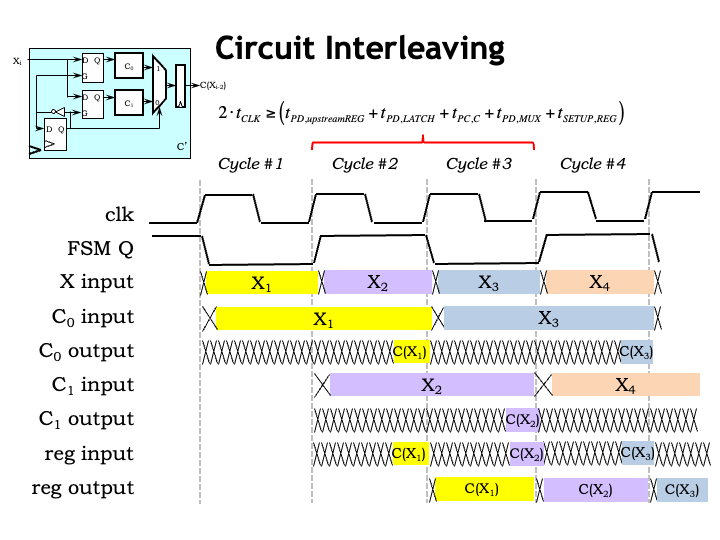

To start, here are the waveforms for the CLK signal and our FSM
state bit from the previous slide.

A new X input arrives from the previous stage just after the
rising edge of the clock.

Next, let&#700;s follow the operation of the $C_0$ component.
Its input latch is open when FSM Q is low, so the newly arriving
$X_1$ input passes through the latch and $C_0$ can begin its
computation, producing its result at the end of clock cycle #2.
Note that the $C_0$ input latch closes at the beginning of the
second clock cycle, holding the $X_1$ input value stable even
though the X input is starting to change.  The effect is that
$C_0$ has a valid and stable input for the better part of 2
clock cycles giving it enough time to compute its result.

The $C_1$ waveforms are similar, just shifted by one clock
cycle.  $C_1$&#700;s input latch is open when FSM Q is high, so
the newly arriving $X_2$ input passes through the latch and
$C_1$ can being its computation, producing its result at the end
of clock cycle #3.

Now let&#700;s check the output of the multiplexer.  When FSM
Q is high, it selects the value from $C_0$ and when FSM Q is
low, it selects the value from $C_1$.  We can see that happening
in the waveform shown.

Finally, at the rising edge of the clock, the output register
captures the value on its input and holds it stable for the
remainder of the clock cycle.

The behavior of the interleaving circuit is like a 2-stage
pipeline: the input value arriving in cycle i is processed over
two clock cycles and the result output becomes available on
cycle i+2.

What about the clock period for the interleaving system?  Well,
there is some time lost to the propagation delays of the
upstream pipeline register that supplies the X input, the
internal latches and multiplexer, and the setup time of the
output register.  So the clock cycle has to be just a little bit
longer than half the propagation delay of the C module.

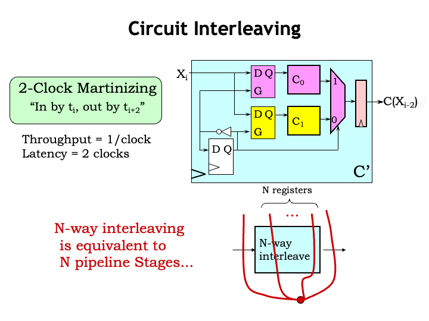

We can treat the interleaving circuit as a 2-stage pipeline,
consuming an input value every clock cycle and producing a
result two cycles later.

When incorporating an N-way interleaved component in our
pipeline diagrams, we treat it just like a N-stage pipeline.  So
N of our pipelining contours have to pass through the
component.

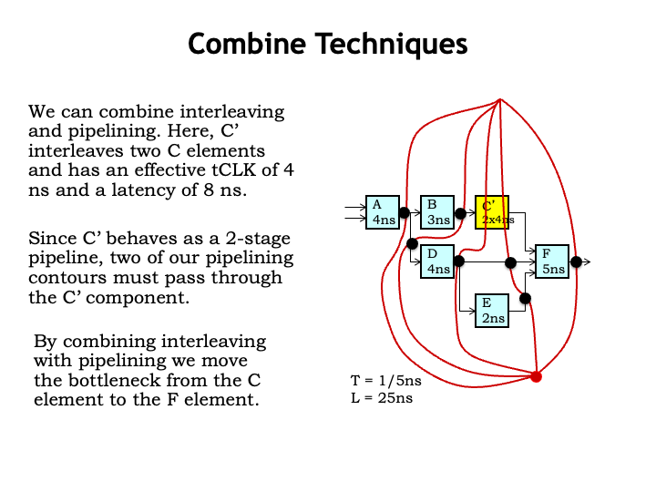

Here we&#700;ve replaced the slow unpipelined C component with
a 2-way interleaved C-prime component.

We can follow our process for drawing pipelining contours.
First we draw a contour across all the outputs.  Then we add
contours, ensuring that two of them pass through the C-prime
component. Then we add pipeline registers at the intersections
of the contours with the signal connections.  We see that the
contours passing through C-prime have caused extra pipeline
registers to be added on the other inputs to the F module,
accommodating the 2-cycle delay through C-prime.

Somewhat optimistically we&#700;ve specified the C-prime
minimum $t_{\textrm{CLK}}$ to be 4 ns, so that means that the
slow component which determines the system&#700;s clock period
is now the F module, with a propagation delay of 5 ns.

So the throughput of our new pipelined circuit is 1 output
every 5 ns, and with 5 contours, it&#700;s a 5-pipeline so the
latency is 5 times the clock period or 25 ns.

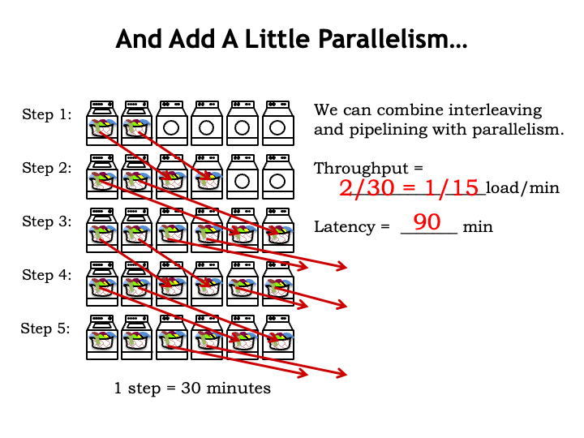

By running pipelined systems in parallel we can continue to
increase the throughput.  Here we show a laundry with 2 washers
and 4 dryers, essentially just two copies of the 1-washer,
2-dryer system shown earlier.  The operation is as described
before, except that at each step the system produces and
consumes two loads of laundry.

So the throughput is 2 loads every 30 minutes for an effective
rate of 1 load every 15 minutes.  The latency for a load
hasn&#700;t changed; it&#700;s still 90 minutes per load.

We&#700;ve seen that even with slow components we can use
interleaving and parallelism to continue to increase throughput.
Is there an upper bound on the throughput we can achieve?  Yes!
The timing overhead of the pipeline registers and interleaving
components will set a lower bound on the achievable clock
period, thus setting an upper bound on the achievable
throughput.  Sorry, no infinite speed-up is possible in the real
world.

<h2>Control Structure Alternatives</h2>

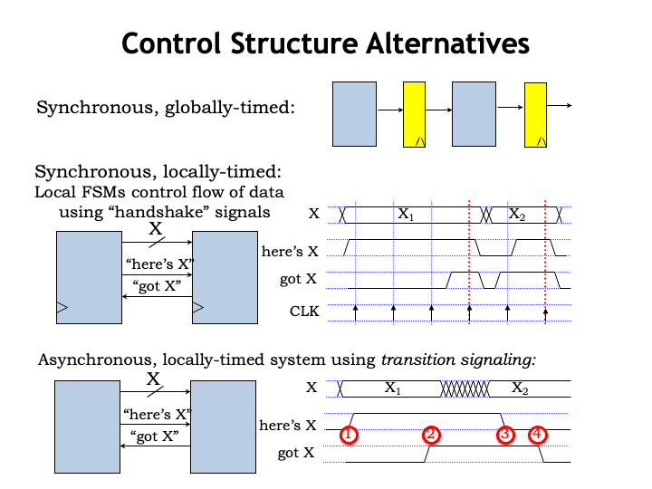

We&#700;ve been designing our processing pipelines to have all
the stages operate in lock step, choosing the clock period to
accommodate the worst-case processing time over all the stages.
This is what we&#700;d call a synchronous, globally timed
system.

But what if there are data dependencies in the processing
time, <i>i.e.</i>, if for some data inputs a particular
processing stage might be able to produce its output in a
shorter time?  Can we design a system that could take advantage
of that opportunity to increase throughput?

One alternative is to continue to use a single system clock,
but for each stage to signal when it&#700;s ready for a new
input and when it has a new output ready for the next stage.
It&#700;s fun to design a simple 2-signal handshake protocol to
reliably transfer data from one stage to the next.  The upstream
stage produces a signal called HERE-IS-X to indicate that is has
new data for the downstream stage.  And the downstream stage
produces a signal called GOT-X to indicate when it is willing to
consume data.  It&#700;s a synchronous system so the signal
values are only examined on the rising edge of the clock.

The handshake protocol works as follows: the upstream stage
asserts HERE-IS-X if it will have a new output value available
at the next rising edge of the clock.  The downstream stage
asserts GOT-X if it will grab the next output at the rising edge
of the clock.  Both stages look at the signals on the rising
edge of the clock to decide what to do next.  If both stages see
that HERE-IS-X and GOT-X are asserted at the same clock edge,
the handshake is complete and the data transfer happens at that
clock edge.  Either stage can delay a transfer if they are still
working on producing the next output or consuming the previous
input.

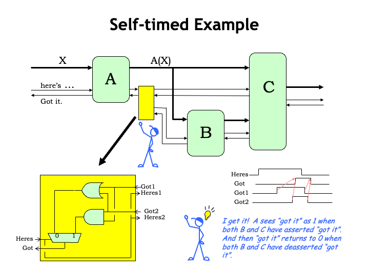

It&#700;s possible, although considerably more difficult, to
build a clock-free asynchronous self-timed system that uses a
similar handshake protocol.  The handshake involves four phases.
In phase 1, when the upstream stage has a new output and GOT-X
is deasserted, it asserts its HERE-IS-X signal and then waits to
see the downstream stage&#700;s reply on the GOT-X signal.  In
phase 2, the downstream stage, seeing that HERE-IS-X is
asserted, asserts GOT-X when it has consumed the available
input.  In phase 3, the downstream stage waits to see the
HERE-IS-X go low, indicating that the upstream stage has
successfully received the GOT-X signal.  In phase 4, once
HERE-IS-X is deasserted, the downstream stage deasserts GOT-X
and the transfer handshake is ready to begin again.  Note that
the upstream stage waits until it sees the GOT-X deasserted
before starting the next handshake.

The timing of the system is based on the transitions of the
handshake signals, which can happen at any time the conditions
required by the protocol are satisfied.  No need for a global
clock here!

It&#700;s fun to think about how this self-timed protocol
might work when there are multiple downstream modules, each with
their own internal timing.

In this example, A&#700;s output is consumed by both the B and
C stages.  We need a special circuit, shown as a yellow box in
the diagram, to combine the GOT-X signals from the B and C
stages and produce a summary signal for the A stage.

Let&#700;s take a quick look at the timing diagram shown here.
After A has asserted HERE-IS-X, the circuit in the yellow box
waits until both the B AND the C stage have asserted their GOT-X
signals before asserting GOT-X to the A stage.  At this point
the A stage deasserts HERE-IS-X, then the yellow box waits until
both the B and C stages have deasserted their GOT-X signals,
before deasserting GOT-X to the A stage.

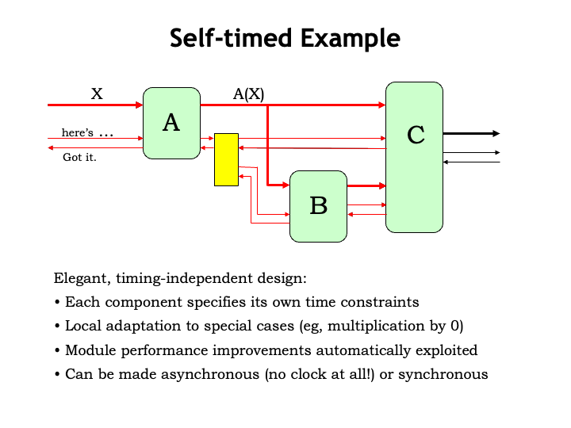

Let&#700;s watch the system in action!  When a signal is
asserted we&#700;ll show it in red, otherwise it&#700;s shown
in black.

A new value for the A stage arrives on A&#700;s data input and
the module supplying the value then asserts its HERE-IS-X signal
to let A know it has a new input.

At some point later, A signals GOT-X back upstream to indicate
that it has consumed the value, then the upstream stage
deasserts HERE-IS-X, followed by A deasserting its GOT-X output.
This completes the transfer of the data to the A stage.

When A is ready to send a new output to the B and C stages, it
checks that its GOT-X input is deasserted (which it is), so it
asserts the new output value and signals HERE-IS-X to the yellow
box which forwards the signal to the downstream stages.

B is ready to consume the new input and so asserts its GOT-X
output.  Note that C is still waiting for its second input and
has yet to assert its GOT-X output.

After B finishes its computation, it supplies a new value to C
and asserts its HERE-IS-X output to let C know its second input
is ready.

Now C is happy and signals both upstream stages that it has
consumed its two inputs.  Now that both GOT-X inputs are
asserted, the yellow box asserts A&#700;s GOT-X input to let it
know that the data has been transferred. Meanwhile B completes
its part of the handshake, and C completes its transaction with
B and A deasserts HERE-IS-X to indicate that it has seen its
GOT-X input.  When the B and C stages see their HERE-IS-X inputs
go low, they their finish their handshakes by deasserting their
GOT-X outputs, and when they&#700;re both low, the yellow box
lets A know the handshake is complete by deserting A&#700;s
GOT-X input.

Whew!  The system has returned to the initial state where A is
now ready to accept some future input value.

This an elegant design based entirely on transition signaling.
Each module is in complete control of when it consumes inputs
and produces outputs, and so the system can process data at the
fastest possible speed, rather than waiting for the worst-case
processing delay.

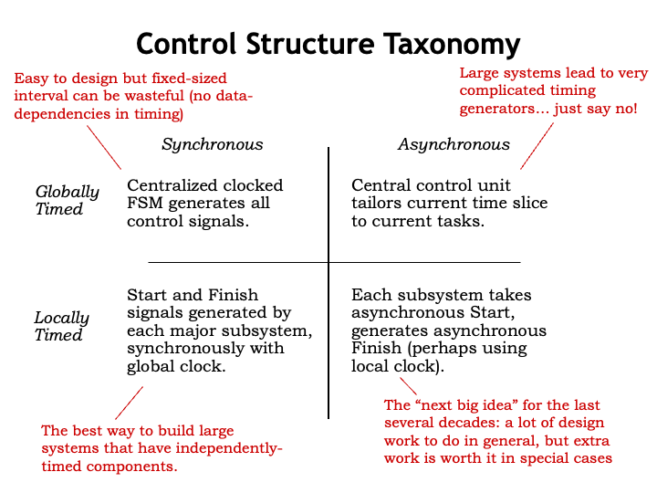

Let&#700;s summarize what we&#700;ve learned about
controlling pipelined systems.  The most straightforward
approach is to use a pipeline with the system clock chosen to
accommodate the worst-case processing time.  These systems are
easy to design but can&#700;t produce higher throughputs if the
processing stages might run more quickly for some data
values.

We saw that we could use a simple handshake protocol to move
data through the system.  All communication still happens on the
rising edge of the system clock, but the specific clock edge
used to transfer data is determined by the stages
themselves.

It&#700;s tempting to wonder if we can might adjust the global
clock period to take advantage of data-dependent processing
speedups.  But the necessary timing generators can be very
complicated in large systems. It&#700;s usually much easier to
use local communication between modules to determine system
timing than trying to figure out all the constraints at the
system level.  So this approach isn&#700;t usually a good
one.

But what about locally-timed asynchronous systems like the
example we just saw?  Each generation of engineers has heard the
siren call of asynchronous logic.  Sadly, it usually proves too
hard to produce a provably reliable design for a large system,
say, a modern computer.  But there are special cases, such as
the logic for integer division, where the data-dependent
speed-ups make the extra work worthwhile.

<h2>Summary</h2>

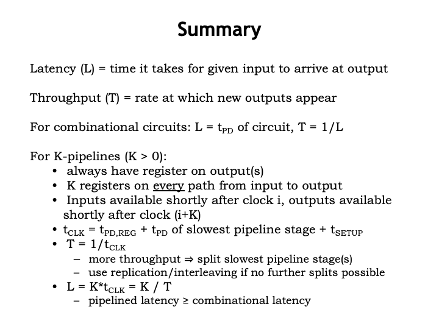

We characterized the performance of our systems by measuring
their latency and throughput.  For combinational circuits, the
latency is simply the propagation delay of the circuit and its
throughput is just 1/latency.

We introduced a systematic strategy for designing K-pipelines,
where there&#700;s a register on the outputs of each stage, and
there are exactly K registers on every path from input to
output.  The period of the system clock $t_{\textrm{CLK}}$ is
determined by the propagation delay of the slowest pipeline
stage.  The throughput of a pipelined system is
$1/t_{\textrm{CLK}}$ and its latency is
$K t_{\textrm{CLK}}$.

Pipelining is the key to increasing the throughput of most
high-performance digital systems.

