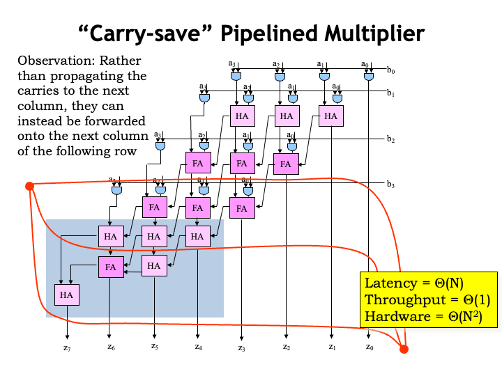

<h2>Optimizing Your Design</h2>

In this lecture, we&#700;re going to look into
optimizing digital systems to make them smaller, faster, higher
performance, more energy efficient, and so on.  It would be
wonderful if we could achieve all these goals at the same time
and for some circuits we can.  But, in general, optimizing in
one dimension usually means doing less well in another.  In
other words, there are design tradeoffs to be made.

Making tradeoffs correctly requires that we have a clear
understanding of our design goals for the system.  Consider two
different design teams: one is charged with building a high-end
graphics card for gaming, the other with building the Apple
watch.

The team building the graphics card is mostly concerned with
performance and, within limits, is willing to trade-off cost and
power consumption to achieve their performance goals.  Graphics
cards have a set size, so there&#700;s a high priority in
making the system small enough to meet the required size, but
there&#700;s little to be gained in making it smaller than
that.

The team building the watch has very different goals.  Size and
power consumption are critical since it has fit on a wrist and
run all day without leaving scorch marks on the wearer&#700;s
wrist!

Suppose both teams are thinking about pipelining part of their
logic for increased performance.  Pipelining registers are an
obvious additional cost.  The overlapped execution and higher
$t_{\textrm{CLK}}$ made possible by pipelining would increase
the power consumption and the need to dissipate that power
somehow.  You can imagine the two teams might come to very
different conclusions about the correct course of action!

This lecture takes a look at some of the possible tradeoffs.
But as designers you&#700;ll have to pick and choose which
tradeoffs are right for your design. This is the sort of design
challenge on which good engineers thrive!  Nothing is more
satisfying than delivering more than anyone thought possible
within the specified constraints.

Our first optimization topic is power dissipation, where the
usual goal is to either meet a certain power budget, or to
minimize power consumption while meeting all the other design
targets.

In CMOS circuits, there are several sources of power
dissipation, some under our control, some not.

Static power dissipation is power that is consumed even when
the circuit is idle, i.e., no nodes are changing value.  Using
our simple switch model for the operation of MOSFETs, we&#700;d
expect CMOS circuits to have zero static power dissipation.  And
in the early days of CMOS, we came pretty close to meeting that
ideal.  But as the physical dimensions of the MOSFET have shrunk
and the operating voltages have been lowered, there are two
sources of static power dissipation in MOSFETs that have begun
to loom large.

We&#700;ll discuss the effects as they appear in n-channel
MOSFETs, but keep in mind that they appear in p-channel MOSFETs
too.

The first effect depends on the thickness of the MOSFET&#700;s
gate oxide, shown as the thin yellow layer in the MOSFET diagram
on the left.  In each new generation of integrated circuit
technology, the thickness of this layer has shrunk, as part of
the general reduction in all the physical dimensions.  The
thinner insulating layer means stronger electrical fields that
cause a deeper inversion layer that leads to NFETs that carry
more current, producing faster gate speeds.  Unfortunately the
layers are now thin enough that electrons can tunnel through the
insulator, creating a small flow of current from the gate to the
substrate.  With billions of NFETs in a single circuit, even
tiny currents can add up to non-negligible power drain.

The second effect is caused by current flowing between the
drain and source of a NFET that is, in theory, not conducting
because $V_{\textrm{GS}}$ is less than the threshold voltage.
Appropriately this effect is called sub-threshold conduction and
is exponentially related to $V_{\textrm{GS}}$ -
$V_{\textrm{TH}}$ (a negative value when the NFET is off).  So
as $V_{\textrm{TH}}$ has been reduced in each new generation of
technology, $V_{\textrm{GS}} - V_{\textrm{TH}}$ is less negative
and the sub-threshold conduction has increased.

One fix has been to change the geometry of the NFET so the
conducting channel is a tall, narrow fin with the gate terminal
wrapped around 3 sides, sometimes referred to as a tri-gate
configuration.  This has reduced the sub-threshold conduction by
an order-of-magnitude or more, solving this particular problem
for now.

Neither of these effects is under the control of the system
designer, except of course, if they&#700;re free to choose an
older manufacturing process!  We mention them here so that
you&#700;re aware that newer technologies often bring
additional costs that then become part of the trade-off
process.

A designer does have some control over the dynamic power
dissipation of the circuit, the amount of power spent causing
nodes to change value during a sequence of computations.  Each
time a node changes from 0-to-1 or 1-to-0, currents flow through
the MOSFET pullup and pulldown networks, charging and
discharging the output node&#700;s capacitance and thus
changing its voltage.

Consider the operation of an inverter.  As the voltage of the
input changes, the pullup and pulldown networks turn on and off,
connecting the inverter&#700;s output node to VDD or ground.
This charges or discharges the capacitance of the output node
changing its voltage.  We can compute the energy dissipated by
integrating the instantaneous power associated with the current
flow through the pullups and pulldowns over the time taken by
the output transition.

The power dissipated across the resistance of the MOSFET
channel is simply $I_{\textrm{DS}}$ times $V_{\textrm{DS}}$.
Here&#700;s the energy integral for the 1-to-0 transition of
the output node, where we&#700;re measuring $I_{\textrm{DS}}$
using the equation for the current flowing out of the output
node&#700;s capacitor: $I = C dV/dt$.  Assuming that the input
signal is a clock signal of period $t_{\textrm{CLK}}$ and that
each transition is taking half a clock cycle, we can work
through the math to determine that energy dissipated through the
pulldown network is $0.5 f C V_{\textrm{DD}}^2$, where the
frequency $f$ tells us the number of such transitions per
second, $C$ is the nodal capacitance, and $V_{\textrm{DD}}$ (the
power supply voltage) is the starting voltage of the nodal
capacitor.

There&#700;s a similar integral for the current dissipated by
pullup network when charging the capacitor and it yields the
same result.

So one complete cycle of charging then discharging dissipates
$f C V^2$ joules.  Note the all this energy has come from the
power supply &#8212; the first half is dissipated when the
output node is charged and the other half stored as energy in
the capacitor.  Then the capacitor&#700;s energy is dissipated
as it discharges.

These results are summarized in the lower left.  We&#700;ve
added the calculation for the energy dissipation of an entire
circuit assuming N of the circuit&#700;s nodes change each
clock cycle.

How much energy could be consumed by a modern integrated
circuit?  Here&#700;s a quick back-of-the-envelope estimate for
a current generation CPU chip.  It&#700;s operating at, say, 1
GHz and will have 100 million internal nodes that could change
each clock cycle.  Each nodal capacitance is around 1 femto
Farad and the power supply is about 1V.  With these numbers, the
estimated power consumption is 100 watts.  We all know how hot a
100W light bulb gets!  You can see it would be hard to keep the
CPU from overheating.

This is way too much energy to be dissipated in many
applications, and modern CPUs intended, say, for laptops only
dissipate a fraction of this energy.  So the CPU designers must
have some tricks up their sleeve, some of which we&#700;ll see
in a minute.

But first notice how important it&#700;s been to be able to
reduce the power supply voltage in modern integrated circuits.
If we&#700;re able to reduce the power supply voltage from 3.3V
to 1V, that alone accounts for more than a factor of 10 in power
dissipation.  So the newer circuit can be say, 5 times larger
and 2 times faster with the same power budget!

Newer technologies trends are shown here.  The net effect is
that newer chips would naturally dissipate more power if we
could afford to have them do so.  We have to be very clever in
how we use more and faster MOSFETs in order not to run up
against the power dissipation constraints we face.

To see what we can do to reduce power consumption, consider the
following diagram of an arithmetic and logic unit (ALU) like the
one you&#700;ll design in the final lab in this part of the
course.  There are four independent component modules,
performing the separate arithmetic, boolean, shifting and
comparison operations typically found in an ALU.  Some of the
ALU control signals are used to select the desired result in a
particular clock cycle, basically ignoring the answers produced
by the other modules.

Of course, just because the other answers aren&#700;t selected
doesn&#700;t mean we didn&#700;t dissipate energy in computing
them.  This suggests an opportunity for saving power!  Suppose
we could somehow turn off modules whose outputs we
didn&#700;t need?  One way to prevent them from dissipating
power is to prevent the module&#700;s inputs from changing,
thus ensuring that no internal nodes would change and hence
reducing the dynamic power dissipation of the off
module to zero.

One idea is to put latches on the inputs to each module, only
opening a module&#700;s input latch if an answer was required
from that module in the current cycle.  If a module&#700;s
latch stayed closed, its internal nodes would remain unchanged,
eliminating the module&#700;s dynamic power dissipation.  This
could save a substantial amount of power.  For example, the
shifter circuitry has many internal nodes and so has a large
dynamic power dissipation.  But there are comparatively few
shift operations in most programs, so with our proposed fix,
most of the time those energy costs wouldn&#700;t be
incurred.

A more draconian approach to power conservation is to literally
turn off unused portions of the circuit by switching off their
power supply.  This is more complicated to achieve, so this
technique is usually reserved for special power-saving modes of
operation, where we can afford the time it takes to reliably
power the circuity back up.

Another idea is to slow the clock (reducing the frequency of
nodal transitions) when there&#700;s nothing for the circuit to
do.  This is particularly effective for devices that interact
with the real world, where the time scales for significant
external events are measured in milliseconds.  The device can
run slowly until an external event needs attention, then speed
up the clock while it deals with the event.

All of these techniques and more are used in modern mobile
devices to conserve battery power without limiting the ability
to deliver bursts of performance.  There is much more innovation
waiting to be done in this area, something you may be asked to
tackle as designers!

One last question is whether computation has to consume energy?
There have been some interesting theoretical speculations about
this question &#8212; see section 6.5 of the course notes to
read more.

<h2>Improving Latency: Faster Adders</h2>

The most straightforward way to improve performance is to
reduce the propagation delay of a circuit.  Let&#700;s look at
a perennial performance bottleneck: the ripple-carry adder.

To fix it, we first have to figure out the path from inputs to
outputs that has the largest propagation delay, i.e., the path
that&#700;s determining the overall $t_{\textrm{PD}}$.  In this
case that path is the long carry chain following the carry-in to
carry-out path through each full adder module.  To trigger the
path add -1 and 1 by setting the A inputs to all 1&#700;s and
the B input to all 0&#700;s except for the low-order bit which
is 1.  The final answer is 0, but notice that each full adder
has to wait for the carry-in from the previous stage before it
produces 0 on its sum output and generates a carry-out for the
next full adder.  The carry really does ripple through the
circuit as each full adder in turn does its thing.

To total propagation delay along this path is N-1 times the
carry-in to carry-out delay of each full adder, plus the delay
to produce the final bit of the sum.

How would the overall latency change if we, say, doubled the
size of the operands, i.e., made N twice as large?  It&#700;s
useful to summarize the dependency of the latency on N using the
order-of notation to give us the big picture.
Clearly as N gets larger the delay of the XOR gate at the end
becomes less significant, so the order-of notation ignores terms
that are relatively less important as N grows.

In this example, the latency is $\Theta(N)$, which tells us
that the latency would be expected to essentially double if we
made N twice as large.

The order-of notation, which theoreticians call asymptotic
analysis, tells us the term that would dominate the result as N
grows.  The yellow box contains the official definition, but an
example might make it easier to understand what&#700;s
happening.

Suppose we want to characterize the growth in the value of the
equation $n^2 + 2n + 3$ as $n$ gets larger.  The dominant term
is clearly $n^2$ and the value of our equation is bounded above
and below by simple multiples of $n^2$, except for finitely many
values of n.  The lower bound is always true for $n$ greater
than or equal to 0.  And in this case, the upper bound
doesn&#700;t hold only for $n$ equal to 0, 1, 2, or 3.  For all
other positive values of $n$ the upper inequality is true.  So
we&#700;d say that this equation was $\Theta(n^2)$.

There are actually two variants for the order-of notation.  We
use the $\Theta()$ notation to indicate that $g(n)$ is bounded
above AND below by multiples of $f(n)$.  The $O()$ notation is
used when $g(n)$ is only bounded above by a multiple of
$f(n)$.

Here&#700;s a first attempt at improving the latency of our
addition circuit.  The trouble with the ripple-carry adder is
that the high-order bits have to wait for the carry-in from the
low-order bits.  Is there a way in which we can get high half
the adder working in parallel with the low half?

Suppose we wanted to build a 32-bit adder.  Let&#700;s make
two copies of the high 16 bits of the adder, one assuming the
carry-in from the low 16 bits is 0, and the other assuming the
carry-in is 1.  So now we have three 16-bit adders, all of which
can operate in parallel on newly arriving A and B inputs. Once
the 16-bit additions are complete, we can use the actual
carry-out from the low-half to select the answer from the
particular high-half adder that used the matching carry-in
value.  This type of adder is appropriately named the
carry-select adder.

The latency of this carry-select adder is just a little more
than the latency of a 16-bit ripple-carry addition.  This is
approximately half the latency of the original 32-bit
ripple-carry adder.  So at a cost of about 50% more circuitry,
we&#700;ve halved the latency!

As a next step, we could apply the same strategy to halve the
latency of the 16-bit adders.  And then again to halve the
latency of the 8-bit adders used in the previous step.  At each
step we halve the adder latency and add a MUX delay.  After
$\log_2(N)$ steps, $N$ will be 1 and we&#700;re done.

At this point the latency would be some constant cost to do a
1-bit addition, plus $\log_2(N)$ times the MUX latency to select the
right answers.  So the overall latency of the carry-select adder
is $\Theta(\log N)$.  Note that $\log_2 N$ and $\log N$only
differ by a constant factor, so we ignore the base of the log in
order-of notation.

The carry-select adder shows a clear performance-size tradeoff
available to the designer.

Since adders play a big role in many digital systems,
here&#700;s a more carefully engineered version of a 32-bit
carry-select adder.  You could try this in your ALU design!

The size of the adder blocks has been chosen so that the trial
sums and the carry-in from the previous stage arrive at the
carry-select MUX at approximately the same time.  Note that
since the select signal for the MUXes is heavily loaded
we&#700;ve included a buffer to make the select signal
transitions faster.

This carry-select adder is about two-and-a-half times faster
than a 32-bit ripple-carry adder at the cost of about twice as
much circuitry.  A great design to remember when you&#700;re
looking to double the speed of your ALU!

Here&#700;s another approach to improving the latency of our
adder, this time focusing just on the carry logic.  Early on in
the course, we learned that by going from a chain of logic gates
to a tree of logic gates, we could go from a linear latency to a
logarithmic latency.  Let&#700;s try to do that here.

We&#700;ll start by rewriting the equations for the carry-out
from the full adder module.  The final form of the rewritten
equation has two terms.  The G, or generate, term is true when
the inputs will cause the module to generate a carry-out right
away, without having to wait for the carry-in to arrive.  The P,
or propagate, term is true if the module will generate a
carry-out only if there&#700;s a carry-in.

So there only two ways to get a carry-out from the module:
it&#700;s either generated by the current module or the
carry-in is propagated from the previous module.

Actually, it&#700;s usual to change the logic for the P term
from &#8220;A OR B&#8221; to &#8220;A XOR B&#8221;. This
doesn&#700;t change the truth table for the carry-out but will
allow us to express the sum output as P XOR
carry-in.  Here&#700;s the schematic for the reorganized
full adder module.  The little sum-of-products circuit for the
carry-out can be implemented using 3 2-input NAND gates, which
is a bit more compact than the implementation for the three
product terms we suggested in Lab 2.  Time to update your full
adder circuit!

Now consider two adjacent adder modules in a larger adder
circuit: we&#700;ll use the label H to refer to the high-order
module and the label L to refer to the low-order module.

We can use the generate and propagate information from each of
the modules to develop equations for the carry-out from the pair
of modules treated as a single block.

We&#700;ll generate a carry-out from the block when a
carry-out is generated by the H module, or when a carry-out is
generated by the L module and propagated by the H module.  And
we&#700;ll propagate the carry-in through the block only if the
L module propagates its carry-in to the intermediate carry-out
and H module propagates that to the final carry-out.  So we have
two simple equations requiring only a couple of logic gates to
implement.

Let&#700;s use these equations to build a generate-propagate
(GP) module and hook it to the H and L modules as shown.  The G
and P outputs of the GP module tell us under what conditions
we&#700;ll get a carry-out from the two individual modules
treated as a single, larger block.

We can use additional layers of GP modules to build a tree of
logic that computes the generate and propagate logic for adders
with any number of inputs.  For an adder with N inputs, the tree
will contain a total of N-1 GP modules and have a latency
that&#700;s $\Theta(\log N)$.

In the next step, we&#700;ll see how to use the generate and
propagate information to quickly compute the carry-in for each
of the original full adder modules.

Once we&#700;re given the carry-in $C_0$ for the low-order
bit, we can hierarchically compute the carry-in for each full
adder module.

Given the carry-in to a block of adders, we simply pass it
along as the carry-in to the low-half of the block.  The
carry-in for the high-half of the block is computed the using
the generate and propagate information from the low-half of the
block.

We can use these equations to build a C module and arrange the
C modules in a tree as shown to use the $C_0$ carry-in to
hierarchically compute the carry-in to each layer of
successively smaller blocks, until we finally reach the full
adder modules.  For example, these equations show how $C_4$ is
computed from $C_0$, and $C_6$ is computed from $C_4$.

Again the total propagation delay from the arrival of the $C_0$
input to the carry-ins for each full adder is $\Theta(\log
N)$.

Notice that the $G_L$ and $P_L$ inputs to a particular C module
are the same as two of the inputs to the GP module in the same
position in the GP tree.

We can combine the GP module and C module to form a single
carry-lookahead module that passes generate and propagate
information up the tree and carry-in information down the tree.
The schematic at the top shows how to wire up the tree of
carry-lookahead modules.

And now we get to the payoff for all this hard work!  The
combined propagation delay to hierarchically compute the
generate and propagate information on the way up and the
carry-in information on the way down is $\Theta(\log N)$, which
is then the latency for the entire adder since computing the sum
outputs only takes one additional XOR delay.  This is a
considerable improvement over the $\Theta(N)$ latency of the
ripple-carry adder.

A final design note: we no longer need the carry-out circuitry
in the full adder module, so it can be removed.

Variations on this generate-propagate strategy form the basis
for the fastest-known adder circuits. If you&#700;d like to
learn more, look up "Kogge-Stone adders" on
Wikipedia.

<h2>Improving Throughput: Binary Multiplication</h2>

One of the biggest and slowest circuits in an arithmetic and
logic unit is the multiplier.  We&#700;ll start by developing a
straightforward implementation and then, in the next section,
look into tradeoffs to make it either smaller or faster.

Here&#700;s the multiplication operation for two unsigned
4-bit operands broken down into its component operations.  This
is exactly how we learned to do it in primary school.  We take
each digit of the multiplier (the B operand) and use our
memorized multiplication tables to multiply it with each digit
of the multiplicand (the A operand), dealing with any carries
into the next column as we process the multiplicand
right-to-left.  The output from this step is called a partial
product, and then we repeat the step for the remaining bits of
the multiplier.  Each partial product is shifted one digit to
the left, reflecting the increasing weight of the multiplier
digits.

In our case the digits are just single bits, i.e.,
they&#700;re 0 or 1 and the multiplication table is pretty
simple!  In fact, the 1-bit-by-1-bit binary multiplication
circuit is just a 2-input AND gate.  And look Mom, no
carries!

The partial products are N bits wide since there are no
carries.  If the multiplier has M bits, there will be M partial
products.  And when we add the partial products together,
we&#700;ll get an N+M bit result if we account for the possible
carry-out from the high-order bit.

The easy part of the multiplication is forming the partial
products &#8212; it just requires some AND gates.  The more
expensive operation is adding together the M N-bit partial
products.

Here&#700;s the schematic for the combinational logic needed
to implement the 4x4 multiplication, which would be easy to
extend for larger multipliers (we&#700;d need more rows) or
larger multiplicands (we&#700;d need more columns).

The M*N 2-input AND gates compute the bits of the M partial
products.  The adder modules add the current row&#700;s partial
product with the sum of the partial products from the earlier
rows.  Actually there are two types of adder modules. The full
adder is used when the modules needs three inputs.  The simpler
half adder is used when only two inputs are needed.

The longest path through this circuit takes a moment to figure
out.  Information is always moving either down a row or left to
the adjacent column.  Since there are M rows and, in any
particular row, N columns, there are at most N+M modules along
any path from input to output.  So the latency is $\Theta(N)$,
since M and N differ by just some constant factor.

Since this is a combinational circuit, the throughput is just
1/latency.  And the total amount of hardware is
$\Theta(N^2)$.

In the next section, we&#700;ll investigate how to reduce the
hardware costs, or, separately, how to increase the
throughput.

But before we do that, let&#700;s take a moment to see how the
circuit would change if the operands were two&#700;s complement
integers instead of unsigned integers.

With a two&#700;s complement multiplier and multiplicand, the
high-order bit of each has negative weight.  So when adding
together the partial products, we&#700;ll need to sign-extend
each of the N-bit partial products to the full N+M-bit width of
the addition.  This will ensure that a negative partial product
is properly treated when doing the addition.  And, of course,
since the high-order bit of the multiplier has a negative
weight, we&#700;d subtract instead of add the last partial
product.

Now for the clever bit.  We&#700;ll add 1&#700;s to various
of the columns and then subtract them later, with the goal of
eliminating all the extra additions caused by the
sign-extension.  We&#700;ll also rewrite the subtraction of the
last partial product as first complementing the partial product
and then adding 1.  This is all a bit mysterious but...

Here in step 3 we see the effect of all the step 2
machinations.  Let&#700;s look at the high order bit of the
first partial product X3Y0.  If that partial product is
non-negative, X3Y0 is a 0, so all the sign-extension bits are 0
and can be removed.  The effect of adding a 1 in that position
is to simply complement X3Y0.

On the other hand, if that partial product is negative, X3Y0 is
1, and all the sign-extension bits are 1.  Now when we add a 1
in that position, we complement the X3Y0 bit back to 0, but we
also get a carry-out.  When that&#700;s added to the first
sign-extension bit (which is itself a 1), we get zero with
another carry-out.  And so on, with all the sign-extension bits
eventually getting flipped to 0 as the carry ripples to the end.
Again the net effect of adding a 1 in that position is to simply
complement X3Y0.

We do the same for all the other sign-extended partial
products, leaving us with the results shown here.

In the final step we do a bit of arithmetic on the remaining
constants to end up with this table of work to done.  Somewhat
to our surprise, this isn&#700;t much different than the
original table for the unsigned multiplication.  There are a few
partial product bits that need to be complemented, and two
1-bits that need to be added to particular columns.

The resulting circuitry is shown here.  We&#700;ve changed
some of the AND gates to NAND gates to perform the necessary
complements.  And we&#700;ve changed the logic necessary to
deal with the two 1-bits that needed to be added in.

The colored elements show the changes made from the original
unsigned multiplier circuitry.  Basically, the circuit for
multiplying two&#700;s complement operands has the same
latency, throughput and hardware costs as the original
circuitry.

Let&#700;s see if we can improve the throughput of the
original combinational multiplier design.  We&#700;ll use our
patented pipelining process to divide the processing into stages
with the expectation of achieving a smaller clock period and
higher throughput.  The number to beat is approximately 1 output
every 2N, where N is the number of bits in each of the
operands.

Our first step is to draw a contour across all the outputs.
This creates a 1-pipeline, which gets us started but
doesn&#700;t improve the throughput.

Let&#700;s add another contour, dividing the computations
about in half.  If we&#700;re on the right track, we hope to
see some improvement in the throughput.  And indeed we do: the
throughput has doubled.  Yet both the before and after
throughputs are $\Theta(1/N)$.  Is there any hope of a
dramatically better throughput?

The necessary insight is that as long as an entire row is
inside a single pipeline stage, the latency of the stage will be
$\Theta(N)$ since we have to leave time for the N-bit
ripple-carry add to complete.

There are several ways to tackle this problem.  The technique
illustrated here will be useful in our next task.  In this
schematic we&#700;ve redrawn the carry chains.  Carry-outs are
still connected to a module one column to the left, but, in this
case, a module that&#700;s down a row.  So all the additions
that need to happen in a specific column still happen in that
column, we&#700;ve just reorganized which row does the
adding.

Let&#700;s pipeline this revised diagram, creating stages with
approximately two module&#700;s worth of propagation delay.

The horizontal contours now break the long carry chains and the
latency of each stage is now constant, independent of N.

Note that we had to add $\Theta(N)$ extra rows to take of the
propagating the carries all the way to the end &#8212; the extra
circuitry is shown in the grey box.

To achieve a latency that&#700;s independent of N in each
stage, we&#700;ll need $\Theta(N)$ contours.  This means the
latency is constant, which in order-of notation we write as
$\Theta(1)$..  But this means the clock period is now
independent of N, as is the throughput &#8212; they are both
$\Theta(1)$.  With $\Theta(N)$ contours, there are $\Theta(N)$ pipeline
stages, so the system latency is $\Theta(N)$.  The hardware cost is
still $\Theta(N^2)$.  So the pipelined carry-save multiplier has
dramatically better throughput than the original circuit,
another design tradeoff we can remember for future use.

We&#700;ll use the carry-save technique in our next
optimization, which is to implement the multiplier using only
$\Theta(N)$ hardware.

This sequential multiplier design computes a single partial
product in each step and adds it to the accumulating sum.  It
will take $\Theta(N)$ steps to perform the complete
multiplication.

In each step, the next bit of the multiplier, found in the
low-order bit of the B register, is ANDed with the multiplicand
to form the next partial product.  This is sent to the N-bit
carry-save adder to be added to the accumulating sum in the P
register.  The value in the P register and the output of the
adder are in <i>carry-save format</i>.  This means there
are 32 data bits, but, in addition, 31 saved carries, to be
added to the appropriate column in the next cycle.  The output
of the carry-save adder is saved in the P register, then in
preparation for the next step both P and B are shifted right by
1 bit.  So each cycle one bit of the accumulated sum is retired
to the B register since it can no longer be affected by the
remaining partial products.  Think of it this way: instead of
shifting the partial products left to account for the weight of
the current multiplier bit, we&#700;re shifting the accumulated
sum right!

The clock period needed for the sequential logic is quite
small, and, more importantly is independent of N.  Since
there&#700;s no carry propagation, the latency of the
carry-save adder is very small, i.e., only enough time for the
operation of a single full adder module.

After $\Theta(N)$ steps, we&#700;ve generated the necessary
partial products, but will need to continue for another $\Theta(N)$
steps to finish propagating the carries through the carry-save
adder.

But even at 2N steps, the overall latency of the multiplier is
still $\Theta(N)$.  And at the end of the 2N steps, we produce the
answer in the P and B registers combined, so the throughput is
$\Theta(1/N)$.  The big change is in the hardware cost at $\Theta(N)$, a
dramatic improvement over the $\Theta(N^2)$ hardware cost of the
original combinational multiplier.

This completes our little foray into multiplier designs.
We&#700;ve seen that with a little cleverness we can create
designs with $\Theta(1)$ throughput, or designs with only
$\Theta(N)$ hardware.  The technique of carry-save addition is
useful in many situations and its use can improve throughput at
constant hardware cost, or save hardware at a constant
throughput.

<h2>Summary</h2>

This discussion of design tradeoffs completes Part 1 of the
course.  We&#700;ve covered a lot of ground in the last eight
lectures.

We started by looking at the mathematics underlying information
theory and used it to help evaluate various alternative ways of
effectively using sequences of bits to encode information
content.  Then we turned our attention to adding
carefully-chosen redundancies to our encoding to ensure that we
could detect and even correct errors that corrupted our
bit-level encodings.

Next we learned how analog signaling accumulates errors as we
added processing elements to our system.  We solved the problem
by using voltages digitally choosing two ranges of
voltages to encode the bit values 0 and 1.  We had different
signaling specifications for outputs and inputs, adding noise
margins to make our signaling more robust.  Then we developed
the static discipline for combinational devices and were led to
the conclusion that our devices had to be non-linear and exhibit
gains &gt; 1.

In our study of combinational logic, we fist learned about the
MOSFET, a voltage-controlled switch.  We developed a technique
for using MOSFETs to build CMOS combinational logic gates, which
met all the criteria of the static discipline.  Then we
discussed systematic ways of synthesizing larger combinational
circuits that could implement any functionality we could express
in the form a truth table.

To be able to perform sequences of operations, we first
developed a reliable bistable storage element based on a
positive feedback loop.  To ensure the storage elements worked
correctly we imposed the dynamic discipline which required
inputs to the storage elements to be stable just before and
after the time the storage element was transitioned to
memory mode.  We introduced finite-state machines
as a useful abstraction for designing sequential logic.  And
then we figured out how to deal with asynchronous inputs in way
that minimized the chance of incorrect operation due to
metastability.

In the last two lectures we developed latency and throughput as
performance measures for digital systems and discussed ways of
achieving maximum throughput under various constraints.  We
discussed how it&#700;s possible to make tradeoffs to achieve
goals of minimizing power dissipation and increasing performance
through decreased latency or increased throughput.

Whew!  That&#700;s a lot of information in a short amount of
time.

