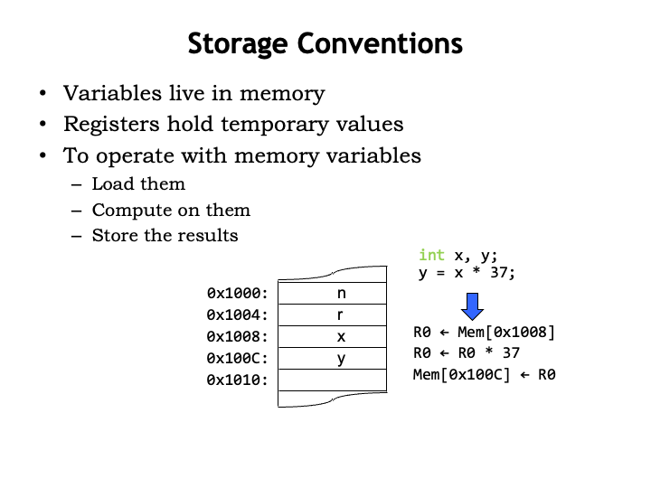
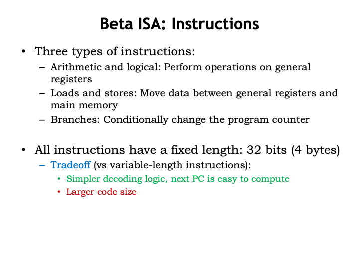
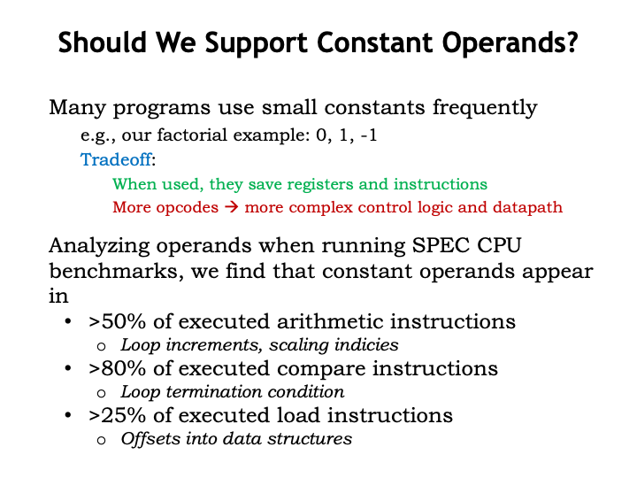

<h2>Data Paths and FSMs</h2>

Welcome to Part 2 of Computation Structures!  In this part of the course, we
turn our attention to the design and implementation of digital
systems that can perform useful computations on different types
of binary data.  We&#700;ll come up with a general-purpose
design for these systems, we which we call
<i>computers</i> so that they can serve as useful tools
in many diverse application areas.  Computers were first used to
perform numeric calculations in science and engineering, but
today they are used as the central control element in any system
where complex behavior is required.

We have a lot to do in this lecture, so let&#700;s get
started!  Suppose we want to design a system to compute the
factorial function on some numeric argument N.  N! is defined as
the product of N times N-1 times N-2, and so on down to 1.

We can use a programming language like C to describe the
sequence of operations necessary to perform the factorial
computation.  In this program there are two variables,
&#8220;a&#8221; and &#8220;b&#8221;.  &#8220;a&#8221; is used to
accumulate the answer as we compute it step-by-step.
&#8220;b&#8221; is used to hold the next value we need to
multiply. &#8220;b&#8221; starts with the value of the numeric
argument N. The DO loop is where the work gets done: on each
loop iteration we perform one of the multiplies from the
factorial formula, updating the value of the accumulator
&#8220;a&#8221; with the result, then decrementing
&#8220;b&#8221; in preparation for the next loop iteration.

If we want to implement a digital system that performs this
sequence of operations, it makes sense to use sequential logic!
Here&#700;s the state transition diagram for a high-level
finite-state machine designed to perform the necessary
computations in the desired order.  We call this a high-level
FSM since the <i>outputs</i> of each state are more than
simple logic levels.  They are formulas indicating operations to
be performed on source variables, storing the result in a
destination variable.

The sequence of states visited while the FSM is running mirrors
the steps performed by the execution of the C program.  The FSM
repeats the LOOP state until the new value to be stored in
&#8220;b&#8221; is equal to 0, at which point the FSM
transitions into the final DONE state.

The high-level FSM is useful when designing the circuitry
necessary to implement the desired computation using our digital
logic building blocks.  We&#700;ll use 32-bit D-registers to
hold the &#8220;a&#8221; and &#8220;b&#8221; values.  And
we&#700;ll need a 2-bit D-register to hold the 2-bit encoding
of the current state, <i>i.e.</i>, the encoding for either START, LOOP
or DONE.  We&#700;ll include logic to compute the inputs
required to implement the correct state transitions.  In this
case, we need to know if the new value for &#8220;b&#8221; is
zero or not.  And, finally, we&#700;ll need logic to perform
multiply and decrement, and to select which value should be
loaded into the &#8220;a&#8221; and &#8220;b&#8221; registers
the end of each FSM cycle.

Let&#700;s start by designing the logic that implements the
desired computations &#8212; we call this part of the logic the
<i>datapath</i>.

First we&#700;ll need two 32-bit D-registers to hold the
&#8220;a&#8221; and &#8220;b&#8221; values.  Then we&#700;ll
draw the combinational logic blocks needed to compute the values
to be stored in those registers.  In the START state , we
need the constant 1 to load into the &#8220;a&#8221; register
and the constant N to load into the &#8220;b&#8221; register.
In the LOOP state, we need to compute a*b for the
&#8220;a&#8221; register and b-1 for the &#8220;b&#8221;
register.  Finally, in the DONE state , we need to be
able to reload each register with its current value.

We&#700;ll use multiplexers to select the appropriate value to
load into each of the data registers.  These multiplexers are
controlled by 2-bit select signals that choose which of the
three 32-bit input values will be the 32-bit value to be loaded
into the register.  So by choosing the appropriate values for
WASEL and WBSEL, we can make the datapath compute the desired
values at each step in the FSM&#700;s operation.

Next we&#700;ll add the combinational logic needed to control
the FSM&#700;s state transitions.  In this case, we need to
test if the new value to be loaded into the &#8220;b&#8221;
register is zero.  The Z signal from the datapath will be 1 if
that&#700;s the case and 0 otherwise.

Now we&#700;re all set to add the hardware for the control
FSM, which has one input (Z) from the datapath and generates two
2-bit outputs (WASEL and WBSEL) to control the datapath.
Here&#700;s the truth table for the FSM&#700;s combinational
logic.  S is the current state, encoded as a 2-bit value, and
S&#700; is the next state.

Using our skills from Part 1 of the course, we&#700;re ready
to draw a schematic for the system!  We know how to design the
appropriate multiplier and decrement circuitry.  And we can use
our standard register-and-ROM implementation for the control
FSM.  The Z signal from the datapath is combined with the 2 bits
of current state to form the 3 inputs to the combinational
logic, in this case realized by a read-only memory with $2^3=8$
locations.  Each ROM location has the appropriate values for the
6 output bits: 2 bits each for WASEL, WBSEL, and next state.
The table on the right shows the ROM contents, which are easily
determined from the table on the previous slide.

Okay, we&#700;ve figured out a way to design hardware to
perform a particular computation: Draw the state transition
diagram for an FSM that describes the sequence of operations
needed to complete the computation.  Then construct the
appropriate datapath, using registers to store values and
combinational logic to implement the needed operations.  Finally
build an FSM to generate the control signals required by the
datapath.

Is the datapath plus control logic itself an FSM?  Well, it has
registers and some combinational logic, so, yes, it is an FSM.
Can we draw the truth table?  In theory, yes.  In practice,
there are 66 bits of registers and hence 66 bits of state, so
our truth table would need $2^{66}$ rows!  Hmm, not very likely
that we&#700;d be able to draw the truth table!  The difficulty
comes from thinking of the registers in the datapath as part of
the state of our super-FSM.  That&#700;s why we think about the
datapath as being separate from the control FSM.

So how do we generalize this approach so we can use one
computer circuit to solve many different problems.  Well, most
problems would probably require more storage for operands and
results.  And a larger list of allowable operations would be
handy.  This is actually a bit tricky: what&#700;s the minimum
set of operations we can get away with?  As we&#700;ll see
later, surprisingly simple hardware is sufficient to perform any
realizable computation.  At the other extreme, many complex
operations (<i>e.g.</i>, fast fourier transform) are best implemented as
sequences of simpler operations (<i>e.g.</i>, add and multiply) rather
than as a single massive combinational circuit.  These sorts of
design tradeoffs are what makes computer architecture fun!

We&#700;d then combine our larger storage with logic for our
chosen set of operations into a general purpose datapath that
could be reused to solve many different problems.  Let&#700;s
see how that would work...

Here&#700;s a datapath with 4 data registers to hold results.
The ASEL and BSEL multiplexers allow any of the data registers
to be selected as either operand for our repertoire of
arithmetic and boolean operations.  The result is selected by
the OPSEL MUX and can be written back into any of the data
registers by setting the WEN control signal to 1 and using the
2-bit WSEL signal to select which data register will be loaded
at the next rising clock edge.  Note that the data registers
have a load-enable control input: when this signal is 1, the
register will load a new value from its D input, otherwise it
ignores the D input and simply reloads its previous value.

And, of course, we&#700;ll add a control FSM to generate the
appropriate sequence of control signals for the datapath.  The Z
input from the datapath allows the system to perform
data-dependent operations, where the sequence of operations can
be influenced by the actual values in the data registers.

Here&#700;s the state transition diagram for the control FSM
we&#700;d use if we wanted to use this datapath to compute
factorial assuming the initial contents of the data registers
are as shown.  We need a few more states than in our initial
implementation since this datapath can only perform one
operation at each step.  So we need three steps for each
iteration: one for the multiply, one for the decrement, and one
for the test to see if we&#700;re done.

As seen here, it&#700;s often the case that general-purpose
computer hardware will need more cycles and perhaps involve more
hardware than an optimized single-purpose circuit.

You can solve many different problems with this system:
exponentiation, division, square root, and so on, so long as you
don&#700;t need more than four data registers to hold input
data, intermediate results, or the final answer.

By designing a control FSM, we are in effect
&#8220;programming&#8221; our digital system, specifying the
sequence of operations it will perform.

This is exactly how the early digital computers worked!
Here&#700;s a picture of the ENIAC computer built in 1943 at
the University of Pennsylvania.

The Wikipedia article on the ENIAC tells us that &#8220;ENIAC
could be programmed to perform complex sequences of operations,
including loops, branches, and subroutines. The task of taking a
problem and mapping it onto the machine was complex, and usually
took weeks. After the program was figured out on paper, the
process of getting the program into ENIAC by manipulating its
switches and cables could take days. This was followed by a
period of verification and debugging, aided by the ability to
execute the program step by step.&#8221;

It&#700;s clear that we need a less cumbersome way to program
our computer!

<h2>The von Neumann Model</h2>

There are many approaches to building a general-purpose
computer that can be easily re-programmed for new problems.
Almost all modern computers are based on the <i>stored
program</i> computer architecture developed by John von
Neumann in 1945, which is now commonly referred to as the
&#8220;von Neumann model&#8221;.

The von Neumann model has three components.  There&#700;s a
central processing unit (aka the CPU) that contains a datapath
and control FSM as described previously.

The CPU is connected to a read/write memory that holds some
number W of words, each with N bits.  Nowadays, even small
memories have a billion words and the width of each location is
at least 32 bits (usually more).  This memory is often referred
to as <i>main memory</i> to distinguish it from other
memories in the system.  You can think of it as an array: when
the CPU wishes to operate on values in memory, it sends
the memory an array index, which we call the address, and, after
a short delay (currently 10&#700;s of nanoseconds) the memory
will return the N-bit value stored at that address.  Writes to
main memory follow the same protocol except, of course, the data
flows in the opposite direction.  We&#700;ll talk about memory
technologies a couple of lectures from now.

And, finally, there are input/output devices that enable the
computer system to communicate with the outside world or to
access data storage that, unlike main memory, will remember
values even when turned off.

The key idea is to use main memory to hold the instructions for
the CPU as well as data.  Both instructions and data are, of
course, just binary data stored in main memory.

Interpreted as an instruction, a value in memory can be thought
of as a set of fields containing one or bits encoding
information about the actions to be performed by the CPU.  The
opcode field indicates the operation to be performed (<i>e.g.</i>, ADD,
XOR, COMPARE).  Subsequent fields specify which registers supply
the source operands and the destination register where the
result is stored.  The CPU interprets the information in the
instruction fields and performs the requested operation.  It
would then move on to the next instruction in memory, executing
the stored program step-by-step.  The goal of this lecture is to
discuss the details of what operations we want the CPU to
perform, how many registers we should have, and so on.

Of course, some values in memory are not instructions! They
might be binary data representing numeric values, strings of
characters, and so on.  The CPU will read these values into its
temporary registers when it needs to operate on them and write
newly computed values back into memory.

Mr. Blue is asking a good question: how do we know which words
in memory are instructions and which are data?  After all,
they&#700;re both binary values!  The answer is that we
can&#700;t tell by looking at the values &#8212; it&#700;s how
they are used by the CPU that distinguishes instructions from
data.  If a value is loaded into the datapath, it&#700;s being
used as data.  If a value is loaded by the control logic,
it&#700;s being used an instruction.

So this is the digital system we&#700;ll build to perform
computations.  We&#700;ll start with a datapath that contains
some number of registers to hold data values.  We&#700;ll be
able to select which registers will supply operands for the
arithmetic and logic unit that will perform an operation. The
ALU produces a result and other status signals.  The ALU result
can be written back to one of the registers for later
use. We&#700;ll provide the datapath with means to move data to
and from main memory.

There will be a control unit that provides the necessary
control signals to the datapath.  In the example datapath shown
here, the control unit would provide ASEL and BSEL to select two
register values as operands and DEST to select the register
where the ALU result will be written.  If the datapath had, say,
32 internal registers, ASEL, BSEL and DEST would be 5-bit
values, each specifying a particular register number in the
range 0 to 31.  The control unit also provides the FN function
code that controls the operation performed by the ALU.  The ALU
we designed in Part 1 of the course requires a 6-bit function
code to select between a variety of arithmetic, boolean and
shift operations.

The control unit would load values from main memory to be
interpreted as instructions.  The control unit contains a
register, called the <i>program counter</i>, that keeps
track of the address in main memory of the next instruction to
be executed.  The control unit also contains a (hopefully small)
amount of logic to translate the instruction fields into the
necessary control signals.  Note the control unit receives
status signals from the datapath that will enable programs to
execute different sequences of instructions if, for example, a
particular data value was zero.

The datapath serves as the brawn of our digital system and is
responsible for storing and manipulating data values.  The
control unit serves as the brain of our system, interpreting the
program stored in main memory and generating the necessary
sequence of control signals for the datapath.

Instructions are the fundamental unit of work. They&#700;re
fetched by the control unit and executed one after another in
the order they are fetched.  Each instruction specifies the
operation to be performed along with the registers to supply the
source operands and destination register where the result will
be stored.

In a von Neumann machine, instruction execution involves the
steps shown here: the instruction is loaded from the memory
location whose address is specified by the program counter.
When the requested data is returned by the memory, the
instruction fields are converted to the appropriate control
signals for the datapath, selecting the source operands from the
specified registers, directing the ALU to perform the specified
operation, and storing the result in the specified destination
register.  The final step in executing an instruction is
updating the value of the program counter to be the address of
the next instruction.

This execution loop is performed again and again.  Modern
machines can execute up more than a billion instructions per
second!

The discussion so far has been a bit abstract.  Now it&#700;s
time to roll up our sleeves and figure out what instructions we
want our system to support.  The specification of instruction
fields and their meaning along with the details of the datapath
design are collectively called the instruction set architecture
(ISA) of the system.  The ISA is a detailed functional
specification of the operations and storage mechanisms and
serves as a contract between the designers of the digital
hardware and the programmers who will write the programs.  Since
the programs are stored in main memory and can hence be changed,
we&#700;ll call them software, to distinguish them from the
digital logic which, once implemented, doesn&#700;t change.
It&#700;s the combination of hardware and software that
determine the behavior of our system.

The ISA is a new layer of abstraction: we can write programs
for the system without knowing the implementation details of the
hardware.  As hardware technology improves we can build faster
systems without having to change the software.  You can see here
that over a fifteen year timespan, the hardware for executing
the Intel x86 instruction set went from executing 300,000
instructions per second to executing 5 billion instructions per
second.  Same software as before, we&#700;ve just taken
advantage of smaller and faster MOSFETs to build more complex
circuits and faster execution engines.

But a word of caution is in order!  It&#700;s tempting to make
choices in the ISA that reflect the constraints of current
technologies, <i>e.g.</i>, the number of internal registers, the width
of the operands, or the maximum size of main memory.  But it
will be hard to change the ISA when technology improves since
there&#700;s a powerful economic incentive to ensure that old
software can run on new machines, which means that a particular
ISA can live for decades and span many generations of
technology.  If your ISA is successful, you&#700;ll have to
live with any bad choices you made for a very long time.

Designing an ISA is hard!  What are the operations that should
be supported?  How many internal registers?  How much main
memory?  Should we design the instruction encoding to minimize
program size or to keep the logic in the control unit as simple
as possible?  Looking into our crystal ball, what can we say
about the computation and storage capabilities of future
technologies?

We&#700;ll answer these questions by taking a quantitative
approach.  First we&#700;ll choose a set of benchmark programs,
chosen as representative of the many types of programs we expect
to run on our system.  So some of benchmark programs will
perform scientific and engineering computations, some will
manipulate large data sets or perform database operations, some
will require specialized computations for graphics or
communications, and so on.  Happily, after many decades of
computer use, several standardized benchmark suites are
available for us to use.

We&#700;ll then implement the benchmark programs using our
instruction set and simulate their execution on our proposed
datapath.  We&#700;ll evaluate the results to measure how well
the system performs.  But what do we mean by &#8220;well&#8221;?
That&#700;s where it gets interesting: &#8220;well&#8221; could
refer to execution speed, energy consumption, circuit size,
system cost, etc.  If you&#700;re designing a smart watch,
you&#700;ll make different choices than if you&#700;re
designing a high-performance graphics card or a data-center
server.

Whatever metric you choose to evaluate your proposed system,
there&#700;s an important design principle we can follow:
identify the common operations and focus on them as you optimize
your design.  For example, in general-purpose computing, almost
all programs spend a lot of their time on simple arithmetic
operations and accessing values in main memory.  So those
operations should be made as fast and energy efficient as
possible.

Now, let&#700;s get to work designing our own instruction set
and execution engine, a system we&#700;ll call the Beta.

<h2>Beta ISA: Storage</h2>

The Beta is an example of a reduced-instruction-set computer
(RISC) architecture.  &#8220;Reduced&#8221; refers to the fact
that in the Beta ISA, most instructions only access the internal
registers for their operands and destination.  Memory values are
loaded and stored using separate memory-access instructions,
which implement only a simple address calculation.  These
reductions lead to smaller, higher-performance hardware
implementations and simpler compilers on the software side.  The
ARM and MIPS ISAs are other examples of RISC architectures.
Intel&#700;s x86 ISA is more complex.

There is a limited amount of storage inside of the CPU &#8212;
using the language of sequential logic, we&#700;ll refer to
this as the CPU state.  There&#700;s a 32-bit program counter
(PC for short) that holds the address of the current instruction
in main memory.  And there are thirty-two registers, numbered 0
through 31. Each register holds a 32-bit value. We&#700;ll use
use 5-bit fields in the instruction to specify the number of the
register to be used an operand or destination.  As shorthand,
we&#700;ll refer to a register using the prefix &#8220;R&#8221;
followed by its number, <i>e.g.</i>, &#8220;R0&#8221; refers to the
register selected by the 5-bit field 0b00000.

Register 31 (R31) is special &#8212; its value always reads as
0 and writes to R31 have no affect on its value.

The number of bits in each register and hence the number of
bits supported by ALU operations is a fundamental parameter of
the ISA.  The Beta is a 32-bit architecture.  Many modern
computers are 64-bit architectures, meaning they have 64-bit
registers and a 64-bit datapath.

Main memory is an array of 32-bit words.  Each word contains
four 8-bit bytes.  The bytes are numbered 0 through 3, with byte
0 corresponding to the low-order 7 bits of the 32-bit value, and
so on.  The Beta ISA only supports word accesses, either loading
or storing full 32-bit words.  Most &#8220;real&#8221; computers
also support accesses to bytes and half-words.

Even though the Beta only accesses full words, following a
convention used by many ISAs it uses byte addresses.  Since
there are 4 bytes in each word, consecutive words in memory have
addresses that differ by 4.  So the first word in memory has
address 0, the second word address 4, and so on.  You can see
the addresses to left of each memory location in the diagram
shown here.  Note that we&#700;ll usually use hexadecimal
notation when specifying addresses and other binary values
&#8212; the &#8220;0x&#8221; prefix indicates when a number is
in hex.  When drawing a memory diagram, we&#700;ll follow the
convention that addresses increase as you read from top to
bottom.

The Beta ISA supports 32-bit byte addressing, so an address
fits exactly into one 32-bit register or memory location.  The
maximum memory size is $2^{32}$ bytes or $2^{30}$ words &#8212;
that&#700;s 4 gigabytes (4 GB) or one billion words of main
memory.  Some Beta implementations might actually have a smaller
main memory, <i>i.e.</i>, one with fewer than 1 billion locations.

Why have separate registers and main memory?  Well, modern
programs and datasets are very large, so we&#700;ll want to
have a large main memory to hold everything.  But large memories
are slow and usually only support access to one location at a
time, so they don&#700;t make good storage for use in each
instruction which needs to access several operands and store a
result.  If we used only one large storage array, then an
instruction would need to have three 32-bit addresses to specify
the two source operands and destination &#8212; each instruction
encoding would be huge!  And the required memory accesses would
have to be one-after-the-other, really slowing down instruction
execution.

On the other hand, if we use registers to hold the operands and
serve as the destination, we can design the register hardware
for parallel access and make it very fast.  To keep the speed up
we won&#700;t be able to have very many registers &#8212; a
classic size-vs-speed performance tradeoff we see in digital
systems all the time.  In the end, the tradeoff leading to the
best performance is to have a small number of very fast
registers used by most instructions and a large but slow main
memory.  So that&#700;s what the BETA ISA does.

In general, all program data will reside in main memory.  Each
variable used by the program &#8220;lives&#8221; in a specific
main memory location and so has a specific memory address.  For
example, in the diagram below, the value of variable
&#8220;x&#8221; is stored in memory location 0x1008, and the
value of &#8220;y&#8221; is stored in memory location 0x100C,
and so on.

To perform a computation, <i>e.g.</i>, to compute x*37 and store the
result in y, we would have to first load the value of x into a
register, say, R0.  Then we would have the datapath multiply the
value in R0 by 37, storing the result back into R0.  Here
we&#700;ve assumed that the constant 37 is somehow available to
the datapath and doesn&#700;t itself need to be loaded from
memory.  Finally, we would write the updated value in R0 back
into memory at the location for y.

Whew!  A lot of steps...  Of course, we could avoid all the
loading and storing if we chose to keep the values for x and y
in registers.  Since there are only 32 registers, we can&#700;t
do this for all of our variables, but maybe we could arrange to
load x and y into registers, do all the required computations
involving x and y by referring to those registers, and then,
when we&#700;re done, store changes to x and y back into memory
for later use.  Optimizing performance by keeping often-used
values in registers is a favorite trick of programmers and
compiler writers.

So the basic program template is some loads to bring values
into the registers, followed by computation, followed by any
necessary stores.  ISAs that use this template are usually
referred to as <i>load-store architectures</i>.

Having talked about the storage resources provided by the Beta
ISA, let&#700;s design the Beta instructions themselves.  This
might be a good time to print a copy of the handout called the
&#8220;Summary of Beta Instruction Formats&#8221; so
you&#700;ll have it for handy reference.

The Beta has three types of instructions: compute instructions
that perform arithmetic and logic operations on register values,
load and store instructions that access values in main memory,
and branch instructions that change the value of the program
counter.

We&#700;ll discuss each class of instructions in turn.

In the Beta ISA, all the instruction encodings are the same
size: each instruction is encoded in 32 bits and hence occupies
exactly one 32-bit word in main memory.  This instruction
encoding leads to simpler control-unit logic for decoding
instructions.  And computing the next value of the program
counter is very simple: for most instructions, the next
instruction can be found in the following memory location.  We
just need to add 4 to the current value of program counter to
advance to the next instruction.

As we saw in Part 1 of the course, fixed-length encodings are
often inefficient in the sense that the same information content
(in this case, the encoded program) can be encoded using fewer
bits.  To do better we would need a variable-length encoding for
instructions, where frequently-occurring instructions would use
a shorter encoding.  But hardware to decode variable-length
instructions is complex since there may be several instructions
packed into one memory word, while other instructions might
require loading several memory words.  The details can be worked
out, but there&#700;s a performance and energy cost associated
with the more efficient encoding.

Nowadays, advances in memory technology have made memory size
less of an issue and the focus is on the higher-performance
needed by today&#700;s applications.  Our choice of a
fixed-length encoding leads to larger code size, but keeps the
hardware execution engine small and fast.

</vertical>
</sequential>
<sequential display_name="Beta ISA: Computations" url_name="alu">
<vertical display_name="Beta ISA: Computations">

The computation performed by the Beta datapath happens in the
arithmetic-and-logic unit (ALU).  We&#700;ll be using the ALU
designed in Part 1 of the course.

The Beta ALU instructions have 4 instruction fields.
There&#700;s a 6-bit field specifying the ALU operation to be
performed &#8212; this field is called the opcode.  The two
source operands come from registers whose numbers are specified
by the 5-bit &#8220;ra&#8221; and &#8220;rb&#8221; fields.  So
we can specify any register from R0 to R31 as a source operand.
The destination register is specified by the 5-bit
&#8220;rc&#8221; field.

This instruction format uses 21 bits of the 32-bit word, the
remaining bits are unused and should be set to 0.  The diagram
shows how the fields are positioned in the 32-bit word.  The
choice of position for each field is somewhat arbitrary, but to
keep the hardware simple, when we can we&#700;ll want to use
the same field positions for similar fields in the other
instruction encodings.  For example, the opcode will always be
found in bits [31:26] of the instruction.

Here&#700;s the binary encoding of an ADD instruction.  The
opcode for ADD is the 6-bit binary value 0b100000 &#8212; you
can find the binary for each opcode in the Opcode Table in the
handout mentioned before.  The &#8220;rc&#8221; field specifies
that the result of the ADD will be written into R3.  And the
&#8220;ra&#8221; and &#8220;rb&#8221; fields specify that the
first and second source operands are R1 and R2 respectively.  So
this instruction adds the 32-bit values found in R1 and R2,
writing the 32-bit sum into R3.

Note that it&#700;s permissible to refer to a particular
register several times in the same instruction.  So, for
example, we could specify R1 as the register for both source
operands AND also as the destination register.  If we did,
we&#700;d be adding R1 to R1 and writing the result back into
R1, which would effectively multiply the value in R1 by 2.

Since it&#700;s tedious and error-prone to transcribe 32-bit
binary values, we&#700;ll often use hexadecimal notation for
the binary representation of an instruction.  In this example,
the hexadecimal notation for the encoded instruction is
0x80611000.  However, it&#700;s *much* easier if we describe
the instructions using a functional notation, <i>e.g.</i>,
&#8220;ADD(r1,r2,r3)&#8221;.  Here we use a symbolic name for
each operation, called a mnemonic.  For this instruction the
mnemonic is &#8220;ADD&#8221;, followed by a parenthesized list
of operands, in this case the two source operands (r1 and r2),
then the destination (r3).  So we&#700;ll understand that
ADD(ra,rb,rc) is shorthand for asking the Beta to compute the
sum of the values in registers ra and rb, writing the result as
the new value of register rc.

Here&#700;s the list of the mnemonics for all the operations
supported by the Beta.  There is a detailed description of what
each instruction does in the Beta Documentation handout.  Note
that all these instructions use same 4-field template, differing
only in the value of the opcode field.  This first step was
pretty straightforward &#8212; we simply provided instruction
encodings for the basic operations provided by the ALU.

Now that we have our first group of instructions, we can create
a more concrete implementation sketch.

Here we see our proposed datapath.  The 5-bit &#8220;ra&#8221;
and &#8220;rb&#8221; fields from the instruction are used to
select which of the 32 registers will be used for the two
operands.  Note that register 31 isn&#700;t actually a
read/write register, it&#700;s just the 32-bit constant 0, so
that selecting R31 as an operand results in using the value 0.
The 5-bit &#8220;rc&#8221; field from the instruction selects
which register will be written with the result from the ALU.
Not shown is the hardware needed to translate the instruction
opcode to the appropriate ALU function code &#8212; perhaps a
64-location ROM could be used to perform the translation by
table lookup.

The program counter logic supports simple sequential execution
of instructions.  It&#700;s a 32-bit register whose value is
updated at the end of each instruction by adding 4 to its
current value.  This means the next instruction will come from
the memory location following the one that holds the current
instruction.

In this diagram we see one of the benefits of a RISC
architecture: there&#700;s not much logic needed to decode the
instruction to produce the signals needed to control the
datapath.  In fact, many of the instruction fields are used
as-is!

ISA designers receive many requests for what are affectionately
known as &#8220;features&#8221; &#8212; additional instructions
that, in theory, will make the ISA better in some way.  Dealing
with such requests is the moment to apply our quantitive
approach in order to be able to judge the tradeoffs between cost
and benefits.

Our first &#8220;feature request&#8221; is to allow small
constants as the second operand in ALU instructions.  So if we
replaced the 5-bit &#8220;rb&#8221; field, we would have room in
the instruction to include a 16-bit constant as bits [15:0] of
the instruction. The argument in favor of this request is that
small constants appear frequently in many programs and it would
make programs shorter if we didn&#700;t have use load
operations to read constant values from main memory.  The
argument against the request is that we would need additional
control and datapath logic to implement the feature, increasing
the hardware cost and probably decreasing the performance.

So our strategy is to modify our benchmark programs to use the
ISA augmented with this feature and measure the impact on a
simulated execution.  Looking at the results, we find that there
is compelling evidence that small constants are indeed very
common as the second operands to many operations.  Note that
we&#700;re not so much interested in simply looking at the
code.  Instead we want to look at what instructions actually get
executed while running the benchmark programs.  This will take
into account that instructions executed during each iteration of
a loop might get executed 1000&#700;s of times even though they
only appear in the program once.

Looking at the results, we see that over half of the arithmetic
instructions have a small constant as their second operand.

Comparisons involve small constants 80% of the time.  This
probably reflects the fact that during execution comparisons are
used in determining whether we&#700;ve reached the end of a
loop.

And small constants are often found in address calculations
done by load and store operations.

Operations involving constant operands are clearly a common
case, one well worth optimizing.  Adding support for small
constant operands to the ISA resulted in programs that were
measurably smaller and faster.  So: feature request
approved!

Here we see the second of the two Beta instruction formats.
It&#700;s a modification of the first format where we&#700;ve
replaced the 5-bit &#8220;rb&#8221; field with a 16-bit field
holding a constant in two&#700;s complement format.  This will
allow us to represent constant operands in the range of 0x8000
(decimal -32768) to 0x7FFF (decimal 32767).

Here&#700;s an example of the add-constant (ADDC) instruction
which adds the contents of R1 and the constant -3, writing the
result into R3.  We can see that the second operand in the
symbolic representation is now a constant (or, more generally,
an expression that can evaluated to get a constant value).

One technical detail needs discussion: the instruction contains
a 16-bit constant, but the datapath requires a 32-bit operand.
How does the datapath hardware go about converting from, say,
the 16-bit representation of -3 to the 32-bit representation of
-3?

Comparing the 16-bit and 32-bit representations for various
constants, we see that if the 16-bit two&#700;s-complement
constant is negative (<i>i.e.</i>, its high-order bit is 1), the high
sixteen bits of the equivalent 32-bit constant are all
1&#700;s.  And if the 16-bit constant is non-negative (<i>i.e.</i>, its
high-order bit is 0), the high sixteen bits of the 32-bit
constant are all 0&#700;s.  Thus the operation the hardware
needs to perform is <i>sign extension</i> where the
sign-bit of the 16-bit constant is replicated sixteen times to
form the high half of the 32-constant.  The low half of the
32-bit constant is simply the 16-bit constant from the
instruction.  No additional logic gates will be needed to
implement sign extension &#8212; we can do it all with
wiring.

Here are the fourteen ALU instructions in their &#8220;with
constant&#8221; form, showing the same instruction mnemonics but
with a &#8220;C&#8221; suffix indicate the second operand is a
constant.  Since these are additional instructions, these have
different opcodes than the original ALU instructions.

Finally, note that if we need a constant operand whose
representation does NOT fit into 16 bits, then we have to store
the constant as a 32-bit value in a main memory location and
load it into a register for use just like we would any variable
value.

To give some sense for the additional datapath hardware that
will be needed, let&#700;s update our implementation sketch to
add support for constants as the second ALU operand.  We
don&#700;t have to add much hardware: just a multiplexer which
selects either the &#8220;rb&#8221; register value or the
sign-extended constant from the 16-bit field in the instruction.
The BSEL control signal that controls the multiplexer is 1 for
the ALU-with-constant instructions and 0 for the regular ALU
instructions.

We&#700;ll put the hardware implementation details aside for
now and revisit them in a few lectures.

<h2>Beta ISA: Memory Access</h2>

Now let&#700;s turn our attention to the second class of
instructions: load (LD) and store (ST), which allow the CPU to
access values in memory.  Note that since the Beta is a
load-store architecture these instructions are the *only*
mechanism for accessing memory values.

The LD and ST instructions use the same instruction template as
the ALU-with-constant instructions.  To access memory,
we&#700;ll need a memory address, which is computed by adding
the value of the &#8220;ra&#8221; register to the sign-extended
16-bit constant from the low-order 16 bits of the instruction.
This computation is exactly the one performed by the ADDC
instruction &#8212; so we&#700;ll reuse that hardware &#8212;
and the sum is sent to main memory as the byte address of the
location to be accessed.  For the LD instruction, the data
returned by main memory is written to the &#8220;rc&#8221;
register.

The store instruction (ST) performs the same address
calculation as LD, then reads the data value from the
&#8220;rc&#8221; register and sends both to main memory.  The ST
instruction is special in several ways: it&#700;s the only
instruction that needs to read the value of the &#8220;rc&#8221;
register, so we&#700;ll need to adjust the datapath hardware
slightly to accommodate that need.  And since &#8220;rc&#8221;
is serving as a source operand, it appears as the first operand
in the symbolic form of the instruction, followed by
&#8220;const&#8221; and &#8220;ra&#8221; which are specifying
the destination address.  ST is the only instruction that does
*not* write a result into the register file at end of the
instruction.

Here&#700;s the example we saw earlier, where we needed to
load the value of the variable x from memory, multiply it by 37
and write the result back to the memory location that holds the
value of the variable y.

Now that we have actual Beta instructions, we&#700;ve
expressed the computation as a sequence of three instructions.
To access the value of variable x, the LD instruction adds the
contents of R31 to the constant 0x1008, which sums to 0x1008,
the address we need to access.  The ST instruction specifies a
similar address calculation to write into the location for the
variable y.

The address calculation performed by LD and ST works well when
the locations we need to access have addresses that fit into the
16-bit constant field.  What happens when we need to access
locations at addresses higher than 0x7FFF?  Then we need to
treat those addresses as we would any large constant, and store
those large addresses in main memory so they can be loaded into
a register to be used by LD and ST.  Okay, but what if the
number of large constants we need to store is greater than will
fit in low memory, <i>i.e.</i>, the addresses we can access directly?
To solve this problem, the Beta includes a &#8220;load
relative&#8221; (LDR) instruction, which we&#700;ll see in the
lecture on the Beta implementation.

<h2>Beta ISA: Control Flow</h2>

Finally, let&#700;s discuss the third class of instructions
that let us change the program counter.  Up until now, the
program counter has simply been incremented by 4 at the end of
each instruction, so that the next instruction comes from the
memory location that immediately follows the location that held
the current instruction, <i>i.e.</i>, the Beta has been executing
instructions sequentially from memory.

But in many programs, such as in factorial, we need to disrupt
sequential execution, either to loop back to repeat some earlier
instruction, or to skip over instructions because of some data
dependency.  We need a way to change the program counter based
on data values generated by the program&#700;s execution.  In
the factorial example, as long as b is not equal to 0, we need
to keep executing the instructions that calculate a*b and
decrement b.  So we need instructions to test the value of b
after it&#700;s been decremented and if it&#700;s non-zero,
change the PC to repeat the loop one more time.

Changing the PC depending on some condition is implemented by a
branch instruction, and the operation is referred to as a
<i>conditional branch</i>.  When the branch is taken, the
PC is changed and execution is restarted at the new location,
which is called the branch target.  If the branch is not taken,
the PC is incremented by 4 and execution continues with the
instruction following the branch.

As the name implies, a branch instruction represents a
potential fork in the execution sequence.  We&#700;ll use
branches to implement many different types of control
structures: loops, conditionals, procedure calls, etc.

Branch instructions also use the instruction format with the
16-bit signed constant.  The operation of the branch
instructions are a bit complicated, so let&#700;s walk through
their operation step-by-step.

Let&#700;s start by looking at the operation of the BEQ
instruction.  First the usual PC+4 calculation is performed,
giving us the address of the instruction following the BEQ.
This value is written to the &#8220;rc&#8221; register whether
or not the branch is taken.  This feature of branches is pretty
handy and we&#700;ll use it to implement procedure calls a
couple of lectures from now.  Note that if we don&#700;t need
to remember the PC+4 value, we can specify R31 as the
&#8220;rc&#8221; register.

Next, BEQ tests the value of the &#8220;ra&#8221; register to
see if it&#700;s equal to 0.  If it is equal to 0, the branch
is taken and the PC is incremented by the amount specified in
the constant field of the instruction.  Actually the constant,
called an offset since we&#700;re using it to offset the PC, is
treated as a word offset and is multiplied by 4 to convert it a
byte offset since the PC uses byte addressing.  If the contents
of the &#8220;ra&#8221; register is not equal to 0, the PC is
incremented by 4 and execution continues with the instruction
following the BEQ.

Let me say a few more words about the offset.  The branches
are using what&#700;s referred to as <i>pc-relative
addressing</i>.  That means the address of the branch target is
specified relative to the address of the branch, or, actually,
relative to the address of the instruction following the branch.
So an offset of 0 would refer to the instruction following the
branch and an offset of -1 would refer to the branch itself.
Negative offsets are called <i>backwards branches</i> and
are usually seen at branches used at the end of loops, where the
looping condition is tested and we branch backwards to the
beginning of the loop if another iteration is called for.
Positive offsets are called <i>forward branches</i>  and
are usually seen in code for <i>if statements</i>, where
we might skip over some part of the program if a condition is
not true.

We can use BEQ to implement a so-called unconditional branch,
<i>i.e.</i>, a branch that is always taken.  If we test R31 to see if
it&#700;s 0, that&#700;s always true, so BEQ(R31,...) would
always branch to the specified target.

There&#700;s also a BNE instruction, identical to BEQ in its
operation except the sense of the condition is reversed: the
branch is taken if the value of register &#8220;ra&#8221; is
non-zero.

It might seem that only testing for zero/non-zero doesn&#700;t
let us do everything we might want to do.  For example, how
would we branch if &#8220;a &lt; b&#8221;?  That&#700;s where the
compare instructions come in &#8212; they do more complicated
comparisons, producing a non-zero value if the comparison is
true and a zero value if the comparison is false.  Then we can
use BEQ and BNE to test the result of the comparison and branch
appropriately.

At long last we&#700;re finally in a position to write Beta
code to compute factorial using the iterative algorithm shown in
C code on the left.  In the Beta code, the loop starts at the
second instruction and is marked with the &#8220;L:&#8221;
label.  The body of the loop consists of the required
multiplication and the decrement of b.  Then, in the fourth
instruction, b is tested and, if it&#700;s non-zero, the BNE
will branch back to the instruction with the label L.

Note that in our symbolic notation for BEQ and BNE instructions
we don&#700;t write the offset directly since that would be a
pain to calculate and would change if we added or removed
instructions from the loop.  Instead we reference the
instruction to which we want to branch, and the program that
translates the symbolic code into the binary instruction fields
will do the offset calculation for us.

There&#700;s a satisfying similarity between the Beta code and
the operations specified by the high-level FSM we created for
computing factorial in the simple programmable datapath
discussed earlier in this lecture.  In this example, each state
in the high-level FSM matches up nicely with a particular Beta
instruction.  We wouldn&#700;t expect that high degree of
correspondence in general, but since our Beta datapath and the
example datapath were very similar, the states and instructions
match up pretty well.

Finally, our last instruction!  Branches conditionally transfer
control to a specific target instruction.  But we&#700;ll also
need the ability to compute the address of the target
instruction &#8212; that ability is provided by the JMP
instruction which simply sets the program counter to value from
register &#8220;ra&#8221;.  Like branches, JMP will write the
PC+4 value into to the specified destination register.

This capability is very useful for implementing procedures in
Beta code.  Suppose we have a procedure &#8220;sqrt&#8221; that
computes the square root of its argument, which is passed in,
say, R0.  We don&#700;t show the code for sqrt on the right,
except for the last instruction, which is a JMP.

On the left we see that the programmer wants to call the sqrt
procedure from two different places in his program.  Let&#700;s
watch what happens...

The first call to the sqrt procedure is implemented by the
unconditional branch at location 0x100 in main memory.  The
branch target is the first instruction of the sqrt procedure, so
execution continues there.  The BEQ also writes the address of
the following instruction (0x104) into its destination register,
R28.  When we reach the end of first procedure call, the JMP
instruction loads the value in R28, which is 0x104, into the PC,
so execution continues with the instruction following the first
BEQ.  So we&#700;ve managed to return from the procedure and
continue execution where we left off in the main program.

When we get to the second call to the sqrt procedure, the
sequence of events is the same as before except that this time
R28 contains 0x67C, the address of the instruction following the
second BEQ. So the second time we reach the end of the sqrt
procedure, the JMP sets the PC to 0x67C and execution resumes
with the instruction following the second procedure call.

Neat!  The BEQs and JMP have worked together to implement
procedure call and return.  We&#700;ll discuss the
implementation of procedures in detail in an upcoming
lecture.

<h2>Beta ISA Summary</h2>

That wraps up the design of the Beta instruction set
architecture.  In summary, the Beta has 32 registers to hold
values that can be used as operands for the ALU.  All other
values, along with the binary representation of the program
itself, are stored in main memory.  The Beta supports 32-bit
memory addresses and can access values in $2^{32} = 4$ gigabytes
of main memory.  All Beta memory access refer to 32-bit words,
so all addresses will be a multiple of 4 since there are 4
bytes/word.

The are two instruction formats.  The first specifies an
opcode, two source registers and a destination register.  The
second replaces the second source register with a 32-bit
constant, derived by sign-extending a 16-bit constant stored in
the instruction itself.

There are three classes of instructions: ALU operations, LD and
ST for accessing main memory, and branches and JMPs that change
the order of execution.

And that&#700;s it!  As we&#700;ll see in the next lecture,
we&#700;ll be able parlay this relatively simple repertoire of
operations into a system that can execute any computation we can
specify.

