
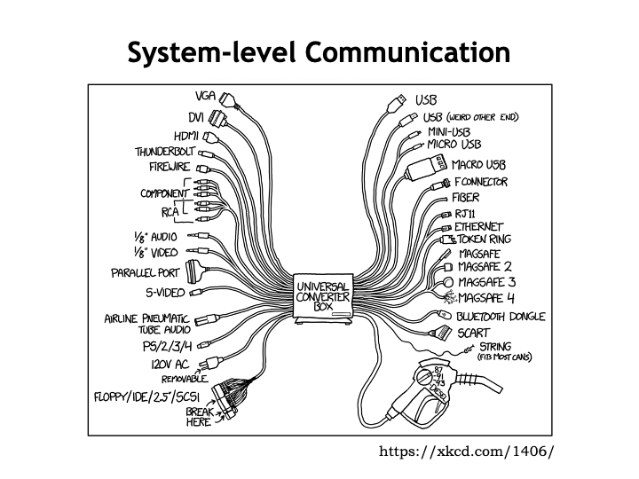

<h2>The Importance of Interfaces</h2>

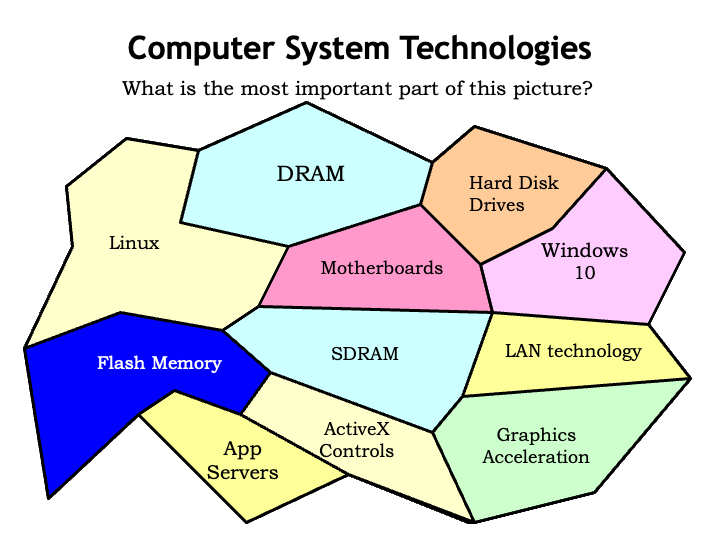

Computer systems bring together many technologies and harness
them to provide fast execution of programs.  Some of these
technologies are relatively new, others have been with us for
decades.  Each of the system components comes with a detailed
specification of their functionality and interface.  The
expectation is that system designers can engineer the system
based on the component specifications without having to know the
details of the implementations of each component.  This is good
since many of the underlying technologies change, often in ways
that allow the components to become smaller, faster, cheaper,
more energy efficient, and so on.  Assuming the new components
still implement same interfaces, they can be integrated into the
system with very little effort.

The moral of this story is that the important part of the
system architecture is the interfaces.

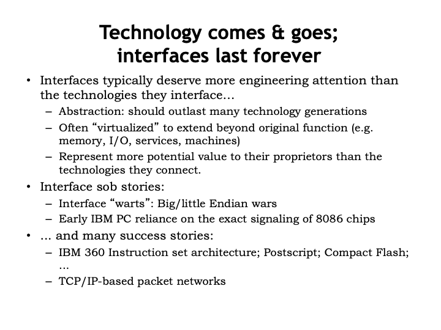

Our goal is to design interface specifications that can survive
many generations of technological change.  One approach to
long-term survival is to base the specification on a useful
abstraction that hides most, if not all, of the low-level
implementation details.  Operating systems provide many
interfaces that have remained stable for many years.  For
example, network interfaces that reliably deliver streams of
bytes to named hosts, hiding the details of packets, sockets,
error detection and recovery, etc.  Or windowing and graphics
systems that render complex images, shielding the application
from details about the underlying graphics engine.  Or journaled
file systems that behind-the-scenes defend against corruption in
the secondary storage arrays.

Basically, we&#700;re long since past the point where we can
afford to start from scratch each time the integrated circuit
gurus are able to double the number of transistors on a chip, or
the communication wizards figure out how to go from 1GHz
networks to 10GHz networks, or the memory mavens are able to
increase the size of main memory by a factor of 4.  The
interfaces that insulate us from technological change are
critical to ensure that improved technology isn&#700;t a
constant source of disruption.

There are some famous examples of where an apparently
convenient choice of interface has had embarrassing long-term
consequences.  For example, back in the days of stand-alone
computing, different ISAs made different choices on how to store
multi-byte numeric values in main memory.  IBM architectures are
store the most-significant byte in the lowest address (big
endian), while Intel&#700;s x86 architectures store the
least-significant byte first (little endian).  But this leads to
all sorts of complications in a networked world where numeric
data is often transferred from system to system.  This is a
prime example of a locally-optimal choice having an unfortunate
global impact.  As the phrase goes: &#8220;a moment of
convenience, a lifetime of regret.&#8221;

Another example is the system-level communication strategy
chosen for the first IBM PC, the original personal computer
based Intel CPU chips.  IBM built their expansion bus for adding
I/O peripherals, memory cards, etc., by simply using the
interface signals provided by then-current x86 CPU.  So the
width of the data bus, the number of address pins, the
data-transfer protocol, etc. where are exactly as designed for
interfacing to that particular CPU.  A logical choice since it
got the job done while keeping costs as low a possible.  But
that choice quickly proved unfortunate as newer,
higher-performance CPUs were introduced, capable of addressing
more memory or providing 32-bit instead of 16-bit external data
paths.  So system architects were forced into offering customers
the Hobson&#700;s choice of crippling system throughput for the
sake of backward compatibility, or discarding the networking
card they bought last year since it was now incompatible with
this year&#700;s system.

But there are success stories too.  The System/360 interfaces
chosen by IBM in the early 1960s carried over to the System/370
in the 70&#700;s and 80&#700;s and to the Enterprise System
Architecture/390 of the 90&#700;s.  Customers had the
expectation that software written for the earlier machines would
continue to work on the newer systems and IBM was able to
fulfill that expectation.

Maybe the most notable long-term interface success is the
design the TCP and IP network protocols in the early 70&#700;s,
which formed the basis for most packet-based network
communication.  A recent refresh expanded the network addresses
from 32 to 128 bits, but that was largely invisible to
applications using the network.  It was a remarkably prescient
set of engineering choices that stood the test of time for over
four decades of exponential growth in network connectivity.

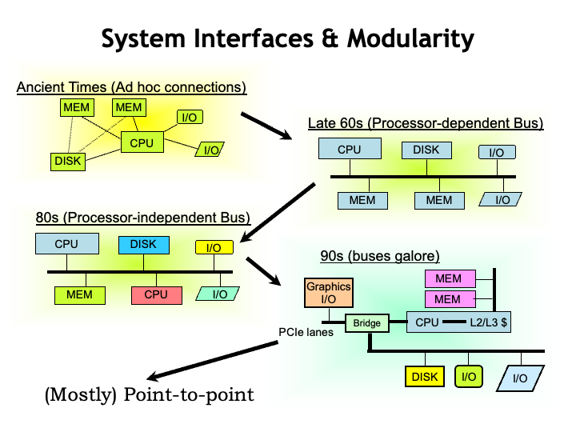

This lecture&#700;s topic is figuring out the appropriate
interface choices for interconnecting system components.  In the
earliest systems these connections were very ad hoc in the sense
that the protocols and physical implementation were chosen
independently for each connection that had to be made.  The
cable connecting the CPU box to the memory box (yes, in those
days, they lived in separate 19-inch racks!) was different than
the cable connecting the CPU to the disk.

Improving circuit technologies allowed system components to
shrink from cabinet-size to board-size and system engineers
designed a modular packaging scheme that allowed users to
mix-and-match board types that plugged into a communication
backplane.  The protocols and signals on the backplane reflected
the different choices made by each vendor &#8212; IBM boards
didn&#700;t plug into Digital Equipment backplanes, and vice
versa.

This evolved into some standardized communication backplanes
that allowed users to do their own system integration, choosing
different vendors for their CPU, memory, networking, etc.
Healthy competition quickly brought prices down and drove
innovation.  However this promising development was overtaken by
rapidly improving performance, which required communication
bandwidths that simply could not be supported across a
multi-board backplane.

These demands for higher performance and the ability to
integrate many different communication channels into a single
chip, lead to a proliferation of different channels.  In many
ways, the system architecture was reminiscent of the original
systems &#8212; ad-hoc purpose-built communication channels
specialized to a specific task.

As we&#700;ll see, engineering considerations have led to the
widespread adoption of general-purpose unidirectional
point-to-point communication channels.  There are still several
types of channels depending on the required performance, the
distance travelled, etc., but asynchronous point-to-point
channels have mostly replaced the synchronous multi-signal
channels of earlier systems.

Most system-level communications involve signaling over wires,
so next we&#700;ll look into some the engineering issues
we&#700;ve had to deal with as communication speeds have
increased from kHz to GHz.

<h2>Wires</h2>

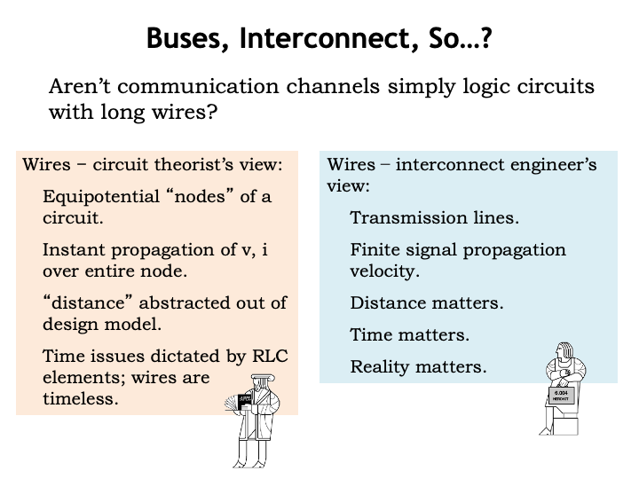

So, how hard can it be to build a communication channel?
Aren&#700;t they just logic circuits with a long wire that runs
from one component to another?

A circuit theorist would tell you that wires in a schematic
diagram are intended to represent the equipotential nodes of the
circuit, which are used to connect component terminals.  In this
simple model, a wire has the same voltage at all points and any
changes in the voltage or current at one component terminal is
instantly propagated to the other component terminals connected
to the same wire.  The notion of distance is abstracted out of
our circuit models: terminals are either connected by a wire, or
they&#700;re not.  If there are resistances, capacitances, and
inductances that need to be accounted for, the necessary
components can be added to the circuit model.  Wires are
timeless.  They are used to show how components connect, but
they aren&#700;t themselves components.

In fact, thinking of wires as equipotential nodes is a very
workable model when the rate of change of the voltage on the
wire is slow compared to the time it takes for an
electromagnetic wave to propagate down the wire.  Only as
circuit speeds have increased with advances in integrated
circuit technologies did this rule-of-thumb start to be violated
in logic circuits where the components were separated by at most
10&#700;s of inches.

In fact, it has been known since the late 1800s that changes in
voltage levels take finite time to propagate down a wire.
Oliver Heaviside was a self-taught English electrical engineer
who, in the 1880&#700;s, developed a set of
<i>telegrapher&#700;s equations</i> that described how
signals propagate down wires.  Using these, he was able to show
how to improve the rate of transmission on then new
transatlantic telegraph cable by a factor of 10.

We now know that for high-speed signaling we have to treat
wires as transmission lines, which we&#700;ll say more about in
the next few slides.  In this domain, the distance between
components and hence the lengths of wires is of critical concern
if we want to correctly predict the performance of our circuits.
Distance and signal propagation matter &#8212; real-world wires are,
in fact, fairly complex components!

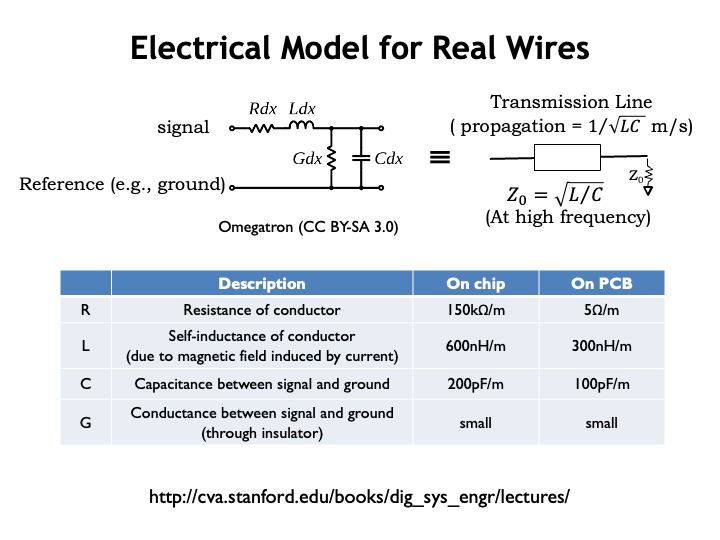

Here&#700;s an electrical model for an infinitesimally small
segment of a real-world wire.  An actual wire is correctly
modeled by imagining a many copies of the model shown here
connected end-to-end.  The signal,
<i>i.e.</i>, the voltage on the wire, is measured with respect
to the reference node which is also shown in the model.

There are 4 parameters that characterize the behavior of the
wire.  R tells us the resistance of the conductor.  It&#700;s
usually negligible for the wiring on printed circuit boards, but
it can be significant for long wires in integrated circuits.  L
represents the self-inductance of the conductor, which
characterizes how much energy will be absorbed by the
wire&#700;s magnetic fields when the current flowing through
the wire changes.  The conductor and reference node are
separated by some sort insulator (which might be just air!) and
hence form a capacitor with capacitance C.  Finally, the
conductance G represents the current that leaks through the
insulator.  Usually this is quite small.

The table shows the parameter values we might measure for wires
inside an integrated circuit and on printed circuit boards.

If we analyze what happens when sending signals down the wire,
we can describe the behavior of the wires using a single
component called a transmission line which has a characteristic
complex-valued impedance $Z_0$.  At high signaling frequencies
and over the distances found on-chip or on circuit boards, such
as one might find in a modern digital system, the transmission
line is lossless, and voltage changes (<i>steps</i>)
propagate down the wire at the rate of $1/\sqrt(LC)$ meters per
second.  Using the values given here for a printed circuit
board, the characteristic impedance is approximately 50 ohms and
the speed of propagation is about 18 cm (7 in.) per ns.

To send digital information from one component to another, we
change the voltage on the connecting wire, and that voltage step
propagates from the sender to the receiver.  We have to pay some
attention to what happens to that energy front when it gets to
the end of the wire!  If we do nothing to absorb that energy,
conservation laws tell us that it reflects off the end of the
wire as an &#8220;echo&#8221; and soon our wire will be full of
echoes from previous voltage steps!

To prevent these echoes we have to terminate the wire with a
resistance to ground that matches the characteristic impedance
of the transmission line.  If the signal can propagate in both
directions, we&#700;ll need termination at both ends.

What this model is telling is the time it takes to transmit
information from one component to another and that we have to be
careful to absorb the energy associated with the transmission
when the information has reached its destination.

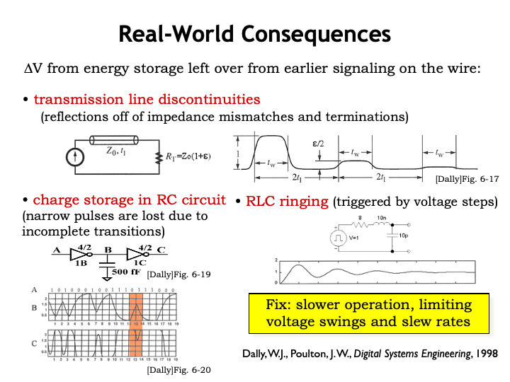

With that little bit of theory as background, we&#700;re in a
position to describe the real-world consequences of poor
engineering of our signal wires.  The key observation is that
unless we&#700;re careful there can still be energy left over
from previous transmissions that might corrupt the current
transmission.  The general fix to this problem is
time, <i>i.e.</i>, giving the transmitted value a longer time to
settle to an interference-free value.  But slowing down
isn&#700;t usually acceptable in high-performance systems, so
we have to do our best to minimize these energy storage
effects.

If there the termination isn&#700;t exactly right, we&#700;ll
get some reflections from any voltage step reaching the end of
the wire, and it will take a while for the echoes to die out.
In fact, as we&#700;ll see, energy will reflect off of any
impedance discontinuity, which mean we&#700;ll want to minimize
the number of such discontinuities.

We need to be careful to allow sufficient time for signals to
reach valid logic levels.  The shaded region shows a transition
of the wire A from 1 to 0 to 1.  The first inverter is trying to
produce a 1-output from the initial input transition to 0, but
doesn&#700;t have sufficient time to complete the transition on
wire B before the input changes again.  This leads to a runt
pulse on wire C, the output of the second inverter, and we see
that the sequence of bits on A has been corrupted by the time
the signal reaches C.  This problem was caused by the energy
storage in the capacitance of the wire between the inverters,
which will limit the speed at which we can run the logic.

And here see we what happens when a large voltage step triggers
oscillations in wire, called ringing, voltages due to the
wire&#700;s inductance and capacitance.  The graph shows it
takes some time before the ringing dampens to the point that we
have a reliable digital signal.  The ringing can be diminished
by spreading the voltage step over a longer time.

The key idea here is that by paying close attention to the
design of our wiring and the drivers that put information onto
the wire, we can minimize the performance implications of these
energy-storage effects.

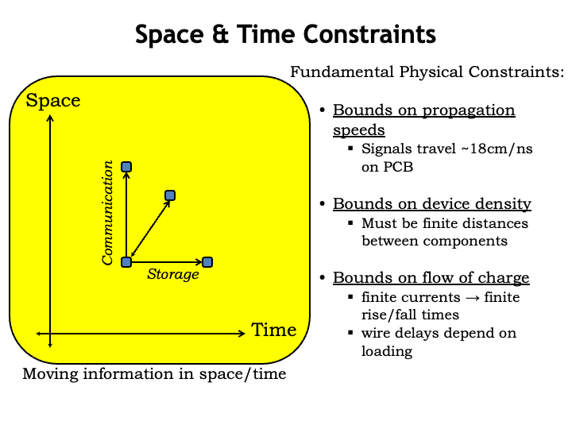

Okay, enough electrical engineering!  Suppose we have some
information in our system.  If we preserve that information over
time, we call that storage.  If we send that information to
another component, we call that communication.  In the real
world, we&#700;ve seen that communication takes time and we
have to budget for that time in our system timing.  Our
engineering has to accommodate the fundamental bounds on
propagating speeds, distances between components and how fast we
can change wire voltages without triggering the effects we saw
on the previous slide.  The upshot: our timing models will have
to account for wire delays.

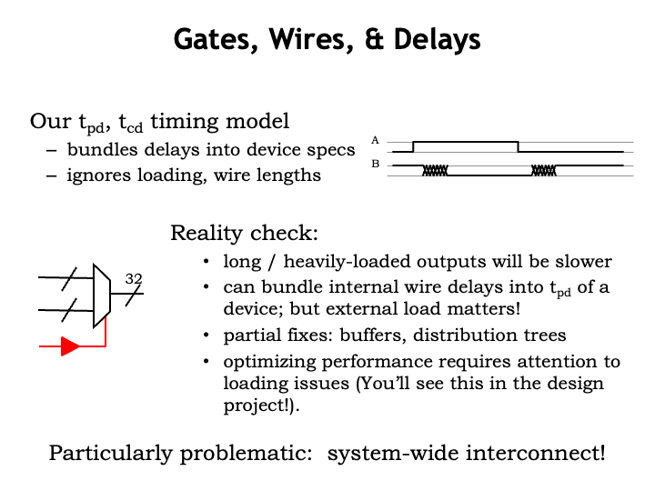

Earlier in the course, we had a simple timing model that
assigned a fixed propagation delay, $t_{\textrm{PD}}$, to the
time it took for the output of a logic gate to reflect a change
to the gate&#700;s input.

We&#700;ll need to change our timing model to account for
delay of transmitting the output of a logic gate to the next
components.  The timing will be load dependent, so signals that
connect to the inputs of many other gates will be slower than
signals that connect to only one other gate.  The Jade simulator
takes the loading of a gate&#700;s output signal into account
when calculating the effective propagation delay of the
gate.

We can improve propagation delays by reducing the number of
loads on output signals or by using specially-design gates
called buffers (the component shown in red) to drive signals
that have very large loads.  A common task when optimizing the
performance of a circuit is to track down heavily loaded and
hence slow wires and re-engineering the circuit to make them
faster.

Today our concern is wires used to connect components at the
system level.  So next we&#700;ll turn our attention to
possible designs for system-level interconnect and the issues
that might arise.

<h2>Buses</h2>

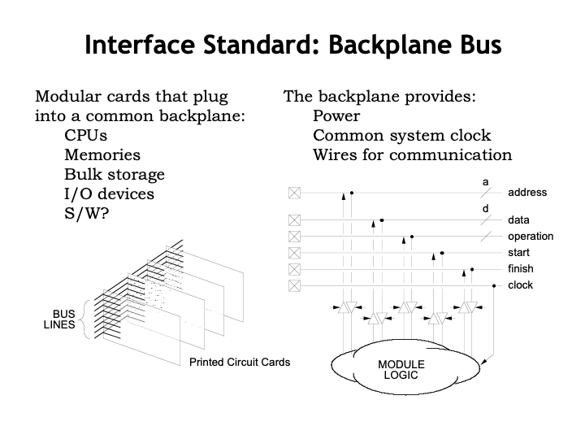

If we want our system to be modular and expandable, how should
its design accommodate components that the user might add at a
later time?  For many years the approach was to provide a way to
plug additional printed circuit boards into the main
motherboard that holds the CPU, memory, and the
initial collection of I/O components.  The socket on the
motherboard connects the circuitry on the add-in card to the
signals on the motherboard that allow the CPU to communicate
with the add-in card.  These signals include power and a clock
signal used to time the communication, along with the
following.

* Address wires to select different communication end points on
the add-in card.  The end points might include memory locations,
control registers, diagnostic ports, etc.

* Data wires for transferring data to and from the CPU.  In
older systems, there would many data wires to support byte- or
word-width data transfers.

* Some number of control wires that tell the add-in card when a
particular transfer has started and that allow the add-in card
to indicate when it has responded.

If there are multiple slots for plugging in multiple add-in
cards, the same signals might be connected to all the cards and
the address wires would be used to sort out which transfers were
intended for which cards.  Collectively these signals are
referred to as the system bus.  <i>Bus</i> is system-architect
jargon for a collection of wires used to transfer data using a
pre-determined communication protocol.

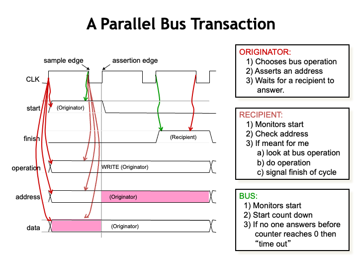

Here&#700;s an example of how a bus transaction might
work.

The CLK signal is used to time when signals are placed on the
bus wires (at the assertion edge of CLK) and when they&#700;re
read by the recipient (at the sample edge of the CLK).  The
timing of the clock waveform is designed to allow enough time
for the signals to propagate down the bus and reach valid logic
levels at all the receivers.

The component initiating the transaction is said to
&#8220;own&#8221; the bus.  Most buses provide a mechanism for
transferring ownership from one component to another.  The
owner sets the bus lines to indicate the desired operation
(read, write, block transfer, etc.), the address of the
recipient, and, in the case of a write operation, the data to be
sent to the recipient.

The possible recipients are watching the bus
lines looking for their address at each sample edge.  When one sees
a transaction for itself, the selected recipient performs the requested
operation, using a bus signal to indicate when the operation is
complete.  On completion it may use the data wires to return
information to the originator.

The bus itself may include circuitry to look for transactions
where no recipeient responds and, after an appropriate
interval, generate an error response so the originator can take the
appropriate action.

This sort of bus architecture proved to be a very workable
design for accommodating add-in cards as long as the rate of
transactions wasn&#700;t too fast, say less than 50 MHz.

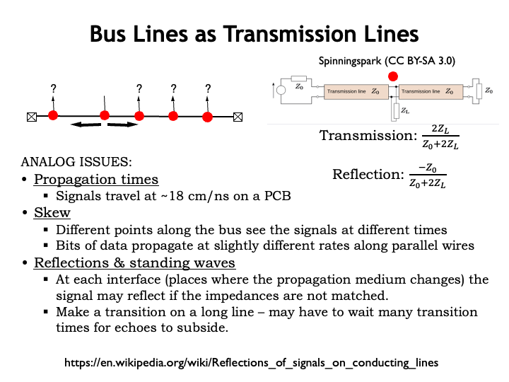

But as system speeds increased, transaction rates had to
increase to keep system performance at acceptable levels, so the
time for each transaction got smaller.  With less time for
signaling on the bus wires, various effects began loom
large.

If the clock had too short a period, there wasn&#700;t enough
time for the originator to see the assertion edge, enable its
drivers, have the signal propagate down a long bus to the
intended receiver and be stable at each receiver for long enough
before the sample edge.

Another problem was that the clock signal would arrive at
different cards at different times.  So a card with an
early-arriving clock might decide it was its turn to start
driving the bus signals, while a card with a late-arriving clock
might still be driving the bus from the previous cycle.  These
momentary conflicts between drivers could add huge amounts of
electrical noise to the system.

Another big issue is that energy would reflect off all the
small impedance discontinuities caused by the bus connectors.
If there were many connectors, there would be many small echoes
which would could corrupt the signal seen by various receivers.
The equations in the upper right show how much of the signal
energy is transmitted and how much is reflected at each
discontinuity.  The net effect was like trying to talk very fast
while yelling into the Grand Canyon &#8212; the echoes could distort
the message beyond recognition unless sufficient time was
allocated between words for the echoes to die away.

Eventually buses were relegated to relatively low-speed
communication tasks and a different approach had to be developed
for high-speed communication.

<h2>Point-to-point Communication</h2>

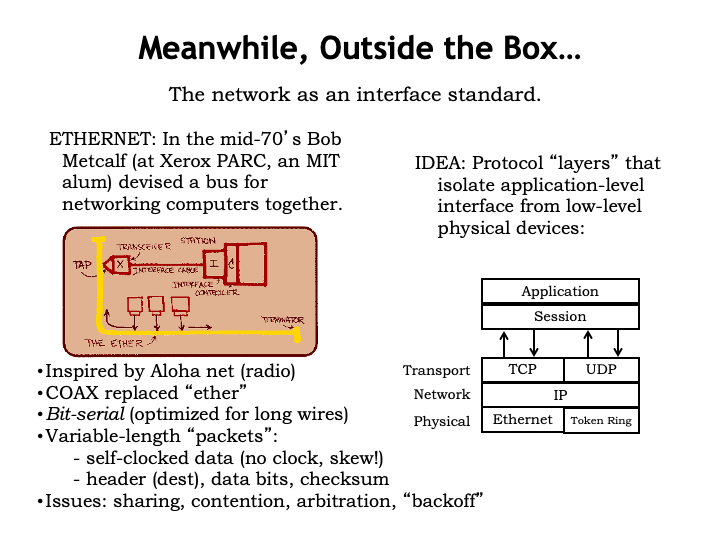

Network technologies were developed to connect components (in
this case individual computer systems) separated by larger
distances, <i>i.e.</i>, distances measured in meters instead of
centimeters.  Communicating over these larger distances led to
different design tradeoffs.  In early networks, information was
sent as a sequence of bits over the shared communication medium.
The bits were organized into packets, each containing the
address of the destination.  Packets also included a checksum
used to detect errors in transmission and the protocol supported
the ability to request the retransmission of corrupted
packets.

The software controlling the network is divided into a
<i>protocol stack</i> of modules, each implementing a different
communication abstraction.  The lowest-level physical layer is
responsible for transmitting and receiving an individual packet
of bits.  Bit errors are detected and corrected, and packets
with uncorrectable errors are discarded. There are different
physical-layer modules available for the different types of
physical networks.

The network layer deals with the addressing and routing of
packets.  Clever routing algorithms find the shortest
communication path through the multi-hop network and deal with
momentary or long-term outages on particular network links.

The transport layer is responsible for providing the reliable
communication of a stream of data, dealing with the issues of
discarded or out-of-order packets.  In an effort to optimize
network usage and limit packet loses due to network congestion,
the transport layer deals with flow control, <i>i.e.</i>, the
rate at which packets are sent.

A key idea in the networking community is the notion of
building a reliable communication channel on top of a
<i>best efforts</i> packet network.  Higher layers of the
protocol are designed so that its possible to recover from
errors in the lower layers.  This has proven much more
cost-effective and robust than trying to achieve 100%
reliability at each layer.

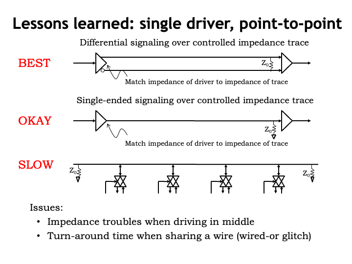

As we saw in the previous section, there are a lot of
electrical issues when trying to communicate over a shared wire
with multiple drivers and receivers.  Slowing down the rate of
communication helps to solve the problems, but
&#8220;slow&#8221; isn&#700;t in the cards for today&#700;s
high-performance systems.

Experience in the network world has shown that the fastest and
least problematic communication channels have a single driver
communicating with a single receiver, what&#700;s called a
point-to-point link.  Using differential signaling is
particularly robust.  With differential signaling, the receiver
measures the voltage difference across the two signaling wires.
Electrical effects that might induce voltage noise on one
signaling wire will affect the other in equal measure, so the
voltage difference will be largely unaffected by most noise.
Almost all high-performance communication links use differential
signaling.

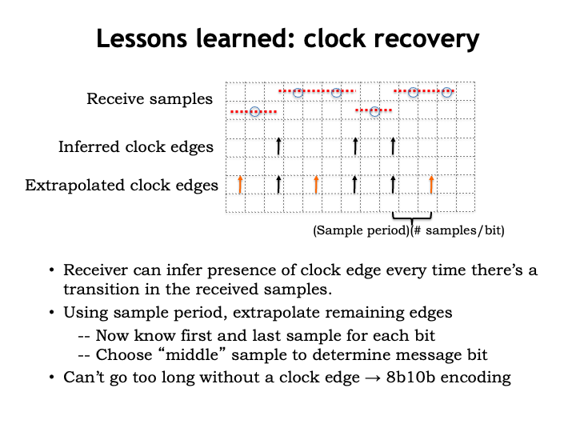

If we&#700;re sending digital data, does that mean we also
have to send a separate clock signal so the receiver knows when
to sample the signal to determine the next bit?

With some cleverness, it turns out that we can recover the
timing information from the received signal assuming we know the
nominal clock period at the transmitter.  If the transmitter
changes the bit its sending at the rising edge of the
transmitter&#700;s clock, then the receiver can use the
transitions in the received waveform to infer the timing for
some of the clock edges.

Then the receiver can use its knowledge of the
transmitter&#700;s nominal clock period to infer the location
of the remaining clock edges.  It does this by using a
phase-locked loop to generate a local facsimile of the
transmitter&#700;s clock, using any received transitions to
correct the phase and period of the local clock.  The
transmitter adds a training sequence of bits at the front of
packet to ensure that the receiver&#700;s phased-lock loop is
properly synchronized before the packet data itself is
transmitted.  A special unique bit sequence is used to separate
the training signal from the packet data so the receiver can
tell exactly where the packet data starts even if it missed a
few training bits while the clocks were being properly
synchronized.

Once the receiver knows the timing of the clock edges, it can
then sample the incoming waveform towards the end of each clock
period to determine the transmitted bit.

To keep the local clock in sync with the transmitter&#700;s
clock, the incoming waveform needs to have reasonably frequent
transitions.  But if the transmitter is sending say, all zeroes,
how can we guarantee frequent-enough clock edges?

The trick, invented by IBM, is for the transmitter to take the
stream of message bits and re-encode them into a bit stream that
is guaranteed to have transitions no matter what the message
bits are.  The most commonly used encoding is 8b10b, where 8
message bits are encoded into 10 transmitted bits, where the
encoding guarantees a transition at least every 6 bit times.  Of
course, the receiver has to reverse the 8b10b encoding to
recover the actual message bits.  Pretty neat!

The benefit of this trick is that we truly only need to send a
single stream of bits.  The receiver will be able to recover
both the timing information and the data without also needing to
transmit a separate clock signal.

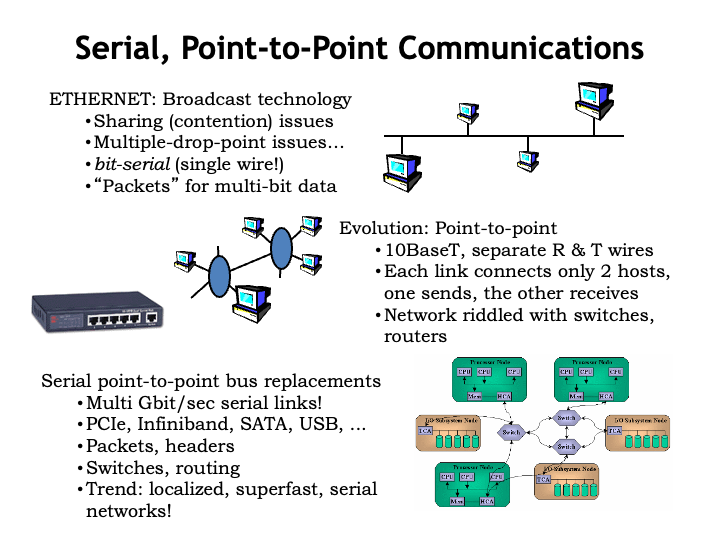

Using these lessons, networks have evolved from using shared
communication channels to using point-to-point links.  Today
local-area networks use 10, 100, or 1000 BaseT wiring which
includes separate differential pairs for sending and
receiving, <i>i.e.</i>, each sending or receiving channel is
unidirectional with a single driver and single receiver.  The
network uses separate switches and routers to receive packets
from a sender and then forward the packets over a point-to-point
link to the next switch, and so on, across multiple
point-to-point links until the packet arrives at its
destination.

System-level connections have evolved to use the same
communication strategy: point-to-point links with switches for
routing packets to their intended destination.  Note that
communication along each link is independent, so a network with
many links can actually support a lot of communication
bandwidth.  With a small amount of packet buffering in the
switches to deal with momentary contention for a particular
link, this is a very effective strategy for moving massive
amounts of information from one component to the next.

In the next section, we&#700;ll look at some of the more
interesting details.

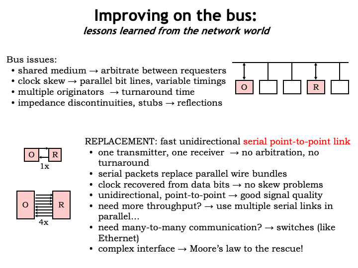

Serial point-to-point links are the modern replacement for the
parallel communications bus with all its electrical and timing
issues.  Each link is unidirectional and has only a single
driver and the receiver recovers the clock signal from the data
stream, so there are no complications from sharing the channel,
clock skew, and electrical problems.  The very controlled
electrical environment enables very high signaling rates, well
up into the gigahertz range using today&#700;s
technologies.

If more throughput is needed, you can use multiple serial links
in parallel.  Extra logic is needed to reassemble the original
data from multiple packets sent in parallel over multiple links,
but the cost of the required logic gates is very modest in
current technologies.

Note that the expansion strategy of modern systems still uses
the notion of an add-in card that plugs into the motherboard.
But instead of connecting to a parallel bus, the add-in card
connects to one or more point-to-point communication links.

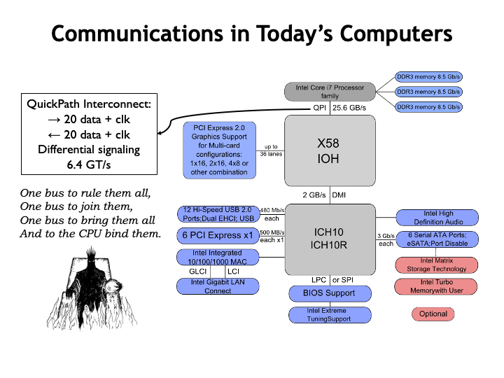

Here&#700;s the system-level communications diagram for a
recent system based on an Intel Core i7 CPU chip.  The CPU is
connected directly to the memories for the highest-possible
memory bandwidth, but talks to all the other components over the
QuickPath Interconnect (QPI), which has 20 differential
signaling paths in each direction.  QPI supports up to 6.4
billion 20-bit transfers in each direction every second.

All the other communication channels (USB, PCIe, networks,
Serial ATA, Audio, etc.) are also serial links, providing
various communication bandwidths depending on the
application.

Reading about the QPI channel used by the CPU reminded me a lot
of the one ring that could be used to control all of Middle
Earth in the Tolkien trilogy <i>Lord of the Rings</i>.  Why mess around
with a lot of specialized communication channels when you have a
single solution that&#700;s powerful enough to solve all your
communication needs?

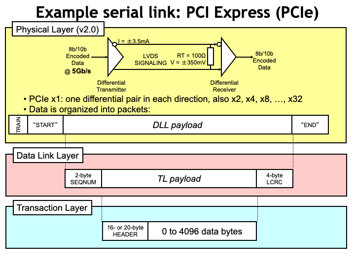

PCI Express (PCIe) is often used as the communication link
between components on the system motherboard.  A single PCIe
version 2 <i>lane</i> transmits data at 5 Gb/sec using
low-voltage differential signal (LVDS) over wires designed to
have a 100-Ohm characteristic impedance.

The PCIe lane is under the control of the same sort of network
stack as described earlier.  The physical layer transmits
packetized data through the lane.  Each packet starts with a
training sequence to synchronize the receiver&#700;s
clock-recovery circuitry, followed by a unique start sequence,
then the packet&#700;s data payload, and ends with a unique end
sequence.

The physical layer payload is organized as a sequence number, a
transaction layer payload and a cyclical redundancy check
sequence that&#700;s used to validate the data.  Using the
sequence number, the data link layer can tell when a packet has
been dropped and request the transmitter restart transmission at
the missing packet.  It also deals with flow control issues.

Finally, the transaction layer reassembles the message from the
transaction layer payloads from all the lanes and uses the
header to identify the intended recipient at the receive
end.

Altogether, a significant amount of logic is needed to send and
receive messages on multiple PCIe lanes, but the cost is quite
acceptable when using today&#700;s integrated circuit
technologies.  Using 8 lanes, the maximum transfer rate is 4
GB/sec, capable of satisfying the needs of high-performance
peripherals such as graphics cards.

So knowledge from the networking world has reshaped how
components communicate on the motherboard, driving the
transition from parallel buses to a handful of serial
point-to-point links.  As a result today&#700;s systems are
faster, more reliable, more energy-efficient and smaller than
ever before.

</vertical>
</sequential>
<sequential display_name="Communication Topologies" url_name="topologies">
<vertical display_name="Communication Topologies" type="problem">

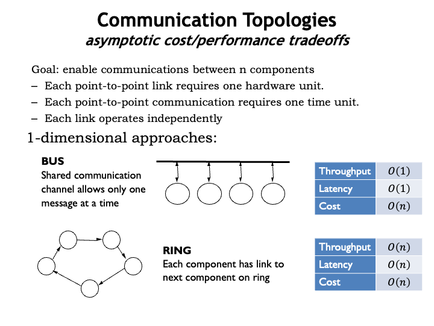

Let&#700;s wrap up our discussion of system-level interconnect
by considering how best to connect N components that need to
send messages to one another, <i>e.g.</i>, CPUs on a multicore
chip.  Today such chips have a handful of cores, but soon they
may have 100s or 1000s of cores.

We&#700;ll build our communications network using
point-to-point links.  In our analysis, each point-to-point link
is counted at a cost of 1 hardware unit.  Sending a message
across a link requires one time unit.  And we&#700;ll assume
that different links can operate in parallel, so more links will
mean more message traffic.

We&#700;ll do an asymptotic analysis of the throughput (total
messages per unit time), latency (worst-case time to deliver a
single message), and hardware cost.  In other words, we&#700;ll
make a rough estimate how these quantities change as N
grows.

Note that in general the throughput and hardware cost are
proportional to the number of point-to-point links.

Our baseline is the backplane bus discussed earlier, where all
the components share a single communication channel. With only a
single channel, bus throughput is 1 message per unit time and a
message can travel between any two components in one time unit.
Since each component has to have an interface to the shared
channel, the total hardware cost is O(n).

In a ring network each component sends its messages to a single
neighbor and the links are arranged so that its possible to
reach all components.  There are N links in total, so the
throughput and cost are both O(n).  The worst case latency is
also O(n) since a message might have to travel across N-1 links
to reach the neighbor that&#700;s immediately upstream.  Ring
topologies are useful when message latency isn&#700;t important
or when most messages are to the component that&#700;s
immediately downstream, <i>i.e.</i>, the components form a
processing pipeline.

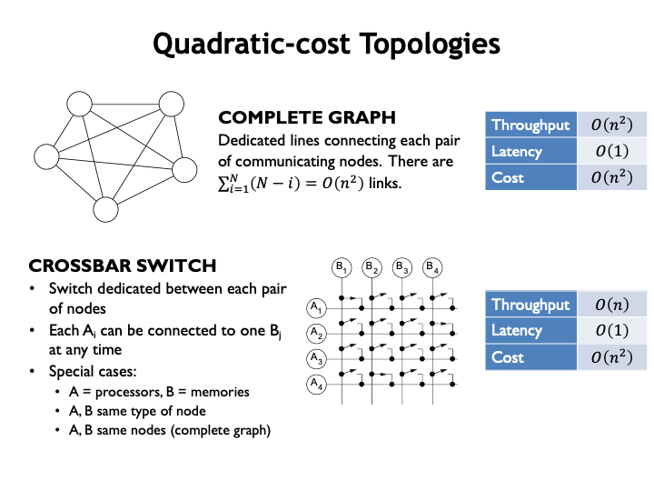

The most general network topology is when every component has a
direct link to every other component.  There are O(N**2) links
so the throughput and cost are both O(N**2).  And the latency is
1 time unit since each destination is directly accessible.
Although expensive, complete graphs offer very high throughput
with very low latencies.

A variant of the complete graph is the crossbar switch where a
particular row and column can be connected to form a link
between particular A and B components with the restriction that
each row and each column can only carry 1 message during each
time unit.  Assume that the first row and first column connect
to the same component, and so on, <i>i.e.</i>, that the example
crossbar switch is being used to connect 4 components.  Then
there are O(n) messages delivered each time unit, with a latency
of 1.  There are N**2 switches in the crossbar, so the cost is
O(N**2) even though there are only O(n) links.

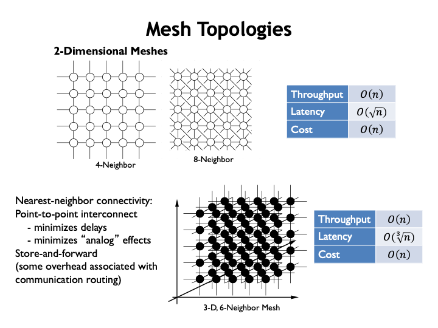

In mesh networks, components are connected to some fixed number
of neighboring components, in either 2- or 3-dimensions.  Hence
the total number of links is proportional to the number of
components, so both throughput and cost are O(n).  The
worst-case latencies for mesh networks are proportional to
length of the sides, so the latency is O(sqrt n) for 2D meshes
and O(cube root n) for 3D meshes.  The orderly layout, constant
per-node hardware costs, and modest worst-case latency make 2D
4-neighbor meshes a popular choice for the current generation of
experimental multi-core processors.

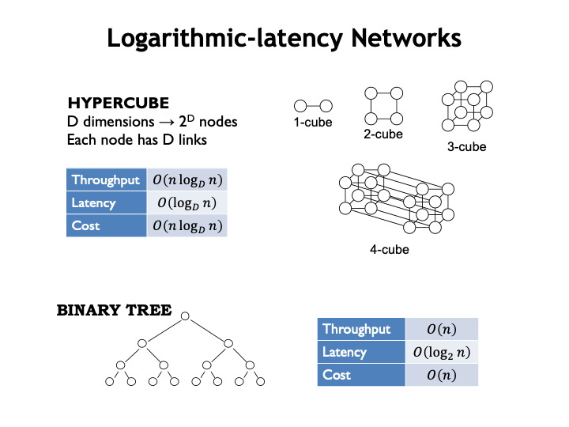

Hypercube and tree networks offer logarithmic latencies, which
for large N may be faster than mesh networks.  The original CM-1
Connection Machine designed in the 80&#700;s used a hypercube
network to connect up to 65,536 very simple processors, each
connected to 16 neighbors.  Later generations incorporated
smaller numbers of more sophisticated processors, still
connected by a hypercube network.  In the early 90&#700;s the
last generation of Connection Machines used a tree network, with
the clever innovation that the links towards the root of the
tree had a higher message capacity.

<h2>Summary</h2>

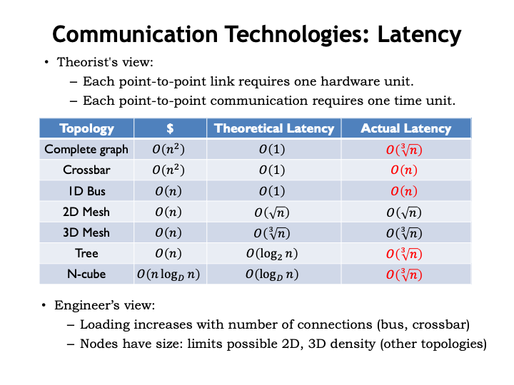

Here&#700;s a summary of the theoretical latencies we
calculated for the various topologies.

As a reality check, it&#700;s important to realize that the
lower bound on the worst-case distance between components in our
3-dimensional world is O(cube root of N).  In the case of a 2D
layout, the worst-case distance is O(sqrt N).  Since we know
that the time to transmit a message is proportional to the
distance traveled, we should modify our latency calculations to
reflect this physical constraint.

Note that the bus and crossbar involve N connections to a
single link, so here the lower-bound on the latency needs to
reflect the capacitive load added by each connection.

The winner? Mesh networks avoid the need for longer wires as
the number of connected components grows and appear to be an
attractive alternative for high-capacity communication networks
connecting 1000&#700;s of processors.

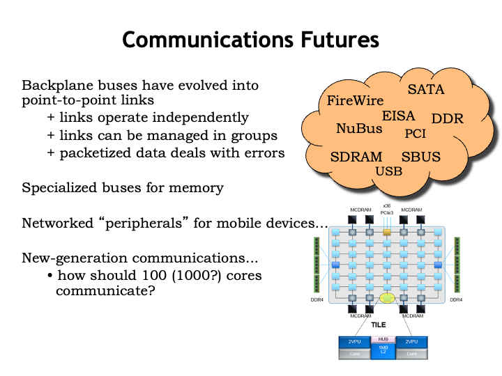

Summarizing our discussion:

<ul>
  <li>Point-to-point links are in common use today for system-level
  interconnect, and as a result our systems are faster, more
  reliable, more energy-efficient and smaller than ever
  before.</li>

  
<li>Multi-signal parallel buses are still used for
  very-high-bandwidth connections to memories, with a lot of very
  careful engineering to avoid the electrical problems observed in
  earlier bus implementations.</li>

  
<li>Wireless connections are in common use to connect mobile
  devices to nearby components and there has been interesting work
  on how to allow mobile devices to discover what peripherals are
  nearby and enable them to connect automatically.</li>

  
<li>The upcoming generation of multi-core chips will have
  10&#700;s to 100&#700;s of processing cores.  There is a lot
  ongoing research to determine which communication topology would
  offer the best combination of high communication bandwidth and
  low latency.  The next ten years will be an interesting time for
  on-chip network engineers!</li>
</ul>
