
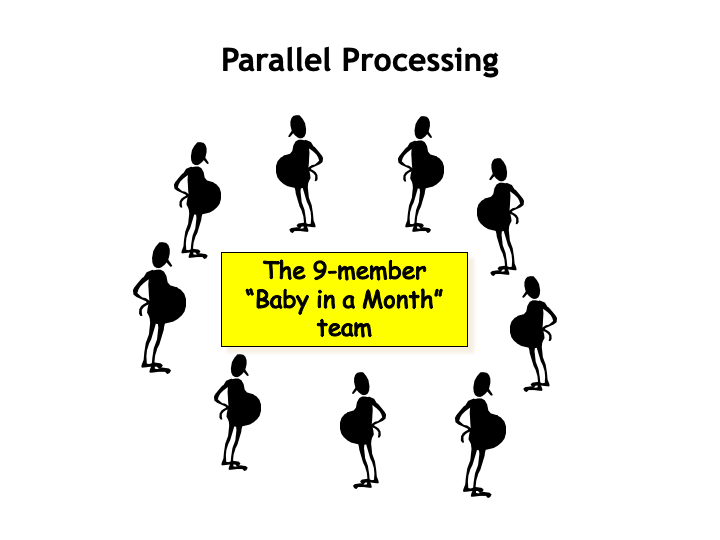

<h2>Improving Processor Performance</h2>

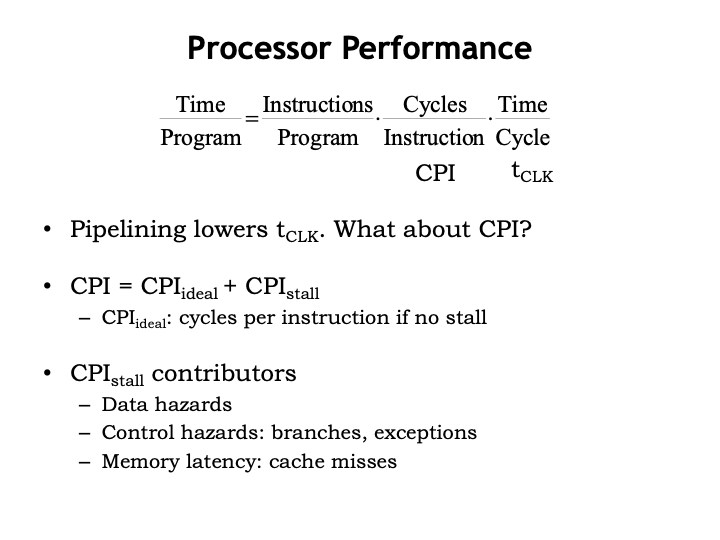

The modern world has an insatiable appetite for computation, so system
architects are always thinking about ways to make programs run faster.
The running time of a program is the product of three terms:

The number of instructions in the program, multiplied by the average
number of processor cycles required to execute each instruction (CPI),
multiplied by the time required for each processor cycle ($t_{\textrm{CLK}}$).

To decrease the running time we need to decrease one or more of these
terms.  The number of instructions per program is determined by the
ISA and by the compiler that produced the sequence of assembly
language instructions to be executed.  Both are fair game, but for
this discussion, let&#700;s work on reducing the other two terms.

As we&#700;ve seen, pipelining reduces $t_{\textrm{CLK}}$ by dividing instruction
execution into a sequence of steps, each of which can complete its
task in a shorter $t_{\textrm{CLK}}$.  What about reducing CPI?

In our 5-stage pipelined implementation of the Beta, we designed the
hardware to complete the execution of one instruction every clock
cycle, so CPI_ideal is 1.  But sometimes the hardware has to introduce
<i>NOP bubbles</i> into the pipeline to delay execution of a pipeline
stage if the required operation couldn&#700;t (yet) be completed.  This
happens on taken branch instructions, when attempting to immediately
use a value loaded from memory by the LD instruction, and when waiting
for a cache miss to be satisfied from main memory.  CPI_stall accounts
for the cycles lost to the NOPs introduced into the pipeline.  Its
value depends on the frequency of taken branches and immediate use of
LD results.  Typically it&#700;s some fraction of a cycle. For example, if
a 6-instruction loop with a LD takes 8 cycles to complete, CPI_stall
for the loop would be 2/6, <i>i.e.</i>, 2 extra cycles for every 6
instructions.

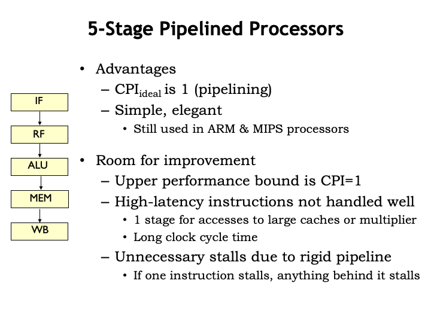

Our classic 5-stage pipeline is an effective compromise that allows
for a substantial reduction of $t_{\textrm{CLK}}$ while keeping CPI_stall to a
reasonably modest value.

There is room for improvement.  Since each stage is working on one
instruction at a time, CPI_ideal is 1.

Slow operations &#8212; <i>e.g.</i>, completing a multiply in the ALU stage, or
accessing a large cache in the IF or MEM stages &#8212; force $t_{\textrm{CLK}}$ to be
large to accommodate all the work that has to be done in one cycle.

The order of the instructions in the pipeline is fixed.  If, say, a LD
instruction is delayed in the MEM stage because of a cache miss, all
the instructions in earlier stages are also delayed even though their
execution may not depend on the value produced by the LD.  The order
of instructions in the pipeline always reflects the order in which
they were fetched by the IF stage.

Let&#700;s look into what it would take to relax these constraints and
hopefully improve program runtimes.

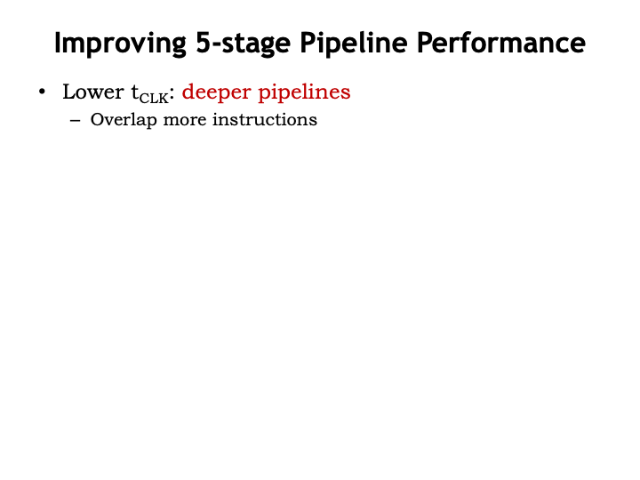

Increasing the number of pipeline stages should allow us to decrease
the clock cycle time.  We&#700;d add stages to break up performance
bottlenecks, <i>e.g.</i>, adding additional pipeline stages (MEM1 and MEM2) to
allow a longer time for memory operations to complete.  This comes at
cost to CPI_stall since each additional MEM stage means that more NOP
bubbles have to be introduced when there&#700;s a LD data hazard.  Deeper
pipelines mean that the processor will be executing more instructions
in parallel.

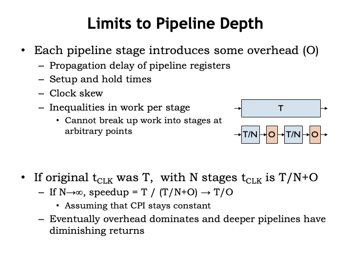

Let&#700;s interrupt enumerating our performance shopping list to think
about limits to pipeline depth.

Each additional pipeline stage includes some additional overhead costs
to the time budget.  We have to account for the propagation, setup,
and hold times for the pipeline registers.  And we usually have to
allow a bit of extra time to account for clock skew, <i>i.e.</i>, the
difference in arrival time of the clock edge at each register.  And,
finally, since we can&#700;t always divide the work exactly evenly between
the pipeline stages, there will be some wasted time in the stages that
have less work.  We&#700;ll capture all of these effects as an additional
per-stage time overhead of O.

If the original clock period was T, then with N pipeline stages, the
clock period will be T/N + O.

At the limit, as N becomes large, the speedup approaches T/O.  In
other words, the overhead starts to dominate as the time spent on work
in each stage becomes smaller and smaller.  At some point adding
additional pipeline stages has almost no impact on the clock period.

As a data point, the Intel Core-2 x86 chips (nicknamed &#8220;Nehalem&#8221;)
have a 14-stage execution pipeline.

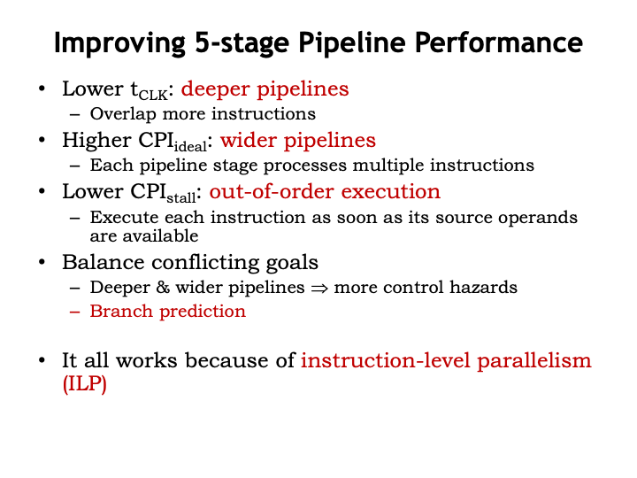

Okay, back to our performance shopping list...

There may be times we can arrange to execute two or more instructions
in parallel, assuming that their executions are independent from each
other.  This would increase CPI_ideal at the cost of increasing the
complexity of each pipeline stage to deal with concurrent execution of
multiple instructions.

If there&#700;s an instruction stalled in the pipeline by a data hazard,
there may be following instructions whose execution could still
proceed.  Allowing instructions to pass each other in the pipeline is
called out-of-order execution.  We&#700;d have to be careful to ensure that
changing the execution order didn&#700;t affect the values produced by the
program.

More pipeline stages and wider pipeline stages increase the amount of
work that has to be discarded on control hazards, potentially
increasing CPI_stall.  So it&#700;s important to minimize the number of
control hazards by predicting the results of a branch (<i>i.e.</i>, taken or
not taken) so that we increase the chances that the instructions in
the pipeline are the ones we&#700;ll want to execute.

Our ability to exploit wider pipelines and out-of-order execution
depends on finding instructions that can be executed in parallel or in
different orders.  Collectively these properties are called
<i>instruction-level parallelism</i> (ILP).

<h2>Instruction-level Parallelism</h2>

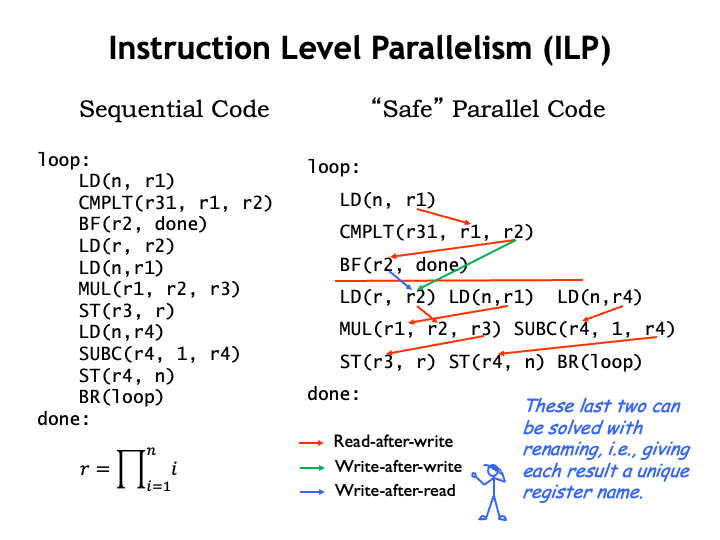

Here&#700;s an example that will let us explore the amount of ILP that
might be available.  On the left is an unoptimized loop that computes
the product of the first N integers.  On the right, we&#700;ve rewritten
the code, placing instructions that could be executed concurrently on
the same line.

First notice the red line following the BF instruction.  Instructions
below the line should only be executed if the BF is *not* taken.  That
doesn&#700;t mean we couldn&#700;t start executing them before the results of
the branch are known, but if we executed them before the branch, we
would have to be prepared to throw away their results if the branch
was taken.

The possible execution order is constrained by the read-after-write
(RAW) dependencies shown by the red arrows.  We recognize these as the
potential data hazards that occur when an operand value for one
instruction depends on the result of an earlier instruction.  In our
5-stage pipeline, we were able to resolve many of these hazards by
bypassing values from the ALU, MEM, and WB stages back to the RF stage
where operand values are determined.

Of course, bypassing will only work when the instruction has been
executed so its result is available for bypassing!  So in this case,
the arrows are showing us the constraints on execution order that
guarantee bypassing will be possible.

There are other constraints on execution order.  The green arrow
identifies a write-after-write (WAW) constraint between two
instructions with the same destination register.  In order to ensure
the correct value is in R2 at the end of the loop, the LD(r,R2)
instruction has to store its result into the register file after the
result of the CMPLT instruction is stored into the register file.

Similarly, the blue arrow shows a write-after-read (WAR) constraint
that ensures that the correct values are used when accessing a
register.  In this case, LD(r,R2) must store into R2 after the Ra
operand for the BF has been read from R2.

As it turns out, WAW and WAR constraints can be eliminated if we give
each instruction result a unique register name.  This can actually be
done relatively easily by the hardware by using a generous supply of
temporary registers, but we won&#700;t go into the details of renaming
here.  The use of temporary registers also makes it easy to discard
results of instructions executed before we know the outcomes of
branches.

In this example, we discovered that the potential concurrency was
actually pretty good for the instructions following the BF.

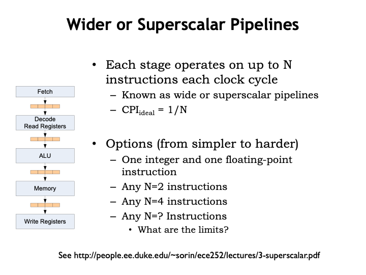

To take advantage of this potential concurrency, we&#700;ll need to modify
the pipeline to execute some number N of instructions in parallel.  If
we can sustain that rate of execution, CPI_ideal would then be 1/N
since we&#700;d complete the execution of N instructions in each clock
cycle as they exited the final pipeline stage.

So what value should we choose for N?  Instructions that are executed
by different ALU hardware are easy to execute in parallel, <i>e.g.</i>, ADDs
and SHIFTs, or integer and floating-point operations.  Of course, if
we provided multiple adders, we could execute multiple integer
arithmetic instructions concurrently.  Having separate hardware for
address arithmetic (called LD/ST units) would support concurrent
execution of LD/ST instructions and integer arithmetic instructions.

This set of lecture slides from Duke gives a nice overview of
techniques used in each pipeline stage to support concurrent
execution.

Basically by increasing the number of functional units in the ALU and
the number of memory ports on the register file and main memory, we
would have what it takes to support concurrent execution of multiple
instructions.  So, what&#700;s the right tradeoff between increased circuit
costs and increased concurrency?

As a data point, the Intel Nehalem core can complete up to 4
micro-operations per cycle, where each micro-operation corresponds to
one of our simple RISC instructions.

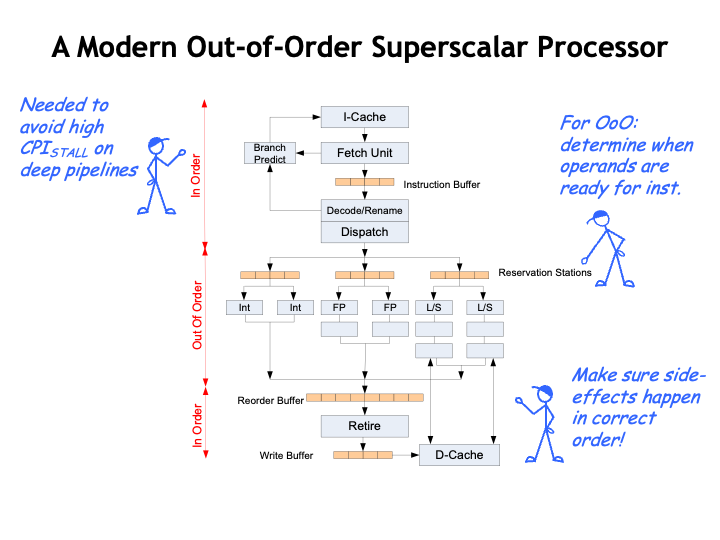

Here&#700;s a simplified diagram of a modern out-of-order superscalar
processor.

Instruction fetch and decode handles, say, 4 instructions at a time.
The ability to sustain this execution rate depends heavily on the
ability to predict the outcome of branch instructions, ensuring that
the wide pipeline will be mostly filled with instructions we actually
want to execute.  Good branch prediction requires the use of the
history from previous branches and there&#700;s been a lot of cleverness
devoted to getting good predictions from the least amount of hardware!
If you&#700;re interested in the details, search for &#8220;branch predictor&#8221;
on Wikipedia.

The register renaming happens during instruction decode, after which
the instructions are ready to be dispatched to the functional units.

If an instruction needs the result of an earlier instruction as an
operand, the dispatcher has identified which functional unit will be
producing the result.  The instruction waits in a queue until the
indicated functional unit produces the result and when all the operand
values are known, the instruction is finally taken from the queue and
executed.  Since the instructions are executed by different functional
units as soon as their operands are available, the order of execution
may not be the same as in the original program.

After execution, the functional units broadcast their results so that
waiting instructions know when to proceed.  The results are also
collected in a large reorder buffer so that that they can be retired
(<i>i.e.</i>, write their results in the register file) in the correct order.

Whew!  There&#700;s a lot of circuitry involved in keeping the functional
units fed with instructions, knowing when instructions have all their
operands, and organizing the execution results into the correct order.
So how much speed up should we expect from all this machinery?  The
effective CPI is very program-specific, depending as it does on cache
hit rates, successful branch prediction, available ILP, and so on.
Given the architecture described here the best speed up we could hope
for is a factor of 4.  Googling around, it seems that the reality is
an average speed-up of 2, maybe slightly less, over what would be
achieved by an in-order, single-issue processor.

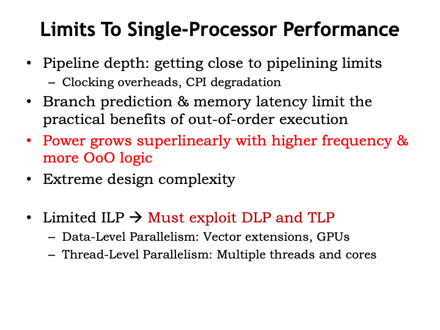

What can we expect for future performance improvements in
out-of-order, superscalar pipelines?

Increases in pipeline depth can cause CPI_stall and timing overheads
to rise.  At the current pipeline depths the increase in CPI_stall is
larger than the gains from decreased $t_{\textrm{CLK}}$ and so further increases in
depth are unlikely.

A similar tradeoff exists between using more out-of-order execution to
increase ILP and the increase in CPI_stall caused by the impact of
mis-predicted branches and the inability to run main memories any
faster.

Power consumption increases more quickly than the performance gains
from lower $t_{\textrm{CLK}}$ and additional out-of-order execution logic.

The additional complexity required to enable further improvements in
branch prediction and concurrent execution seems very daunting.

All of these factors suggest that is unlikely that we&#700;ll see
substantial future improvements in the performance of out-of-order
superscalar pipelined processors.

So system architects have turned their attention to exploiting
data-level parallelism (DLP) and thread-level parallelism (TLP).
These are our next two topics.

<h2>Data-Level Parallelism</h2>

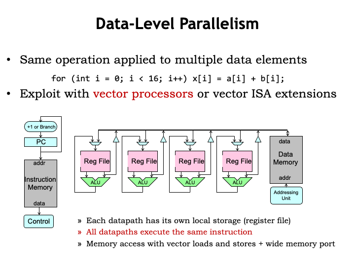

For some applications, data naturally comes in vector or matrix form.
For example, a vector of digitized samples representing an audio
waveform over time, or an matrix of pixel colors in a 2D image from a
camera.  When processing that data, it&#700;s common to perform the same
sequence of operations on each data element.  The example code shown
here is computing a vector sum, where each component of one vector is
added to the corresponding component of another vector.

By replicating the datapath portion of our CPU, we can design
special-purpose vector processors capable of performing the same
operation on many data elements in parallel. Here we see that the
register file and ALU have been replicated and the control signals
from decoding the current instruction are shared by all the datapaths.
Data is fetched from memory in big blocks (very much like fetching a
cache line) and the specified register in each datapath is loaded with
one of the words from the block.  Similarly each datapath can
contribute a word to be stored as a contiguous block in main memory.
In such machines, the width of the data buses to and from main memory
is many words wide, so a single memory access provides data for all
the datapaths in parallel.

Executing a single instruction on a machine with N datapaths is
equivalent to executing N instructions on a conventional machine with
a single datapath.  The result achieves a lot of parallelism without
the complexities of out-of-order superscalar execution.

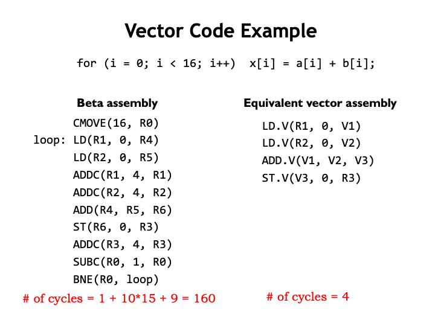

Suppose we had a vector processor with 16 datapaths.  Let&#700;s compare
its performance on a vector-sum operation to that of a conventional
pipelined Beta processor.

Here&#700;s the Beta code, carefully organized to avoid any data hazards
during execution.  There are 9 instructions in the loop, taking 10
cycles to execute if we count the NOP introduced into the pipeline
when the BNE at the end of the loop is taken.  It takes 160 cycles to
sum all 16 elements assuming no additional cycles are required due to
cache misses.

And here&#700;s the corresponding code for a vector processor where we&#700;ve
assumed constant-sized 16-element vectors.  Note that &#8220;V&#8221; registers
refer to a particular location in the register file associated with
each datapath, while the &#8220;R&#8221; registers are the conventional Beta
registers used for address computations, etc.  It would only take 4
cycles for the vector processor to complete the desired operations, a
speed-up of 40.

This example shows the best-possible speed-up.  The key to a good
speed-up is our ability to <i>vectorize</i> the code and take advantage
of all the datapaths operating in parallel.  This isn&#700;t possible for
every application, but for tasks like audio or video encoding and
decoding, and all sorts of digital signal processing, vectorization is
very doable.  Memory operations enjoy a similar performance
improvement since the access overhead is amortized over large blocks
of data.

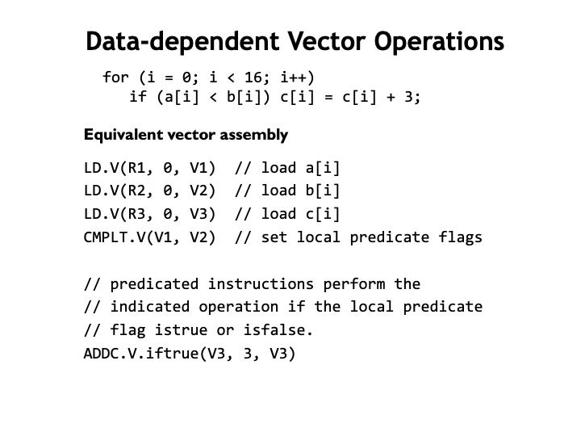

You might wonder if it&#700;s possible to efficiently perform
data-dependent operations on a vector processor.  Data-dependent
operations appear as conditional statements on conventional machines,
where the body of the statement is executed if the condition is true.
If testing and branching is under the control of the single
instruction execution engine, how can we take advantage of the
parallel datapaths?

The trick is provide each datapath with a local predicate flag.  Use a
vectorized compare instruction (CMPLT.V) to perform the a[i] &lt; b[i]
comparisons in parallel and remember the result locally in each
datapath&#700;s predicate flag.  Then extend the vector ISA to include
<i>predicated instructions</i>, which check the local predicate to see if
they should execute or do nothing.  In this example, ADDC.V.iftrue
only performs the ADDC on the local data if the local predicate flag
is true.

Instruction predication is also used in many non-vector architectures
to avoid the execution-time penalties associated with mis-predicted
conditional branches.  They are particularly useful for simple
arithmetic and boolean operations (<i>i.e.</i>, very short instruction
sequences) that should be executed only if a condition is met.  The
x86 ISA includes a conditional move instruction, and in the 32-bit ARM
ISA almost all instructions can be conditionally executed.

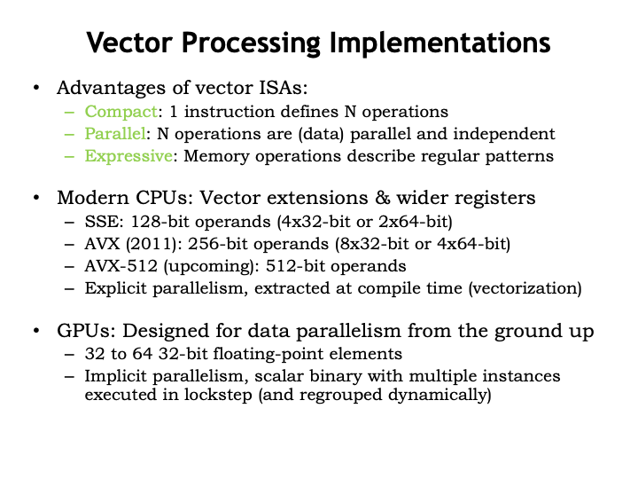

The power of vector processors comes from having 1 instruction
initiate N parallel operations on N pairs of operands.

Most modern CPUs incorporate vector extensions that operate in
parallel on 8-, 16-, 32- or 64-bit operands organized as blocks of
128-, 256-, or 512-bit data.  Often all that&#700;s needed is some simple
additional logic on an ALU designed to process full-width operands.
The parallelism is baked into the vector program, not discovered
on-the-fly by the instruction dispatch and execution machinery.
Writing the specialized vector programs is a worthwhile investment for
certain library functions which see a lot use in processing today&#700;s
information streams with their heavy use of images, and A/V material.

Perhaps the best example of architectures with many datapaths
operating in parallel are the graphics processing units (GPUs) found
in almost all computer graphics systems.  GPU datapaths are typically
specialized for 32- and 64-bit floating point operations found in the
algorithms needed to display in real-time a 3D scene represented as
billions of triangular patches as a 2D image on the computer screen.
Coordinate transformation, pixel shading and antialiasing, texture
mapping, etc., are examples of &#8220;embarrassingly parallel&#8221;
computations where the parallelism comes from having to perform the
same computation independently on millions of different data objects.
Similar problems can be found in the fields of bioinformatics, big
data processing, neural net emulation used in deep machine learning,
and so on.  Increasingly, GPUs are used in many interesting scientific
and engineering calculations and not just as graphics engines.

Data-level parallelism provides significant performance improvements
in a variety of useful situations.  So current and future ISAs will
almost certainly include support for vector operations.

<h2>Thread-level Parallelism</h2>

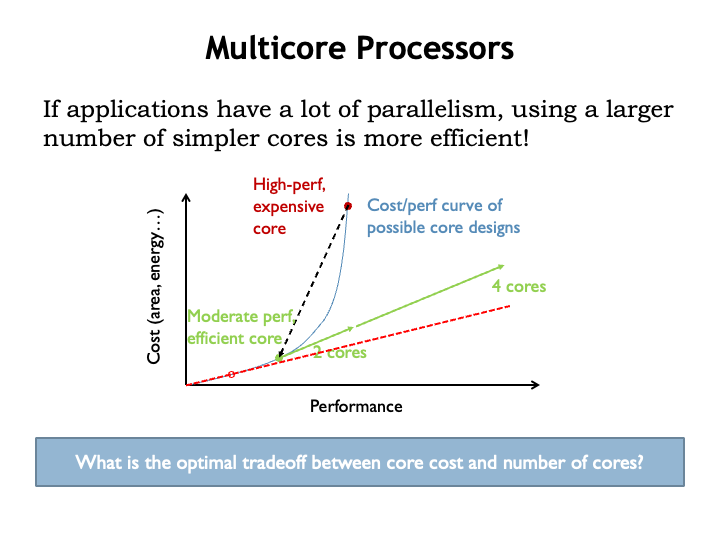

In discussing out-of-order superscalar pipelined CPUs we commented
that the costs grow very quickly relative the to performance gains,
leading to the cost-performance curve shown here.  If we move down the
curve, we can arrive at more efficient architectures that give, say,
1/2 the performance at a 1/4 of the cost.

When our applications involve independent computations that can be
performed in a parallel, it may be that we would be able to use two
cores to provide the same performance as the original expensive core,
but a fraction of the cost. If the available parallelism allows us to
use additional cores, we&#700;ll see a linear relationship between
increased performance vs. increased cost.  The key, of course, is that
desired computations can be divided into multiple tasks that can run
independently, with little or no need for communication or
coordination between the tasks.

What is the optimal tradeoff between core cost and the number of
cores?  If our computation is arbitrarily divisible without incurring
additional overhead, then we would continue to move down the curve
until we found the cost-performance point that gave us the desired
performance at the least cost.  In reality, dividing the computation
across many cores does involve some overhead, <i>e.g.</i>, distributing the
data and code, then collecting and aggregating the results, so the
optimal tradeoff is harder to find.  Still, the idea of using a
larger number of smaller, more efficient cores seems attractive.

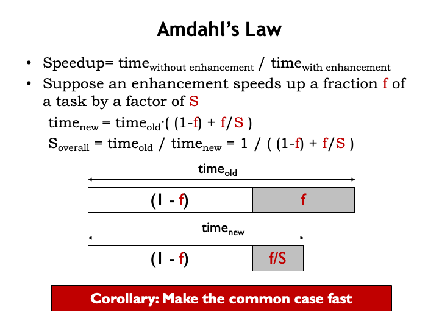

Many applications have some computations that can be performed in
parallel, but also have computations that won&#700;t benefit from
parallelism.  To understand the speedup we might expect from
exploiting parallelism, it&#700;s useful to perform the calculation
proposed by computer scientist Gene Amdahl in 1967, now known as
Amdahl&#700;s Law.

Suppose we&#700;re considering an enhancement that speeds up some fraction
F of the task at hand by a factor of S.  As shown in the figure, the
gray portion of the task now takes F/S of the time that it used to
require.

Some simple arithmetic lets us calculate the overall speedup we get
from using the enhancement.  One conclusion we can draw is that we&#700;ll
benefit the most from enhancements that affect a large portion of the
required computations, <i>i.e.</i>, we want to make F as large a possible.

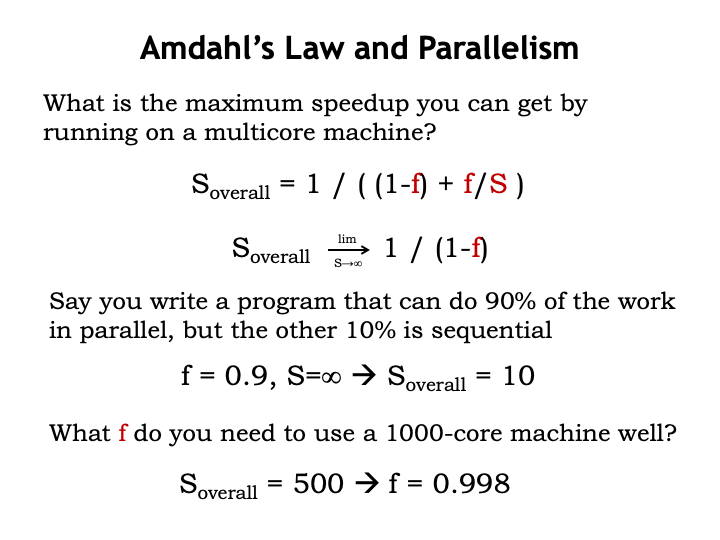

What&#700;s the best speedup we can hope for if we have many cores that can
be used to speed up the parallel part of the task?  Here&#700;s the speedup
formula based on F and S, where in this case F is the parallel
fraction of the task.  If we assume that the parallel fraction of the
task can be speed up arbitrarily by using more and more cores, we see
that the best possible overall speed up is 1/(1-F).

For example, your write a program that can do 90% of its work in
parallel, but the other 10% must be done sequentially.  The best
overall speedup that can be achieved is a factor of 10, no matter how
many cores you have at your disposal.

Turning the question around, suppose you have a 1000-core machine
which you hope to be able to use to achieve a speedup of 500 on your
target application.  You would need to be able parallelize 99.8% of
the computation in order to reach your goal!  Clearly multicore
machines are most useful when the target task has lots of natural
parallelism.

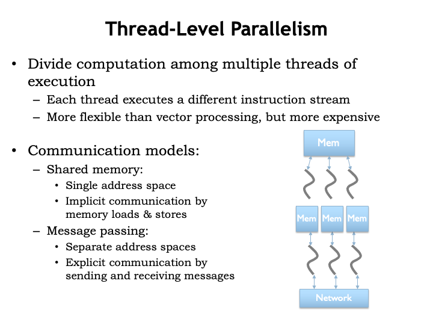

Using multiple independent cores to execute a parallel task is called
thread-level parallelism (TLP), where each core executes a separate
computation <i>thread</i>.  The threads are independent programs, so the
execution model is potentially more flexible than the lock-step
execution provided by vector machines.

When there are a small number of threads, you often see the cores
sharing a common main memory, allowing the threads to communicate and
synchronize by sharing a common address space.  We&#700;ll discuss this
further in the next section.  This is the approach used in current
multicore processors, which have between 2 and 12 cores.

Shared memory becomes a real bottleneck when there 10&#700;s or 100&#700;s of
cores, since collectively they quickly overwhelm the available memory
bandwidth.  In these architectures, threads communicate using a
communication network to pass messages back and forth.  We discussed
possible network topologies in an earlier lecture.  A cost-effective
on-chip approach is to use a nearest-neighbor mesh network, which
supports many parallel point-to-point communications, while still
allowing multi-hop communication between any two cores.  Message
passing is also used in computing clusters, where many ordinary CPUs
collaborate on large tasks.  There&#700;s a standardized message passing
interface (MPI) and specialized, very high throughput, low latency
message-passing communication networks (<i>e.g.</i>, Infiniband) that make it
easy to build high-performance computing clusters.

In the next couple of sections we&#700;ll look more closely at some of the
issues involved in building shared-memory multicore processors.

<h2>Shared Memory and Caches</h2>

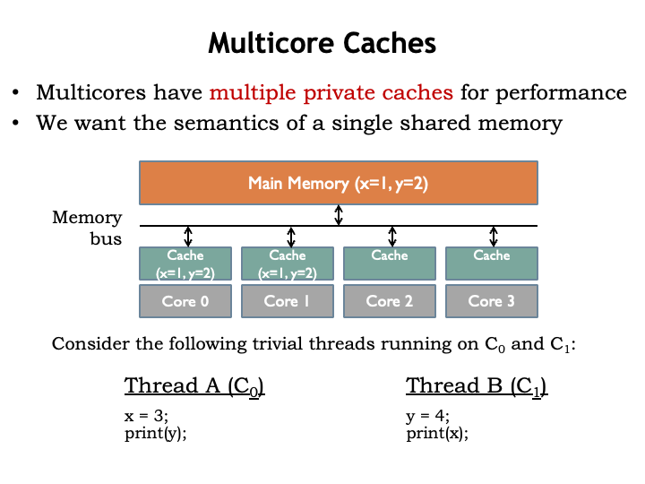

A conceptual schematic for a multicore processor is shown below.  To
reduce the average memory access time, each of the four cores has its
own cache, which will satisfy most memory requests.  If there&#700;s a
cache miss, a request is sent to the shared main memory.  With a
modest number of cores and a good cache hit ratio, the number of
memory requests that must access main memory during normal operation
should be pretty small.  To keep the number of memory accesses to a
minimum, the caches implement a write-back strategy, where ST
instructions update the cache, but main memory is only updated when a
dirty cache line is replaced.

Our goal is that each core should share the contents of main memory,
<i>i.e.</i>, changes made by one core should visible to all the other cores.
In the example shown here, core 0 is running Thread A and core 1 is
running Thread B.  Both threads reference two shared memory locations
holding the values for the variables X and Y.

The current values of X and Y are 1 and 2, respectively.  Those values
are held in main memory as well as being cached by each core.

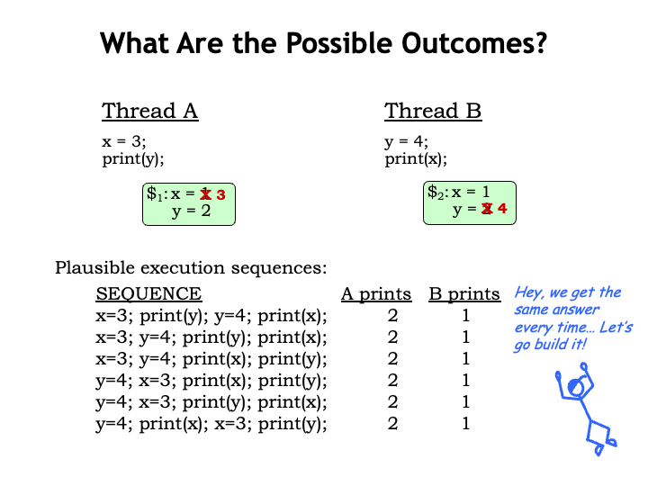

What happens when the threads are executed?  Each thread executes
independently, updating its cache during stores to X and Y.  For any
possible execution order, either concurrent or sequential, the result
is the same: Thread A prints &#8220;2&#8221;, Thread B prints &#8220;1&#8221;.  Hardware
engineers would point to the consistent outcomes and declare victory!

But closer examination of the final system state reveals some
problems.  After execution is complete, the two cores disagree on the
values of X and Y.  Threads running on core 0 will see X=3 and Y=2.
Threads running on core 1 will see X=1 and Y=4.  Because of the
caches, the system isn&#700;t behaving as if there&#700;s a single shared
memory.  On the other hand, we can&#700;t eliminate the caches since that
would cause the average memory access time to skyrocket, ruining any
hoped-for performance improvement from using multiple cores.

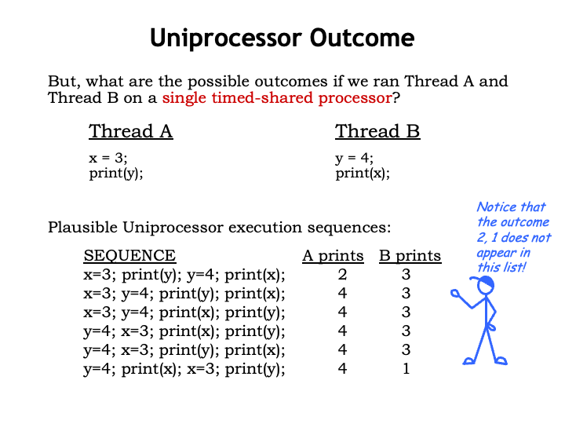

What outcome should we expect?  One plausible standard of correctness
is the outcome when the threads are run a single timeshared core.  The
argument would be that a multicore implementation should produce the
same outcome but more quickly, with parallel execution replacing
timesharing.

The table shows the possible results of the timesharing experiment,
where the outcome depends on the order in which the statements are
executed.  Programmers will understand that there is more than one
possible outcome and know that they would have to impose additional
constraints on execution order, say, using semaphores, if they wanted
a specific outcome.

Notice that the multicore outcome of 2,1 doesn&#700;t appear anywhere on
the list of possible outcomes from sequential timeshared execution.

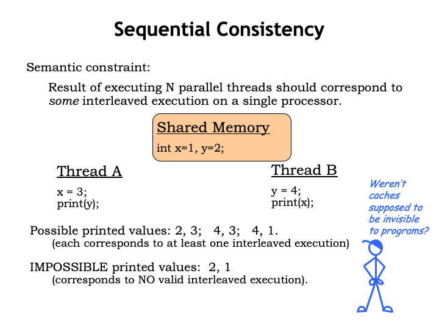

The notion that executing N threads in parallel should correspond to
some interleaved execution of those threads on a single core is called
<i>sequential consistency</i>.  If multicore systems implement sequential
consistency, then programmers can think of the systems as providing
hardware-accelerated timesharing.

So, our simple multicore system fails on two accounts.  First, it
doesn&#700;t correctly implement a shared memory since, as we&#700;ve seen, it&#700;s
possible for the two cores to disagree about the current value of a
shared variable.  Second, as a consequence of the first problem, the
system doesn&#700;t implement sequential consistency.

Clearly, we&#700;ll need to figure out a fix!

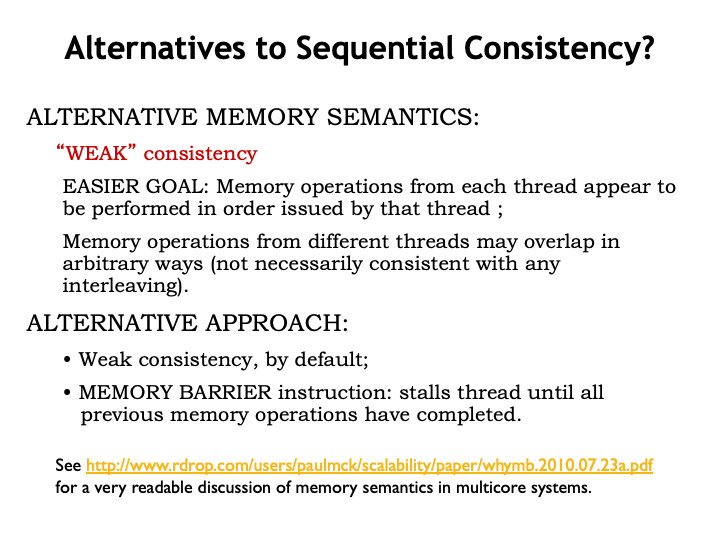

One possible fix is to give up on sequential consistency.  An
alternative memory semantics is <i>weak consistency</i>, which only
requires that the memory operations from each thread appear to be
performed in the order issued by that thread. In other words in a
weakly consistent system, if a particular thread writes to X and then
writes to Y, the possible outcomes from reads of X and Y by any thread
would be one of

(unchanged X, unchanged Y), or (changed X, unchanged Y), or (changed
X, changed Y).

But no thread would see changed Y but unchanged X.

In a weakly consistent system, memory operations from other threads
may overlap in arbitrary ways (not necessarily consistent with any
sequential interleaving).

Note that our multicore cache system doesn&#700;t itself guarantee even
weak consistency.  A thread that executes &#8220;write X; write Y&#8221; will
update its local cache, but later cache replacements may cause the
updated Y value to be written to main memory before the updated X
value.  To implement weak consistency, the thread should be modified
to &#8220;write X; communicate changes to all other processors; write Y&#8221;.
In the next section, we&#700;ll discuss how to modify the caches to perform
the required communication automatically.

Out-of-order cores have an extra complication since there&#700;s no
guarantee that successive ST instructions will complete in the order
they appeared in the program.  These architectures provide a BARRIER
instruction that guarantees that memory operations before the BARRIER
are completed before memory operation executed after the BARRIER.

There are many types of memory consistency &#8212; each
commercially-available multicore system has its own particular
guarantees about what happens when.  So the prudent programmer needs
to read the ISA manual carefully to ensure that her program will do
what she wants.  See the referenced PDF file for a very readable
discussion about memory semantics in multicore systems.

<h2>Cache Coherence</h2>

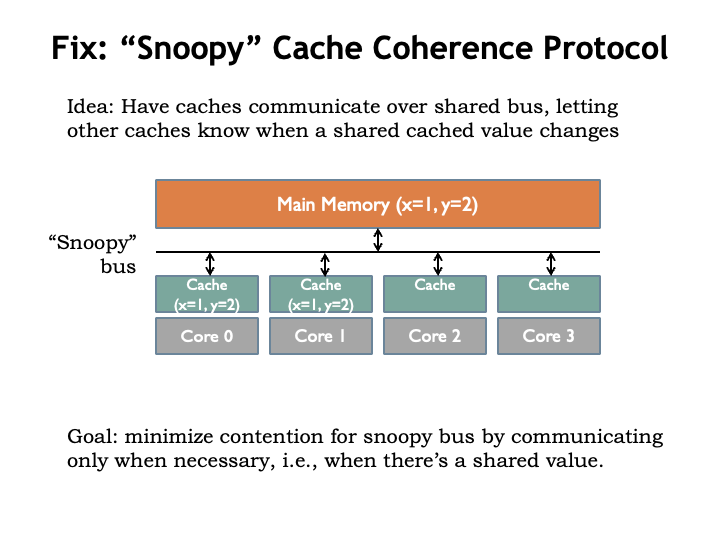

The problem with our simple multicore system is that there is no
communication when the value of a shared variable is changed.  The fix
is to provide the necessary communications over a shared bus that&#700;s
watched by all the caches.  A cache can then <i>snoop</i> on what&#700;s
happening in other caches and then update its local state to be
consistent.  The required communications protocol is called a <i>cache
coherence protocol</i>.

In designing the protocol, we&#700;d like to incur the communications
overhead only when there&#700;s actual sharing in progress, <i>i.e.</i>, when
multiple caches have local copies of a shared variable.

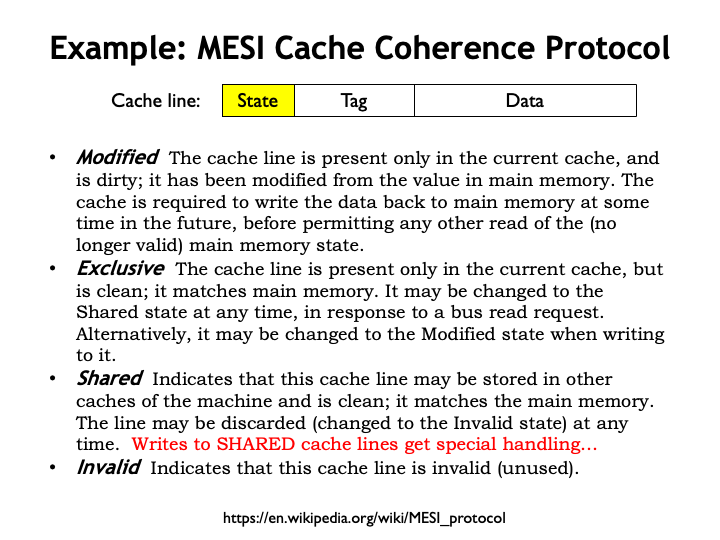

To implement a cache coherence protocol, we&#700;ll change the state
maintained for each cache line.

The initial state for all cache lines is INVALID indicating that the
tag and data fields do not contain up-to-date information.  This
corresponds to setting the valid bit to 0 in our original cache
implementation.

When the cache line state is EXCLUSIVE, this cache has the only copy
of those memory locations and indicates that the local data is the
same as that in main memory.  This corresponds to setting the valid
bit to 1 in our original cache implementation.

If the cache line state is MODIFIED, that means the cache line data is
the sole valid copy of the data. This corresponds to setting both the
dirty and valid bits to 1 in our original cache implementation.

To deal with sharing issues, there&#700;s a fourth state called SHARED that
indicates when other caches may also have a copy of the same
unmodified memory data.

When filling a cache from main memory, other caches can snoop on the
read access and participate if fulfilling the read request.

If no other cache has the requested data, the data is fetched from
main memory and the requesting cache sets the state of that cache line
to EXCLUSIVE.

If some other cache has the requested in line in the EXCLUSIVE or
SHARED state, it supplies the data and asserts the SHARED signal on
the snoopy bus to indicate that more than one cache now has a copy of
the data.  All caches will mark the state of the cache line as SHARED.

If another cache has a MODIFIED copy of the cache line, it supplies
the changed data, providing the correct values for the requesting
cache as well as updating the values in main memory.  Again the SHARED
signal is asserted and both the reading and responding cache will set
the state for that cache line to SHARED.

So, at the end of the read request, if there are multiple copies of
the cache line, they will all be in the SHARED state.  If there&#700;s only
one copy of the cache line it will be in the EXCLUSIVE state.

Writing to a cache line is when the sharing magic happens.  If there&#700;s
a cache miss, the first cache performs a cache line read as described
above.  If the cache line is now in the SHARED state, a write will
cause the cache to send an INVALIDATE message on the snoopy bus,
telling all other caches to invalidate their copy of the cache line,
guaranteeing the local cache now has EXCLUSIVE access to the cache
line.  If the cache line is in the EXCLUSIVE state when the write
happens, no communication is necessary. Now the cache data can be
changed and the cache line state set to MODIFIED, completing the
write.

This protocol is called &#8220;MESI&#8221; after the first initials of the
possible states.  Note that the the valid and dirty state bits in our
original cache implementation have been repurposed to encode one of
the four MESI states.

The key to success is that each cache now knows when a cache line may
be shared by another cache, prompting the necessary communication when
the value of a shared location is changed.  No attempt is made to
update shared values, they&#700;re simply invalidated and the other caches
will issue read requests if they need the value of the shared variable
at some future time.

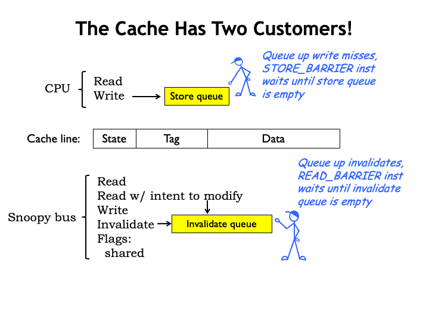

To support cache coherence, the cache hardware has to be modified to
support two request streams: one from the CPU and one from the snoopy
bus.

The CPU side includes a queue of store requests that were delayed by
cache misses.  This allows the CPU to proceed without having to wait
for the cache refill operation to complete.  Note that CPU read
requests will need to check the store queue before they check the
cache to ensure the most-recent value is supplied to the CPU.  Usually
there&#700;s a STORE_BARRIER instruction that stalls the CPU until the
store queue is empty, guaranteeing that all processors have seen the
effect of the writes before execution resumes.

On the snoopy-bus side, the cache has to snoop on the transactions
from other caches, invalidating or supplying cache line data as
appropriate, and then updating the local cache line state.  If the
cache is busy with, say, a refill operation, INVALIDATE requests may
be queued until they can be processed.  Usually there&#700;s a READ_BARRIER
instruction that stalls the CPU until the invalidate queue is empty,
guaranteeing that updates from other processors have been applied to
the local cache state before execution resumes.

Note that the &#8220;read with intent to modify&#8221; transaction shown here is
just protocol shorthand for a READ immediately followed by an
INVALIDATE, indicating that the requester will be changing the
contents of the cache line.

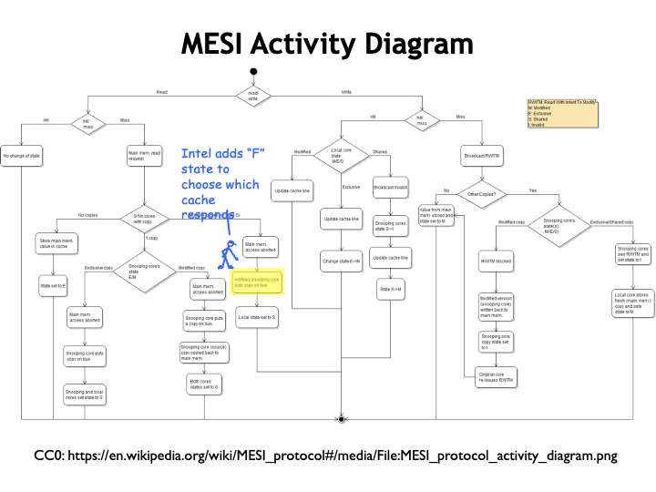

How do the CPU and snoopy-bus requests affect the cache state?  Here
in micro type is a flow chart showing what happens when.  If you&#700;re
interested, try following the actions required to complete various
transactions.

Intel, in its wisdom, adds a fifth &#8220;F&#8221; state, used to determine
which cache will respond to read request when the requested cache line
is shared by multiple caches &#8212; basically it selects which of the
SHARED cache lines gets to be the responder.

But this is a bit abstract.  Let&#700;s try the MESI cache coherence
protocol on our earlier example!

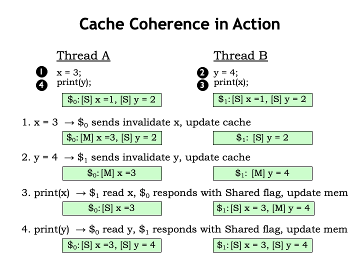

Here are our two threads and their local cache states indicating that
values of locations X and Y are shared by both caches.  Let&#700;s see what
happens when the operations happen in the order (1 through 4) shown
here.  You can check what happens when the transactions are in a
different order or happen concurrently.

First, Thread A changes X to 3.  Since this location is marked as
SHARED [S] in the local cache, the cache for core 0 ( $\$_0$ ) issues an
INVALIDATE transaction for location X to the other caches, giving it
exclusive access to location X, which it changes to have the value 3.
At the end of this step, the cache for core 1 ( $\$_1$ ) no longer has a
copy of the value for location X.

In step 2, Thread B changes Y to 4.  Since this location is marked as
SHARED in the local cache, cache 1 issues an INVALIDATE transaction
for location Y to the other caches, giving it exclusive access to
location Y, which it changes to have the value 4.

In step 3, execution continues in Thread B, which needs the value of
location X.  That&#700;s a cache miss, so it issues a read request on the
snoopy bus, and cache 0 responds with its updated value, and both
caches mark the location X as SHARED.  Main memory, which is also
watching the snoopy bus, also updates its copy of the X value.

Finally, in step 4, Thread A needs the value for Y, which results in a
similar transaction on the snoopy bus.

Note the outcome corresponds exactly to that produced by the same
execution sequence on a timeshared core since the coherence protocol
guarantees that no cache has an out-of-date copy of a shared memory
location.  And both caches agree on the ending values for the shared
variables X and Y.

If you try other execution orders, you&#700;ll see that sequential
consistency and shared memory semantics are maintained in each case.
The cache coherency protocol has done it&#700;s job!

<h2>Summary</h2>

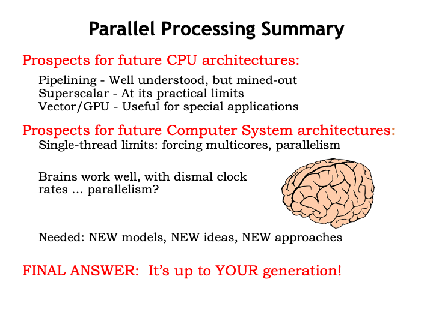

Let&#700;s summarize our discussion of parallel processing.

At the moment, it seems that the architecture of a single core has
reached a stable point.  At least with the current ISAs, pipeline
depths are unlikely to increase and out-of-order, superscalar
instruction execution has reached the point of diminishing performance
returns.  So it seems unlikely there will be dramatic performance
improvements due to architectural changes inside the CPU core.  GPU
architectures continue to evolve as they adapt to new uses in specific
application areas, but they are unlikely to impact general-purpose
computing.

At the system level, the trend is toward increasing the number of
cores and figuring out how to best exploit parallelism with new
algorithms.

Looking further ahead, notice that the brain is able to accomplish
remarkable results using fairly slow mechanisms (it takes ~.01 seconds
to get a message to the brain and synapses fire somewhere between 0.3
to 1.8 times per second).  Is it massive parallelism that gives the
brain its computational power?  Or is it that the brain uses a
different computation model, <i>e.g.</i>, neural nets, to decide upon new
actions given new inputs?  At least for applications involving
cognition there are new architectural and technology frontiers to
explore.  You have some interesting challenges ahead if you get
interested in the future of parallel processing!

